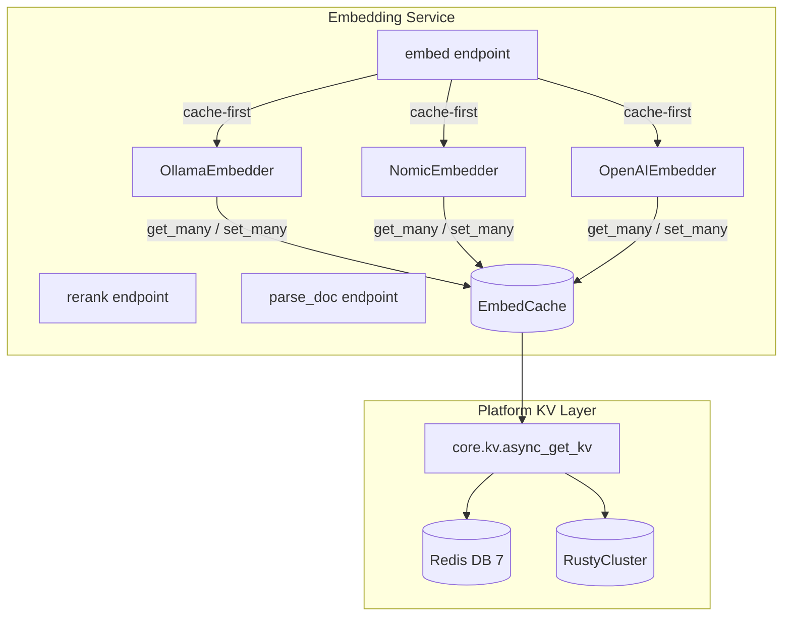
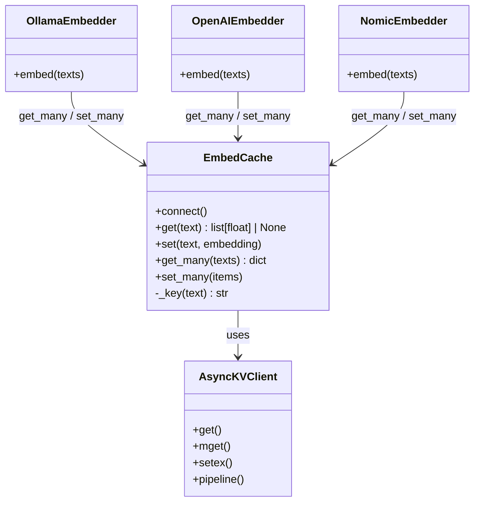
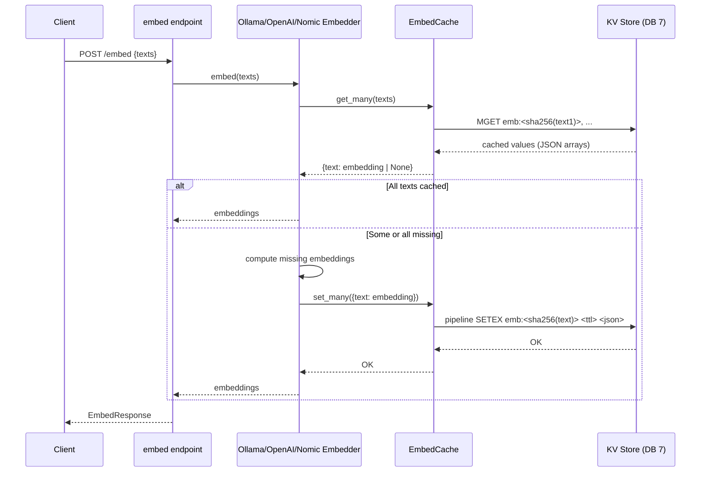
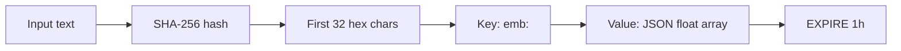
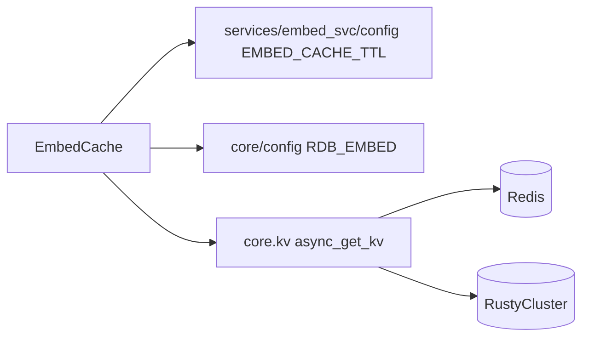

# Embedding Service Cache

The `embedding_service_cache` module provides a high-throughput, KV-backed caching layer for text embeddings inside the `services/embed_svc` microservice. It stores SHA256-keyed embedding vectors with a one-hour TTL, letting the service avoid repeated calls to local Ollama instances, OpenAI, or the Nomic/custom embedding provider for identical text.

## Purpose

Embedding generation is one of the most expensive operations in the retrieval pipeline: it is network-bound, GPU/CPU-bound, and often invoked repeatedly for the same chunks during indexing, re-indexing, and RAG queries. `EmbedCache` reduces that cost by:

- **Deduplicating identical inputs** across concurrent and subsequent requests.
- **Offloading hot vectors** to the platform KV store (Redis DB 7 or RustyCluster, selected by `REDIS_CLIENT_CONFIG_DB7`).
- **Failing open**: if the cache is unreachable, embeddings are computed and returned normally rather than failing the request.

## Core Component

### `EmbedCache`

Located in `services/embed_svc/cache.py`, `EmbedCache` is a thin async wrapper around the platform's async KV client.

| Method | Description |
|--------|-------------|
| `connect()` | Initializes the async KV client for DB 7 and pings it. |
| `get(text)` | Returns a cached `list[float]` or `None`. |
| `set(text, embedding)` | Writes an embedding with `EMBED_CACHE_TTL` expiration. |
| `get_many(texts)` | Batch lookup; returns `dict[text, embedding \| None]`. |
| `set_many(items)` | Pipeline batch write for high-throughput indexing. |

Cache keys are deterministic: `emb:` + `sha256(text)[:32]`. Values are JSON-serialized float arrays. The TTL is driven by `services/embed_svc/config.py` (`EMBED_CACHE_TTL`, default one hour).

## Architecture



`EmbedCache` sits between the three embedder implementations and the platform KV store. It is instantiated once during the FastAPI lifespan and shared by all embedders.

## Component Relationships



For details on the embedders, see embedding_service_embedders.

## Data Flow

### Cache-First Embedding Request



### Cache Key Generation



## How It Fits into the System

`EmbedCache` is a supporting module of the broader [embedding_service](embedding_service.md). It is not exposed directly through HTTP; callers interact with the `/embed`, `/rerank`, and `/parse` endpoints, and the cache is used transparently by the embedders.

- **Indexing workers** (`workers/index_worker.py`, `workers/kb_entity_worker.py`) call the embedding service to vectorize document chunks. The cache prevents re-embedding unchanged chunks during re-indexing.
- **RAG / chat flows** in `gateway.py` and `ABStudio/backend` reuse cached query embeddings when the same question is asked multiple times.
- **Knowledge graph workers** rely on embeddings for entity and relationship extraction.

The cache is initialized in the FastAPI `lifespan`:

```python
_cache = EmbedCache()
await _cache.connect()
_ollama = OllamaEmbedder(_cache)
_openai = OpenAIEmbedder(_cache)
_nomic  = NomicEmbedder(_cache)  # optional
```

If the KV store is unavailable at startup, the service logs a warning and continues without caching. All `EmbedCache` methods are defensive and return `None` or swallow exceptions, so embedders fall back to provider calls.

## Dependencies



- `core.config.RDB_EMBED` selects the logical database index for embedding vectors.
- `core.kv.async_get_kv` resolves the concrete KV backend (Redis or RustyCluster) using the platform-wide `REDIS_CLIENT_CONFIG_DB7` environment variable.
- `services.embed_svc.config.EMBED_CACHE_TTL` defines the TTL for cached vectors.

For more on the KV abstraction, see the platform KV documentation. For the service entry points, see [embedding_service](embedding_service.md).

## Operational Notes

- **TTL**: One hour by default. Short TTL keeps cache churn low while still capturing repeated indexing and query patterns.
- **Key collisions**: Truncating SHA-256 to 32 hex characters is a deliberate trade-off to keep Redis key sizes small; collision probability remains negligible for document-chunk scale.
- **Batching**: `get_many` uses `MGET`; `set_many` uses a pipeline. Both minimize round-trips during large indexing jobs.
- **Observability**: Embedders log cache hit ratios (e.g., `hits=42/50 (84%)`) at `DEBUG` level.
- **Failure mode**: Cache failures are non-fatal. The service degrades to direct provider calls.
