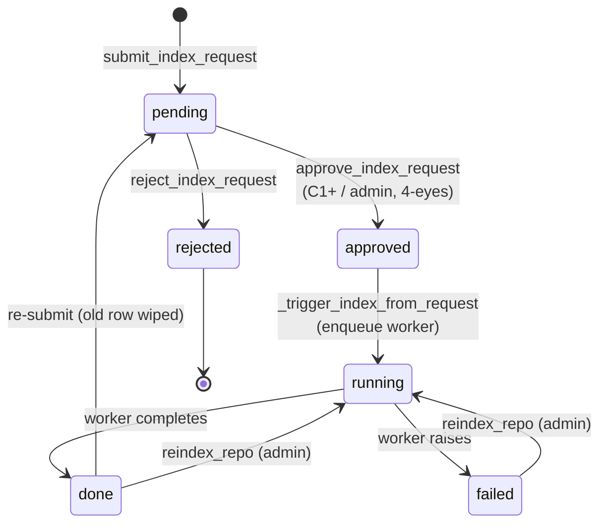
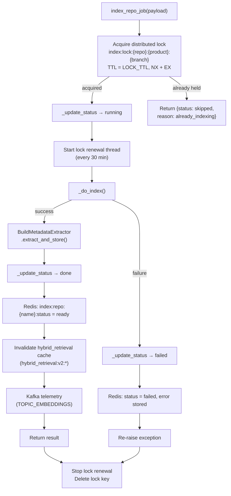
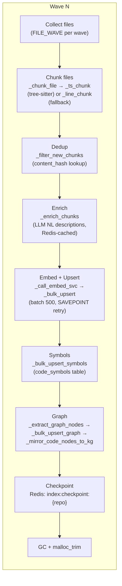
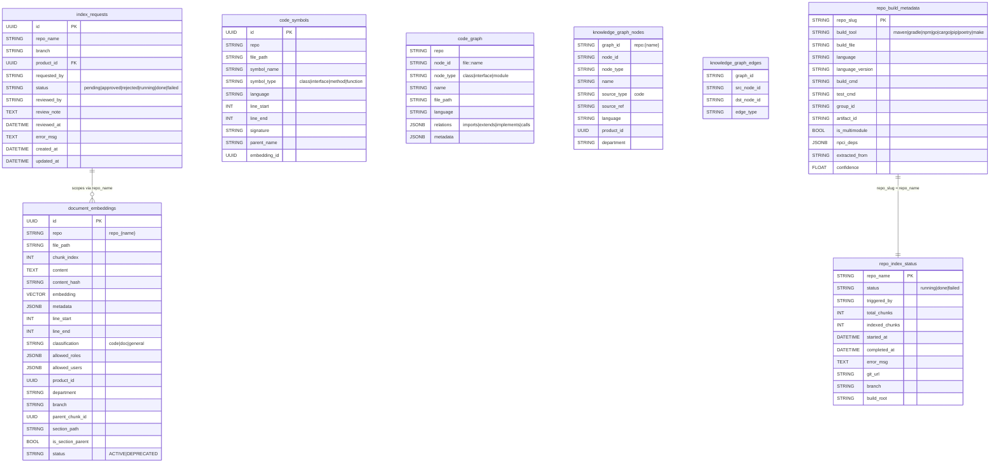
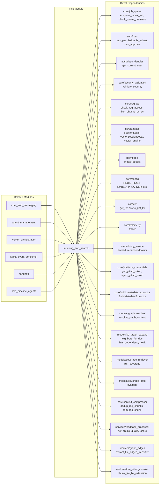
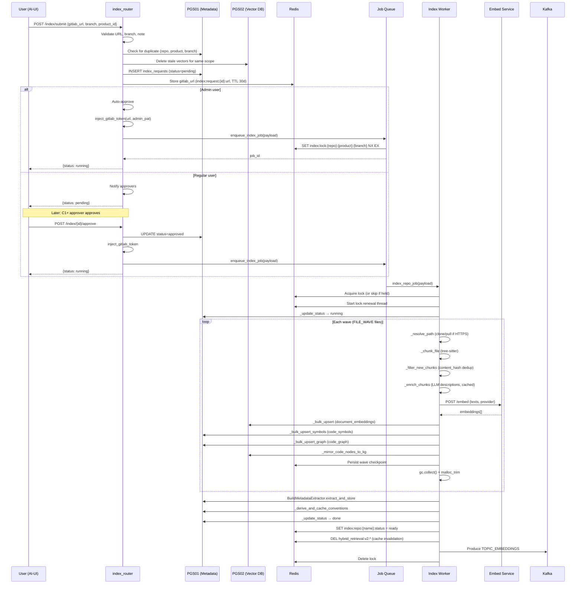
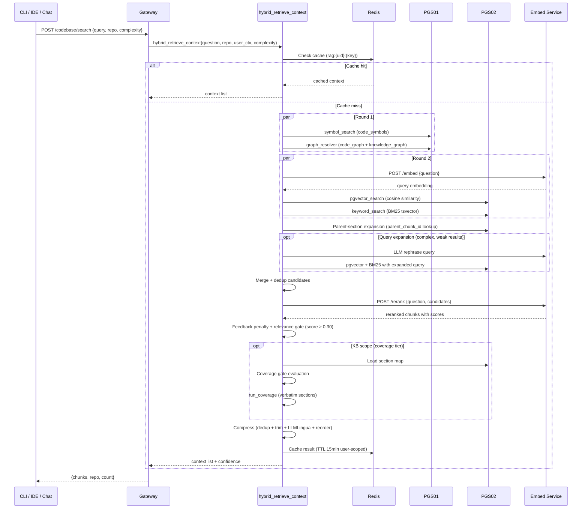

# Indexing & Search Module

## Overview

The **Indexing & Search** module is the codebase intelligence backbone of the platform. It provides two core capabilities:

1. **Codebase Indexing** — Clones GitLab repositories, parses source files with tree-sitter, generates vector embeddings, extracts code symbols and dependency graphs, and persists everything into PostgreSQL (pgvector) for downstream retrieval.
2. **Hybrid Search & Retrieval** — Combines exact symbol lookup, pgvector cosine-similarity search, PostgreSQL BM25 full-text search, knowledge-graph traversal, and BGE reranking to produce high-precision context for LLM-powered code Q&A.

The module spans three layers: **gateway API endpoints** (lightweight enqueue/status), **shared API routers** (governance workflow with approval gates), and **background workers** (the heavy indexing pipeline). Search is served synchronously through the hybrid retriever, invoked by the chat/ask pipeline and exposed as a first-class tool via `/codebase/search`.

---

## Architecture

```mermaid
graph TB
    subgraph "Client Layer"
        CLI[ainxt CLI]
        UI[AI-UI Frontend]
        IDE[IDE Plugin]
    end

    subgraph "Gateway (gateway.py)"
        GW_IDX["POST /index/submit<br/>index_submit"]
        GW_STS["GET /index/{repo}/status<br/>index_status"]
        GW_SEARCH["POST /codebase/search<br/>codebase_search"]
    end

    subgraph "Shared API Routers (index_router.py)"
        RTR_SUB["submit_index_request"]
        RTR_APR["approve_index_request"]
        RTR_REJ["reject_index_request"]
        RTR_RIDX["reindex_repo"]
        RTR_BULK["bulk_index"]
        RTR_LIST["list_repos / list_index_requests"]
        RTR_HEALTH["index_health"]
        RTR_DEL["delete_repo"]
    end

    subgraph "Job Queue (core/job_queue.py)"
        Q_INDEX["Q_INDEX Queue<br/>enqueue_index_job"]
        PRESSURE["check_queue_pressure"]
    end

    subgraph "Index Worker (workers/index_worker.py)"
        JOB["index_repo_job"]
        DO["_do_index"]
        CHUNK["_chunk_file / _ts_chunk"]
        EMBED["_call_embed_svc"]
        UPSERT["_bulk_upsert"]
        SYM["_bulk_upsert_symbols"]
        GRAPH["_extract_graph_nodes<br/>_bulk_upsert_graph<br/>_mirror_code_nodes_to_kg"]
        META["BuildMetadataExtractor"]
        CONV["_derive_and_cache_conventions"]
    end

    subgraph "Embedding Service"
        EMB_SVC["services/embed_svc<br/>Ollama / Nomic embeddings<br/>BGE reranker"]
    end

    subgraph "PostgreSQL"
        PG01[("PGS01 — Metadata<br/>index_requests<br/>repo_index_status<br/>repo_build_metadata<br/>code_symbols<br/>code_graph")]
        PG02[("PGS02 — Vector DB<br/>document_embeddings<br/>knowledge_graph_nodes<br/>knowledge_graph_edges")]
    end

    subgraph "Redis"
        REDIS_LOCK["Distributed Lock<br/>index:lock:{repo}"]
        REDIS_STATUS["Status Cache<br/>index:repo:{repo}:status"]
        REDIS_CKPT["Wave Checkpoint<br/>index:checkpoint:{repo}"]
        REDIS_CONV["Conventions Cache<br/>sdlc:conventions:{repo}"]
    end

    subgraph "Hybrid Retriever (models/hybrid_retriever.py)"
        HRC["hybrid_retrieve_context"]
        SYM_SEARCH["symbol_search"]
        PGV_SEARCH["pgvector_search"]
        BM25_SEARCH["keyword_search"]
        RERANK["_rerank_via_svc"]
        COVERAGE["Coverage Tier<br/>(KB docs)"]
    end

    CLI --> GW_IDX
    CLI --> GW_SEARCH
    UI --> RTR_SUB
    UI --> RTR_APR
    UI --> RTR_RIDX
    IDE --> GW_SEARCH

    GW_IDX --> PRESSURE
    PRESSURE --> Q_INDEX
    RTR_SUB --> RTR_APR
    RTR_APR --> Q_INDEX
    RTR_RIDX --> Q_INDEX
    RTR_BULK --> Q_INDEX

    Q_INDEX --> JOB
    JOB --> DO
    DO --> CHUNK
    DO --> EMBED
    DO --> UPSERT
    DO --> SYM
    DO --> GRAPH
    DO --> META
    DO --> CONV
    EMBED --> EMB_SVC

    JOB --> REDIS_LOCK
    DO --> REDIS_CKPT
    JOB --> REDIS_STATUS
    CONV --> REDIS_CONV

    UPSERT --> PG02
    SYM --> PG01
    GRAPH --> PG01
    GRAPH --> PG02
    META --> PG01
    JOB --> PG01

    GW_STS --> PG01
    RTR_LIST --> PG01
    RTR_LIST --> PG02
    RTR_HEALTH --> REDIS_STATUS
    RTR_HEALTH --> PG02

    GW_SEARCH --> HRC
    HRC --> SYM_SEARCH
    HRC --> PGV_SEARCH
    HRC --> BM25_SEARCH
    HRC --> RERANK
    HRC --> COVERAGE
    PGV_SEARCH --> PG02
    BM25_SEARCH --> PG02
    SYM_SEARCH --> PG01
    RERANK --> EMB_SVC
```



---

## Component Reference

### 1. Gateway Endpoints (`gateway.py`)

The gateway provides lightweight, low-latency endpoints for direct programmatic access. These are the "fast path" — no governance workflow, just enqueue and poll.

#### `IndexRequest`

```python
class IndexRequest(BaseModel):
    repo_name:    str
    repo_path:    str           # local path OR HTTPS GitLab URL
    drop_index:   bool = False  # full re-index (delete existing chunks first)
    file_filter:  List[str] = [] # incremental: only re-index these files
```

#### `index_submit`

| Attribute | Detail |
|-----------|--------|
| **Route** | `POST /ainxt/v1/api/index/submit` |
| **Auth** | JWT bearer token (`_require_auth`) |
| **RBAC** | `codebase:write` permission (operator+) |
| **Back-pressure** | `check_queue_pressure(Q_INDEX)` — returns 503 if queue depth exceeds limit |

**Flow:**
1. Extract `user_id` from JWT (falls back to `"system"`).
2. Verify caller role has `codebase:write` permission via `auth.rbac.has_permission`.
3. Check queue pressure — reject with 503 if the index queue is full.
4. Call `enqueue_index_job()` which acquires a distributed lock (scoped to `repo_name:product_id:branch`) and enqueues the RQ job.
5. Return `{job_id, repo_name}` immediately.

#### `index_status`

| Attribute | Detail |
|-----------|--------|
| **Route** | `GET /ainxt/v1/api/index/{repo_name}/status` |
| **Auth** | None (public) |
| **Source** | `repo_index_status` table (PGS01) |

Returns the full row from `repo_index_status` for the given repo, or `{"status": "not_indexed"}` if no record exists. On error, returns `{"status": "unknown", "error": "..."}`.

#### `codebase_search`

| Attribute | Detail |
|-----------|--------|
| **Route** | `POST /ainxt/v1/api/codebase/search` |
| **Auth** | JWT (`_require_auth`) |
| **Purpose** | First-class semantic+BM25 search tool for CLI/IDE |

Accepts a `_CodebaseSearchReq` (`query`, optional `repo`, `max_chunks`, `complexity`) and delegates to `hybrid_retrieve_context`. If no repo is specified, the gateway attempts auto-detection from the query text. Returns `{chunks, repo, count}`.

---

### 2. Shared API Router — Governance Workflow (`routers/index_router.py`)

The shared API router provides a full governance workflow for codebase indexing with approval gates, department-scoped visibility, and admin operations. This is the primary interface used by the AI-UI frontend.



#### Request Model

```python
class IndexSubmitRequest(BaseModel):
    gitlab_url:  str              # must start with https://
    branch:      str = "main"
    product_id:  Optional[str] = None
    note:        Optional[str] = None
```

#### Key Endpoints

| Endpoint | Function | Access | Description |
|----------|----------|--------|-------------|
| `POST /index/submit` | `submit_index_request` | Any authenticated user | Submit GitLab repo for indexing. Admins auto-approve; others enter `pending` state. Validates URL, branch, note (XSS/injection scan). Clears stale vectors for the same `(repo, product, branch)` scope. |
| `POST /index/{req_id}/approve` | `approve_index_request` | C1+ (ad_level ≤ 3) or admin | Approve a pending request. Enforces 4-eyes principle (cannot approve own request). Department gate for non-admins. Triggers indexing immediately. |
| `POST /index/{req_id}/reject` | `reject_index_request` | C1+ or admin | Reject a pending request with optional note. Notifies submitter. |
| `POST /index/{name}/reindex` | `reindex_repo` | Admin only | Full re-index of an existing repo. Uses admin's own GitLab PAT. |
| `POST /index/bulk` | `bulk_index` | Admin only | Re-index all repos or only stale ones (configurable `stale_days`). Skips locked repos gracefully. |
| `GET /index/repos` | `list_repos` | Authenticated | List repos with status + vector counts. Admin sees all; others see own submissions + department-mapped repos. |
| `GET /index/requests` | `list_index_requests` | Authenticated | Governance queue — pending/rejected/failed requests (excludes `done`). |
| `GET /index/{name}/status` | `repo_status` | Admin, submitter, or dept member | Live status from Redis + vector count from pgvector. |
| `DELETE /index/{name}` | `delete_repo` | C1+ or admin | Delete vectors for a specific `(repo, product, branch)` combination. Preserves other products'/branches' vectors. |
| `GET /index/health` | `index_health` | Admin only | Health summary: all repos with staleness, vector counts, errors. |

#### Security Model

- **URL validation**: GitLab URLs must start with `https://`, no path traversal (`..`), validated via `_validate_gitlab_url`.
- **Branch validation**: Only `[a-zA-Z0-9/_\-.]` allowed.
- **Note validation**: Passed through `core.security_validation.validate_security` (XSS/SQL injection checks).
- **4-eyes principle**: Users cannot approve/reject their own submissions.
- **Department gate**: Non-admin approvers must be in the product's mapped department (`dept_product_mappings`).
- **Credential handling**: GitLab PATs are injected into the clone URL at enqueue time (`inject_gitlab_token`) and stripped before persisting (`strip_gitlab_token`) so stored `git_url` never contains credentials.

---

### 3. Index Worker Pipeline (`workers/index_worker.py`)

The worker is the heavy-lifting component. It runs as an RQ job with a 24-hour timeout and zero auto-retry (re-indexing is expensive; failures must be re-triggered manually).

#### `index_repo_job` — Entry Point



#### `_do_index` — Core Indexing Logic

The indexing pipeline processes files in **waves** (bounded by `FILE_WAVE`) to control peak memory. Each wave performs chunking, embedding, upsert, symbol extraction, and graph extraction as an integrated unit.



**Key sub-operations:**

| Function | Purpose |
|----------|---------|
| `_resolve_path` | If `repo_path` is a local dir, return it. If HTTPS URL, shallow-clone (`--depth=1`) or pull the specified branch into `/tmp/ainxt_repos/{repo}/{branch_slug}`. Disables all interactive git prompts. |
| `_collect_files` | Walks the repo, skipping `.git`, `node_modules`, `__pycache__`, etc. Filters by `SUPPORTED_EXT` and `MAX_FILE_BYTES`. |
| `_chunk_file` | Parses a file using tree-sitter (if available for the language) into semantic chunks + code symbols. Falls back to line-based chunking. Returns `(chunks, symbols)`. |
| `_filter_new_chunks` | Single SQL `SELECT content_hash WHERE content_hash = ANY(:hashes)` to skip already-indexed chunks during incremental re-index. |
| `_enrich_chunks` | Generates natural-language descriptions for code chunks via LLM (Ollama). Redis-cached (`enrich_desc:{MD5}`) so re-indexing skips all LLM calls. Runs `ENRICH_CONCURRENCY` threads in parallel. |
| `_call_embed_svc` | Calls the embedding service (`/embed` endpoint) with round-robin across `_EMBED_SVC_POOL` and exponential backoff (up to 5 min). 4xx errors raise immediately; 5xx/timeout retry. |
| `_bulk_upsert` | Batch upsert (500 rows/round-trip) into `document_embeddings` with `ON CONFLICT (repo, file_path, chunk_index) DO UPDATE`. Uses SAVEPOINT-based retry for content-hash collisions. Stores `embedding` as pgvector, `metadata` as JSONB, with `product_id`, `department`, `branch`, `parent_chunk_id`, `section_path`, `status='ACTIVE'`. |
| `_bulk_upsert_symbols` | Upserts code symbols (classes, methods, functions) into `code_symbols` table with `ON CONFLICT DO NOTHING`. |
| `_extract_graph_nodes` | Builds code graph nodes for class/interface/module symbols. Extracts `imports`, `extends`, `implements`, `calls` relations via regex or tree-sitter AST (flag-gated `SDLC_GRAPH_EDGE_MODE=treesitter`). |
| `_bulk_upsert_graph` | Upserts graph nodes into `code_graph` table with `ON CONFLICT (repo, node_id) DO UPDATE`. |
| `_mirror_code_nodes_to_kg` | Mirrors `code_graph` nodes/edges into the unified `knowledge_graph_nodes`/`knowledge_graph_edges` tables with RBAC scoping (`product_id`, `department`). Best-effort, non-fatal. |
| `_derive_and_cache_conventions` | Post-index analysis: derives base classes, interfaces, common imports, naming pattern (`snake_case`/`camelCase`/`mixed`), and test file pattern from the code graph. Cached in Redis (`sdlc:conventions:{repo}`, TTL 24h). |

#### Resilience Mechanisms

| Mechanism | Implementation |
|-----------|---------------|
| **Distributed lock** | Redis `SET NX EX` scoped to `(repo_name, product_id, branch)`. Prevents duplicate concurrent indexing. Lock metadata (request_id, triggered_by, started_at) stored in value for diagnostics. |
| **Lock renewal** | Daemon thread renews lock TTL every 30 minutes. Prevents lock expiry during 10+ hour indexing runs. |
| **Wave checkpointing** | After each wave, `index:checkpoint:{repo}` (TTL 48h) records `{"drop_done": true, "wave": N}`. On restart, skips already-completed waves and the initial chunk delete. |
| **Memory management** | After each wave: `gc.collect()` + `libc.malloc_trim(0)` to return freed memory to OS and prevent RSS growth. |
| **Embedding retry** | Exponential backoff: `min(10 * 2^attempt, 300)` seconds. Blocks (up to 5 min) rather than failing the wave. |
| **Content-hash dedup** | Pre-embed SQL check (`_filter_new_chunks`) + post-embed batch dedup in `_bulk_upsert`. |
| **SAVEPOINT retry** | Per-batch SAVEPOINT; on `uq_doc_embed_content_hash` collision, falls back to per-row upsert skipping duplicates. |

#### Post-Index Side Effects

After successful indexing, the worker:

1. **Extracts build metadata** — `BuildMetadataExtractor` reads build files (`pom.xml`, `package.json`, `go.mod`, `Cargo.toml`, `pyproject.toml`, `.gitlab-ci.yml`, `Makefile`, etc.) from indexed chunks or workspace fallback. Detects build tool, language, version, build/test commands. Stores in `repo_build_metadata` table. Used by the SDLC pipeline for sandbox image building.

2. **Syncs Redis status** — Sets `index:repo:{name}:status = "ready"` and `indexed_at` timestamp so `repo_status` and `list_repos` reflect completion immediately.

3. **Invalidates retrieval cache** — Deletes all `hybrid_retrieval:v2:*` keys so queries see fresh chunks immediately after re-index.

4. **Emits Kafka telemetry** — Fire-and-forget event to `TOPIC_EMBEDDINGS` with repo, chunk counts, and triggered_by.

---

### 4. Hybrid Retrieval Pipeline (`models/hybrid_retriever.py` + `models/hybrid_search.py`)

The hybrid retriever is the search engine. It orchestrates multiple retrieval strategies in parallel, merges and reranks results, and applies ACL filtering, scope isolation, and context compression.

```mermaid
flowchart TD
    Q["User Question + repo_filter + user_ctx"] --> CACHE{"Redis cache hit?<br/>(per-user, 15min TTL)"}
    CACHE -->|hit| RETURN_CACHED["Return cached context"]
    CACHE -->|miss| R1["ROUND 1 (parallel, 3 threads)"]

    subgraph R1["ROUND 1 — Fast Lookups"]
        R1A["symbol_search<br/>(exact identifier lookup<br/>in code_symbols table)"]
        R1B["graph_resolver<br/>(resolve_graph_context<br/>→ related files + names)"]
    end

    R1 --> R2["ROUND 2 (parallel, 6 threads)"]

    subgraph R2["ROUND 2 — Vector + Keyword"]
        R2A["pgvector_search<br/>(graph-scoped, top_k=6 or 12)"]
        R2B["pgvector_search<br/>(full-repo fallback)"]
        R2C["keyword_search<br/>(BM25 via tsvector/tsquery)"]
        R2D["symbol_search<br/>(graph name boost)"]
    end

    R2 --> PARENT["Parent-section expansion<br/>(fetch parent_chunk_id rows<br/>for broader context)"]
    PARENT --> R25{"ROUND 2.5<br/>Query expansion needed?<br/>(complex + no symbol hit<br/>+ top_score < 0.55)"}
    R25 -->|yes| EXPAND["LLM query rephrase<br/>→ parallel pgvector + BM25"]
    R25 -->|no| MQ{"Multi-query?<br/>(complex + conjunctions<br/>+ ≥15 words)"}
    EXPAND --> MQ
    MQ -->|yes| DECOMP["LLM decompose → 2-3 sub-queries<br/>→ parallel retrieval per sub-query"]
    MQ -->|no| MERGE
    DECOMP --> MERGE

    MERGE["Merge + deduplicate<br/>(max score wins per chunk)<br/>top_k = 40 (complex) or 10"]
    MERGE --> RERANK["Rerank via embed_svc<br/>(BGE reranker, sigmoid scores)"]
    RERANK --> FEEDBACK["Feedback penalty<br/>(thumbs-down chunk quality)"]
    FEEDBACK --> GATE["Relevance gate<br/>(drop score < 0.30)"]
    GATE --> COVERAGE{"KB scope?<br/>Coverage tier evaluation"}
    COVERAGE -->|escalate| COV_RUN["Coverage retriever<br/>(whole-section verbatim)"]
    COVERAGE -->|fast sufficient| COMPRESS
    COV_RUN --> COMPRESS

    COMPRESS["Context compression<br/>dedup + trim (1500→800 chars)<br/>+ LLMLingua (prose only)<br/>+ lost-in-middle reorder"]
    COMPRESS --> CACHE_WRITE["Cache (if no coverage evidence)<br/>TTL 15min (user-scoped) or 24h"]
    CACHE_WRITE --> RETURN["Return context list<br/>+ confidence score"]
```



#### Retrieval Strategies

| Strategy | Function | Description |
|----------|----------|-------------|
| **Symbol Search** | `symbol_search()` | Exact identifier lookup in `code_symbols` table. Detects CamelCase, snake_case, and package paths in the question. Returns formatted symbol definitions with file location and signature. Score = 1.0 (highest precision). Injected BEFORE semantic results. |
| **pgvector Search** | `pgvector_search()` | Cosine similarity search (`1 - (embedding <=> query_vec)`) on `document_embeddings`. Supports multi-repo (`WHERE repo = ANY(:repos)`), ACL predicates (department, product), scope filters (product/domain/spec_version/doc_id), and file-scope narrowing from graph resolver. |
| **BM25 Keyword Search** | `keyword_search()` | PostgreSQL full-text search using `websearch_to_tsquery` (English stemming) + `phraseto_tsquery` (simple, no stemming for exact identifiers/phrases). `ts_rank` scoring normalized to `[0,1)`. GIN index on `content_simple_tsv` for performance. |
| **Graph Resolver** | `resolve_graph_context()` | Multi-hop knowledge graph traversal to find structurally related files. Provides file candidates that narrow pgvector/BM25 search scope. |
| **Query Expansion** | `_expand_query()` | LLM-based query rephrasing. Only fires when: complex tier + no symbol hit + top pgvector score < 0.55. Saves 2-5s LLM call on common path. |
| **Multi-query Decomposition** | `_decompose_query()` | Splits compound questions (containing "and/or/also") into 2-3 sub-queries via LLM. Each sub-query retrieves independently; results merged before rerank. |
| **Coverage Tier** | `run_coverage()` | KB-document-specific: loads the full section map for a scoped document and provides verbatim whole-section evidence. Gated by `KB_RETRIEVAL_SCOPE` env (`auto`/`rag`/`full_file`/`both`). |
| **Graph Walk (Lineage)** | `neighbors_for_doc()` | For impact/lineage questions ("why was this introduced?", "what depends on this?"), walks typed dependency edges (`approved_by`, `implements`, `supersedes`, `references`) in the knowledge graph. |

#### Reranking & Quality Gates

1. **Merge & dedup** — `merge_and_rerank()` keeps max score per chunk across all retrieval passes. Top 40 (complex) or 10 (simple) candidates.
2. **BGE reranker** — `_rerank_via_svc()` calls embed_svc `/rerank` endpoint. Returns sigmoid-normalized scores in `[0,1]`.
3. **Feedback penalty** — Applies thumbs-down quality scores from `FeedbackProcessor`. Penalized chunks are re-sorted.
4. **Relevance gate** — Drops chunks with reranker score < `RERANKER_MIN_SCORE` (default 0.30). Prevents hallucination from irrelevant context.

#### ACL & Scope Filtering

- **SQL-level**: `pgvector_search` and `keyword_search` inject ACL predicates (department, product_ids, scope_filter) directly into WHERE clauses.
- **Python-level**: `core.rag_acl.check_rag_access()` post-filters by classification, org_id, allowed_roles, allowed_users.
- **Scope isolation**: `scope_filter` (`product_id`, `domain`, `spec_version`, `doc_id`) is injected by `hybrid_retrieve_context` from `user_ctx`, making it deterministic and non-spoofable.
- **Repo permissions**: `check_repo_permission()` enforces per-repo access (default-open, explicit deny, admin bypass).

#### Context Compression

| Step | Function | Description |
|------|----------|-------------|
| Dedup | `dedup_rag_chunks()` | Removes same-source duplicate chunks. |
| Trim | `trim_rag_chunk()` | Head+tail strategy: trims Fast-tier chunks from 1500→800 chars. Never trims Coverage/Lineage sources. |
| LLMLingua | `_lingua_compress_if_enabled()` | LLMLingua-2 compression for prose namespaces (Confluence/platform docs). Never applied to `repo_*` (code) namespaces. |
| Reorder | `_reorder_for_attention()` | Lost-in-the-middle mitigation: best chunk first, second-best last, rest in middle. |

#### Caching

- **User-scoped queries**: `rag:{user_id}:{cache_key}`, TTL 15 min. Never shared across users (ACL-safe).
- **Internal queries** (no `user_ctx`): `rag:v2:{cache_key}`, TTL 24h.
- **Cache key**: Includes normalized question, repo_filter, max_chunks, and file_filter.
- **Never cached**: Results containing Coverage-tier evidence (large payload, gate decision depends on live signals).

---

### 5. Database Schema



---

## Dependency Map



### Cross-Module Interactions

| Consumer Module | How It Uses Indexing & Search |
|----------------|-------------------------------|
| **[chat_and_messaging](../chat/chat_and_messaging.md)** | `ask_submit` / `ask_stream` invoke `hybrid_retrieve_context` for RAG-augmented chat. The `rag_mode` (`off`/`auto`/`on`) controls whether retrieval runs. |
| **[agent_management](../agents/agent_management.md)** | Agent runs use `hybrid_retrieve_context` for codebase context injection. Agent KB docs are indexed under `agent_kb:{agent_id}` namespace. |
| **[worker_orchestration](../workers/worker_orchestration.md)** | `start_workers.py` launches the RQ worker process that consumes `Q_INDEX` jobs. |
| **[kafka_event_consumer](../reference/kafka_event_consumer.md)** | `_handle_embeddings` consumer processes indexing telemetry events from `TOPIC_EMBEDDINGS`. |
| **[sandbox](../storage/sandbox.md)** | `SandboxImageBuilder` reads `repo_build_metadata` (populated by `BuildMetadataExtractor`) to determine build tool, language version, and registry configuration for SDLC sandbox images. |
| **[sdlc_pipeline_agents](../agents/sdlc_pipeline_agents.md)** | SDLC agents use `sdlc:conventions:{repo}` (cached by `_derive_and_cache_conventions`) for codebase-aware code generation. Graph traversal supports impact analysis. |

---

## Data Flow: End-to-End Indexing



---

## Data Flow: Hybrid Search



---

## Configuration Reference

| Environment Variable | Default | Description |
|---------------------|---------|-------------|
| `REPO_CLONE_ROOT` | `/tmp/ainxt_repos` | Root directory for cloned repositories |
| `EMBED_PROVIDER` | (from `core/config.py`) | Embedding provider (`ollama`, `nomic`, `openai`) — must match index-time model |
| `RERANKER_MIN_SCORE` | `0.30` | Minimum BGE reranker score for chunk inclusion |
| `KB_RETRIEVAL_SCOPE` | `auto` | Coverage tier mode: `auto`/`rag`/`full_file`/`both` |
| `KB_COVERAGE_ENABLED` | `true` | Enable/disable KB coverage tier |
| `GRAPH_RETRIEVAL_ENABLED` | `true` | Enable/disable graph resolver in retrieval |
| `SDLC_GRAPH_EDGE_MODE` | `regex` | Graph edge extraction: `regex` or `treesitter` |
| `FEEDBACK_PENALTY_ENABLED` | `true` | Apply thumbs-down quality penalties to chunks |
| `ENABLE_LINGUA_COMPRESS` | `false` | Enable LLMLingua-2 compression for prose namespaces |
| `LLM_PROXY_URL` | (env) | LLM proxy endpoint for query expansion/decomposition |

---

## Key Design Decisions

1. **No auto-retry on index jobs** — Indexing runs for hours; silent retries waste compute and create phantom duplicate logs. Failures must be re-triggered manually via `reindex_repo`.

2. **Wave-based processing** — Files are processed in bounded waves (`FILE_WAVE` files per wave) to control peak RAM. Each wave is independently checkpointed, enabling resume after kill/crash.

3. **ChromaDB removed** — All retrieval goes through pgvector. `get_chroma_client()` returns `None`, `get_retriever()` returns `None`, `metadata_search()` returns `[]`. This simplifies infrastructure (single vector DB) and improves consistency.

4. **Distributed lock scoped to (repo, product, branch)** — The same repo can be indexed independently for different products or branches. Lock metadata is stored in the Redis value for diagnostics.

5. **Credential stripping** — `repo_path` arrives with the indexer's PAT baked in (for clone auth), but `git_url` persisted to `repo_index_status` has the token stripped (`strip_gitlab_token`) so each SDLC run re-injects its own credentials.

6. **User-scoped retrieval cache** — Cache keys include `user_id` so ACL-filtered results are never shared across users. TTL is 15 min (user-scoped) vs 24h (internal) to respect data freshness.

7. **Deferred query expansion** — The 2-5s LLM call for query rephrasing only fires when primary retrieval is weak (complex tier + no symbol hit + top score < 0.55). This eliminates the latency cost on the common path.

8. **Coverage evidence never compressed** — Verbatim section text from the Coverage tier is tagged `[Coverage source: ...]` and excluded from trimming, LLMLingua, and lost-in-the-middle reordering. This preserves evidence integrity for compliance-sensitive KB documents.
