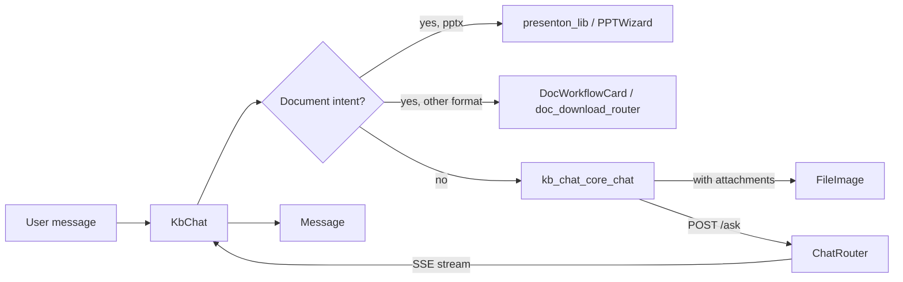

# `kb_chat` Module Overview

## Purpose

The `kb_chat` module is the Knowledge-Base (KB) chat surface in the `ai-ui` frontend. It is implemented primarily in `ai-ui/src/components/KbChat.jsx` and provides a conversational interface where users can ask questions against the indexed knowledge base, upload files and images, generate documents and presentations, manage chat settings, export conversations, and share or give feedback on messages.

It is the KB-specific counterpart to the general-purpose [chat](../chat/chat.md) module and reuses the same authentication, messaging, and notification infrastructure while adding KB-aware behaviour such as RAG-mode toggling, attachment handling, and document-generation intent detection.

---

## Architecture

`kb_chat` is organised as a set of focused sub-modules inside the main `KbChat` component. Each submodule owns a slice of the chat experience and coordinates with shared UI components, utility modules, and backend routers.

```mermaid
flowchart TB
    subgraph kb_chat["kb_chat (ai-ui/src/components/KbChat.jsx)"]
        KbChat["KbChat<br/>main container & state"]
        CoreChat["kb_chat_core_chat<br/>send / continue / regenerate / stop / voice / feedback / share"]
        FileImage["kb_chat_file_image_handling<br/>file upload / image select / attachment chips / cancel upload"]
        Enhance["kb_chat_enhancement_features<br/>prompt enhance / apply enhancement"]
        Settings["kb_chat_chat_settings<br/>scope / RAG mode / mic toggle"]
        ExportTpl["kb_chat_export_template<br/>export to Markdown / save as template"]
        PPTDetect["ppt_detection<br/>document-intent & format detection"]
    end

    KbChat --> CoreChat
    KbChat --> FileImage
    KbChat --> Enhance
    KbChat --> Settings
    KbChat --> ExportTpl
    KbChat --> PPTDetect

    subgraph shared_ui["Shared AI-UI components"]
        KbChatList["KbChatList"]
        KbChatPanel["KbChatPanel"]
        KnowledgeBase["KnowledgeBase"]
        DocPreview["DocumentPreviewModal"]
        Message["Message"]
        MessageMeta["MessageMeta"]
    end

    KbChat --> KbChatList
    KbChat --> KbChatPanel
    KbChat --> KnowledgeBase
    KbChat --> DocPreview
    KbChat --> Message
    KbChat --> MessageMeta

    subgraph infra["Shared infrastructure"]
        Auth["auth / config<br/>authFetch / API_BASE"]
        Toast["ui_dialog<br/>useToast"]
        PreviewCache["previewCache.js"]
        MsgUtils["messageContent.js"]
    end

    KbChat --> Auth
    KbChat --> Toast
    FileImage --> PreviewCache
    CoreChat --> MsgUtils

    subgraph backend["Backend routers"]
        ChatRouter["chat_router.py"]
        DocRouter["doc_download_router.py"]
        PresentonRouter["presenton_router.py"]
        FeedbackRouter["feedback_router.py"]
    end

    CoreChat -->|POST /ask, /ask/image, /chat/*| ChatRouter
    FileImage -->|POST /chat/upload| ChatRouter
    ExportTpl -->|POST /prompt-templates| ChatRouter
    CoreChat -->|POST /chat/messages/{id}/feedback| FeedbackRouter
    PPTDetect -->|pptx intent| PresentonRouter
    PPTDetect -->|docx/xlsx/pdf/md/txt intent| DocRouter
```

### Conversation & intent-routing flow



---

## Core Components

| Component / Submodule | File | Responsibility |
|-----------------------|------|----------------|
| `KbChat` | `ai-ui/src/components/KbChat.jsx` | Main KB chat container; holds active chat state, input, attachments, image files, templates, and orchestrates all child handlers. |
| `kb_chat_core_chat` | `ai-ui/src/components/KbChat.jsx` | Message lifecycle: send, continue, regenerate, stop, voice input, feedback submission, and chat sharing. |
| `kb_chat_file_image_handling` | `ai-ui/src/components/KbChat.jsx` | File uploads via `XMLHttpRequest`, image selection/validation, attachment chip rendering with Cache-API previews, and upload cancellation. |
| `kb_chat_enhancement_features` | `ai-ui/src/components/KbChat.jsx` | AI-powered prompt enhancement and applying enhanced text to the composer. |
| `kb_chat_chat_settings` | `ai-ui/src/components/KbChat.jsx` | Chat scope selection, RAG-mode toggle, and microphone/voice-mode handling. |
| `kb_chat_export_template` | `ai-ui/src/components/KbChat.jsx` | Export the current thread as a Markdown file and save the current input as a private prompt template. |
| `ppt_detection` | `ai-ui/src/components/KbChat.jsx` | Fast regex-based detection of document-generation intents and resolution of target format (`pptx`, `xlsx`, `docx`, `pdf`, `md`, `txt`). |
| `KbChatList` | `ai-ui/src/components/KbChatList.jsx` | Sidebar list of KB chat threads. |
| `KbChatPanel` | `ai-ui/src/components/KbChatPanel.jsx` | Panel wrapper for the KB chat layout. |
| `KnowledgeBase` | `ai-ui/src/components/KnowledgeBase.jsx` | KB document upload and namespace management. |
| `DocumentPreviewModal` | `ai-ui/src/components/DocumentPreviewModal.jsx` | Full-screen preview for uploaded files and generated documents. |

---

## References

- [kb_chat_core_chat](kb_chat_core_chat.md) — core chat lifecycle, streaming, feedback, and sharing.
- [kb_chat_file_image_handling](kb_chat_file_image_handling.md) — uploads, image handling, attachment chips, and previews.
- [kb_chat_enhancement_features](kb_chat_enhancement_features.md) — prompt enhancement helpers.
- [kb_chat_chat_settings](kb_chat_chat_settings.md) — scope, RAG mode, and voice controls.
- [kb_chat_export_template](kb_chat_export_template.md) — chat export and prompt-template save.
- [ppt_detection](../presentation/ppt_detection.md) — document-generation intent and format detection.
- [chat](../chat/chat.md) — general-purpose chat counterpart.
- [config](../core/config.md) — `authFetch` and API base configuration.
- [auth](../auth/auth.md) — authentication context.
- [ui_dialog](../ui/ui_dialog.md) — toast and confirm providers.
- [chat_router](../chat/chat_router.md) — backend chat, upload, share, and prompt-template endpoints.
- [feedback_router](../chat/feedback_router.md) — backend message-feedback endpoint.
- [doc_download_router](../documents/doc_download_router.md) — generic document generation backend.
- [presenton_router](../presentation/presenton_router.md) — presentation-generation backend.
- [presenton_lib](../presentation/presenton_lib.md) — frontend presentation-generation library.
- [ppt_wizard](../presentation/ppt_wizard.md) — PowerPoint creation wizard UI.
- [documents](../documents/documents.md) — generic document cards and preview components.
- [document_preview](../documents/document_preview.md) — `DocumentPreviewModal` and format-specific renderers.
- [knowledge_base](knowledge_base.md) — KB upload and namespace UI.
- [kb_chat_list](kb_chat_list.md) — KB chat thread list.
- [kb_chat_panel](kb_chat_panel.md) — KB chat panel layout.