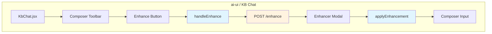
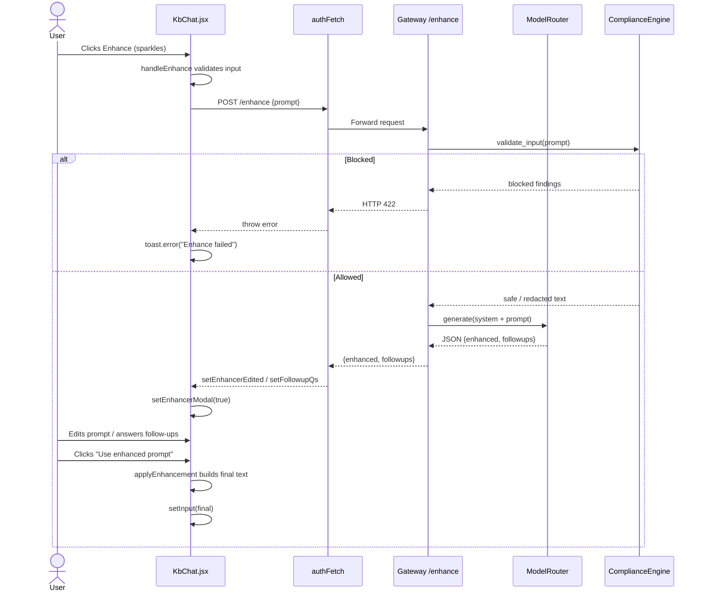
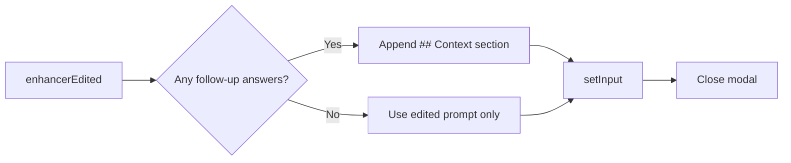
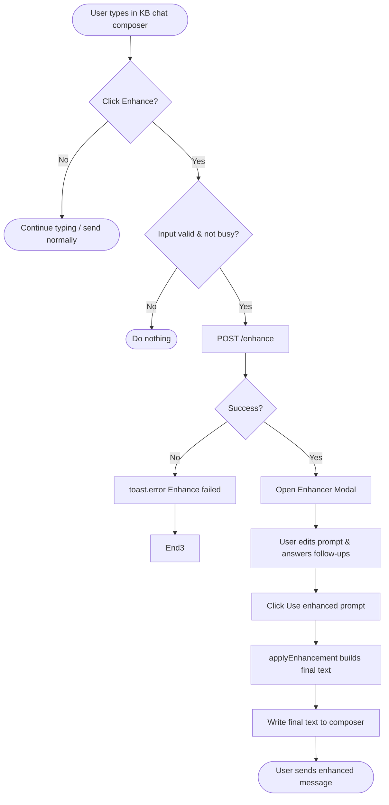

# KB Chat Enhancement Features

## Brief Introduction

The `kb_chat_enhancement_features` module provides the **prompt-enhancement** capabilities in the Knowledge Base (KB) chat surface of the `ai-ui` frontend. It allows users to click a "sparkles" button next to the composer to rewrite a raw prompt into a well-structured, audience-aware question, and optionally answer follow-up clarifications before sending. The module is a focused subset of [`KbChat.jsx`](kb_chat.md) and reuses the same backend `/enhance` endpoint that powers the general `chat_enhancement_features` surface.

> **Scope note:** This module covers only the enhancement UX inside KB chat. Document generation, image generation, voice mode, file upload, scope selection, and the core streaming chat pipeline are owned by sibling modules. See the [Related Modules](#related-modules) section for links.

---

## Core Functionality

### 1. Prompt Enhancement (`handleEnhance`)

When the user clicks the **Enhance** button (or the sparkles icon) in the KB chat composer, `handleEnhance`:

1. Validates that the composer has non-empty text and is not already loading/enhancing.
2. Calls `POST /enhance` with the trimmed prompt.
3. On success, opens a modal with:
   - The rewritten prompt (`enhancerEdited`).
   - Up to three optional follow-up questions (`followupQs`).
4. On failure, shows a toast: "Enhance failed".

```javascript
async function handleEnhance() {
  if (!input.trim() || enhancing || loading) return;
  setEnhancing(true);
  try {
    const res = await authFetch(`${API}/enhance`, {
      method: "POST",
      headers: { "Content-Type": "application/json" },
      body: JSON.stringify({ prompt: input.trim() }),
    });
    if (!res.ok) throw new Error(await res.text());
    const data = await res.json();
    setEnhancerEdited(data.enhanced || input);
    setFollowupQs(data.followups || []);
    setFollowupAnswers({});
    setEnhancerModal(true);
  } catch (e) {
    toast.error("Enhance failed");
  } finally {
    setEnhancing(false);
  }
}
```

### 2. Applying the Enhanced Prompt (`applyEnhancement`)

When the user confirms the enhanced prompt in the modal, `applyEnhancement`:

1. Takes the edited enhanced text.
2. Collects any non-empty answers to follow-up questions.
3. Appends them under a `## Context` section.
4. Writes the final text back into the composer input and closes the modal.

```javascript
function applyEnhancement() {
  let final = enhancerEdited.trim();
  const contextLines = Object.entries(followupAnswers)
    .filter(([, v]) => v.trim())
    .map(([q, a]) => `- ${q}: ${a.trim()}`);
  if (contextLines.length > 0) {
    final = `${final}\n\n## Context\n${contextLines.join("\n")}`;
  }
  setInput(final);
  setEnhancerModal(false);
}
```

### 3. JSON Extraction Helper (`_tryExtractJSON`)

`_tryExtractJSON` is a brace-depth scanner that extracts the first balanced JSON object containing the key `"is_doc"` from a model output string. It correctly handles:

- Nested objects.
- Quoted braces inside strings.
- Escape sequences.

```javascript
function _tryExtractJSON(text) {
  const start = text.indexOf("{");
  if (start < 0) return null;
  let depth = 0, inStr = false, esc = false;
  for (let i = start; i < text.length; i++) {
    const c = text[i];
    if (esc) { esc = false; continue; }
    if (c === "\\") { esc = true; continue; }
    if (c === '"') { inStr = !inStr; continue; }
    if (inStr) continue;
    if (c === "{") depth++;
    else if (c === "}") {
      depth--;
      if (depth === 0) {
        const candidate = text.slice(start, i + 1);
        if (!candidate.includes('"is_doc"')) return null;
        try { return JSON.parse(candidate); } catch { return null; }
      }
    }
  }
  return null;
}
```

> **KB chat note:** In `KbChat.jsx`, document-generation intent classification is intentionally disabled (`classifyDocIntent` always returns `{ is_doc: false, format: null }`). Therefore `_tryExtractJSON` is currently a **legacy/shared helper** carried over from [`Chat.jsx`](../chat/chat.md) and is not on the active code path in KB chat. It remains in the file to keep the two chat surfaces in sync and to support future re-enabling of doc-intent routing.

---

## Architecture

### Component Placement



### State Managed by the Module

| State | Purpose |
|-------|---------|
| `enhancing` | Loading indicator while the `/enhance` request is in flight. |
| `enhancerModal` | Whether the enhancement review modal is open. |
| `enhancerEdited` | The rewritten prompt shown in the modal (editable by the user). |
| `followupQs` | Array of follow-up clarification questions from the backend. |
| `followupAnswers` | User-provided answers keyed by follow-up question. |

---

## Data Flow

### Enhancement Flow



### Apply Enhancement Flow



---

## Dependencies

### Frontend Dependencies

| Dependency | Role |
|------------|------|
| `authFetch` / `API_BASE` ([`config.js`](../ui/ai_ui_frontend_utils.md)) | Authenticated HTTP client and backend base URL. |
| `useToast` ([`DialogProvider.jsx`](../ui/ui_dialog.md)) | Toast notifications for errors. |
| `KbChat` local state (`input`, `setInput`) | Reads the current composer text and writes the enhanced text back. |

### Backend Dependencies

| Dependency | Role |
|------------|------|
| `gateway.py::enhance_prompt` ([`gateway`](../core/gateway.md)) | FastAPI route that accepts `{prompt}` and returns `{enhanced, followups}`. |
| `gateway.py::_enhance_core` | Shared core logic: compliance check, model call, JSON parsing, follow-up generation. |
| `agents.compliance_engine` ([`compliance_engine`](../agents/agent_system.md)) | Input validation / redaction before the LLM call. |
| `models.model_router` ([`model_router`](../llm/model_routing.md)) | Routes the enhancement request to the configured model (default `mini`). |

---

## How It Fits into the System

The KB chat surface (`KbChat.jsx`) is a scoped variant of the general chat surface (`Chat.jsx`). The enhancement feature is intentionally kept identical between the two so users have a consistent experience:

- **Same backend endpoint:** Both surfaces call `POST /enhance` and receive the same `{enhanced, followups}` shape.
- **Same modal UX:** Both render the enhanced prompt in an editable textarea with optional follow-up answers.
- **Same apply logic:** Both append follow-up answers under `## Context` before writing back to the composer.

The main differences are in the surrounding chat surface:

| Aspect | KB Chat (`KbChat.jsx`) | General Chat (`Chat.jsx`) |
|--------|------------------------|---------------------------|
| Scope | Fixed KB scope (domain/product/version/document) | No inherent KB scope |
| Doc generation | Disabled (`classifyDocIntent` returns `is_doc: false`) | Enabled via `classifyIntent` |
| File upload | Not exposed in UI | Fully supported |
| `_tryExtractJSON` usage | Defined but unused | Used by `classifyIntent` |

---

## Related Modules

- [`kb_chat`](kb_chat.md) — Parent KB chat surface that hosts this enhancement feature.
- [`kb_chat_core_chat`](kb_chat_core_chat.md) — Core streaming chat logic (`sendMessageForVoice`, `handleRegenerate`, etc.).
- [`kb_chat_chat_settings`](kb_chat_chat_settings.md) — RAG mode, model picker, mic language.
- `chat_enhancement_features` — Equivalent enhancement feature in general chat.
- [`gateway`](../core/gateway.md) — Backend `/enhance` route and `_enhance_core` implementation.
- [`model_routing`](../llm/model_routing.md) — Model router used by the enhancement backend.
- [`agent_system`](../agents/agent_system.md) — Compliance engine that pre-screens prompts.

---

## Process Flow Summary


