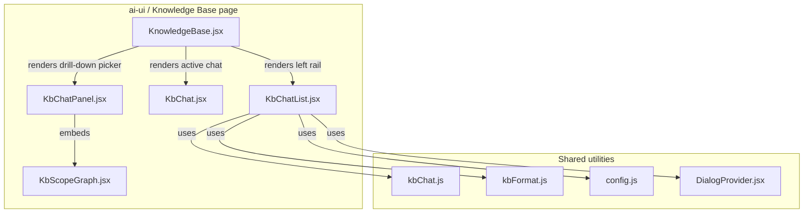
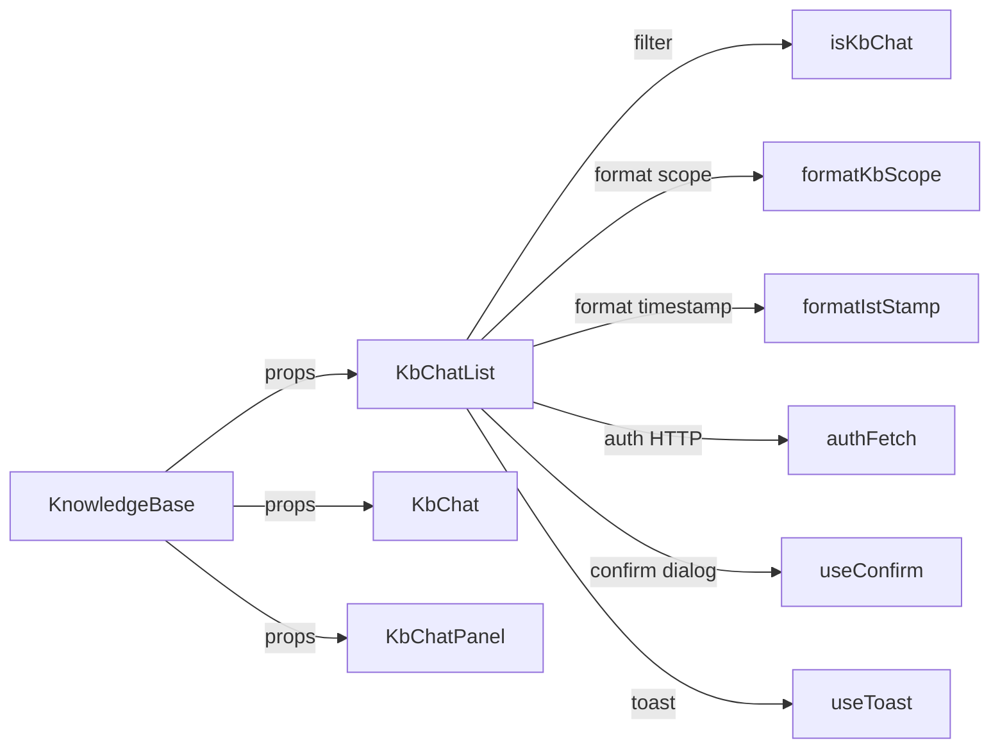
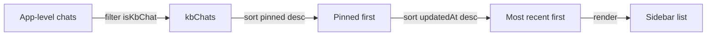
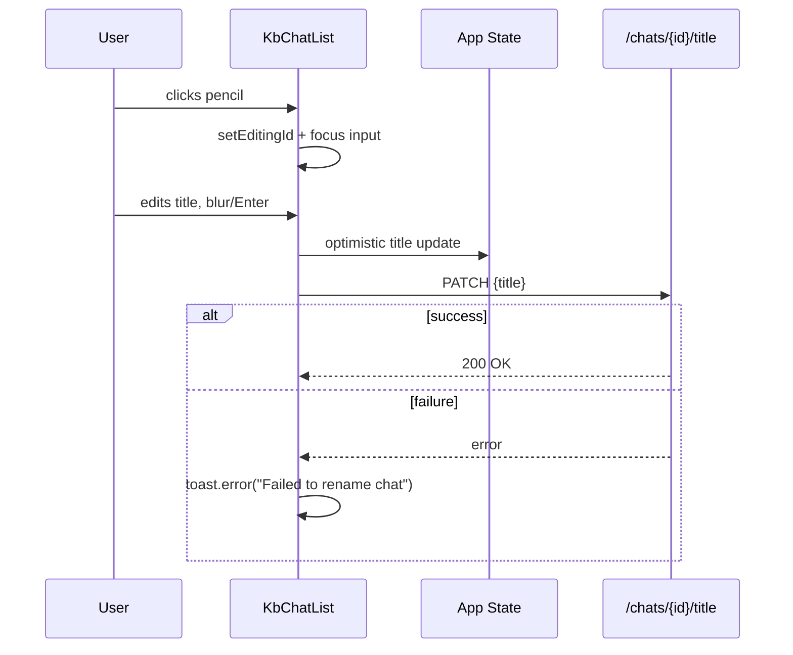
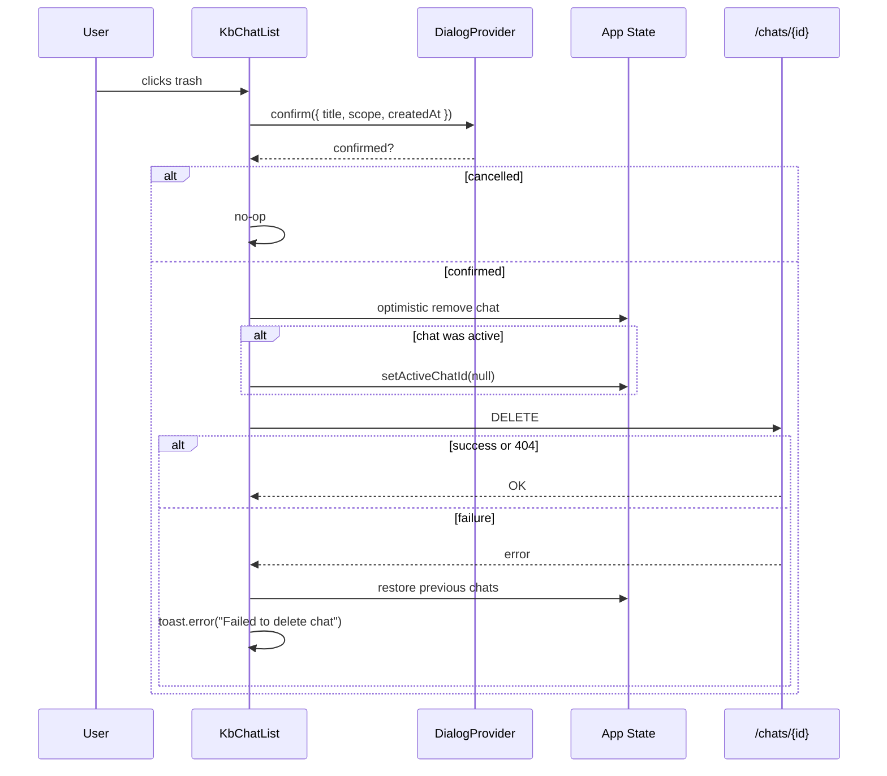
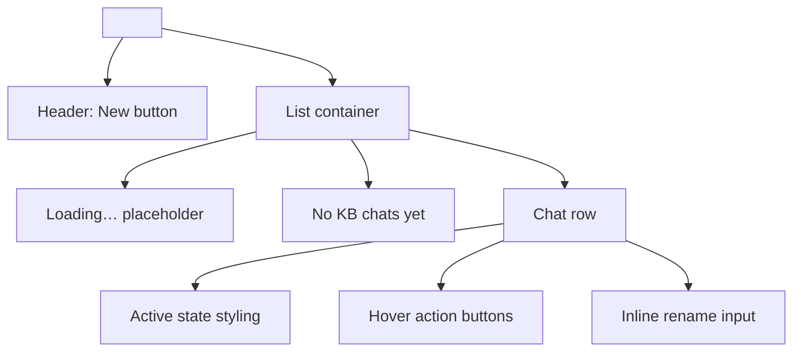
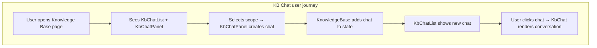

# `KbChatList` Module Documentation

## 1. Brief Introduction

`KbChatList` is a React component that renders the **left-side chat history sidebar** for the **Knowledge Base (KB) Chat** tab in the `ai-ui` frontend. It is intentionally scoped to KB chats only: it filters the global `chats` array, sorts pinned and recent conversations, and provides lightweight chat-management actions (new chat, rename, delete) without leaving the KB page.

The component is a thin, focused UI layer. It does **not** own message rendering, streaming logic, or KB scope selection; those responsibilities live in sibling modules such as [`KbChat`](kb_chat.md), [`KbChatPanel`](kb_chat_panel.md), and [`KnowledgeBase`](knowledge_base.md).

---

## 2. Module Purpose & Core Functionality

### 2.1 Primary Responsibilities

| Responsibility | Description |
| --- | --- |
| **Filter KB chats** | Uses `isKbChat` from [`kbChat.js`](kb_chat.md#utilities) to show only KB-scoped chats. |
| **Local sorting** | Sorts by pinned-first, then most-recently-updated, independently of the main Chat sidebar order. |
| **Selection** | Highlights the active chat and notifies the parent via `setActiveChatId`. |
| **Rename** | In-place title editing with optimistic local update + `PATCH /chats/{id}/title`. |
| **Delete** | Confirm-then-delete flow with optimistic removal + `DELETE /chats/{id}` and rollback on failure. |
| **New chat** | Delegates to `onNewChat` so the parent can reset to the KB drill-down picker. |

### 2.2 What It Does NOT Do

- It does **not** send or receive messages.
- It does **not** render the chat input, scope picker, or message bubbles.
- It does **not** navigate to the main Chat SPA route; KB chats stay inside the KB page.

These boundaries keep `KbChatList` small and reusable as a sidebar primitive within the KB page layout.

---

## 3. Architecture & Component Relationships

### 3.1 High-Level Placement



### 3.2 Component Dependency Diagram



### 3.3 Related Modules

| Module | Relationship |
| --- | --- |
| [`KbChat`](kb_chat.md) | Renders the active KB chat messages and input. Receives `activeChatId` from the parent, not from `KbChatList` directly. |
| [`KbChatPanel`](kb_chat_panel.md) | Shown when no KB chat is selected; hosts `KbScopeGraph` to create a new scoped chat. |
| [`KnowledgeBase`](knowledge_base.md) | Parent page that wires `KbChatList`, `KbChat`, and `KbChatPanel` together and owns `kbActiveChatId`. |
| [`kbChat.js`](kb_chat.md#utilities) | Utility that classifies a chat object as a KB chat. |
| [`kbFormat.js`](knowledge_base.md#formatting) | Date/scope formatting helpers used in the delete confirmation. |

---

## 4. Props Interface

```javascript
KbChatList({
  chats,            // App-level chats array (NOT pre-filtered)
  setChats,         // App-level setter
  activeChatId,     // currently active KB chat id
  setActiveChatId,  // parent setter; called with null to show the picker
  onNewChat,        // handler for the "New" button
  chatsLoading,     // boolean while /chats is being fetched
  pickerVisible,    // true when the drill-down picker is open
})
```

| Prop | Type | Purpose |
| --- | --- | --- |
| `chats` | `Array<Chat>` | Global chat list. |
| `setChats` | `function` | Updates global chat state for optimistic rename/delete. |
| `activeChatId` | `string \| null` | Currently selected KB chat. |
| `setActiveChatId` | `function` | Select or deselect a chat. |
| `onNewChat` | `function` | Parent-defined "new chat" action. |
| `chatsLoading` | `boolean` | Shows a loading placeholder. |
| `pickerVisible` | `boolean` | Disables the New button when the picker is already open. |

---

## 5. Data Flow

### 5.1 Filtering & Sorting



The component deliberately sorts locally so the main Chat sidebar can maintain its own ordering policy.

### 5.2 Rename Flow



### 5.3 Delete Flow



---

## 6. UI Structure



### 6.1 Row States

| State | Visual Cue |
| --- | --- |
| Active | `bg-indigo-50`, indigo left border, bold text. |
| Hover | Rename + delete buttons fade in on the right. |
| Editing | Inline text input replaces the title label. |
| Pinned | Sort order only; no separate pin UI in this component. |

---

## 7. API Endpoints Used

| Method | Endpoint | Purpose |
| --- | --- | --- |
| `PATCH` | `/chats/{chatId}/title` | Persist chat rename. |
| `DELETE` | `/chats/{chatId}` | Delete chat; 404 is treated as success. |

Both endpoints are called through `authFetch` from [`config.js`](../infrastructure/config.md), which attaches credentials and the auth token.

---

## 8. Error Handling & Edge Cases

| Scenario | Behavior |
| --- | --- |
| Rename API fails | Local optimistic update is **not** rolled back; a toast error is shown. |
| Delete API fails | Previous `chats` array is restored; toast error shown. |
| Delete returns 404 | Treated as already-deleted; no error. |
| Active chat deleted | `setActiveChatId(null)` is called so the drill-down picker appears. |
| Empty KB chat list | Friendly empty state with a "New" call-to-action. |
| `pickerVisible=true` | "New" button is disabled with a tooltip explaining why. |

---

## 9. How It Fits Into the Overall System

`KbChatList` is one of three coordinated surfaces that make up the KB Chat experience:

1. **List** (`KbChatList`) — navigation and chat management.
2. **Picker** (`KbChatPanel` + `KbScopeGraph`) — scope selection for a new KB chat.
3. **Conversation** (`KbChat`) — message streaming, RAG grounding, and input.

By keeping the list separate, the system can:

- Reuse the same `chats` global state for both normal and KB chats.
- Maintain independent sort orders for the main Chat sidebar and the KB sidebar.
- Avoid duplicating heavy chat logic inside the sidebar component.



---

## 10. References

- [`KbChat`](kb_chat.md) — active KB chat conversation surface.
- [`KbChatPanel`](kb_chat_panel.md) — new-chat scope picker wrapper.
- [`KnowledgeBase`](knowledge_base.md) — parent page that composes the KB experience.
- [`kbChat.js`](kb_chat.md#utilities) — `isKbChat` classification utility.
- [`config.js`](../infrastructure/config.md) — `API_BASE` and `authFetch`.
- [`DialogProvider`](../ui/ui_dialog.md) — `useConfirm` and `useToast` hooks.
