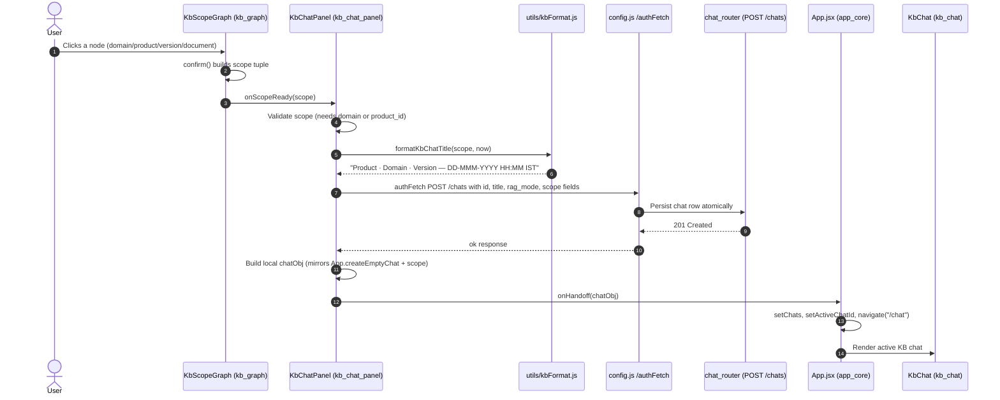
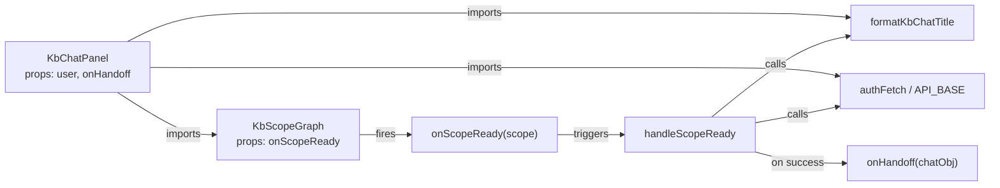
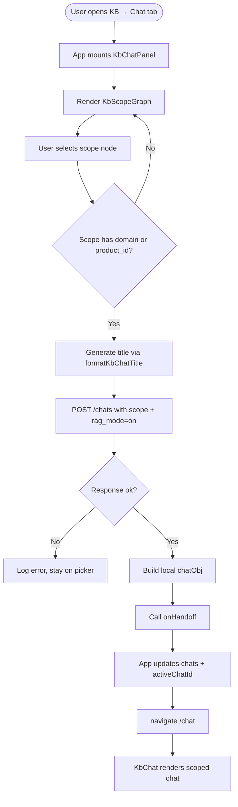

# kb_chat_panel Module Documentation

## Brief Introduction

`kb_chat_panel` is the **Knowledge Base (KB) chat entry-point component** in the `ai-ui` frontend. It bridges the KB scope-selection experience (a force-directed graph of domains, products, versions, and documents) and the main chat interface. When a user picks a scope, the panel eagerly persists a dedicated KB chat row on the backend—complete with `rag_mode='on'` and the selected scope fields—then hands the new chat off to the application-level chat state so the user can start conversing immediately.

This module was introduced to fix a historical reliability gap: previously, KB chats were created lazily by a Kafka consumer on the first assistant turn, which lost empty chats and failed to persist scope/rag metadata. `KbChatPanel` now guarantees that the chat row exists **before** the UI ever renders it.

---

## Purpose and Core Functionality

### What it does

1. **Renders the scope picker** (`KbScopeGraph`) inside the KB → Chat tab.
2. **Listens for a confirmed scope** from the graph picker.
3. **Eagerly creates the chat row** via `POST /chats` with:
   - A generated, human-readable title.
   - `rag_mode: "on"`.
   - KB scope columns: `product_id`, `domain`, `spec_version`, `kb_doc_id`.
4. **Hands the chat object to the application** through the `onHandoff` callback, which wires it into `App`-level state and navigates to `/chat`.

### What it does NOT do

- It does **not** manage chat messages, streaming, or model selection. That is handled by [`kb_chat`](kb_chat.md).
- It does **not** render the chat list sidebar. That is handled by [`kb_chat_list`](kb_chat_list.md).
- It does **not** manage KB document uploads or approval. That is handled by [`knowledge_base`](knowledge_base.md).
- It does **not** own the scope graph layout/rendering logic. That is handled by [`kb_graph`](kb_graph.md).

### Key design decisions

| Decision | Rationale |
|----------|-----------|
| Eager `POST /chats` before handoff | Guarantees the chat survives page refresh even if the user never sends a message. |
| No UI update until the POST succeeds | Prevents "phantom" chats that disappear on refresh. |
| Title generated client-side from scope + IST timestamp | Gives the user immediate context in the chat list without waiting for the backend. |
| Scope labels cached in `_kb_scope_labels` | Lets [`kb_chat`](kb_chat.md) render breadcrumb chips without an extra `/products` round-trip. |
| `kbScopePending` intentionally omitted | Because the row is created eagerly, the lazy back-patch path in `KbChat.jsx` becomes a no-op safety net. |

---

## Architecture and Component Relationships

### Component hierarchy

```text
App.jsx (ai_ui_frontend_app_core)
└── KB tab layout
    ├── KbChatPanel.jsx  (this module)
    │   └── KbScopeGraph.jsx  (kb_graph)
    └── KbChatList.jsx  (kb_chat_list)

KbChatPanel ──onHandoff──► App state + navigation ──► KbChat.jsx (kb_chat)
```

### Module boundaries

- **Inbound dependency**: `App.jsx` mounts `KbChatPanel` and supplies the `onHandoff` callback.
- **Outbound dependencies**:
  - [`kb_graph`](kb_graph.md) for the interactive scope picker.
  - [`kb_chat`](kb_chat.md) as the consumer of the handoff.
  - `config.js` for authenticated API calls.
  - `utils/kbFormat.js` for title formatting.

---

## System Context

`kb_chat_panel` sits at the intersection of the KB exploration UI and the conversational AI UI. It translates a visual scope selection into a persisted, scoped chat session that the backend retrieval pipeline can use for deterministic RAG filtering.

```mermaid
flowchart TB
    subgraph Frontend["ai-ui Frontend"]
        App["App.jsx<br/>App-level chat state & routing"]
        KbChatPanel["KbChatPanel.jsx<br/>(kb_chat_panel)"]
        KbScopeGraph["KbScopeGraph.jsx<br/>(kb_graph)"]
        KbChat["KbChat.jsx<br/>(kb_chat)"]
        KbChatList["KbChatList.jsx<br/>(kb_chat_list)"]
    end

    subgraph Backend["Backend Services"]
        ChatRouter["chat_router<br/>POST /chats, PATCH /chats/{id}/scope"]
        GatewayChat["gateway chat_and_messaging<br/>ask_stream, ask_submit"]
        KBSearch["KB retrieval / hybrid_search"]
    end

    App -->|mounts| KbChatPanel
    KbChatPanel -->|renders| KbScopeGraph
    KbChatPanel -->|onHandoff| App
    App -->|navigates to /chat| KbChat
    App -->|lists chats| KbChatList
    KbChatPanel -->|POST /chats| ChatRouter
    KbChat -->|PATCH /chats/{id}/scope| ChatRouter
    KbChat -->|POST /ask| GatewayChat
    GatewayChat -->|scoped retrieval| KBSearch
```

---

## Data Flow

### Scope selection → chat creation → handoff



### Error path

If `POST /chats` fails, `KbChatPanel` logs the error and **does not** call `onHandoff`. The user remains on the scope picker instead of being sent to a chat that does not exist server-side.

---

## Component Interaction



---

## API Contracts

### Outbound: `POST /chats`

```json
{
  "id": "<uuid>",
  "title": "Product · Domain · Version — 01-Jan-2025 14:30 IST",
  "rag_mode": "on",
  "product_id": "<uuid|null>",
  "domain": "<string|null>",
  "spec_version": "<string|null>",
  "kb_doc_id": "<uuid|null>"
}
```

### Local chat object handed off

```javascript
{
  id, title, messages: [], createdAt, updatedAt,
  rag_mode: "on",
  product_id, domain, spec_version, kb_doc_id,
  _kb_scope_labels: { productName, documentName }
}
```

This shape intentionally mirrors what `App.createEmptyChat` produces and what `/chats` returns on the next page load, so behaviour is identical before and after refresh.

---

## Dependencies

### Direct code dependencies

| File / Module | Role |
|---------------|------|
| `ai-ui/src/components/kb-graph/KbScopeGraph.jsx` ([kb_graph](kb_graph.md)) | Interactive scope picker; fires `onScopeReady`. |
| `ai-ui/src/utils/kbFormat.js` | `formatKbChatTitle` — generates the chat title from scope + timestamp. |
| `ai-ui/src/config.js` | `authFetch`, `API_BASE` — authenticated HTTP client. |

### Runtime / consumer dependencies

| Module | Role |
|--------|------|
| [`app_core`](../core/app_core.md) | Mounts `KbChatPanel`, provides `onHandoff`, owns routing and global chat state. |
| [`kb_chat`](kb_chat.md) | Receives the handed-off chat; handles message streaming, scope edits, and RAG toggle. |
| [`kb_chat_list`](kb_chat_list.md) | Displays the newly created chat in the sidebar. |
| [`knowledge_base`](knowledge_base.md) | Source of approved documents that populate the scope graph. |

### Backend dependencies

| Module | Role |
|--------|------|
| [`chat_router`](../chat/chat_router.md) | `POST /chats`, `PATCH /chats/{id}/scope`, `PATCH /chats/{id}/rag-mode`. |
| [`gateway`](../core/gateway.md) chat_and_messaging | `POST /ask` and streaming endpoints used by [`kb_chat`](kb_chat.md). |

---

## Process Flows

### Creating a new KB chat from the scope graph



---

## Related Documentation

- [`kb_chat`](kb_chat.md) — The chat component that consumes the handoff and handles message streaming, scope edits, and RAG mode.
- [`kb_chat_list`](kb_chat_list.md) — Sidebar chat list for KB chats.
- [`kb_graph`](kb_graph.md) — Force-directed scope picker (`KbScopeGraph`, `KbDrillGraph`).
- [`knowledge_base`](knowledge_base.md) — Document upload and approval that feeds the scope graph.
- [`app_core`](../core/app_core.md) — Application shell, routing, and global chat state.
- [`chat_router`](../chat/chat_router.md) — Backend router for chat CRUD and scope/rag-mode updates.
- [`gateway`](../core/gateway.md) chat_and_messaging — Backend streaming and messaging services.
