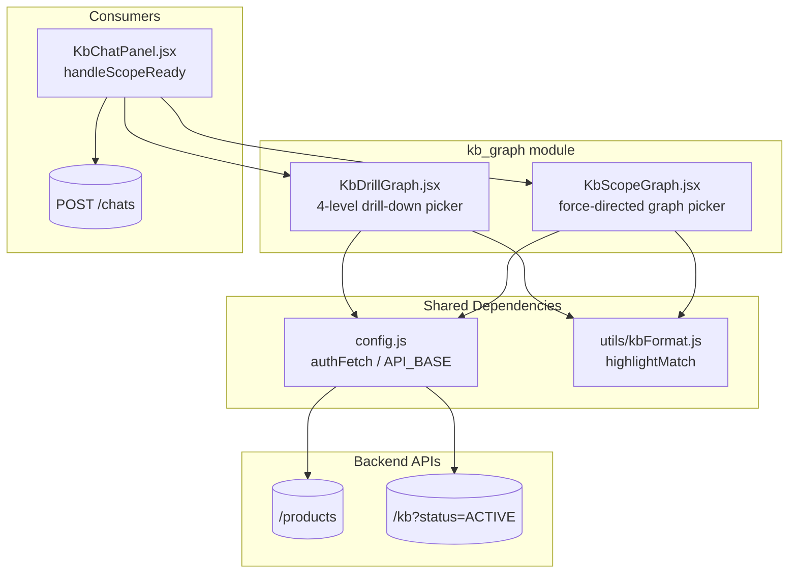
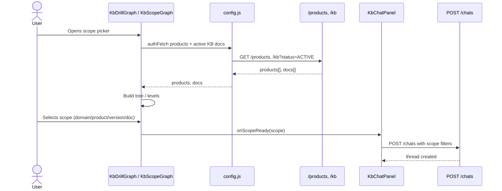

# kb_graph Module

The `kb_graph` module provides interactive **Knowledge Base (KB) scope picker** UIs for the AI UI frontend. Its purpose is to let a user visually narrow the retrieval scope for a KB chat from the entire corpus down to a specific **Domain → Product → Spec Version → Document** path, or any intermediate level. The selected scope is emitted as a normalized object that downstream chat components use to constrain RAG / full-file retrieval.

The module lives in `ai-ui/src/components/kb-graph/` and is part of the larger `ai_ui_frontend` application. It is consumed primarily by the KB chat flow (see [`kb_chat`](kb_chat.md) / [`kb_chat_panel`](kb_chat_panel.md)).

---

## Architecture Overview



The module exposes two interchangeable React components:

| Component | File | Interaction Model | Best For |
|-----------|------|-------------------|----------|
| `KbDrillGraph` | `KbDrillGraph.jsx` | Linear 4-level drill-down with breadcrumb | Users who want a guided, step-by-step narrowing experience |
| `KbScopeGraph` | `KbScopeGraph.jsx` | Force-directed tree with pan/zoom/focus | Users who want to see the whole taxonomy and pick any node directly |

Both components share the same backend contract and emit an identical scope object, so the parent `KbChatPanel` does not need to know which picker is mounted.

---

## Scope Object Contract

Both pickers produce the same scope shape via `onScopeReady`:

```javascript
{
  product_id:    string | null,
  domain:        string | null,
  spec_version:  string,
  parent_doc_id: string | null,
  _productName:  string | null,
  _documentName: string | null
}
```

The `_productName` and `_documentName` fields are display helpers; the other fields are used by the backend to filter retrieval.

---

## Sub-modules

### kb_graph_drill

[`kb_graph_drill.md`](../kb_graph_drill.md) — Detailed documentation for the drill-down picker (`KbDrillGraph.jsx`).

Highlights:
- 4-level hierarchy: Domain → Product → Spec Version → Document
- Module-level cache with 15-second TTL for `/products` and `/kb` responses
- Virtualized children column for long lists
- Right-docked searchable `DocumentsPanel` at the document level
- Breadcrumb navigation and "Chat with this scope" confirmation gate

### kb_graph_scope

[`kb_graph_scope.md`](../kb_graph_scope.md) — Detailed documentation for the force-directed graph picker (`KbScopeGraph.jsx`).

Highlights:
- Single canvas showing the entire KB taxonomy
- Force-directed layout with incremental updates and pinned existing nodes
- Pan, zoom, drag, and focus-on-selection camera tweens
- Search across all levels including collapsed documents
- Right-rail scope summary with "Chat with this scope" action

---

## Data Flow



---

## Relationship to Other Modules

- **Consumers**: [`kb_chat`](kb_chat.md) and [`kb_chat_panel`](kb_chat_panel.md) receive the scope object and forward it to the chat creation API.
- **Data source**: [`knowledge_base`](knowledge_base.md) manages the documents that populate the graph; the graph reads the same `/kb` endpoint.
- **Similar visualization**: [`knowledge_graph`](knowledge_graph.md) provides a broader graph exploration UI; `KbScopeGraph` reuses some layout concepts but is scoped specifically to KB chat retrieval.
- **Shared utilities**: Uses `authFetch` / `API_BASE` from [`config`](../ai_ui_frontend_config.md) and `highlightMatch` from `utils/kbFormat.js`.

---

## Design Notes

- The two pickers are **interchangeable** at the parent level. They exist because different users prefer different mental models: linear narrowing vs. spatial exploration.
- Both use a **short-lived client cache** (15 s) so repeated opens feel fast, while newly approved documents appear without a hard reload.
- Empty / unclassified values are grouped under placeholders such as `(Unclassified)`, `(No product)`, and `(No version)` so incomplete metadata does not break navigation.
