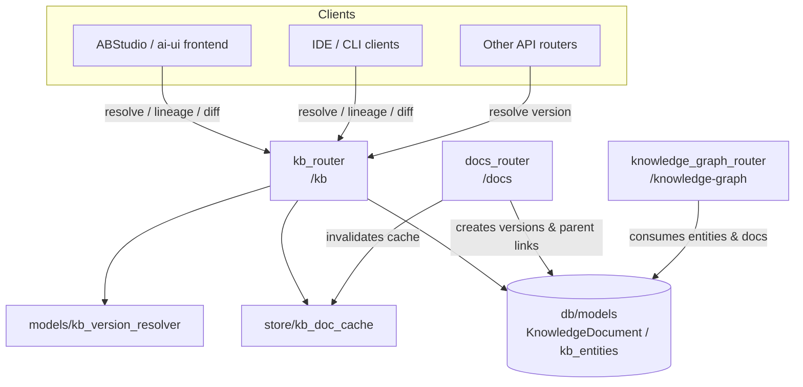
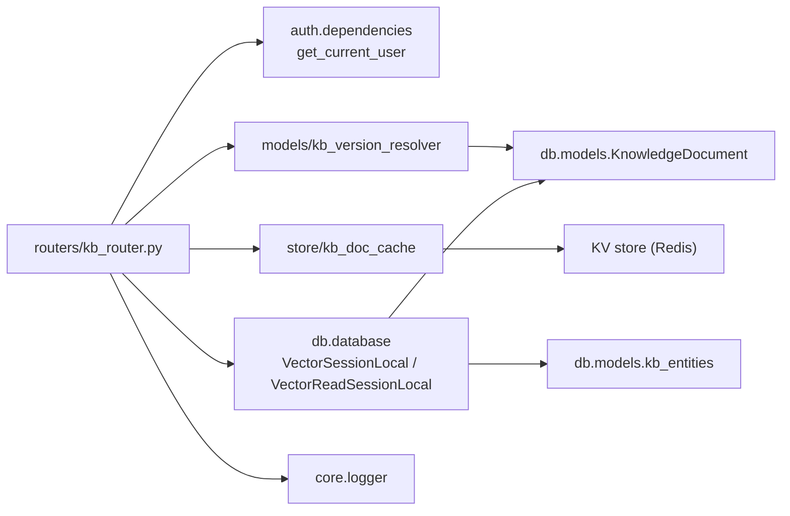
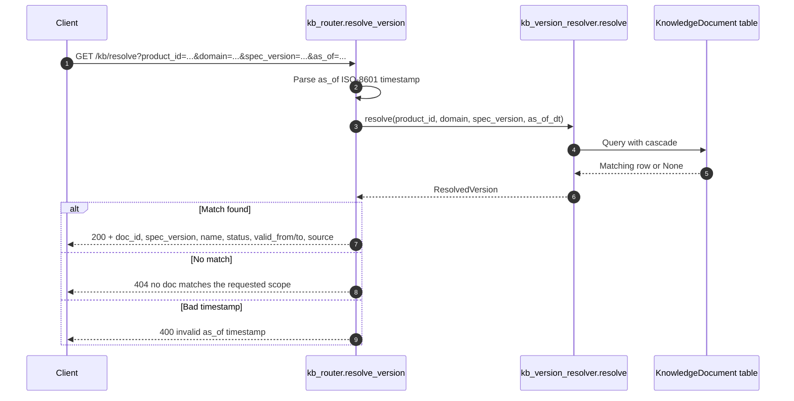
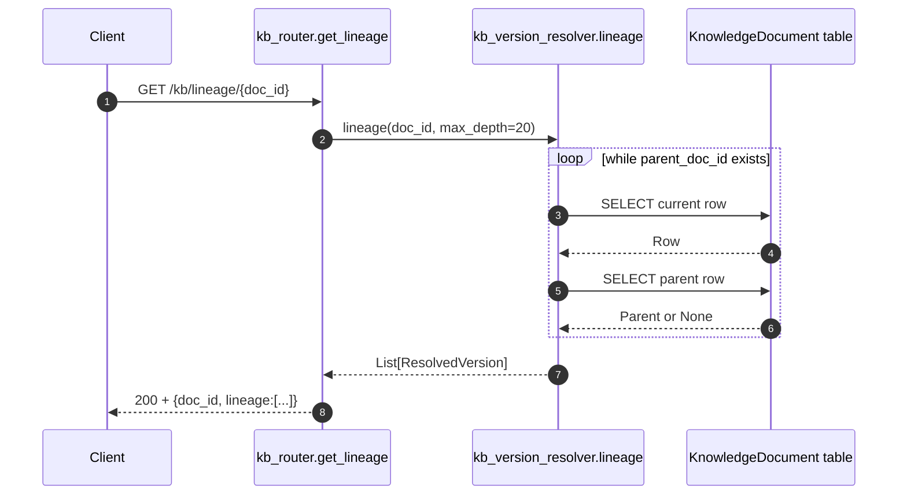
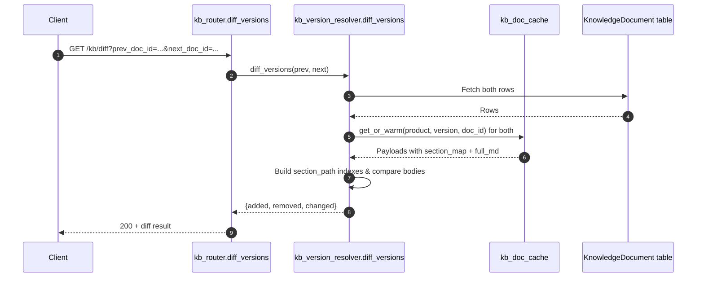
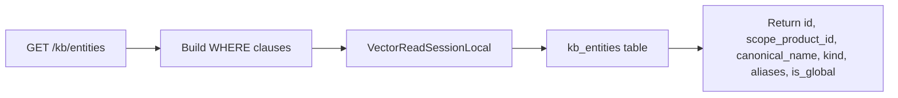
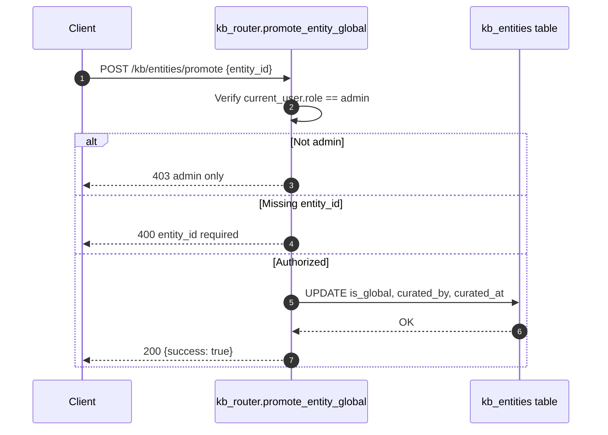

# `kb_router` — Knowledge Base Versioning, Lineage & Entity Registry

## 1. Overview

`kb_router` is a FastAPI router mounted at `/kb`. It exposes read-only and
admin-curated endpoints for navigating the knowledge-base (KB) as a **versioned
document system** rather than a flat file store.

Its responsibilities are:

| Responsibility | Description |
|----------------|-------------|
| **Version resolution** | Map a `{product_id, domain, version or as_of}` request to a concrete `doc_id` using a deterministic cascade. |
| **Lineage tracing** | Walk `parent_doc_id` pointers backwards to produce a version history chain. |
| **Version diffing** | Compare two versions of a document at the **section level** instead of raw text, producing added/removed/changed section lists. |
| **Entity registry** | Browse and curate canonical entities (`kb_entities`) that are used for grounding, RAG and knowledge-graph expansion. |
| **Cache invalidation** | Allow admins to drop warmed doc payloads from the shared `{product, version, doc}` cache. |

Uploads, approvals and document lifecycle management are intentionally **not**
handled here; they live in [`docs_router.md`](../documents/docs_router.md).

---

## 2. System Context

`kb_router` sits on top of the same database tables that [`docs_router.md`](../documents/docs_router.md)
writes to. It is the **query surface** for those tables, while `docs_router` is
the **write/approval surface**.

---

## 3. Architecture

### 3.1 Module Layout

### 3.2 Endpoint Map

| Method | Path | Handler | Access | Purpose |
|--------|------|---------|--------|---------|
| `GET`  | `/kb/resolve` | `resolve_version` | Authenticated | Resolve scope to a concrete document version. |
| `GET`  | `/kb/lineage/{doc_id}` | `get_lineage` | Authenticated | Return parent chain for a document. |
| `GET`  | `/kb/diff` | `diff_versions` | Authenticated | Section-level diff between two versions. |
| `GET`  | `/kb/entities` | `list_entities` | Authenticated | Browse canonical entity registry. |
| `POST` | `/kb/entities/promote` | `promote_entity_global` | Admin only | Promote a product-scoped entity to global. |
| `POST` | `/kb/cache/invalidate` | `invalidate_cache` | Admin only | Drop cached doc payloads. |

---

## 4. Core Components

### 4.1 `resolve_version`

Resolves a `{product_id, domain, spec_version or as_of}` triple to a single
`ResolvedVersion`. The resolution cascade is implemented in
`models/kb_version_resolver.md` and follows
this precedence:

1. **Explicit `spec_version`** — exact match, even if deprecated.
2. **`as_of` timestamp** — version whose `[valid_from, valid_to)` window contains the timestamp.
3. **Active version** — `APPROVED`/`AUTO_APPROVED` with `valid_to IS NULL`.

### 4.2 `get_lineage`

Returns the `parent_doc_id` chain starting from the requested `doc_id` and
walking backwards. The chain is returned **most-recent first** and is capped at
20 hops to avoid runaway traversal.

### 4.3 `diff_versions`

Compares two document versions by their `section_map` entries. It uses
`store/kb_doc_cache.md` to warm the full markdown
payloads for both versions, then computes:

- `added` — section paths present only in `next_doc_id`.
- `removed` — section paths present only in `prev_doc_id`.
- `changed` — section paths present in both but whose body text differs.

### 4.4 `list_entities`

Browses the `kb_entities` table introduced in Phase 5. Supports filtering by:

- `product_id` — scope to a product.
- `include_global` — include globally curated entities.
- `q` — substring match on `canonical_name` or `aliases`.
- `limit` — pagination cap (1–500, default 50).

The SQL is built dynamically and executed against the vector/read database
(`VectorReadSessionLocal`).

### 4.5 `promote_entity_global`

Admin-only endpoint that flips `is_global = TRUE` for a given `entity_id` and
records the curator email and timestamp. Global entities are visible across all
products and are used by the knowledge graph and RAG grounding layers.

### 4.6 `invalidate_cache`

Admin-only endpoint that drops entries from the shared KB document cache. It
accepts either:

- `{"doc_id": "..."}` — drops all cache keys ending with that doc id.
- `{"product_id": "...", "spec_version": "..."}` — drops all keys for that
  product/version pair.

This is typically used after manual curation or when a warmed payload is known
to be stale. Normal invalidation is already performed by
[`docs_router.md`](../documents/docs_router.md) during deprecation and deletion flows.

---

## 5. Key Data Concepts

| Concept | Source | Role in `kb_router` |
|---------|--------|---------------------|
| `KnowledgeDocument` | `db/models.py` | The versioned KB document table. Contains `product_id`, `domain`, `spec_version`, `status`, `valid_from`, `valid_to`, `parent_doc_id`. |
| `ResolvedVersion` | `models/kb_version_resolver.py` | A lightweight wrapper returned by the resolver, exposing the chosen document plus a `source` label (`explicit`, `as_of`, `active`, `lineage`). |
| `kb_entities` | `db/models.py` | Canonical entity registry used for grounding and graph expansion. |
| `kb_doc_cache` | `store/kb_doc_cache.py` | KV cache of parsed/warmed document payloads keyed by `{product}:{version}:{doc_id}`. |

For full details on the document lifecycle and approval states, see
[`docs_router.md`](../documents/docs_router.md). For knowledge-graph consumption of these
entities, see [`knowledge_graph_router.md`](knowledge_graph_router.md).

---

## 6. Security & Access Control

- All endpoints require a valid user via `get_current_user`
  (`auth/dependencies.md`).
- `POST /kb/cache/invalidate` and `POST /kb/entities/promote` are **admin-only**.
  They check `current_user["role"] == "admin"` and return `403` otherwise.
- Read endpoints (`resolve`, `lineage`, `diff`, `entities`) rely on the
  underlying database rows being visible to the caller. Row-level security and
  product-scoping are enforced at the data layer; the router itself does not
  apply additional ACL filtering beyond the `product_id`/`include_global`
  query parameters.

---

## 7. Error Handling

| Scenario | HTTP Status | Detail |
|----------|-------------|--------|
| Invalid `as_of` timestamp | `400` | `invalid as_of timestamp` |
| No document matches scope | `404` | `no doc matches the requested scope` |
| Missing `entity_id` on promote | `400` | `entity_id required` |
| Non-admin on protected endpoint | `403` | `admin only` |
| Database/cache failure | `500` | Exception message (logged via `core.logger`) |

All failures are logged through `core.logger` with a `kb_router.` prefix to
aid tracing.

---

## 8. Performance Considerations

- **Resolution** is a single indexed query on `KnowledgeDocument` and is cheap.
- **Lineage** walks `parent_doc_id` with sequential primary-key lookups; the
  `max_depth=20` cap prevents deep recursion.
- **Diff** requires warming two full document payloads from
  `store/kb_doc_cache.md`. First access may be slower
  if the cache is cold; subsequent diffs are fast.
- **Entity listing** uses the read-replica path (`VectorReadSessionLocal`) and
  applies `LIMIT`/`LIKE` filters at the database.

---

## 9. Related Documentation

- [`docs_router.md`](../documents/docs_router.md) — document upload, approval, deprecation
  and lifecycle; writes the rows that `kb_router` queries.
- [`knowledge_graph_router.md`](knowledge_graph_router.md) — graph construction
  and exploration that consumes `kb_entities` and resolved documents.
- `models_kb_version_resolver.md` — the
  resolution cascade, lineage walk and section-level diff implementation.
- `store_kb_doc_cache.md` — warmed document cache used
  by `diff_versions` and invalidated by `docs_router`.
- `auth_dependencies.md` — authentication dependency
  used by all endpoints.
