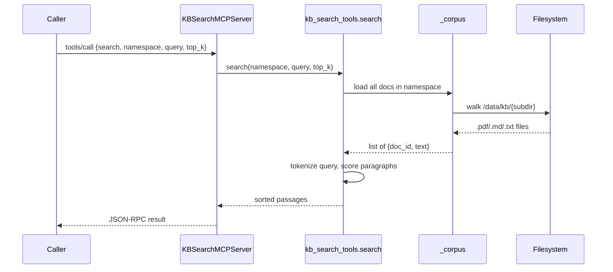
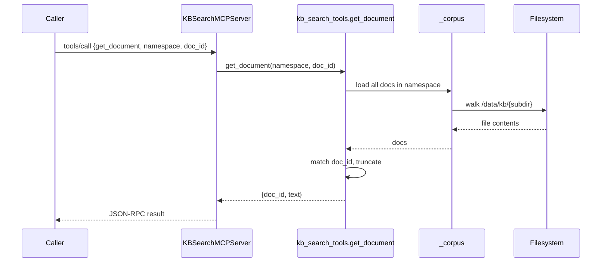
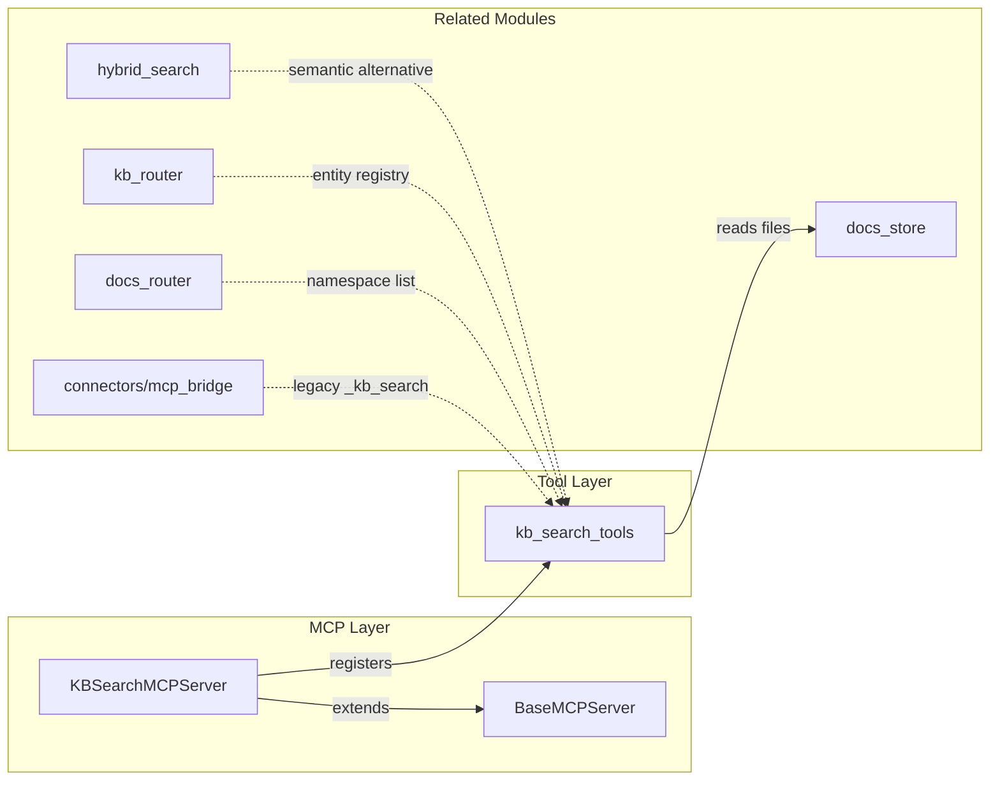

# kb_search_tools

## Brief Introduction

`kb_search_tools` provides a lightweight, namespaced keyword-retrieval layer over configured text corpora. It is the implementation backing the `kb_search` MCP server and is used by agentic flows that need to ground replies in an organization’s knowledge base (e.g., KB-grounded reply drafting, HR policy Q&A, and RFP content-library search).

The module deliberately exposes a small, provider-agnostic contract:

- `list_namespaces` – discover which KB namespaces are available and their ACL band.
- `search` – run a keyword search inside a namespace and receive scored passages with source document IDs.
- `get_document` – fetch the full text of a document by its ID for citation or deep reading.

The default implementation reads `.pdf`, `.md`, and `.txt` files from a local directory tree. The contract is designed so the backend can be swapped for `pgvector` or Elasticsearch in production without changing callers.

---

## Comprehensive Documentation

### 1. Module Purpose and Scope

`kb_search_tools` sits at the boundary between raw document storage and agent-facing retrieval. Its responsibilities are intentionally narrow:

1. **Namespace discovery** – tell callers which named corpora exist.
2. **Passage retrieval** – return the most relevant paragraphs from a namespace for a query.
3. **Document fetch** – return the full text of a single document when the caller needs more than a passage.

It does **not** handle vector embedding, semantic similarity, approval workflows, or document upload lifecycle. Those concerns live in companion modules such as [`docs_store`](../docs_store.md), [`hybrid_search`](../hybrid_search.md), and [`kb_router`](../api/kb_router.md).

### 2. Architecture

```mermaid
flowchart TB
    subgraph Callers
        A[Agent / Chat flow]
        B[KBSearchMCPServer]
        C[Connector MCP bridge]
    end

    subgraph kb_search_tools
        D[list_namespaces]
        E[search]
        F[get_document]
        G[_corpus loader]
        H[_read PDF/MD/TXT]
    end

    subgraph Storage
        I[(Local filesystem<br/>/data/kb/{namespace})]
    end

    A -->|MCP tools/call| B
    B --> D
    B --> E
    B --> F
    C -.->|legacy retrieve| E
    E --> G
    F --> G
    G --> H
    H --> I
```

The module is stateless. All configuration comes from environment variables, and all data is read from the filesystem at call time. The MCP server (`KBSearchMCPServer`) wraps the three functions as MCP tools and adds JSON-RPC dispatch, compliance gating, and audit logging via [`BaseMCPServer`](../mcp/mcp_servers.md).

### 3. Core Components

#### 3.1 `list_namespaces`

Returns the list of configured namespaces and the ACL band tag.

```python
def list_namespaces() -> dict:
    return {"namespaces": list(_NAMESPACES), "acl_band": _ACL_BAND}
```

- **Input:** none.
- **Output:** `{"namespaces": [...], "acl_band": "INTERNAL"}`.
- **Use case:** Agents call this first to know which KB collections they are allowed to search.

#### 3.2 `search`

Keyword search over a namespace.

```python
def search(namespace: str, query: str, top_k: int = 0) -> list:
    ...
```

- Splits the query into lowercase alphanumeric terms longer than two characters.
- Iterates every paragraph in every document of the namespace.
- Scores each paragraph by the sum of term occurrences.
- Returns the top-`top_k` passages, truncated to 900 characters, with `doc_id` and `score`.
- If `top_k` is `0`, falls back to `_DEFAULT_TOP_K`.

> **Note:** This is a simple keyword retriever. For semantic/vector retrieval, see [`hybrid_search`](../hybrid_search.md) and [`local_model`](../local_model.md).

#### 3.3 `get_document`

Fetches the full text of a single document.

```python
def get_document(namespace: str, doc_id: str, max_chars: int = 20000) -> dict:
    ...
```

- Looks up `doc_id` in the loaded corpus.
- Returns `{"doc_id": ..., "text": ...}` truncated to `max_chars`.
- Raises `FileNotFoundError` if the document is not in the namespace.

### 4. Configuration

All settings are optional environment variables:

| Variable | Default | Purpose |
|----------|---------|---------|
| `KB_SEARCH_DATA_DIR` | `/data/kb` | Root directory holding corpora. |
| `KB_SEARCH_NAMESPACES` | `{}` | JSON dict mapping namespace name to subdirectory. |
| `KB_SEARCH_ACL_BAND` | `INTERNAL` | Tag returned by `list_namespaces`. |
| `KB_SEARCH_PROVIDER` | `local_keyword` | Backend hint (informational only). |
| `KB_SEARCH_DEFAULT_TOP_K` | `3` | Fallback `top_k` when caller passes `0`. |

Example:

```bash
export KB_SEARCH_DATA_DIR=/data/kb
export KB_SEARCH_NAMESPACES='{"hr_policies":"hr","rfp":"rfp","release_notes":"relnotes"}'
export KB_SEARCH_ACL_BAND=INTERNAL
export KB_SEARCH_DEFAULT_TOP_K=5
```

### 5. Data Flow

#### 5.1 Search flow



#### 5.2 Document fetch flow



### 6. Component Interactions



- [`KBSearchMCPServer`](../mcp/mcp_servers.md) imports `list_namespaces`, `search`, and `get_document` and exposes them as MCP tools.
- [`BaseMCPServer`](../mcp/mcp_servers.md) provides JSON-RPC dispatch, input/output compliance gating, and optional PCI audit logging.
- [`docs_store`](../docs_store.md) owns the richer document upload, approval, chunking, and embedding lifecycle. `kb_search_tools` is a lightweight sibling for filesystem-backed corpora.
- [`hybrid_search`](../hybrid_search.md) and [`local_model`](../local_model.md) provide semantic/vector retrieval for production RAG.
- [`kb_router`](../api/kb_router.md) exposes the canonical entity registry.
- [`docs_router`](../api/docs_router.md) exposes namespace listing over HTTP.
- [`connectors/mcp_bridge`](../connectors/connectors.md) contains a legacy `_kb_search` helper that routes through the agent state retrieval tool.

### 7. Process Flows

#### 7.1 Adding a new namespace

1. Place documents under `/data/kb/<subdir>`.
2. Add the mapping to `KB_SEARCH_NAMESPACES`, e.g. `"new_ns":"new_subdir"`.
3. Restart the service so the module re-reads the environment.
4. Verify with `list_namespaces` and a sample `search` call.

#### 7.2 Replacing the backend

Because the tool contract is provider-agnostic, a production deployment can:

1. Keep `list_namespaces` and `get_document` signatures unchanged.
2. Reimplement `search` to call a vector store (e.g., pgvector via [`hybrid_search`](../hybrid_search.md)).
3. Update `KB_SEARCH_PROVIDER` to document the new backend.

No MCP client or agent prompt needs to change.

### 8. Error Handling

| Scenario | Behavior |
|----------|----------|
| Unknown namespace | `ValueError: Unknown namespace 'x'. Known: [...]` |
| Missing PDF library | `RuntimeError: pypdf is required to read PDF files` |
| Document not found | `FileNotFoundError: <doc_id>` |
| Empty query terms | Returns empty list (all terms ≤ 2 chars filtered out) |

### 9. Security and Compliance

- The module itself does not enforce user-level ACLs beyond the single `ACL_BAND` tag.
- Input/output compliance scanning is performed by [`BaseMCPServer`](../mcp/mcp_servers.md) before and after each tool invocation.
- For fine-grained RAG ACL filtering, see [`rag_acl`](../infrastructure/core_infrastructure.md) and [`docs_store`](../docs_store.md).

### 10. Testing and Debugging

Quick manual check:

```python
from tools.kb_search_tools import list_namespaces, search, get_document

print(list_namespaces())
print(search("hr_policies", "leave policy", top_k=2))
print(get_document("hr_policies", "some_doc_id.md", max_chars=5000))
```

Ensure `KB_SEARCH_NAMESPACES` is set and the data directory is mounted.

### 11. Related Modules

- [`mcp_servers`](../mcp/mcp_servers.md) – MCP server base class and `KBSearchMCPServer`.
- [`docs_store`](../docs_store.md) – Document upload, approval, chunking, and embedding.
- [`docs_router`](../api/docs_router.md) – HTTP routes for document and namespace management.
- [`kb_router`](../api/kb_router.md) – Canonical entity registry routes.
- [`hybrid_search`](../hybrid_search.md) – Semantic/vector retrieval.
- [`local_model`](../local_model.md) – Local LLM and embedding retriever.
- [`connectors`](../connectors/connectors.md) – Connector infrastructure including the MCP bridge.
