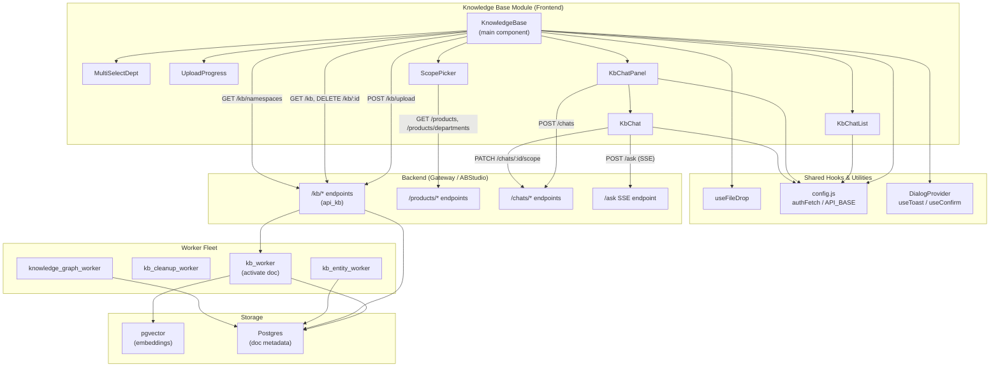
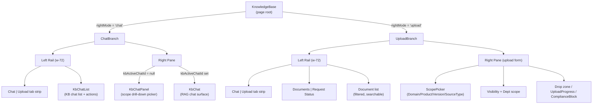
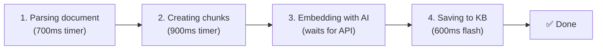
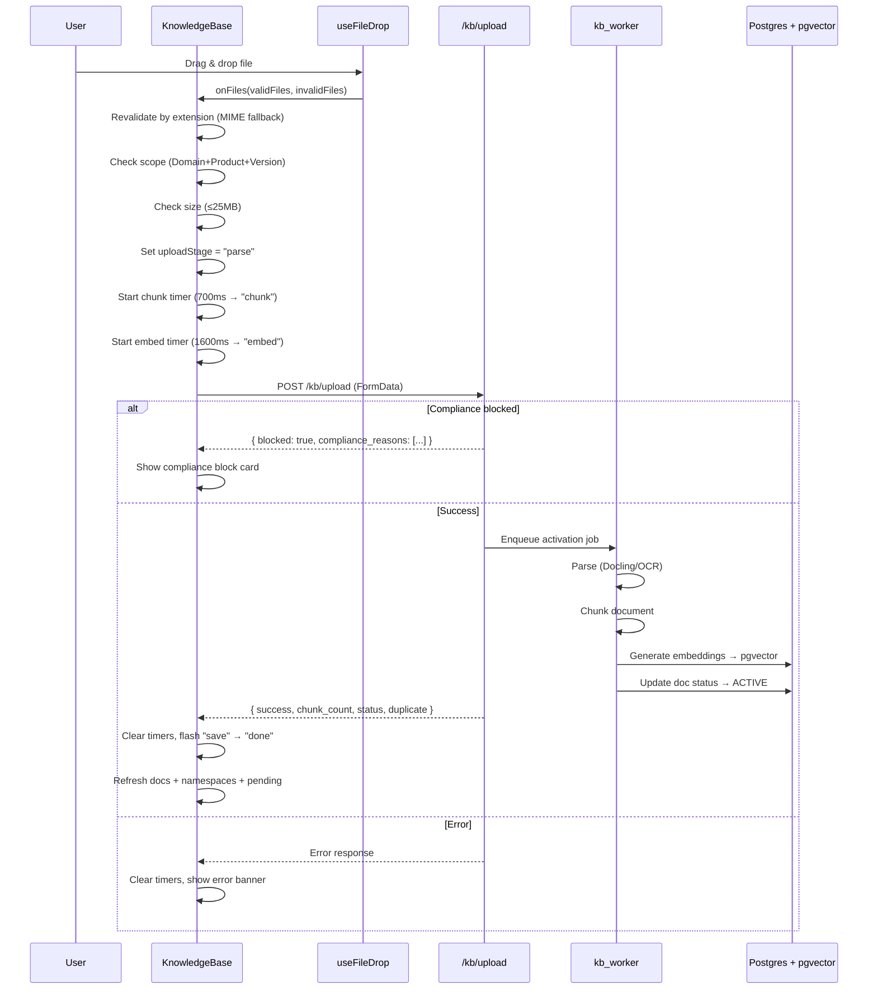
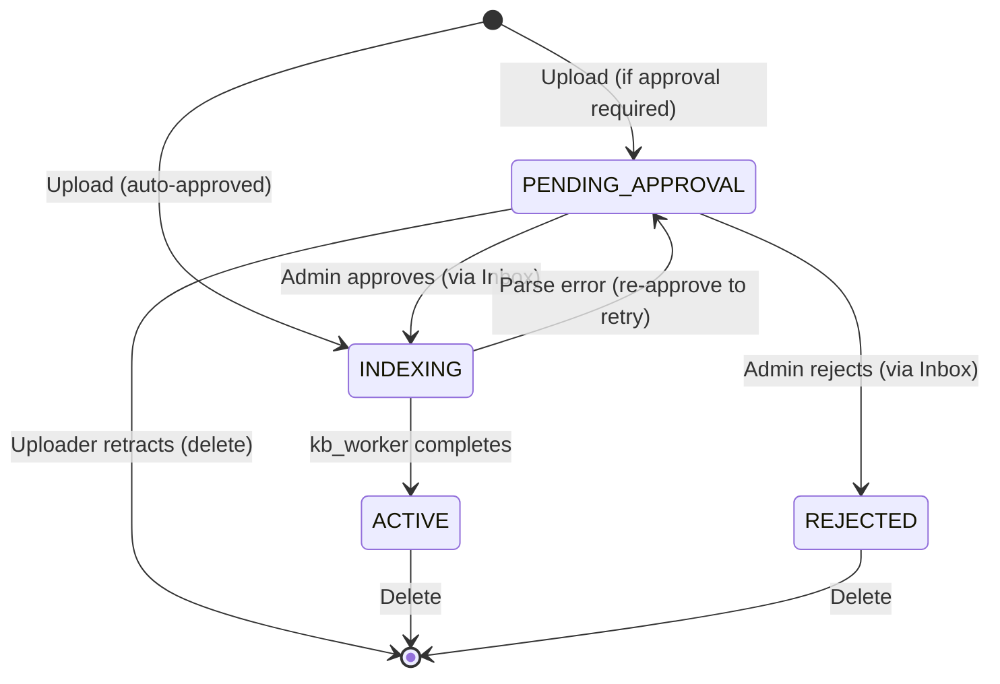
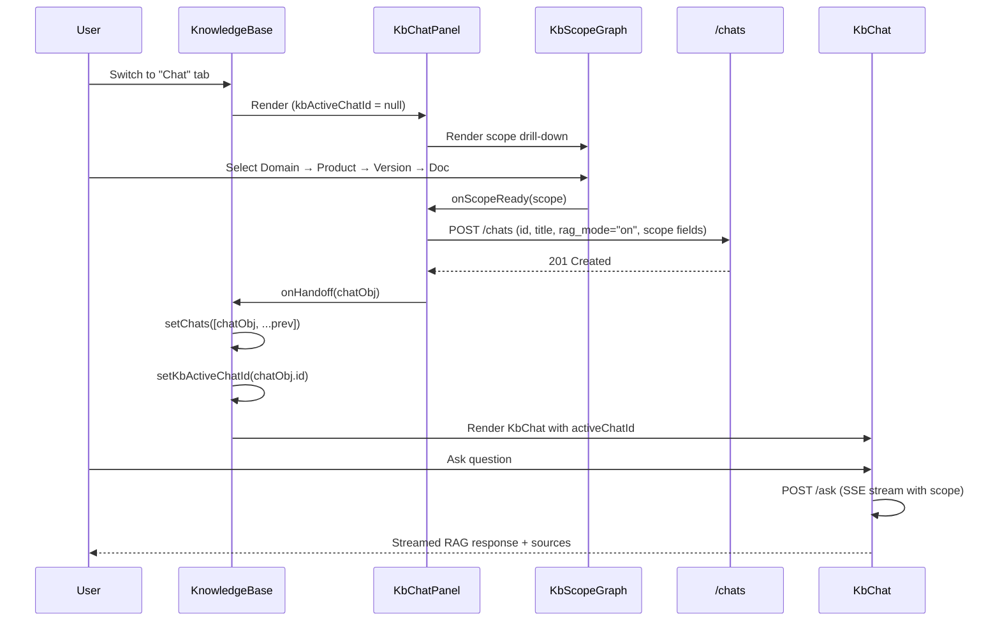
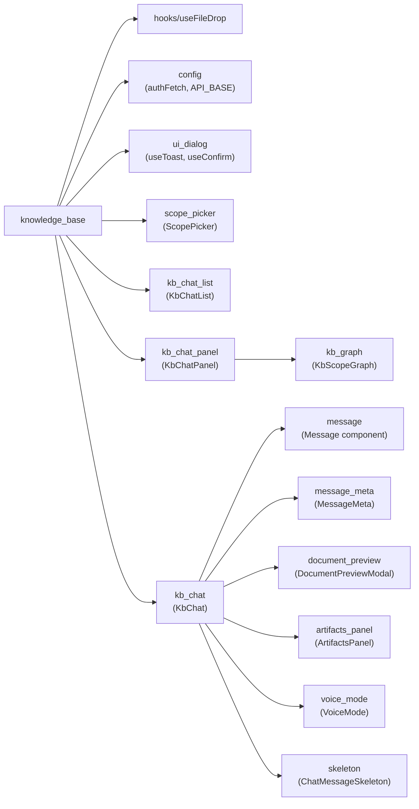

# Knowledge Base Module

## 1. Introduction

The **Knowledge Base** module (`ai-ui/src/components/KnowledgeBase.jsx`) is the primary frontend surface for the platform's Retrieval-Augmented Generation (RAG) document lifecycle. It provides end-users with two integrated capabilities inside a single page:

1. **Upload & Document Management** — drag-and-drop or browse-upload of documents (PDF, DOCX, MD, PPTX, HTML, TXT) into the vector knowledge base, with a staged progress visualisation (parse → chunk → embed → save), approval workflow tracking, namespace/department scoping, and compliance-block handling.
2. **KB Chat** — a scoped chat experience that queries the indexed corpus via RAG, with a drill-down scope picker (Domain → Product → Version → Document) that narrows retrieval deterministically.

The module is the user-facing entry point into the broader KB pipeline that spans the ABStudio backend (`api_kb`), the shared-core document store (`shared_core_knowledge_base`), and the document-knowledge worker fleet (`document_knowledge_workers`). It does **not** implement parsing, embedding, or retrieval itself — it orchestrates those by calling backend HTTP endpoints and rendering the results.

---

## 2. Architecture Overview

### 2.1 Component Hierarchy

---

## 3. Core Components

### 3.1 `KnowledgeBase` (Main Component)

The root component that owns all page-level state and renders one of two modes based on `rightMode` (`"chat"` | `"upload"`).

**Key responsibilities:**

| Responsibility | Mechanism |
|---|---|
| Document list management | `fetchDocs()` → `GET /kb?limit=10000` (optionally filtered by `namespace`) |
| Namespace discovery | `fetchNamespaces()` → `GET /kb/namespaces` |
| Pending/rejected/indexing docs | `fetchPendingDocs()` → parallel `GET /kb?status=PENDING_APPROVAL\|REJECTED\|INDEXING` |
| Department list (C1+ users) | `fetchDepartments()` → `GET /products/departments` |
| File upload | `handleUpload()` → `POST /kb/upload` (multipart FormData) |
| Document deletion | `handleDelete()` → `DELETE /kb/:id` |
| Upload state reset | `clearUpload()` — clears timers + all upload state |
| Status polling | Three `useEffect` pollers (5s / 5s / 8s intervals) for INDEXING and PENDING_APPROVAL docs |
| KB chat lifecycle | Delegates to `KbChatList` + `KbChatPanel` / `KbChat` based on `kbActiveChatId` |

**Role-based access control (client-side):**

| Role check | Effect |
|---|---|
| `isAdmin` (`user.role === "admin"`) | Full visibility; can delete any doc; can select any department |
| `isC1Plus` (`ad_level <= 3`) | Sees all pending docs in Request Status; can fetch department list |
| `canSelectAnyDept` (`ad_level < 2`) | Multi-dept selector enabled for PRIVATE visibility |
| Default (non-approver) | Locked to own department; sees only own pending docs |

**Upload scope gate:** Domain + Product + Spec Version are **mandatory** before upload. A soft warning banner (`scopeWarn`) appears only after the user attempts an upload without all three fields, and auto-clears once they are set.

### 3.2 `MultiSelectDept`

A searchable, multi-select dropdown for department selection (reused pattern from `ProductManager`). Features:

- Click-to-open with search input filtering
- Checkbox toggle per department
- Pill chips for selected items with remove buttons
- Outside-click dismissal via `mousedown` listener
- Footer count indicator

Used only when `visibility === "PRIVATE"` and `canSelectAnyDept` is true.

### 3.3 `UploadProgress`

A staged progress card that visualises the upload pipeline. The stages are:

**Stage timing strategy:**
- `parse` and `chunk` are fast stages driven by client-side timers (`STAGE_TIMERS`) to give immediate visual feedback while the API call is in flight.
- `embed` is the genuine bottleneck — it stays active until the API responds.
- `save` is a brief 600ms flash before transitioning to `done`.
- All timers are tracked via separate refs (`stageTimerRef`, `chunkTimerRef`) and cleared on API response or `clearUpload()`.

**Result display:** Shows chunk count, duplicate detection status, and whether the doc is `PENDING_APPROVAL` (awaiting approval to embed) or fully embedded.

### 3.4 `clearUpload`

Resets all upload-related state:
- Clears both stage timers (`stageTimerRef`, `chunkTimerRef`)
- Resets `uploadStage` → `null`, `uploadFile` → `null`, `uploadResult` → `null`, `complianceBlock` → `null`

Called by the `UploadProgress` "done" dismiss button and the compliance block close button.

### 3.5 `handle` (Event Handlers)

The module tree lists a generic `handle` symbol — in the source this refers to the various inline event handlers within `KnowledgeBase` (e.g., the `useFileDrop` `onFiles` callback, the file input `onChange`, drag-and-drop revalidation logic). Key handler logic:

- **MIME revalidation fallback:** Browser MIME types are unreliable (`.md` → `text/plain`, `.ppt` → `application/octet-stream`). Invalid files are re-checked by extension before rejection.
- **Single-file enforcement:** Only one file per upload; multi-file drops are rejected with an explicit error.
- **Size check:** 25 MB client-side limit before any network call.
- **Department readiness gate:** PRIVATE visibility requires at least one department selected before the drop zone is clickable.

---

## 4. Data Flow

### 4.1 Document Upload Flow

### 4.2 Document Status Lifecycle

**Polling strategy:** Three independent `useEffect` pollers watch for status transitions:

| Poller | Target | Interval | Trigger |
|---|---|---|---|
| Documents tab | `docs` with `status === "INDEXING"` | 5s | `GET /kb/:id` per doc |
| Request Status tab | `pendingDocs` with `status === "INDEXING"` | 5s | `GET /kb/:id` per doc |
| Approval watcher | `pendingDocs` with `status === "PENDING_APPROVAL"` | 8s | `GET /kb/:id` per doc |

When any doc's status changes, both `fetchDocs()` and `fetchPendingDocs()` are called to refresh both tabs simultaneously.

### 4.3 KB Chat Handoff Flow

---

## 5. Dependencies

### 5.1 Internal Module Dependencies

| Module | Purpose | Reference |
|---|---|---|
| `hooks` (`useFileDrop`) | Drag-and-drop file handling with ref-callback pattern for lazy-mounted drop zones | [hooks](../reference/hooks.md) |
| `config` | `authFetch` (cookie-auth + retry on GET), `API_BASE` | [config](../infrastructure/config.md) |
| `ui_dialog` | `useToast` for notifications, `useConfirm` for destructive-action dialogs | [ui_dialog](../ui/ui_dialog.md) |
| `scope_picker` | Shared Domain/Product/Version/SourceType selector used by both upload and chat scope | [scope_picker](../ui/scope_picker.md) |
| `kb_chat_list` | KB-filtered chat list with rename/delete actions | [kb_chat_list](kb_chat_list.md) |
| `kb_chat_panel` | Scope drill-down picker → eager `POST /chats` → handoff to `KbChat` | [kb_chat_panel](kb_chat_panel.md) |
| `kb_chat` | Full RAG chat surface (SSE streaming, sources, feedback, voice, model selection) | [kb_chat](kb_chat.md) |
| `kb_graph` | `KbScopeGraph` — interactive scope drill-down graph used by `KbChatPanel` | [kb_graph](kb_graph.md) |

### 5.2 Backend API Dependencies

| Endpoint | Method | Purpose |
|---|---|---|
| `/kb/upload` | POST | Multipart upload with scope metadata, visibility, department IDs |
| `/kb` | GET | List documents (filterable by `namespace`, `status`, `limit`) |
| `/kb/:id` | GET | Single document status check (used by pollers) |
| `/kb/:id` | DELETE | Delete document + all embeddings |
| `/kb/namespaces` | GET | List all namespaces (domains) |
| `/products` | GET | List ACTIVE products (via `ScopePicker`) |
| `/products/departments` | GET | List departments for multi-select |
| `/chats` | POST | Create KB chat row with scope (via `KbChatPanel`) |
| `/chats/:id/scope` | PATCH | Update KB scope on chat (via `KbChat`) |
| `/chats/:id/rag-mode` | PATCH | Update RAG mode on chat (via `KbChat`) |
| `/ask` | POST (SSE) | RAG query with scope injection (via `KbChat`) |

### 5.3 Backend Module References

| Backend Module | Role | Reference |
|---|---|---|
| `api_kb` | ABStudio backend KB API routes (`upload_build_studio_doc`, `_parse_with_retry`, etc.) | [api_kb](../api/api_kb.md) |
| `shared_core_knowledge_base` | `docs_store._chunk_document`, `upload_doc`; `kb_entity_registry` | [shared_core_knowledge_base](shared_core_knowledge_base.md) |
| `document_knowledge_workers` | `kb_worker.run_activate_doc`, `kb_cleanup_worker`, `kb_entity_worker`, `knowledge_graph_worker` | [document_knowledge_workers](../workers/document_knowledge_workers.md) |
| `embedding_service` | Vector embedding generation (OpenAI/Ollama/Nomic embedders) | [embedding_service](embedding_service.md) |
| `core_ocr` | OCR pipeline for scanned PDFs (Docling/PaddleOCR) | — |

---

## 6. Upload Form & Scope Metadata

The upload form collects **spec scope metadata** that determines how the document is indexed and retrieved:

| Field | Required | Source | Purpose |
|---|---|---|---|
| Domain (Department) | ✅ | `ScopePicker` (dynamic from `/products/departments`) | Namespace partitioning; RAG scope filter |
| Product | ✅ | `ScopePicker` (from `/products?status=ACTIVE`) | Product-pinned chat retrieval scope |
| Spec Version | ✅ | `ScopePicker` (free text) | Version-pinned retrieval; deprecation tracking |
| Version Date | Optional | `ScopePicker` (date input) | Version dating for audit |
| Source Type | Optional | `ScopePicker` (dropdown: BRD/FSD/TPMC_DECISION/RBI_CIRCULAR/ARCHITECTURE/SPEC/OTHER) | Typed citation badges; retrieval filtering |
| Deprecate Prior | Optional | `ScopePicker` (checkbox) | On approval, deprecate prior versions of same product+domain |
| Visibility | ✅ | Toggle (PUBLIC/PRIVATE) | PUBLIC = all departments; PRIVATE = selected departments only |
| Department IDs | Conditional | `MultiSelectDept` (PRIVATE only) | ACL for PRIVATE docs |

**FormData fields sent to `POST /kb/upload`:**
`namespace`, `files`, `visibility`, `department_ids` (JSON array), `product_id`, `domain`, `spec_version`, `version_date`, `deprecate_prior`, `source_type`

---

## 7. Compliance Block Handling

When the backend has `COMPLIANCE_SCAN_KB_UPLOAD=true` enabled, uploaded files are scanned for PCI/PII data **before** indexing. If sensitive data is detected:

1. The API returns `{ blocked: true, filename, block_reason, compliance_reasons: [...] }`
2. All stage timers are cleared immediately
3. Upload state is reset (`uploadStage = null`, `uploadFile = null`)
4. A red compliance block card is rendered showing:
   - Filename
   - Block reason (e.g., "PCI/PII data")
   - Individual compliance reason badges (e.g., "AADHAAR detected", "PAN detected")
5. The user can dismiss the card via `clearUpload()`

When the flag is off, the backend never returns `blocked: true`, making this path a no-op.

---

## 8. Document List & Request Status Tabs

### 8.1 Documents Tab

Shows only **approved/active** documents (excludes `PENDING_APPROVAL` and `REJECTED`). Each document card displays:

- Filename + uploader email
- Namespace chip (click to filter)
- Visibility badge (🔒 Private / 🌐 Public)
- Department scope chips (or "All depts")
- Chunk count + file size
- Status badge: `⏳ Parsing...` (INDEXING) or `✅ Searchable` (ACTIVE)
- Parse error warning (if last activation failed)
- Creation timestamp (IST)
- Delete button (admin or own docs only)

### 8.2 Request Status Tab

Shows `PENDING_APPROVAL`, `REJECTED`, and `INDEXING` documents. Non-approvers see only their own submissions; approvers see all. Each card shows:

- Filename + namespace + file size
- Submitter email + submission date
- Status badge:
  - `Awaiting approval — action available in Inbox` (PENDING_APPROVAL)
  - `⏳ Parsing & indexing — will be searchable shortly` (INDEXING)
  - `✅ Indexed & searchable` (ACTIVE)
  - `Rejected` (REJECTED, with reason)
- Parse error details (if applicable)
- Retract button (PENDING_APPROVAL, own docs only)

A badge counter on the tab shows the count of pending + indexing docs.

---

## 9. KB Chat Integration

The `rightMode === "chat"` branch provides a full RAG chat experience scoped to the knowledge base:

- **`KbChatList`** — Filters the shared `chats` array to KB-only chats (via `isKbChat`), sorted by pinned then recency. Supports rename (inline edit → `PATCH /chats/:id/title`) and delete (optimistic + `DELETE /chats/:id`).
- **`KbChatPanel`** — Renders `KbScopeGraph` for interactive scope drill-down. On scope selection, eagerly creates the chat row via `POST /chats` with `rag_mode: "on"` and all four scope fields, then hands off to `KbChat`.
- **`KbChat`** — Full chat surface with SSE streaming from `POST /ask`, KB source citations, coverage-trace badges, disambiguation picker, voice mode, model selection, prompt enhancement, and feedback. KB scope is persisted per-chat via debounced `PATCH /chats/:id/scope`.

> **Note:** KB chats use a separate `kbActiveChatId` state (not the App-level `activeChatId`) so toggling between Chat and Upload tabs doesn't disturb the main Chat page's selection. KB chats live in the same `chats` array as normal chats but are filtered locally via `isKbChat`.

For full details on the chat surface, see [kb_chat](kb_chat.md).

---

## 10. Supported File Types & Constraints

| Aspect | Value |
|---|---|
| Supported formats | PDF, DOCX, MD, PPTX, HTML, TXT |
| Max file size | 25 MB (client + server enforced) |
| Files per upload | 1 (single-file enforcement) |
| MIME revalidation | Extension-based fallback for unreliable MIME types |
| Accepted MIME types | `application/pdf`, `application/vnd.openxmlformats-officedocument.wordprocessingml.document`, `text/markdown`, `application/vnd.ms-powerpoint`, `application/vnd.openxmlformats-officedocument.presentationml.presentation`, `text/html`, `text/plain` |

---

## 11. Key Design Decisions

1. **Separate `kbActiveChatId` from App `activeChatId`** — Prevents KB tab browsing from perturbing the main Chat page's active selection.

2. **Eager `POST /chats` in `KbChatPanel`** — The chat row is created server-side *before* handoff, so the UI never displays a phantom chat that disappears on refresh. The `kbScopePending` flag is intentionally not set because the row already exists.

3. **Three independent pollers** — Rather than a single global refresh, three targeted pollers watch specific status transitions at appropriate intervals (5s for indexing, 8s for approval). Each self-terminates when no matching docs remain.

4. **Timer-driven stage progression** — The `parse` and `chunk` stages are driven by client-side timers to provide immediate visual feedback, while `embed` genuinely waits for the API. This avoids a static "uploading..." spinner during the real bottleneck.

5. **MIME extension fallback** — Browser MIME detection is unreliable for `.md`, `.ppt`, and `.html` files. The `useFileDrop` `onFiles` callback re-validates "invalid" files by extension before rejecting them.

6. **Scope as mandatory gate** — Domain + Product + Spec Version are required for upload because the doc must be reachable from product-pinned chats. The warning is deferred until an actual upload attempt to avoid nagging on first paint.

7. **Compliance block as separate state** — `complianceBlock` is distinct from `error` so the UI can render a rich card with reason badges rather than a plain error string.

8. **`ScopePicker` reuse** — The same `ScopePicker` component is used for both upload scope and chat scope (via `KbChat`), ensuring consistent metadata collection and a single source of truth for the `/products` and `/products/departments` calls.
