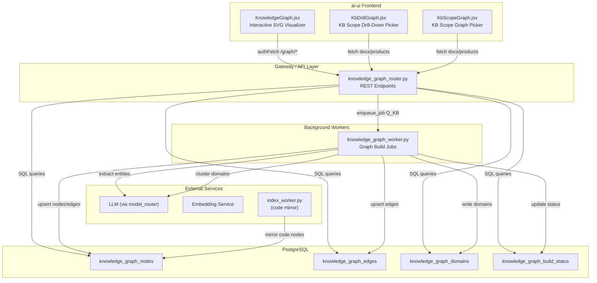
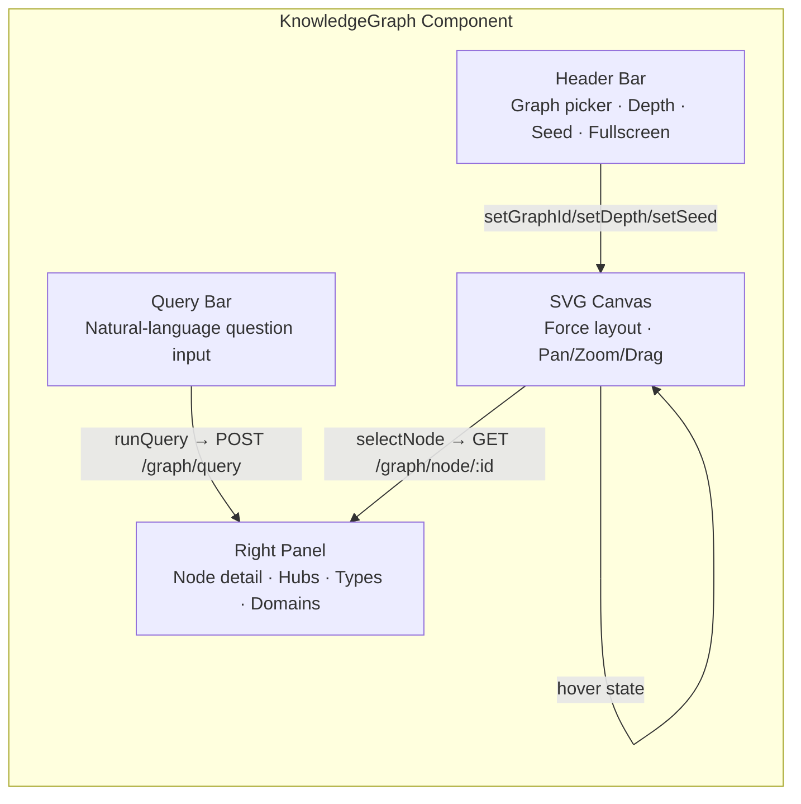
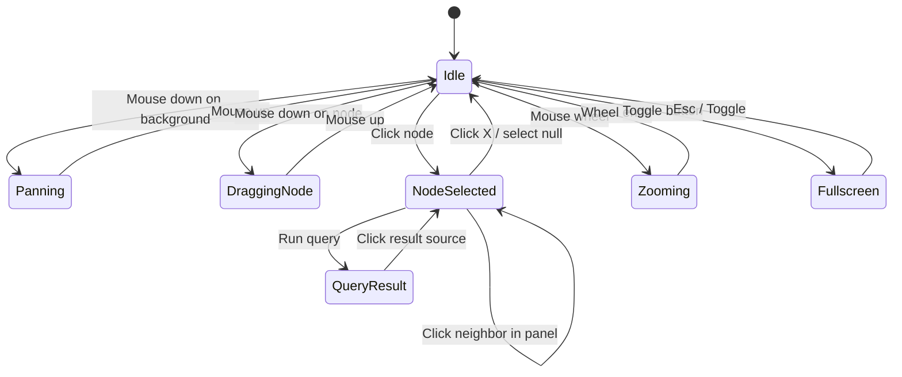
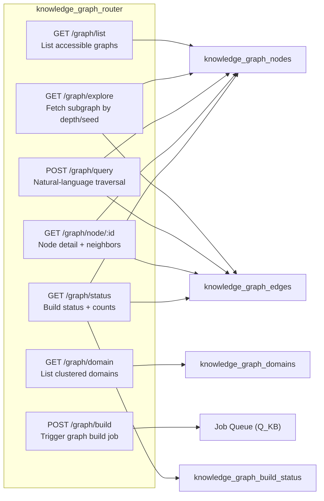
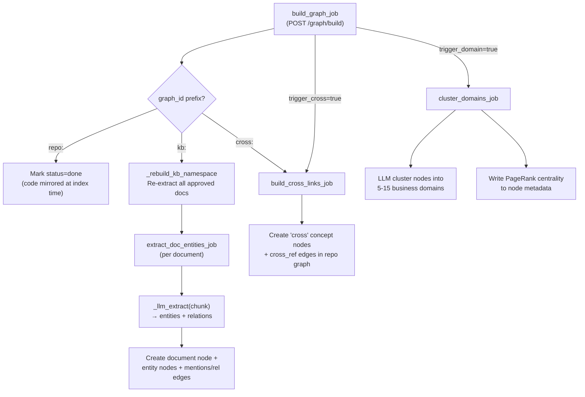
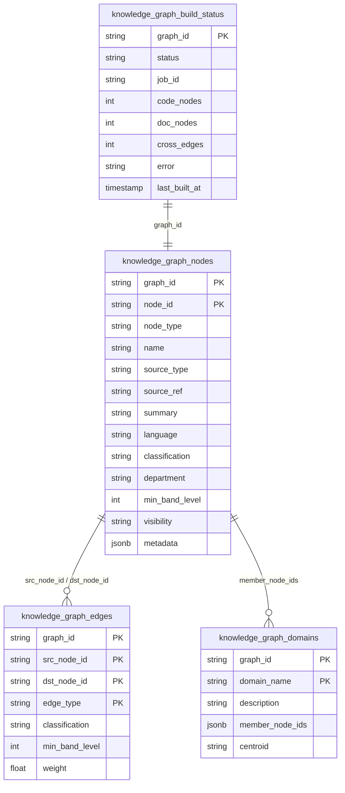
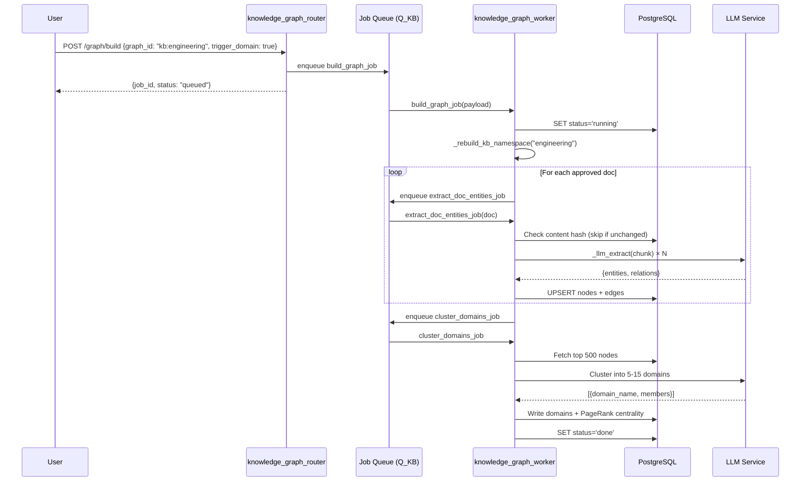
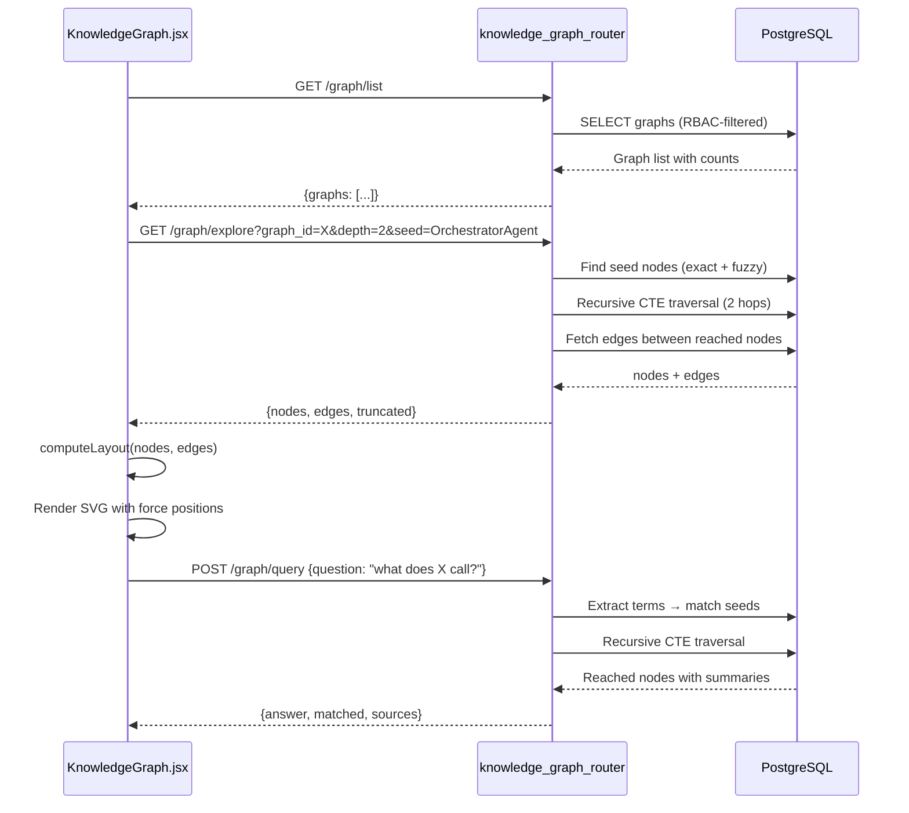

# Knowledge Graph Module

## Introduction

The **Knowledge Graph** module provides an end-to-end system for building, storing, querying, and visually exploring semantic graphs that connect code symbols and document entities across the platform. It spans three layers:

| Layer | Location | Responsibility |
|-------|----------|----------------|
| **Frontend visualizer** | `ai-ui/src/components/KnowledgeGraph.jsx` | Interactive SVG canvas with force-directed layout, pan/zoom/drag, node inspection, natural-language querying, and domain highlighting |
| **Backend API router** | `routers/knowledge_graph_router.py` | REST endpoints for listing graphs, exploring subgraphs, querying by question, fetching node detail, listing domains, and triggering builds |
| **Async worker** | `workers/knowledge_graph_worker.py` | Background jobs that extract entities from documents, mirror code symbols, cross-link code↔docs, cluster domains via LLM, and purge stale nodes |

The module integrates with the broader platform's knowledge base (KB) pipeline, repository indexing, and RBAC system. Graphs are identified by a `graph_id` convention — `repo:<name>` for code graphs, `kb:<namespace>` for document graphs, and `cross:<a>:<b>` for cross-linked graphs — and are stored in PostgreSQL tables (`knowledge_graph_nodes`, `knowledge_graph_edges`, `knowledge_graph_domains`, `knowledge_graph_build_status`).

---

## Architecture Overview



### Module Relationships

The Knowledge Graph module interacts with several other platform modules:

- **[config](../core/config.md)** — Provides `authFetch` and `API_BASE` used by the frontend to call backend endpoints with correlation IDs and credential cookies.
- **[knowledge_graph_router](knowledge_graph_router.md)** (within `shared_api_routers`) — The backend REST API that the frontend visualizer calls.
- **[document_knowledge_workers](../workers/document_knowledge_workers.md)** (within `workers`) — Contains the `knowledge_graph_worker.py` that performs async graph construction, plus `kb_entity_worker.py` and `index_worker.py` that feed data into the graph.
- **[kb_graph](kb_graph.md)** — Sibling frontend components (`KbDrillGraph`, `KbScopeGraph`) that provide KB scope selection for chat, using a different interaction model (drill-down tree vs. force-directed graph).
- **[model_routing](../llm/model_routing.md)** (within `shared_core`) — The `model_router` used by the worker for LLM-based entity extraction and domain clustering.
- **[authentication](../auth/authentication.md)** (within `shared_core`) — RBAC enforcement via `get_current_user` dependency and ACL filters on all graph queries.

---

## Frontend: KnowledgeGraph.jsx

### Purpose

A self-contained React component that renders an interactive, force-directed knowledge graph in an SVG canvas. Users can:

- **Select a graph** from a dropdown of all accessible graphs (RBAC-filtered)
- **Explore subgraphs** by adjusting depth (1–3 hops) and seeding from a specific node
- **Pan, zoom, and drag nodes** with mouse interactions
- **Click nodes** to inspect details, summaries, source references, and neighbor lists
- **Ask natural-language questions** that are matched against node names and traversed via graph edges
- **Highlight domains** — LLM-clustered business/technical groupings — to focus on subsets of nodes
- **View hub nodes** (most-connected) and node-type breakdowns in a side panel

### Component Architecture



### Force-Directed Layout

The `computeLayout` function implements a custom force-directed graph layout entirely in JavaScript (no external library). Key characteristics:

| Parameter | Value | Purpose |
|-----------|-------|---------|
| `REP` | 48000 | Repulsion constant between all node pairs |
| `SPRING` | 0.02 | Spring constant for connected nodes |
| `LEN` | 190 | Target edge length |
| `CENTER` | 0.004 | Gravity pulling nodes toward canvas center |
| `DAMP` | 0.9 | Velocity damping per iteration |
| `MAXV` | 60 | Maximum velocity clamp |
| Iterations | `min(400, 220 + n*4)` | Scales with node count |

**Hub-aware initialization**: Nodes with degree > 6 start at 25% of the radius (near center), while leaf nodes start on the rim. This prevents large star-graph topologies from collapsing into a tight cluster.

**Cooling schedule**: A linear cooling factor (`1 - (it/iters) * 0.7`) gradually reduces repulsion forces over iterations, allowing the layout to settle.

### Interaction Model



### Transform System (Pan/Zoom)

The component maintains a transform state `tf = { k, x, y }` applied as an SVG `<g transform="translate(x,y) scale(k)">`. The `toGraph` function converts screen coordinates to graph-space coordinates accounting for the current transform:

```
graphX = (screenX / rectWidth * W - tf.x) / tf.k
graphY = (screenY / rectHeight * H - tf.y) / tf.k
```

Zoom is anchored at the cursor position: the point under the cursor stays fixed as the scale changes. The zoom range is clamped to `[0.25, 6]`.

### Label Visibility Heuristic

Labels are conditionally shown to avoid clutter:

```
showLabel(node) = selected || hovered || queryMatched || degree >= 5 || totalNodes <= 16 || zoom >= 1.7
```

This ensures that on large graphs, only hubs and contextually relevant nodes display labels, while zooming in progressively reveals more labels.

### API Integration

The component calls five backend endpoints via `authFetch`:

| Endpoint | Method | Trigger | Purpose |
|----------|--------|---------|---------|
| `/graph/list` | GET | Component mount | List all accessible graphs with node counts |
| `/graph/explore?graph_id=&depth=&seed=` | GET | Graph/depth/seed change | Fetch subgraph nodes + edges |
| `/graph/domain?graph_id=` | GET | Graph change | Fetch LLM-clustered domains |
| `/graph/node/:id?graph_id=` | GET | Node click | Fetch detailed node info + neighbors |
| `/graph/query` | POST | Query button / Enter | Natural-language graph traversal |

### Node Type Color Mapping

```javascript
const TYPE_COLOR = {
  class: "#2563eb",      interface: "#2563eb",  module: "#6366f1",
  function: "#0891b2",   concept: "#059669",    system: "#7c3aed",
  process: "#d97706",    domain: "#db2777",     document: "#475569",
  person: "#0d9488",     policy: "#dc2626",     cross: "#9333ea",
};
```

Node radius scales with degree: `r = clamp(5 + degree * 0.7, 5, 13)`.

---

## Backend: knowledge_graph_router.py

### Endpoints



### RBAC Enforcement

All endpoints use `get_current_user` as a dependency and apply ACL filters via `_node_acl()` and `_edge_acl()` helper functions. These generate SQL conditions based on the user's classification level, department, and band level, ensuring users only see nodes and edges they are authorized to access.

### Explore Endpoint (Subgraph Fetch)

The `explore` endpoint supports two modes:

1. **Seed-based traversal**: When a `seed` parameter is provided, it finds matching node IDs (exact name match, then fuzzy `LIKE` fallback) and performs a recursive CTE traversal up to `depth` hops, returning all reachable nodes and the edges between them.

2. **Centrality-based**: Without a seed, it returns the top `limit` nodes ordered by `metadata->>'centrality'` (PageRank computed by the domain clustering job), plus all edges between them.

Both modes support optional `node_types` and `edge_types` filters, and can return GraphML format via `?format=graphml`.

### Query Endpoint (Natural-Language)

The `query_graph` endpoint implements a lightweight graph QA system:

1. **Term extraction**: Regex extracts alphanumeric tokens (≥3 chars) from the question, capped at 8 unique terms
2. **Seed matching**: Exact name match first, then fuzzy `LIKE` substring match as fallback
3. **Recursive traversal**: A recursive CTE traverses up to `max_hops` (1–3) from seed nodes
4. **Result assembly**: Returns matched node names, traversed sources with summaries, and a generated answer string

---

## Backend: knowledge_graph_worker.py

### Job Pipeline



### build_graph_job

The central dispatcher enqueued by `POST /graph/build`. It routes based on the `graph_id` prefix:

- **`repo:<name>`**: Code nodes are already mirrored during repository indexing (by `index_worker.py`'s `_mirror_code_nodes_to_kg`). The job simply marks the build status as `done`.
- **`kb:<namespace>`**: Calls `_rebuild_kb_namespace` which re-enqueues `extract_doc_entities_job` for every approved document in the namespace.
- **Follow-on jobs**: If `trigger_cross` is set (and graph is a repo), enqueues `build_cross_links_job`. If `trigger_domain` is set, enqueues `cluster_domains_job`.

### extract_doc_entities_job

Extracts entities and relations from a KB document's text chunks into the graph:

1. **Content-hash gating**: Computes SHA-256 of joined chunks; skips if unchanged (idempotent rebuilds)
2. **LLM extraction**: Sends each chunk (up to `_MAX_LLM_CALLS`) to the LLM via `_llm_extract`, which returns structured `{entities: [...], relations: [...]}`
3. **Node creation**: Creates a `document` node for the doc itself, plus typed entity nodes (concept, person, system, etc.)
4. **Edge creation**: `mentions` edges from document → each entity; typed relation edges between co-occurring entities
5. **RBAC inheritance**: All nodes/edges inherit the document's classification and department

### build_cross_links_job

Cross-links a repo's code nodes with a KB namespace's document entities by exact name match:

1. Fetches all `source_type='code'` node names from the repo graph
2. Fetches all `source_type='doc'` entity names from the KB graph
3. For each matching name (≥4 chars), creates a `cross` concept node in the repo graph with a `cross_ref` edge to the code node
4. This enables single-graph traversal: `explore(repo:X)` surfaces related KB concepts without switching graphs

### cluster_domains_job

LLM-clusters a graph's nodes into business/technical domains:

1. Fetches top 500 nodes (by centrality) with names, types, and summaries
2. Sends a structured prompt to the LLM requesting 5–15 domain groupings as JSON
3. Writes domains to `knowledge_graph_domains` with member node IDs and descriptions
4. Computes and writes PageRank centrality to node metadata (used by the explore endpoint's default sort)

### delete_doc_nodes

Purges a document's nodes and edges from the graph when a document is deleted. Uses `LIKE` pattern matching on node IDs (`doc_{doc_id}::%` and `doc::{doc_id}`) to remove all associated entities and their edges.

---

## Data Model



### Graph ID Conventions

| Prefix | Example | Source | Build Trigger |
|--------|---------|--------|---------------|
| `repo:` | `repo:payments-service` | Code symbols from repository indexing | Automatic at index time; `build_graph_job` marks status |
| `kb:` | `kb:engineering` | Document entities from KB namespace | `build_graph_job` → `extract_doc_entities_job` per doc |
| `cross:` | N/A (virtual) | Cross-link nodes in repo graph | `build_cross_links_job` |

### Node Types

Nodes are typed by their source and semantic category:

- **Code types**: `class`, `interface`, `module`, `function` (from `source_type='code'`)
- **Document types**: `document` (the doc itself), `concept`, `person`, `system`, `process`, `policy` (extracted entities, `source_type='doc'`)
- **Cross types**: `concept` with `source_type='cross'` (cross-link bridge nodes)

### Edge Types

- `mentions` — document → entity (doc extraction)
- `related_to` / custom — entity → entity (LLM-extracted relations)
- `cross_ref` — code node → cross concept node (cross-linking)
- Code structural edges (calls, imports, inherits) — from index_worker mirroring

---

## Comparison: KnowledgeGraph vs. KbGraph Components

The platform has three graph-based frontend components with different purposes:

| Aspect | `KnowledgeGraph.jsx` | `KbDrillGraph.jsx` | `KbScopeGraph.jsx` |
|--------|----------------------|---------------------|---------------------|
| **Purpose** | Explore semantic knowledge graphs | Pick a KB scope via drill-down tree | Pick a KB scope via force-directed graph |
| **Data source** | `/graph/*` endpoints (knowledge graph tables) | `/docs` + `/products` endpoints | `/docs` + `/products` endpoints |
| **Layout** | Force-directed (repulsion + springs) | Hierarchical drill-down (domain → product → version → document) | Force-directed with tree structure |
| **Interaction** | Free-form exploration, NL queries | Sequential breadcrumb navigation | Click-to-select scope with camera tween |
| **Output** | Insight / exploration | Scope tuple for KB chat | Scope tuple for KB chat |
| **Fullscreen** | Yes (Esc to exit) | No | Yes (Esc to exit) |

The `KbDrillGraph` and `KbScopeGraph` components are documented in detail in **[kb_graph](kb_graph.md)**.

---

## Process Flows

### Graph Build Flow



### Explore & Query Flow



---

## Key Design Decisions

### 1. Client-Side Force Layout (No D3/WebGL)

The `computeLayout` function is a pure-JavaScript implementation using basic trigonometry and iterative relaxation. This avoids external dependencies (D3-force, vis.js, cytoscape) and keeps the bundle small. The trade-off is O(n²) per iteration, mitigated by the iteration cap (`min(400, 220 + n*4)`) and cooling schedule.

### 2. Recursive CTE for Graph Traversal

Both `explore` and `query_graph` use PostgreSQL recursive CTEs for multi-hop traversal. This leverages the database's query optimizer and avoids loading the entire graph into application memory. The traversal is bounded by `depth` (max 3) and `limit` (max 200 nodes, 500 edges) to prevent runaway queries.

### 3. Content-Hash Gating for Idempotent Rebuilds

`extract_doc_entities_job` computes a SHA-256 hash of the document's joined chunks and skips re-extraction if the hash is unchanged. This makes namespace rebuilds idempotent and avoids redundant LLM calls when documents haven't been modified.

### 4. Cross-Link as Bridge Nodes (Not Cross-Graph Edges)

Cross-linking creates `cross` concept nodes *within the repo graph* rather than edges spanning two graphs. This keeps each graph self-contained for single-graph traversal while still surfacing KB concepts when exploring a code graph.

### 5. LLM-Based Domain Clustering with PageRank

Domain clustering uses an LLM to group nodes into business/technical domains (not a pure algorithmic clustering). This produces human-readable domain names and descriptions. PageRank centrality is computed algorithmically and stored in node metadata, powering the default "most central" sort in the explore endpoint.

### 6. RBAC at the SQL Level

All graph queries embed ACL conditions (`_node_acl()`, `_edge_acl()`) directly in SQL WHERE clauses, filtering by classification, department, and band level. This ensures users never receive unauthorized nodes/edges, even in aggregated queries like `list_graphs`.
