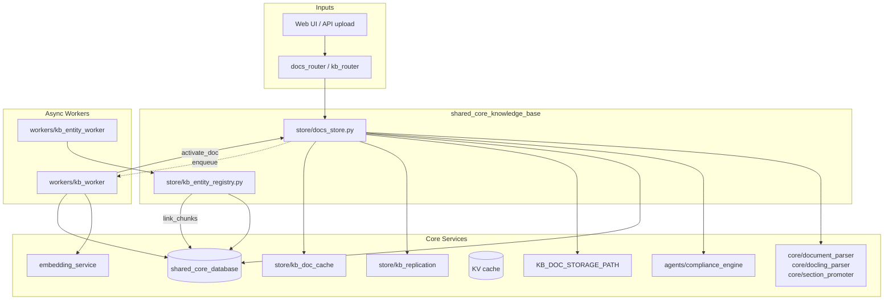
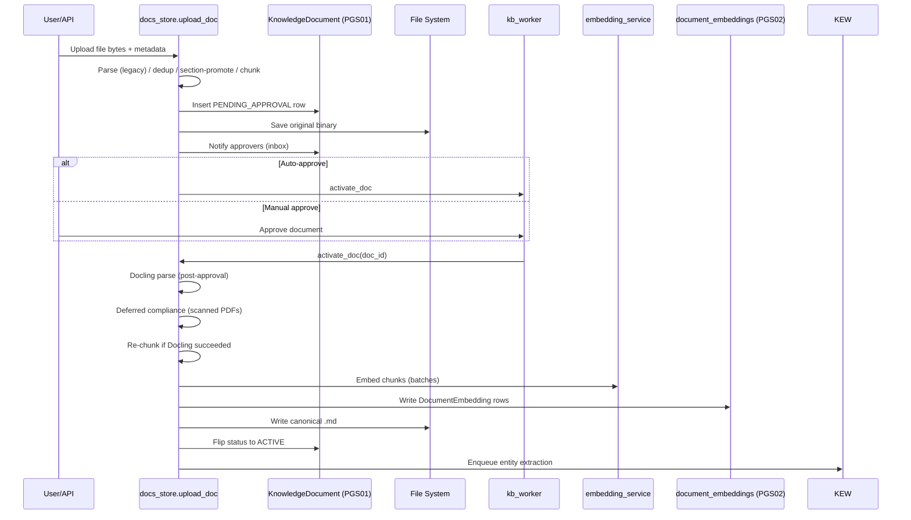
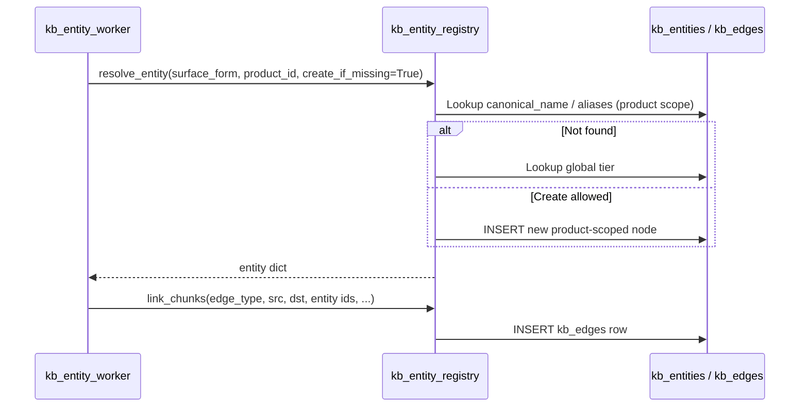

# shared_core_knowledge_base

The `shared_core_knowledge_base` module is the central ingestion, storage, and entity-resolution layer for the platform's Retrieval-Augmented Generation (RAG) knowledge base. It is responsible for turning raw uploaded files into searchable vector chunks, managing document lifecycle states, and maintaining a canonical entity registry so that cross-document references (e.g. "UPI Lite", "UPI-Lite") collapse to a single node.

## Purpose

- Provide a **document knowledge-base store** that parses, chunks, embeds, and indexes uploaded documents into `pgvector`.
- Enforce an **approval workflow** so unapproved content is never RAG-searchable.
- Support **structured, section-aware chunking** with parent/leaf relationships, page numbers, and atomic code/table blocks.
- Maintain a **canonical entity registry** with product-scoped and global tiers, alias normalization, and graph-edge linking.
- Integrate with compliance, OCR/Docling parsing, embedding service, replication, caching, and async entity-extraction workers.

## Architecture Overview

### Component Responsibilities

| Component | File | Responsibility |
|-----------|------|----------------|
| Document Store | `store/docs_store.py` | Upload staging, parsing, chunking, approval workflow, activation/embedding, deprecation, deletion, and namespace management. |
| Entity Registry | `store/kb_entity_registry.py` | Canonical entity resolution, alias management, and generic knowledge-graph edge insertion. |

## Sub-modules

- **[shared_core_knowledge_base_entity_registry](shared_core_knowledge_base_entity_registry.md)** — canonical entity resolution and alias normalization.
- **[shared_core_knowledge_base_document_store](shared_core_knowledge_base_document_store.md)** — document ingestion, chunking, activation, and lifecycle management.

## Document Lifecycle Data Flow

## Entity Resolution Data Flow

## Integration with the Rest of the System

- **API layer**: `shared_api_routers.docs_router`, `shared_api_routers.kb_router`, and `abstudio_backend.app.api.kb` call `upload_doc`, `list_docs`, `delete_doc`, and entity APIs.
- **Frontend**: `ai_ui_frontend.knowledge_base` (`KnowledgeBase.jsx`) and `abstudio_frontend.common_components.KnowledgeUploadInline` drive uploads and namespace selection.
- **Database**: Uses `shared_core_database` (`KnowledgeDocument`, `DocumentEmbedding`, `kb_entities`, `kb_edges`) via `db.database.SessionLocal` / `VectorSessionLocal`.
- **Parsing**: Delegates to `shared_core_document_processing` (`core/document_parser`, `core/docling_parser`, `core/section_promoter`).
- **Compliance**: Scans content through `shared_core_agent_system.compliance_engine`.
- **Embedding**: Calls the standalone `embedding_service` over HTTP.
- **Workers**: `workers/kb_worker` triggers activation; `workers/kb_entity_worker` extracts entities and links chunks.
- **Storage/Cache**: Persists originals and markdown to `KB_DOC_STORAGE_PATH`, replicates via `store/kb_replication`, and invalidates `store/kb_doc_cache`.

## Key Design Decisions

1. **Approval-gated embedding**: Vectors are written only in `activate_doc`, so rejected or pending documents are never RAG-searchable.
2. **Post-approval Docling**: Expensive OCR/Docling parsing runs after approval to avoid wasted work on rejected docs.
3. **Structured chunking**: `docs_store` emits parent (whole-section) and leaf chunks with `section_path`, `section_name`, and `page_number` for better citation and retrieval.
4. **Two-tier entity registry**: Product-scoped entities prevent cross-product leakage; global entities are admin-promoted only.
5. **Alias normalization**: Lowercase, punctuation-stripped, whitespace-collapsed keys with hyphen/space/underscore convergence.
6. **Zero-vector guard**: Activation fails if >10% of embeddings are zero vectors, preventing silently broken RAG results.
