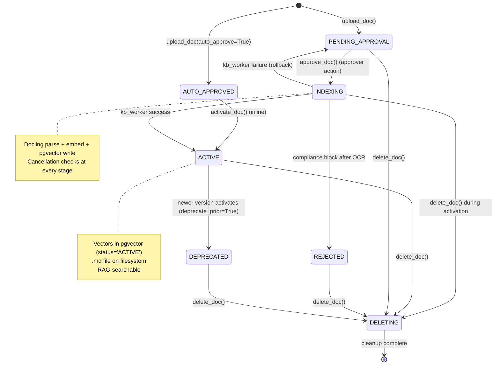
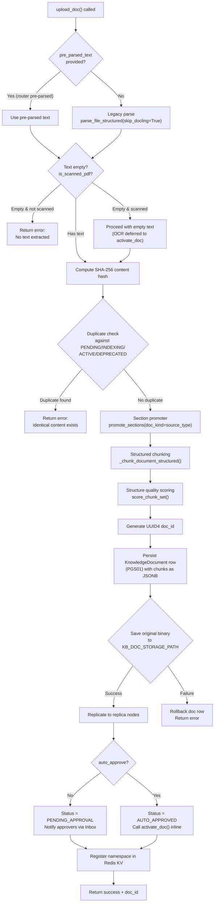
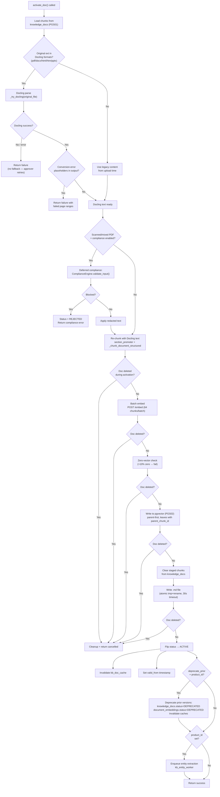
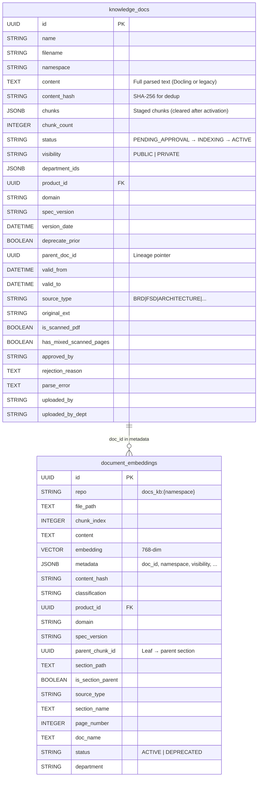
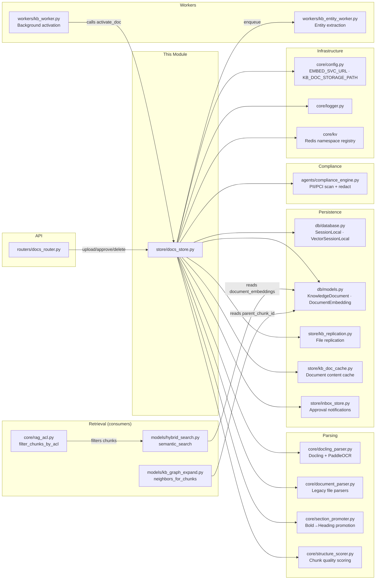
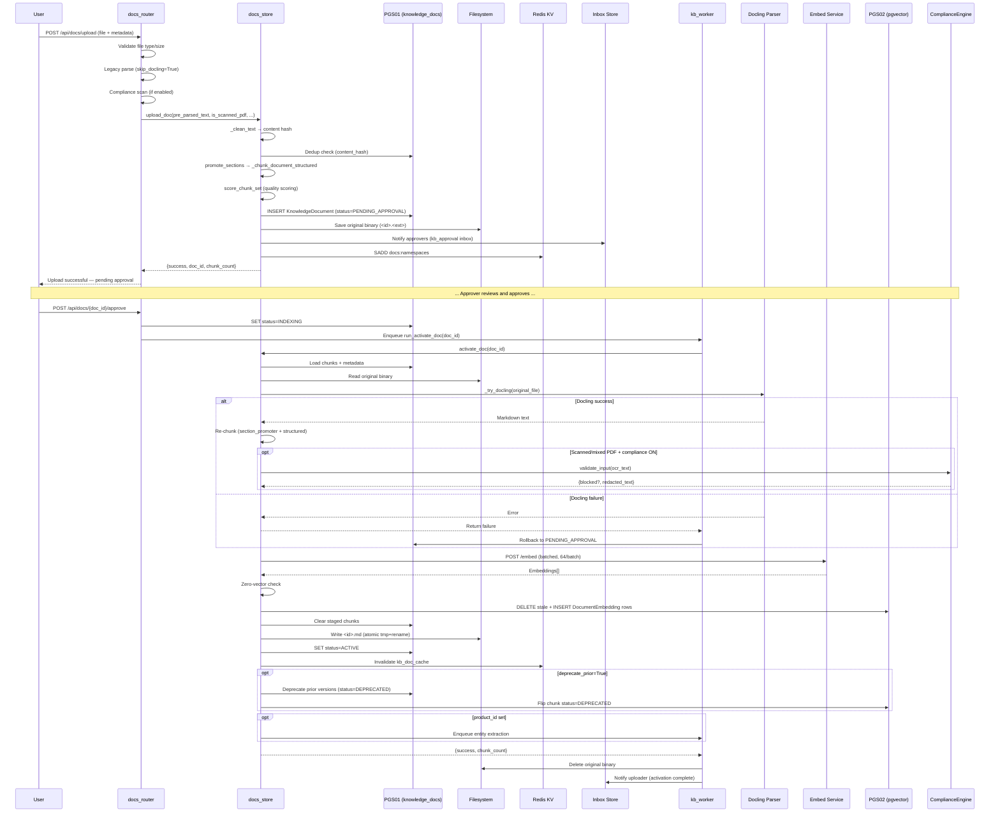

# Knowledge Base Document Store

## Introduction

The **Knowledge Base Document Store** (`store/docs_store.py`) is the central persistence and lifecycle management layer for enterprise documents in the RAG (Retrieval-Augmented Generation) pipeline. It governs the complete document journey — from upload through parsing, structure-aware chunking, approval-gated embedding, and final activation into the pgvector search index — while enforcing deduplication, compliance redaction, version deprecation, and multi-tenant access control.

The module sits within the broader [shared_core_knowledge_base](shared_core_knowledge_base.md) subsystem and is the **single authoritative entry point** for writing document content and embeddings. No other component writes to the `document_embeddings` pgvector table except `activate_doc()` in this module.

---

## Architecture Overview

```mermaid
graph TB
    subgraph "API Layer"
        DR["routers/docs_router.py<br/>upload_doc · approve_doc · delete_doc"]
        KR["routers/kb_router.py<br/>list_entities · get_lineage"]
    end

    subgraph "Document Store (this module)"
        UD["upload_doc<br/>Parse → Chunk → Stage"]
        AD["activate_doc<br/>Docling → Re-chunk → Embed → pgvector"]
        CD["_chunk_document_structured<br/>Section-aware chunker"]
        LD["list_docs · delete_doc<br/>list_namespaces · get_original_path"]
    end

    subgraph "Parsing & Chunking"
        DP["core/docling_parser.py<br/>Docling + PaddleOCR"]
        LCP["core/document_parser.py<br/>Legacy parsers"]
        SP["core/section_promoter.py<br/>Bold→Heading promotion"]
        SS["core/structure_scorer.py<br/>Chunk quality scoring"]
    end

    subgraph "Persistence"
        PGS1["PGS01 — knowledge_docs<br/>(PostgreSQL main DB)"]
        PGS2["PGS02 — document_embeddings<br/>(pgvector)"]
        FS["Filesystem<br/>KB_DOC_STORAGE_PATH/<id>.md<br/>KB_DOC_STORAGE_PATH/<id>.<ext>"]
        KV["Redis KV<br/>docs:namespaces"]
    end

    subgraph "External Services"
        ES["Embedding Service<br/>/embed endpoint"]
        CE["ComplianceEngine<br/>PII/PCI scan + redact"]
    end

    subgraph "Workers"
        KW["workers/kb_worker.py<br/>run_activate_doc (RQ)"]
        KEW["workers/kb_entity_worker.py<br/>Entity extraction"]
    end

    DR -->|"upload"| UD
    DR -->|"approve → enqueue"| KW
    DR -->|"delete"| LD
    KW -->|"calls"| AD

    UD -->|"skip_docling=True"| LCP
    UD -->|"pre_parsed_text"| CD
    UD --> SP
    UD --> SS
    UD -->|"stage chunks"| PGS1
    UD -->|"save original binary"| FS
    UD -->|"notify approvers"| IS["store/inbox_store.py"]

    AD -->|"re-parse post-approval"| DP
    AD -->|"deferred compliance"| CE
    AD -->|"re-chunk Docling output"| SP
    AD --> CD
    AD -->|"batch embed"| ES
    AD -->|"write vectors"| PGS2
    AD -->|"write .md"| FS
    AD -->|"deprecate prior versions"| PGS1
    AD -->|"enqueue entity extraction"| KEW

    LD -->|"delete vectors"| PGS2
    LD -->|"delete record"| PGS1
    LD -->|"delete files"| FS
```



---

## Document Lifecycle State Machine

The module enforces a strict approval-gated lifecycle. Vectors are **never** written to pgvector until a document is approved — unapproved content is never RAG-searchable.



### Status Values

| Status | Meaning | Vectors in pgvector? |
|---|---|---|
| `PENDING_APPROVAL` | Uploaded, awaiting approver action | No |
| `AUTO_APPROVED` | Admin/approver uploaded — embed immediately | No (transient) |
| `INDEXING` | Approved, background worker parsing/embedding | No (in progress) |
| `ACTIVE` | Fully indexed and RAG-searchable | Yes (`status='ACTIVE'`) |
| `REJECTED` | Compliance block or parse failure | No |
| `DEPRECATED` | Superseded by newer version | Yes (`status='DEPRECATED'`, filtered out) |
| `DELETING` | Deletion in progress — activation workers must stop | Being removed |

---

## Core Components

### 1. `upload_doc()` — Upload, Parse, Chunk, and Stage

The primary entry point for document ingestion. Performs a **lightweight** parse (legacy parsers only — Docling is intentionally deferred to post-approval), structure-aware chunking, deduplication, and staging into the `knowledge_docs` table.



**Key design decisions:**

- **Docling deferred**: The expensive Docling/PaddleOCR parse runs only in `activate_doc()` post-approval, avoiding wasted parse calls for documents deleted before approval.
- **Deduplication on content hash**: SHA-256 of cleaned text (or raw bytes for scanned PDFs) is checked against all non-terminal document statuses.
- **Original binary retained**: The raw file (PDF/DOCX/etc.) is saved to `KB_DOC_STORAGE_PATH/<doc_id>.<ext>` at upload time so `activate_doc()` can pass it to Docling without needing the raw bytes again.
- **Scanned PDF handling**: Image-only PDFs with zero extractable text are allowed through (flagged `is_scanned_pdf=True`); OCR + compliance run during activation.
- **Mixed PDF detection**: PDFs with some scanned pages and some digital pages are flagged (`has_mixed_scanned_pages=True`); PaddleOCR runs on scanned pages at activation and results are merged.

---

### 2. `_chunk_document_structured()` — Section-Aware Chunker

The chunking engine produces **parent + leaf** chunk pairs with section-path breadcrumbs, enabling hierarchical retrieval and precise citation rendering.

```mermaid
flowchart LR
    subgraph "Input"
        RT["Raw markdown text<br/>with <!-- page:N --> markers"]
    end

    subgraph "Pre-processing"
        CT["_clean_text()<br/>Strip page numbers, separators,<br/>conversion-error placeholders"]
        AB["_extract_atomic_blocks()<br/>Fenced code, JSON, XML,<br/>code-like blocks → placeholders"]
    end

    subgraph "Section Splitting"
        HS["Split at ATX headings<br/>(# ## ###)"
        SS2["Build heading stack<br/>→ section_path breadcrumbs"]
    end

    subgraph "Per-Section Processing"
        SP2["_section_to_pieces()<br/>Tables = atomic units<br/>Paragraphs → sentence split"]
        MP["_merge_pieces()<br/>Greedy merge to target=800 chars"]
        FL["Filter noise leaves<br/>(heading-only, <50 chars)"]
        OL["Overlap stitching<br/>(skip if prev ends with table)"]
    end

    subgraph "Output"
        PR["PARENT rows<br/>(whole section, ≤6000 chars)"]
        LR["LEAF rows<br/>(fine-grained, parent_idx link)"]
        AR["ATOMIC rows<br/>(code/JSON/XML, content_type+language)"]
    end

    RT --> CT --> AB --> HS --> SS2 --> SP2 --> MP --> FL --> OL
    OL --> PR
    OL --> LR
    OL --> AR
```

**Chunk metadata emitted per row:**

| Field | Description |
|---|---|
| `text` | Chunk content |
| `section_path` | Breadcrumb path, e.g. `"1. Intro > 1.2 Scope"` |
| `section_name` | Last segment of section_path (for UI badges) |
| `page_number` | Page from `<!-- page:N -->` markers (PDF only) |
| `is_parent` | `True` for whole-section rows |
| `parent_idx` | Index of parent row in the output list (for leaves) |
| `atomic` | `True` for code/JSON/XML blocks |
| `content_type` | `code`, `json`, `xml`, `code_like` |
| `language` | Inferred language: `python`, `java`, `sql`, `json`, etc. |

**Table handling**: Consecutive Markdown table lines (`|…|`) are kept as atomic units — never split mid-table. Overlap stitching is skipped when the previous leaf ends with a table row to prevent corrupting table fragments.

**Atomic block extraction**: Fenced code blocks, JSON objects/arrays, XML blocks, and code-like text regions are extracted as placeholders before chunking, then re-injected as standalone atomic chunks with inferred language metadata. This prevents code from being fragmented across chunk boundaries.

---

### 3. `activate_doc()` — Post-Approval Activation

The **only path** that makes a document RAG-searchable. Called either inline (for auto-approved uploads) or via the `kb_worker` background queue (for approver-approved documents).



**Cancellation safety**: At every major stage (after Docling parse, before/after embedding, before/after pgvector write, before MD write, before status flip), the module checks whether the document has been marked `DELETING` or `DELETED`. If so, it cleans up any partial outputs (pgvector rows, .md files) and returns a cancelled result.

**Zero-vector guard**: The Ollama embedder silently returns zero vectors for failed individual texts. If more than 10% of chunks are zero vectors, activation fails — preventing documents with silently broken embeddings from becoming ACTIVE.

**Version deprecation**: When `deprecate_prior=True` and `product_id` is set, all prior versions of the same product+domain are atomically deprecated — both in `knowledge_docs` (status → `DEPRECATED`, `valid_to` set) and in `document_embeddings` (chunk-level `status` → `DEPRECATED`). The hybrid search query appends `AND status='ACTIVE'`, so deprecation is instant with no re-indexing.

---

### 4. `delete_doc()` — Document Deletion

Removes a document from all storage layers with cache-first invalidation:

1. **Invalidate cache** — Drop `kb_doc_cache` entry before touching SQL (prevents race where another request warms cache from the row being deleted)
2. **Mark DELETING** — Signal to any in-flight `activate_doc()` workers to stop
3. **Delete filesystem files** — Remove `.md` and original binary (`.<ext>`) from `KB_DOC_STORAGE_PATH`, plus replicas
4. **Delete pgvector rows** — `DELETE FROM document_embeddings WHERE metadata->>'doc_id' = :doc_id`
5. **Delete DB record** — Remove `KnowledgeDocument` row from PGS01
6. **Cleanup namespace** — Remove namespace from Redis KV if no chunks remain

---

### 5. Supporting Functions

| Function | Purpose |
|---|---|
| `list_docs()` | List documents with optional filters (namespace, status, product_id, domain, spec_version) |
| `list_namespaces()` | Return registered namespaces from Redis KV, with DB and pgvector fallbacks |
| `get_original_path()` | Return absolute path to retained original binary for citation "Open original" links |
| `_notify_approvers_kb()` | Fire-and-forget inbox notification to all active approvers (ad_level ≤ 3 or admin) |

---

## Data Model

### PGS01: `knowledge_docs` (KnowledgeDocument)

Stores document metadata, lifecycle status, and staged chunks (pre-embedding).



### PGS02: `document_embeddings` (DocumentEmbedding)

The pgvector table holding embedded chunks. Written **only** by `activate_doc()`. Each chunk row carries denormalized metadata (doc_name, source_type, section_path, page_number) to enable citation rendering and source-type filtering without cross-DB joins.

---

## Dependency Map



---

## Integration Points

### Upstream Callers

| Caller | Function Called | Context |
|---|---|---|
| `routers/docs_router.py::upload_doc` | `upload_doc()` | HTTP multipart upload with validation, compliance scan, scanned-PDF detection |
| `routers/docs_router.py::approve_doc` | Enqueues `kb_worker.run_activate_doc` | Sets status to `INDEXING`, enqueues RQ job |
| `workers/kb_worker.py::run_activate_doc` | `activate_doc()` | Background worker — handles rollback, original file cleanup, uploader notification |
| `routers/docs_router.py::delete_doc` | `delete_doc()` | HTTP delete with cache invalidation |

### Downstream Consumers

| Consumer | What It Reads | Module Reference |
|---|---|---|
| `models/hybrid_search.py` | `document_embeddings` table — semantic + keyword search with `status='ACTIVE'` filter | [model_routing](../llm/model_routing.md) |
| `core/rag_acl.py` | Chunk metadata (`classification`, `department`, `product_id`) for access control | [core_infrastructure](../core/core_infrastructure.md) |
| `models/kb_graph_expand.py` | `parent_chunk_id`, `section_path` for graph-based context expansion | [model_routing](../llm/model_routing.md) |
| `store/kb_doc_cache.py` | `.md` file on filesystem for full-document content caching | [shared_core_knowledge_base_entity_registry](shared_core_knowledge_base_entity_registry.md) |
| `workers/kb_entity_worker.py` | `knowledge_docs.content` for entity extraction and knowledge graph building | [document_knowledge_workers](../workers/document_knowledge_workers.md) |

---

## End-to-End Document Flow



---

## Compliance Integration

The module integrates with the [ComplianceEngine](../sdlc/shared_core_sdlc_pipeline.md) at two points, gated by the `COMPLIANCE_SCAN_KB_UPLOAD` environment flag (default OFF):

1. **Upload time** (in `docs_router.py`): For non-scanned documents with extractable text, PII/PCI scan + redaction runs before staging. Blocking types (e.g., card numbers, private keys) reject the upload entirely.

2. **Activation time** (in `activate_doc()`): For scanned/mixed PDFs where compliance was deferred (no OCR text existed at upload), the compliance scan runs after Docling/PaddleOCR extracts text. Blocking types set the document to `REJECTED` with the compliance reasons stored in `rejection_reason`.

When compliance is OFF, raw text is stored and indexed as-is; redaction happens at retrieval time for cloud models only.

---

## Filesystem Layout

```
KB_DOC_STORAGE_PATH/
├── <doc_id>.md              # Canonical markdown body (Docling-processed)
├── <doc_id>.pdf             # Original binary (deleted by kb_worker post-activation)
├── <doc_id>.docx            # Original binary (deleted by kb_worker post-activation)
└── ...
```

- The `.md` file is the single source of truth for full-document content (Coverage tier in RAG).
- The original binary is retained only until activation completes; `kb_worker` deletes it after successful embedding.
- For pending/rejected documents that were never activated, the original binary persists until `delete_doc()` removes it.
- File writes use atomic tmp+rename to be safe for concurrent cache readers.

---

## Key Design Principles

1. **Approval-gated embedding**: Vectors are never written to pgvector until a document is approved. Unapproved content is invisible to RAG search.

2. **Deferred expensive parsing**: Docling/PaddleOCR runs only post-approval in `activate_doc()`, not at upload time. This avoids wasted parse calls for documents deleted before approval.

3. **Structure-aware chunking**: The chunker respects Markdown headings, tables (atomic), code blocks (atomic with language inference), and sentence boundaries — producing parent+leaf pairs with section-path breadcrumbs for hierarchical retrieval.

4. **Cancellation safety**: Every stage of `activate_doc()` checks for document deletion, cleaning up partial outputs if the document was deleted mid-activation.

5. **User-facing error sanitization**: Internal exceptions (DB errors, service URLs, model names) are logged in full but never surfaced to users. Error messages are scrubbed via `sanitize_user_error()` before returning.

6. **Version deprecation**: When a new spec version activates with `deprecate_prior=True`, prior versions are atomically deprecated at both the document and chunk level — no re-indexing required.

7. **Multi-DB architecture**: Document metadata lives in PGS01 (PostgreSQL main DB); vector embeddings live in PGS02 (pgvector). Chunk metadata is denormalized onto embedding rows to avoid cross-DB joins during retrieval.
