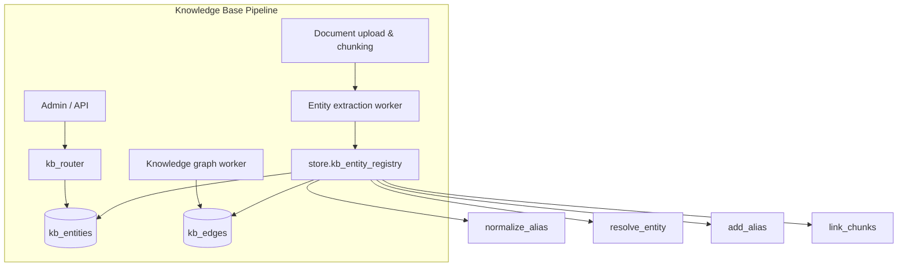
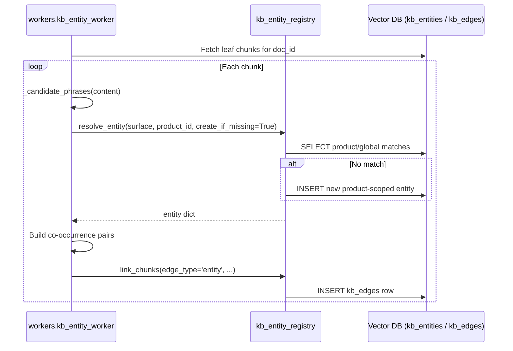
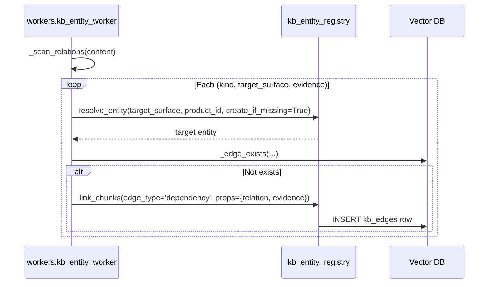
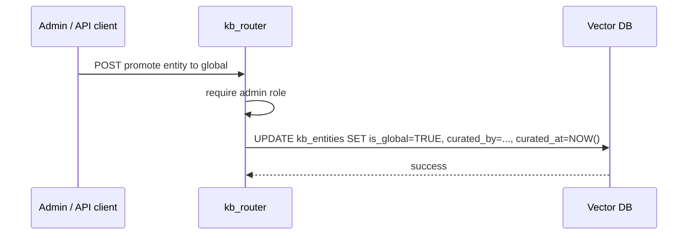
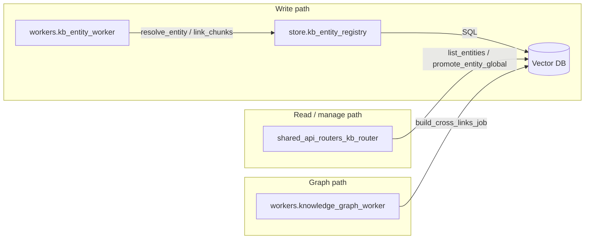

# shared_core_knowledge_base_entity_registry

## Brief Introduction

The **Canonical Entity Registry** (`store/kb_entity_registry.py`) is a small but critical layer inside the shared knowledge-base stack. Its job is to collapse many surface forms of the same real-world entity into a single canonical node so that downstream graph, search, and dependency features do not fragment across spelling variations.

A few examples of what it resolves:

| Surface forms | Canonical node |
|---------------|----------------|
| `UPI Lite`, `UPI-Lite`, `UPI lite payment` | `UPI Lite` |
| `RBI`, `Reserve Bank of India` | `RBI` (global) |

The registry supports two scope tiers:

1. **Product-scoped (default)** — each `canonical_name` lives under a `scope_product_id`. The same string in a different product is a separate node. This honors the hard product filter and prevents cross-product entity links from bleeding.
2. **Global (curated allow-list)** — admin-promoted only; extraction never auto-promotes. Used for genuinely cross-product entities such as regulators, standards, or company-wide concepts.

This module is intentionally narrow: it only knows how to normalize text, look up or create canonical rows, append aliases, and write generic edges. All document parsing, chunking, embedding, graph traversal, and governance logic live in sibling modules.

---

## Responsibilities

- **Alias normalization** — convert surface forms into comparable keys (lowercase, strip punctuation, collapse whitespace, converge hyphen/space/underscore variants).
- **Entity resolution** — match a surface form against product-scoped and global canonical names and aliases, with optional auto-creation.
- **Alias curation** — append new normalized aliases to existing entities idempotently.
- **Edge persistence** — write rows into `kb_edges` for co-occurrence, dependency, version, and cross-reference relationships.

---

## Architecture Overview



The registry sits between extraction workers and the database. It does not own the document lifecycle; it only owns the canonical identity of entities discovered inside documents.

---

## Data Model

The module operates on two tables in the vector database:

### `kb_entities`

| Column | Type | Purpose |
|--------|------|---------|
| `id` | UUID | Primary key |
| `scope_product_id` | UUID / NULL | Product scope; `NULL` only for global entities |
| `canonical_name` | text | Human-readable canonical form |
| `kind` | text | Optional type label (e.g. `product`, `regulator`) |
| `aliases` | JSONB | GIN-indexed list of normalized surface forms |
| `is_global` | boolean | `TRUE` for curated global entities |
| `curated_by`, `curated_at` | text / timestamp | Audit trail for global promotion |

### `kb_edges`

| Column | Purpose |
|--------|---------|
| `edge_type` | `entity`, `dependency`, `version`, `cross_ref`, etc. |
| `src_doc_id`, `src_chunk_id` | Source location |
| `dst_doc_id`, `dst_chunk_id` | Target location (may be NULL for entity-only targets) |
| `src_entity_id`, `dst_entity_id` | Canonical entity endpoints |
| `product_id`, `spec_version` | Scope metadata |
| `props` | JSONB relation metadata (e.g. `relation: co_occurs`) |

---

## Core Components

### `normalize_alias(text: str) -> str`

Idempotent normalization used as the registry key.

Rules applied:

- Lowercase
- Strip leading/trailing whitespace
- Replace any non-alphanumeric run with a single space
- Collapse internal whitespace

Examples:

- `"UPI Lite"` → `"upi lite"`
- `"UPI-Lite"` → `"upi lite"`
- `"UPILITE"` → `"upilite"` (glued forms stay separate without dictionary help)
- `"RBI"` → `"rbi"`

### `_candidates(name: str) -> list[str]`

Generates the normalized candidate set for a surface form. Covers common hyphen, space, and glued variants:

- normalized base
- base with spaces removed
- base with spaces replaced by hyphens

These candidates are stored in `aliases` and used for `?|` JSONB containment queries.

### `resolve_entity(...)`

The main resolution entry point.

Lookup order:

1. Exact `canonical_name` match in product scope
2. Alias match in product scope (`aliases ?| ARRAY[:cand0]`)
3. Exact `canonical_name` match in global tier (`is_global = TRUE`)
4. Alias match in global tier
5. If `create_if_missing=True` and `product_id` is provided, create a new product-scoped node

Returns a dict produced by `_row_to_dict`, or `None` on failure/no-match.

Key parameters:

| Parameter | Meaning |
|-----------|---------|
| `surface_form` | The raw text to resolve |
| `product_id` | Product scope to search / create under |
| `create_if_missing` | Whether to mint a new product-scoped entity |
| `kind` | Optional type label for newly created entities |

### `add_alias(entity_id: str, alias: str) -> bool`

Appends a normalized alias to an existing entity idempotently. Uses a `jsonb_array_elements_text` subquery with `array_agg(DISTINCT a)` to avoid duplicates. Returns `True` on success, `False` on failure.

### `link_chunks(...)`

Generic edge writer used by both Phase 4 (dependency/version edges) and Phase 5 (entity edges). Inserts one row into `kb_edges` and returns the new edge id as a string, or `None` on failure.

Important fields:

- `edge_type` — discriminates the semantic of the edge
- `src_entity_id` / `dst_entity_id` — link through the canonical registry
- `props` — arbitrary JSONB metadata such as `relation` and `evidence`

### `_row_to_dict(row) -> dict`

Internal helper that converts a SQLAlchemy row tuple into the standard entity dict:

```python
{
    "id": str(row[0]),
    "scope_product_id": str(row[1]) if row[1] else None,
    "canonical_name": row[2],
    "kind": row[3] or "",
    "aliases": row[4] or [],
    "is_global": bool(row[5]),
}
```

---

## Data Flow

### Entity Extraction Flow



### Dependency Edge Flow



### Global Promotion Flow



---

## Component Interactions



- **workers.kb_entity_worker** is the primary writer. It calls `resolve_entity` for every candidate phrase and `link_chunks` for every co-occurrence or dependency edge.
- **shared_api_routers_kb_router** exposes browse and admin-promotion endpoints over `kb_entities`.
- **workers.knowledge_graph_worker** builds cross-reference edges between code graphs and KB doc entities; it reads `knowledge_graph_nodes` rather than calling the registry directly, but the KB concepts it links were canonicalized by the registry.

---

## How It Fits into the System

The registry is one piece of the larger knowledge-base stack:

1. Documents are uploaded and chunked by [shared_core_knowledge_base_document_store](shared_core_knowledge_base_document_store.md).
2. Approved documents are embedded and their leaf chunks land in `document_embeddings`.
3. [workers_document_knowledge_workers](../workers_document_knowledge_workers.md) (specifically `kb_entity_worker`) scan those chunks, resolve surface forms through this registry, and write `kb_edges`.
4. [shared_api_routers_kb_router](../shared_api_routers_kb_router.md) lets users browse entities, view lineage, diff versions, and promote entities to the global tier.
5. The knowledge graph worker can later cross-link code symbols with canonical KB concepts.

By centralizing canonical identity here, the rest of the system can treat `"UPI Lite"` and `"UPI-Lite"` as the same node without every consumer reimplementing normalization logic.

---

## Error Handling and Logging

All public functions are wrapped in defensive `try/except` blocks. On failure they:

- Log a warning or error via `core.logger`
- Return `None` or `False` rather than raising, so extraction workers can continue with the next chunk
- Close the SQLAlchemy session in a `finally` block

Because the registry is called inside batch workers, silent degradation is preferred over hard failures that would block an entire document.

---

## References

- [shared_core_knowledge_base_document_store](shared_core_knowledge_base_document_store.md) — document upload, chunking, and activation
- [workers_document_knowledge_workers](../workers_document_knowledge_workers.md) — `kb_entity_worker` and `knowledge_graph_worker`
- [shared_api_routers_kb_router](../shared_api_routers_kb_router.md) — entity browse, lineage, version diff, and global promotion endpoints
