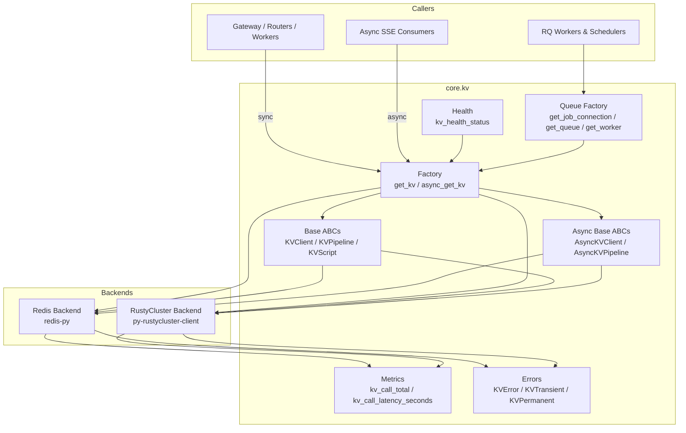
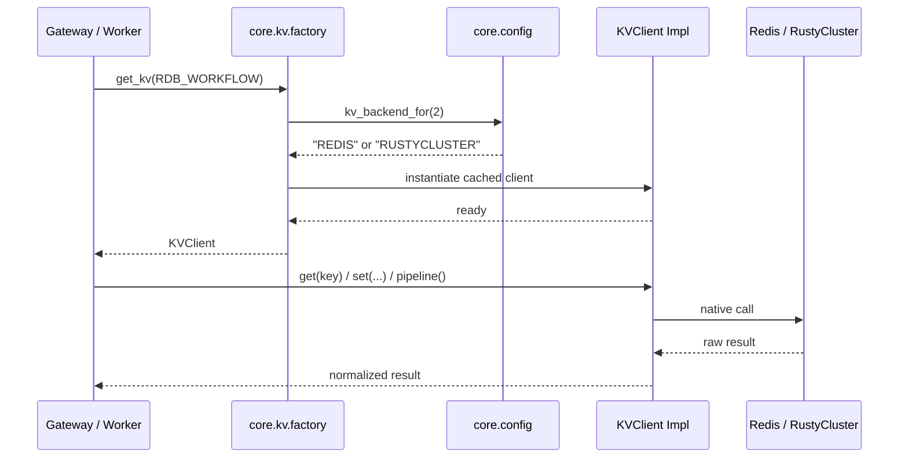

# kv_store — Backend-Agnostic Key-Value Layer

The `kv_store` module (implemented under `core/kv`) is the platform's unified key-value access layer. It abstracts away the differences between a local/standalone **Redis** deployment and a clustered **RustyCluster** backend so that the rest of the codebase can treat KV storage as a single, backend-agnostic interface.

## Purpose

* Provide a stable `KVClient` / `AsyncKVClient` API for strings, hashes, sets, sorted sets, lists, streams, Lua scripts, and pipelines.
* Allow per-logical-DB backend selection (Redis vs RustyCluster) via environment variables, enabling safe incremental rollouts and rollbacks.
* Centralize connection caching, health probing, exception translation, and Prometheus metrics for all KV access.
* Expose a backend-agnostic RQ-compatible job-queue factory (`core.kv.queue`) used by workers and schedulers.

## Logical DB Allocation

The platform uses nine logical DBs (`KV_DB_COUNT = 9`). The backend for each DB is resolved independently by `core.config.kv_backend_for(db)`:

| DB | Constant | Primary Use |
|----|----------|-------------|
| 0 | `RDB_CACHE` | Answer cache, rewrite cache |
| 1 | `RDB_TRACE` | Trace store |
| 2 | `RDB_WORKFLOW` | Workflows, agent run history |
| 3 | `RDB_REGISTRY` | Marketplace registry, inbox, index governance |
| 4 | `RDB_BUDGET` | Budget and usage data |
| 5 | `RDB_QUEUE` | RQ job queues, Teams conversation mapping |
| 6 | `RDB_STREAM` | Chat token streams (SSE via `XREAD`) |
| 7 | `RDB_EMBED` | Embedding service SHA256 embedding cache |
| 8 | `RDB_PRIVACY` | Privacy service PII cache |

Backend selection order for each DB:
1. `REDIS_CLIENT_CONFIG_DB{n}` (per-DB override)
2. `REDIS_CLIENT_CONFIG` (global default)
3. `"REDIS"` (hard-coded fallback)

## Architecture Overview



## High-Level Sub-Modules

| Sub-module | Files | Responsibility | Documentation |
|------------|-------|----------------|---------------|
| **Sync Client Implementations** | `redis_impl.py`, `rustycluster_impl.py` | Concrete `KVClient` implementations for Redis and RustyCluster, including pipelines, Lua scripts, and exception translation. | [kv_store_sync_clients.md](kv_store_sync_clients.md) |
| **Async Client Implementations** | `async_redis_impl.py`, `async_rustycluster_impl.py` | Concrete `AsyncKVClient` implementations for Redis and RustyCluster, used by SSE consumers and microservices. | [kv_store_async_clients.md](kv_store_async_clients.md) |
| **Core Infrastructure** | `base.py`, `async_base.py`, `errors.py`, `factory.py`, `health.py`, `metrics.py`, `queue.py` | ABCs, error hierarchy, client factory with per-DB caching, health probes, Prometheus metrics, and RQ-compatible queue factory. | [kv_store_infrastructure.md](kv_store_infrastructure.md) |

## Public API

The recommended entry points are exported from `core.kv`:

```python
from core.kv import get_kv, async_get_kv, close_all_kv, async_close_all_kv
from core.kv import kv_backend_map, kv_health_status
from core.kv import KVClient, AsyncKVClient, KVError, KVTransient, KVPermanent
```

* `get_kv(db, decode_responses=True)` — returns a cached sync `KVClient` for the logical DB.
* `async_get_kv(db, decode_responses=True)` — returns a cached async `AsyncKVClient` bound to the current event loop.
* `close_all_kv()` / `async_close_all_kv()` — close all cached clients during graceful shutdown.
* `kv_backend_map()` — live backend resolution for every logical DB.
* `kv_health_status()` — ping every logical DB and report reachability.

## Backend-Swap Safety

The module is designed so that switching a DB from Redis to RustyCluster (or back) is a configuration-only change:

* All backend-specific errors are translated into `KVError`, `KVTransient`, or `KVPermanent`.
* Method signatures and return types are normalized across backends.
* RustyCluster imports are lazy; Redis-only deployments do not need the `py-rustycluster-client` package.
* The queue factory (`core.kv.queue`) returns `rq.Queue` / `rq.Worker` for Redis and `RustyClusterQueue` / `RustyClusterWorker` for RustyCluster.

## Relationship to Other Modules

* `core.config` — supplies `REDIS_HOST`, `REDIS_PORT`, `REDIS_PASSWORD`, `kv_backend_for()`, and the `RDB_*` DB constants. See [core_config](core_config.md).
* `metrics` — the KV metrics module registers `kv_call_total` and `kv_call_latency_seconds` into the shared Prometheus registry. See [metrics](metrics.md) (if documented).
* `gateway.py` — calls `kv_health_status()` in its health endpoint and uses `get_kv()` for caching, chat streams, and run history. See [gateway](gateway.md).
* `workers` — import `core.kv.queue` to obtain RQ connections, queues, and workers. See [workers](workers.md).
* `core.storage` / `memory` / `store.*` — higher-level persistence modules that build on `core.kv` primitives.

## Typical Data Flow



## Error Handling

All callers should catch the unified exceptions rather than backend-specific ones:

```python
from core.kv import KVTransient, KVPermanent, KVError

try:
    value = get_kv(RDB_CACHE).get("my_key")
except KVTransient as exc:
    # retry or degrade
except KVPermanent as exc:
    # log and surface; do not retry
except KVError as exc:
    # generic KV failure
```

## Operational Notes

* `REDIS_CLIENT_CONFIG_DB{n}` allows flipping one DB at a time without a code deploy.
* Production startup validation (`core.config.validate_prod_config`) hard-fails if any DB is configured for RustyCluster but `RUSTYCLUSTER_PASSWORD` or `rustycluster.yaml` is missing.
* The async client cache is keyed by event-loop ID to avoid cross-loop sharing of `redis.asyncio.Redis` instances.
* `kv_health_status()` pings every configured DB; a failed RustyCluster DB is treated as critical by the gateway health endpoint.
