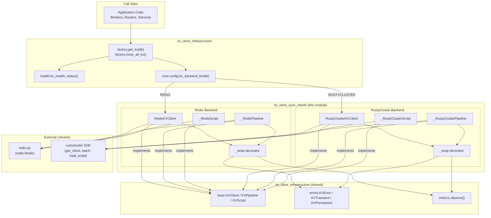
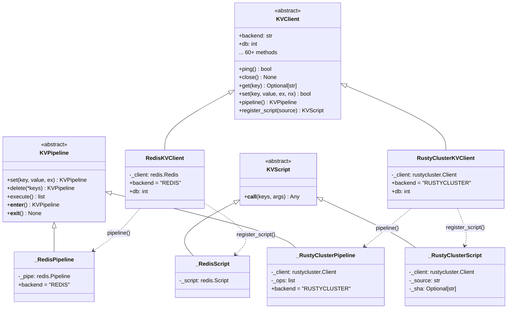
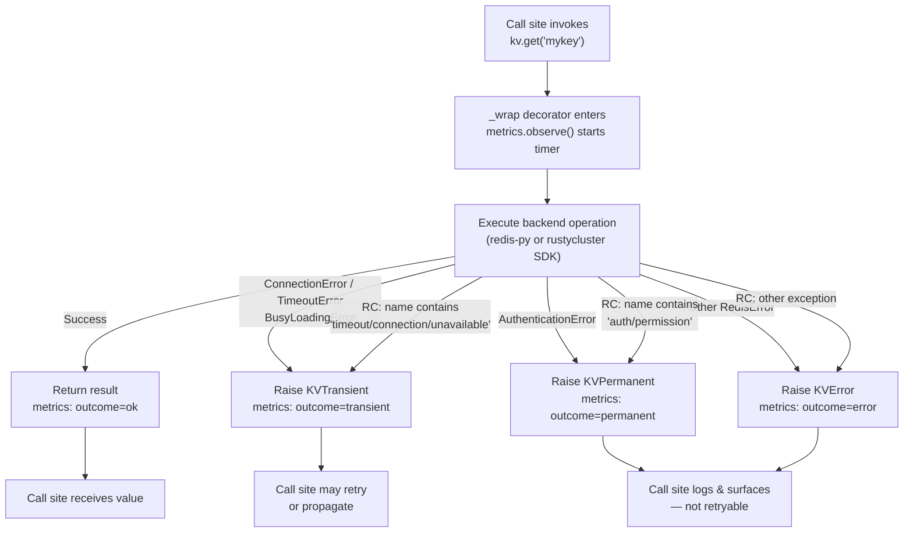
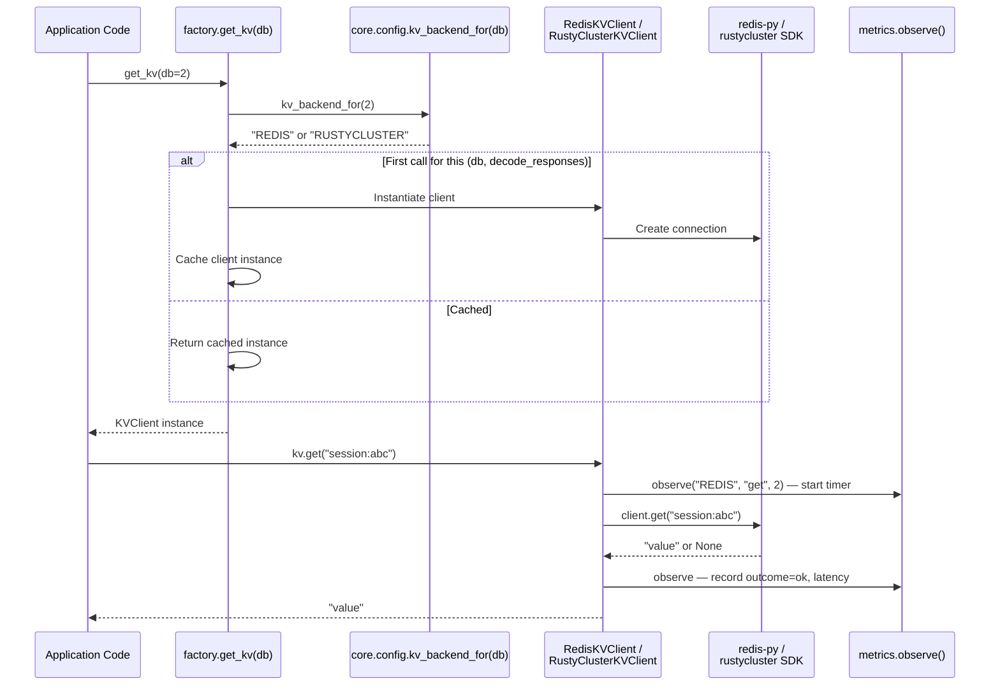
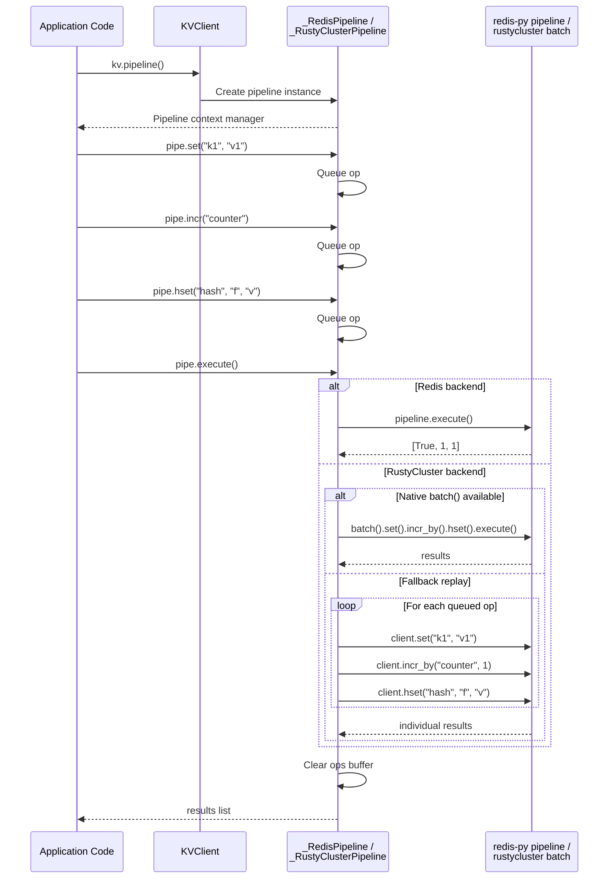
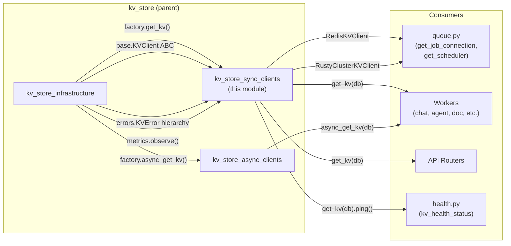

# KV Store Sync Clients

## Overview

The `kv_store_sync_clients` module provides **synchronous** key-value store client implementations that conform to the backend-agnostic `KVClient` abstract base class. It contains two concrete implementations:

- **`RedisKVClient`** — a thin pass-through wrapper around the `redis-py` library.
- **`RustyClusterKVClient`** — an adapter over the `rustycluster` SDK that normalizes its API onto the same `KVClient` interface.

Both implementations expose the full suite of Redis-compatible data-structure operations (Strings, Hashes, Sets, Sorted Sets, Lists, Streams), server-side Lua scripting, and pipelined/batched writes. They share a common error-mapping strategy that converts backend-specific exceptions into the unified `KVError` / `KVTransient` / `KVPermanent` hierarchy, and both record Prometheus metrics (call count + latency) on every operation.

Call sites never instantiate these classes directly — they use the factory function `get_kv(db)` from the [kv_store_infrastructure](kv_store_infrastructure.md) module, which resolves the backend per-DB via environment configuration and caches the resulting client instance.

---

## Architecture



### Class Hierarchy



---

## Component Reference

### RedisKVClient

**File:** `core/kv/redis_impl.py`
**Implements:** `KVClient`

A thin pass-through wrapper around `redis.Redis`. Every method delegates directly to the underlying `redis-py` client, with the only added behaviour being:

1. **Exception mapping** — via the `_wrap` decorator, `redis.exceptions.ConnectionError`, `TimeoutError`, and `BusyLoadingError` are converted to `KVTransient`; `AuthenticationError` to `KVPermanent`; all other `RedisError` subclasses to `KVError`.
2. **Metrics instrumentation** — every wrapped method records `kv_call_total` (with `outcome` label) and `kv_call_latency_seconds` via `metrics.observe()`.
3. **Type normalization** — return values are coerced to Python primitives (`bool`, `int`, `float`, `list`, `dict`, `set`) for consistency with the `KVClient` contract.

**Construction:**

```python
client = RedisKVClient(db=0, decode_responses=True)
```

The client connects to `REDIS_HOST:REDIS_PORT` with `REDIS_PASSWORD` (read from `core.config`), using a 2-second socket connect timeout. `decode_responses=True` is the default so all string values are returned as `str` rather than `bytes`.

**Supported data structures:** Strings, Hashes, Sets, Sorted Sets, Lists, Streams, server-side Lua scripting, and pipelined writes.

---

### _RedisPipeline

**File:** `core/kv/redis_impl.py`
**Implements:** `KVPipeline`

Wraps a `redis-py` pipeline (created with `transaction=False`, i.e. no MULTI/EXEC wrapping). Operations are queued on the underlying pipeline and flushed atomically on `execute()`. The `execute()` method itself is decorated with `_wrap` for exception mapping and metrics.

Key design notes:
- The `backend` class attribute is set to `"REDIS"` and `db` is passed from the parent client so the `_wrap` decorator (which reads `self.backend` / `self.db`) can instrument `execute()` without additional plumbing.
- On context-manager exit without `execute()`, the underlying pipeline is reset (matching `redis-py` semantics).

---

### _RedisScript

**File:** `core/kv/redis_impl.py`
**Implements:** `KVScript`

Wraps a `redis-py` registered `Script` object. The script source is uploaded once via `EVAL`/`EVALSHA`; subsequent calls use the cached SHA. The `__call__` method maps `redis-py` exceptions to the `KVError` hierarchy.

---

### RustyClusterKVClient

**File:** `core/kv/rustycluster_impl.py`
**Implements:** `KVClient`

An adapter over the `rustycluster` SDK. Each logical DB (0–7) maps to a named cluster (`"DB0"`–`"DB7"`) defined in `rustycluster.yaml`. The `rustycluster` client handles replication, sharding, failover, and authentication internally.

**Key differences from `RedisKVClient`:**

| Aspect | RedisKVClient | RustyClusterKVClient |
|---|---|---|
| Underlying library | `redis-py` | `rustycluster` SDK |
| Connection config | `REDIS_HOST` / `REDIS_PORT` / `REDIS_PASSWORD` env vars | `rustycluster.yaml` with `${VAR:-default}` expansion |
| Method names | Direct pass-through | Normalized (e.g. `set_ex` → `setex`, `incr_by` → `incr`, `hget_all` → `hgetall`) |
| Response decoding | `decode_responses=True` on client | Manual `_to_str()` helper for `bytes` → `str` |
| Scripting | `register_script()` via `redis-py` | `load_script` / `eval_sha` (SPEC §6.7); falls back with clear error if SDK lacks support |
| Pipeline | Native `redis-py` pipeline | Native `batch()` if available; otherwise Python-side replay buffer |
| Exception mapping | Type-based (`_TRANSIENT_TYPES` tuple) | Name-based heuristic on exception class name |

**Lazy import:** The `rustycluster` package is imported lazily via `_get_rc()`. If the package is not installed, a `KVPermanent` error is raised with installation instructions. This allows REDIS-only deployments to run without the `rustycluster` dependency.

**YAML env-var expansion:** The upstream `rustycluster` library does not expand `${VAR}` / `${VAR:-default}` placeholders in its YAML config. The `_load_settings_with_env()` function pre-loads the YAML, expands shell-style placeholders against `os.environ`, writes the expanded config to a temporary file, and passes it to `RustyClusterSettings.from_yaml()`. The result is cached after the first call.

**Defensive fallbacks:** Several methods include fallback logic for older SDK versions:
- `zremrangebyscore` — falls back to `zrangebyscore` + `zrem` if the method is missing.
- `zrevrange` — falls back to reversing the ascending range client-side.
- `zincrby` — falls back to a non-atomic read-modify-write via `zscore` + `zadd`.
- `ltrim` — falls back to `lrange` + `delete` + `rpush` (best-effort).

---

### _RustyClusterPipeline

**File:** `core/kv/rustycluster_impl.py`
**Implements:** `KVPipeline`

Adapts the `rustycluster` batch API (SPEC §7). Operations are queued in a Python-side list of `(op_name, args, kwargs)` tuples. On `execute()`:

1. If the SDK exposes a native `batch()` builder, operations are replayed onto it and executed atomically.
2. If `batch()` is unavailable or its shape differs, operations are replayed one-by-one against the client.

On context-manager exit with un-executed ops, a warning is logged (matching `redis-py`'s behaviour of not silently dropping queued work).

---

### _RustyClusterScript

**File:** `core/kv/rustycluster_impl.py`
**Implements:** `KVScript`

Implements Lua scripting via the RustyCluster SPEC §6.7 `load_script` / `eval_sha` pattern. The source is uploaded once via `load_script` (which returns a SHA); subsequent calls use `eval_sha`. If the SDK lacks either method, a `KVPermanent` error is raised with a clear message directing the user to upgrade the SDK or route the DB to REDIS.

---

### _wrap Decorator (both files)

Each file defines its own `_wrap` decorator with backend-specific exception classification:

- **`redis_impl._wrap`** — uses a tuple of known transient exception types (`ConnectionError`, `TimeoutError`, `BusyLoadingError`) for precise classification.
- **`rustycluster_impl._wrap`** — uses a name-based heuristic on `type(exc).__name__.lower()` since the RC SDK's exception types vary across versions. Checks for `"auth"` / `"permission"` (→ `KVPermanent`), `"timeout"` / `"connection"` / `"unavailable"` (→ `KVTransient`), and everything else (→ `KVError`).

Both decorators:
1. Record metrics via `metrics.observe(self.backend, op_name, self.db)`.
2. Re-raise `KVError` subclasses as-is (so already-classified errors pass through).
3. Preserve the original function's `__name__` and `__doc__`.

---

## Error Handling Flow



---

## Data Flow: Factory → Client → Backend



---

## Pipeline Execution Flow



---

## Backend Selection & Configuration

Backend selection is **per-DB** and resolved at first client instantiation via `core.config.kv_backend_for(db)`:

| Environment Variable | Scope | Default | Valid Values |
|---|---|---|---|
| `REDIS_CLIENT_CONFIG_DB{db}` | Per-DB override (e.g. `REDIS_CLIENT_CONFIG_DB2`) | Falls through to `REDIS_CLIENT_CONFIG` | `REDIS`, `RUSTYCLUSTER` |
| `REDIS_CLIENT_CONFIG` | Global default for all DBs | `REDIS` | `REDIS`, `RUSTYCLUSTER` |

For the Redis backend, connection parameters come from:
- `REDIS_HOST` — Redis server hostname
- `REDIS_PORT` — Redis server port
- `REDIS_PASSWORD` — Optional authentication password

For the RustyCluster backend, configuration is loaded from `rustycluster.yaml` (searched in `./`, `./config/`, `~/.`), with `${VAR}` and `${VAR:-default}` placeholders expanded against `os.environ`.

---

## Relationship to Other KV Modules



- **[kv_store_infrastructure](kv_store_infrastructure.md)** — Defines the `KVClient` / `KVPipeline` / `KVScript` abstract base classes, the `KVError` exception hierarchy, the `get_kv()` / `close_all_kv()` factory, the `metrics.observe()` context manager, and the `kv_health_status()` health probe. This module implements those abstractions.
- **[kv_store_async_clients](kv_store_async_clients.md)** — The asynchronous counterparts (`AsyncRedisKVClient`, `AsyncRustyClusterKVClient`) that implement `AsyncKVClient` for `asyncio`-based code paths. They share the same error hierarchy and metrics infrastructure.
- **`queue.py`** — Uses `get_job_connection()` and `get_scheduler()` to obtain backend-appropriate connection objects for `rq` (Redis Queue) job processing. These functions internally resolve the backend via the same `kv_backend_for()` mechanism.

---

## Usage Examples

### Basic Get/Set

```python
from core.kv.factory import get_kv

kv = get_kv(db=0)
kv.set("session:abc", "user_data", ex=3600)
value = kv.get("session:abc")  # → "user_data"
```

### Hash Operations

```python
kv = get_kv(db=1)
kv.hset("user:42", "name", "Alice")
kv.hset("user:42", "email", "alice@example.com")
kv.hincrby("user:42", "login_count", 1)
profile = kv.hgetall("user:42")  # → {"name": "Alice", "email": "...", "login_count": "1"}
```

### Pipeline (Batched Writes)

```python
kv = get_kv(db=2)
with kv.pipeline() as pipe:
    pipe.set("counter", "0")
    pipe.incr("counter")
    pipe.incr("counter")
    pipe.expire("counter", 60)
    results = pipe.execute()  # → [True, 1, 2, True]
```

### Lua Scripting

```python
kv = get_kv(db=3)
script = kv.register_script("""
    local current = redis.call('GET', KEYS[1])
    if current == false then
        redis.call('SET', KEYS[1], ARGV[1])
        return 1
    end
    return 0
""")
result = script(keys=["lock:resource"], args=["owner-1"])  # → 1 (acquired) or 0 (held)
```

### Error Handling

```python
from core.kv.factory import get_kv
from core.kv.errors import KVTransient, KVPermanent

kv = get_kv(db=0)
try:
    kv.set("key", "value")
except KVTransient:
    # Connection timeout, temporary outage — safe to retry
    retry_operation()
except KVPermanent:
    # Auth failure, config error — not retryable
    log_and_alert()
```

---

## Design Decisions

1. **Thin wrappers, not reimplementations** — Both clients delegate to their respective SDKs rather than reimplementing the Redis protocol. This avoids maintenance burden and leverages battle-tested connection pooling, retry logic, and protocol handling in the underlying libraries.

2. **Per-DB backend selection** — Different logical databases can be routed to different backends (e.g. DB0 on Redis for simple caching, DB2 on RustyCluster for replicated session storage) via environment variables, without code changes.

3. **Unified error hierarchy** — All backend exceptions are normalized to `KVError` / `KVTransient` / `KVPermanent`, so call sites can implement retry logic and alerting without knowing which backend is active.

4. **Metrics on every call** — The `_wrap` decorator ensures no operation escapes instrumentation. Metrics include `backend`, `op`, `db`, and `outcome` labels, enabling per-operation, per-DB dashboards and alerting.

5. **Lazy RustyCluster import** — The `rustycluster` package is imported only when a DB is configured for the RUSTYCLUSTER backend. This allows REDIS-only deployments to run without installing the `rustycluster` SDK.

6. **Defensive fallbacks in RustyCluster** — The RustyCluster SDK's API has evolved across versions. Methods like `zremrangebyscore`, `zrevrange`, `zincrby`, and `ltrim` include fallback implementations for older SDK versions, ensuring the client works across a range of `py-rustycluster-client` releases.
