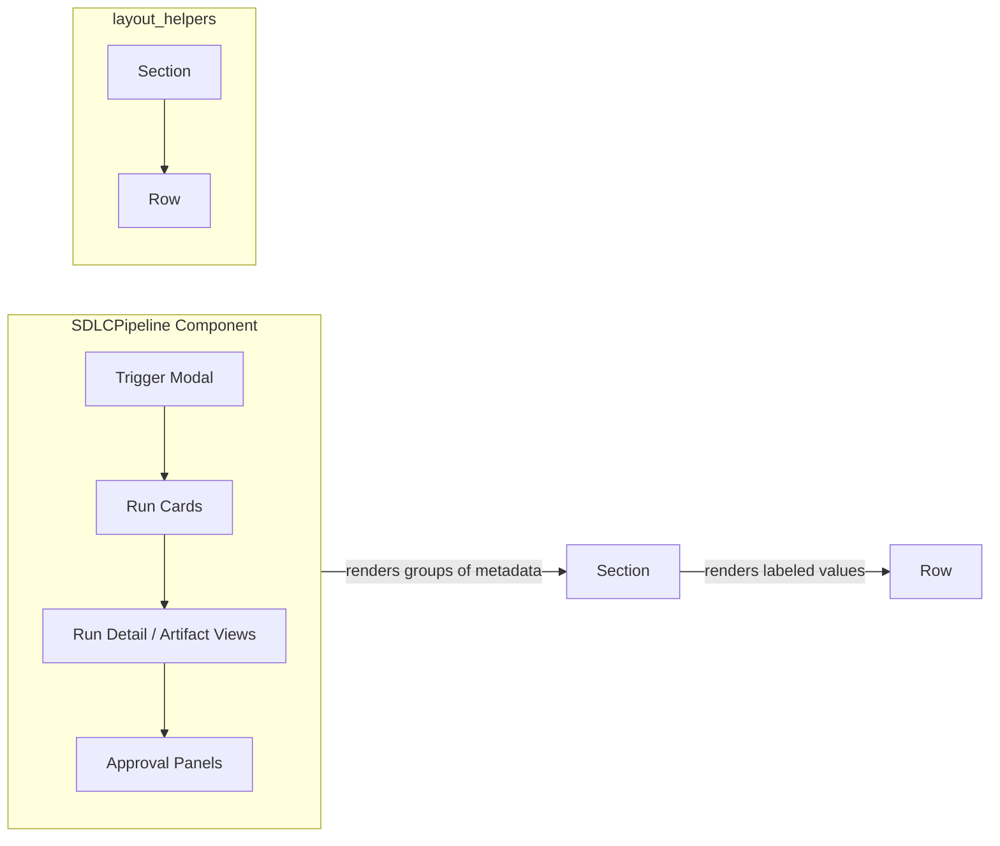
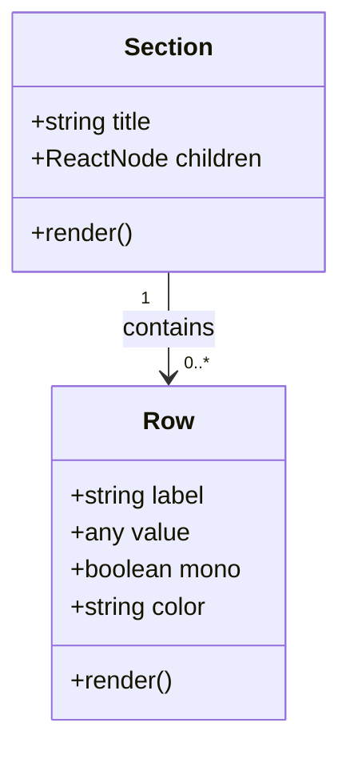
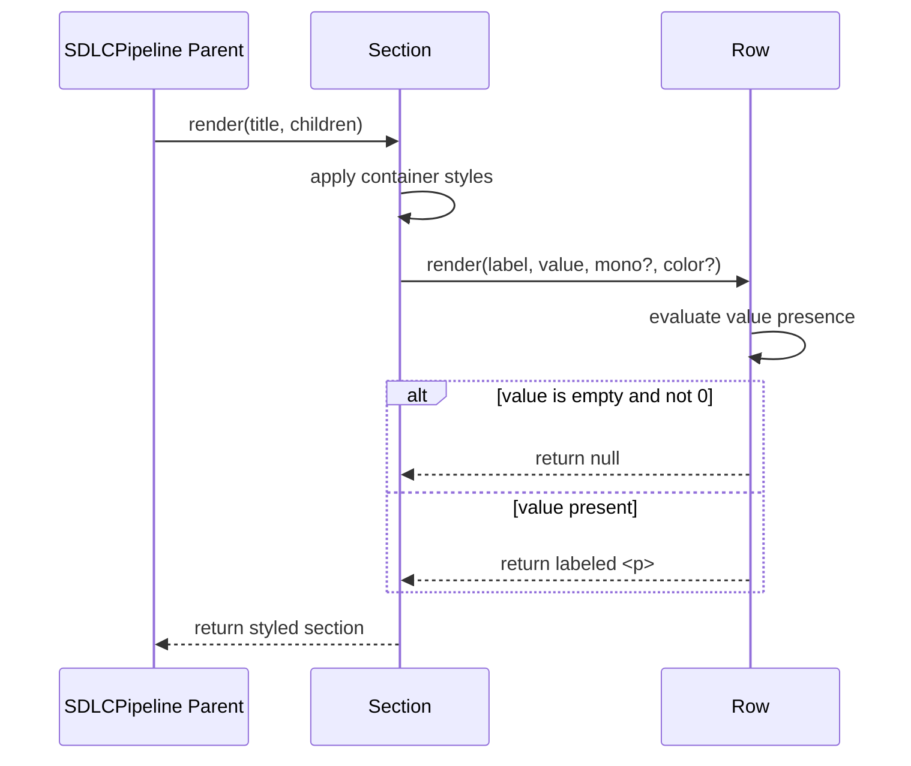

# layout_helpers

The `layout_helpers` module provides lightweight, reusable React layout primitives used inside the [SDLCPipeline](sdlc_pipeline.md) UI. It exposes two components — `Section` and `Row` — that standardize how labeled groups and key/value metadata are rendered across pipeline artifact views, run details, and configuration panels.

---

## Purpose and Core Functionality

This module is intentionally small and focused: it decouples presentational layout concerns from the complex SDLCPipeline orchestration logic so that artifact summaries, run metadata, and governance details share a consistent visual language without duplicating Tailwind classes or markup.

| Component | Responsibility |
|-----------|----------------|
| `Section` | Renders a titled container with a subtle gray background, rounded corners, and uniform padding/spacing. Used to group related rows of metadata. |
| `Row` | Renders a single labeled value. Supports monospace styling for technical identifiers and optional color classes for status emphasis. Skips rendering when the value is empty (`null`, `undefined`, or empty string), unless the value is `0`. |

Both components are pure presentational functions with no side effects, state, or external data fetching.

---

## Architecture



`layout_helpers` sits at the bottom of the SDLCPipeline presentation stack. Higher-level components in [sdlc_pipeline](sdlc_pipeline.md) compose `Section` and `Row` to build readable summaries of pipeline runs, governance findings, and stage artifacts.

---

## Component Relationships



- `Section` accepts a `title` and `children`. It is designed to wrap one or more `Row` components, but can wrap any React node.
- `Row` accepts a `label` and `value`. It is the atomic unit for displaying a metadata field.

---

## Data Flow



1. A parent component (e.g., a run detail panel) passes a title and a set of `Row` children to `Section`.
2. `Section` applies consistent styling and renders the title and children.
3. Each `Row` decides independently whether to render based on its `value` prop.
4. Rendered rows display a label and value; optional `mono` and `color` props adjust typography and color.

---

## Component API

### `Section`

| Prop | Type | Required | Description |
|------|------|----------|-------------|
| `title` | `string` | Yes | Header text displayed above the container. |
| `children` | `ReactNode` | No | Content to render inside the styled container, typically one or more `Row` components. |

### `Row`

| Prop | Type | Required | Description |
|------|------|----------|-------------|
| `label` | `string` | Yes | Static label shown before the value. |
| `value` | `any` | Yes | Value to display. Empty values (`null`, `undefined`, `""`) suppress rendering unless the value is `0`. |
| `mono` | `boolean` | No | When `true`, renders the value in a monospace font with an indigo color. Useful for commit SHAs, branch names, and IDs. |
| `color` | `string` | No | Additional Tailwind color class applied to the value span. Useful for status colors (e.g., `text-green-600`). |

---

## Usage Example

```jsx
import { Section, Row } from "../components/SDLCPipeline";

function RunSummary({ run }) {
  return (
    <Section title="Run Metadata">
      <Row label="Run ID" value={run.id} mono />
      <Row label="Status" value={run.status} color={statusColor(run.status)} />
      <Row label="Branch" value={run.branch} mono />
      <Row label="Duration" value={run.durationMs} />
    </Section>
  );
}
```

---

## Dependencies

`layout_helpers` has no runtime dependencies beyond React and the Tailwind CSS utility classes used for styling. It does not import from other application modules, stores, or hooks.

| Dependency | Purpose |
|------------|---------|
| React | Component runtime |
| Tailwind CSS | Styling via utility classes |

---

## Integration with the System

`layout_helpers` is consumed exclusively by the [sdlc_pipeline](sdlc_pipeline.md) module in the `ai-ui` frontend. It is used to render:

- Run metadata in `RunCard` and `RunDetail` views.
- Stage artifact summaries in `ContextTab`, `OutputsTab`, and other artifact tabs.
- Governance and approval details in `ApprovalPanel`, `BaselineActionPanel`, and `StageActionPanel`.
- Trigger modal form sections.

Because these helpers are stateless and styling-only, they can be reused by any future UI surface that needs consistent labeled metadata presentation without introducing coupling to SDLCPipeline business logic.

---

## Notes for Maintainers

- Keep this module free of business logic, data fetching, and state. It should remain a pure presentation layer.
- When adding new visual variants, prefer extending props (e.g., a new boolean or className prop) rather than creating one-off wrapper components.
- The `Row` component intentionally treats `0` as a renderable value to support numeric fields such as counts and durations.
