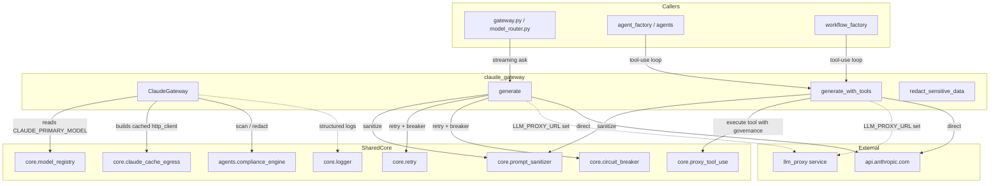
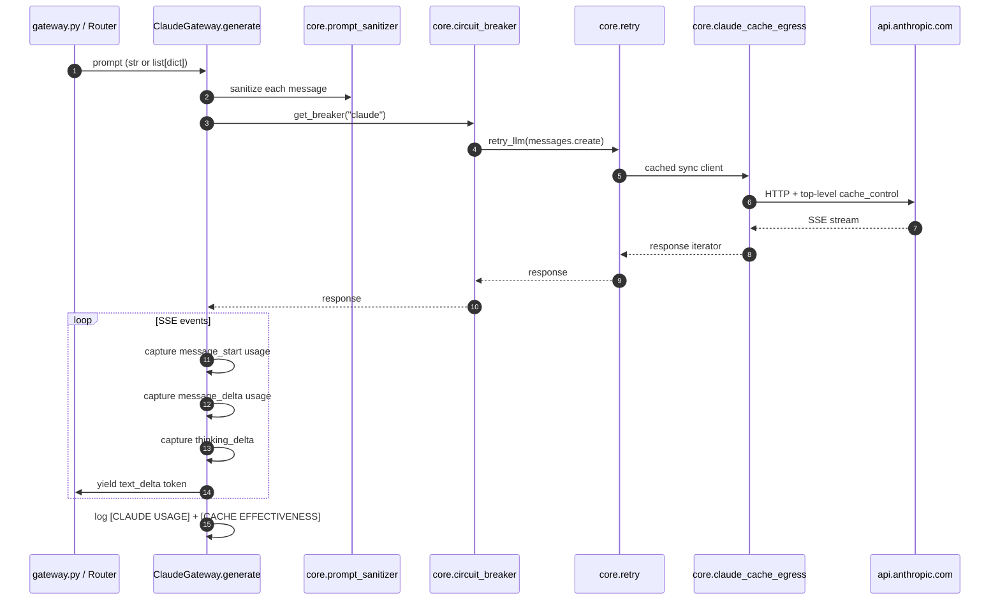
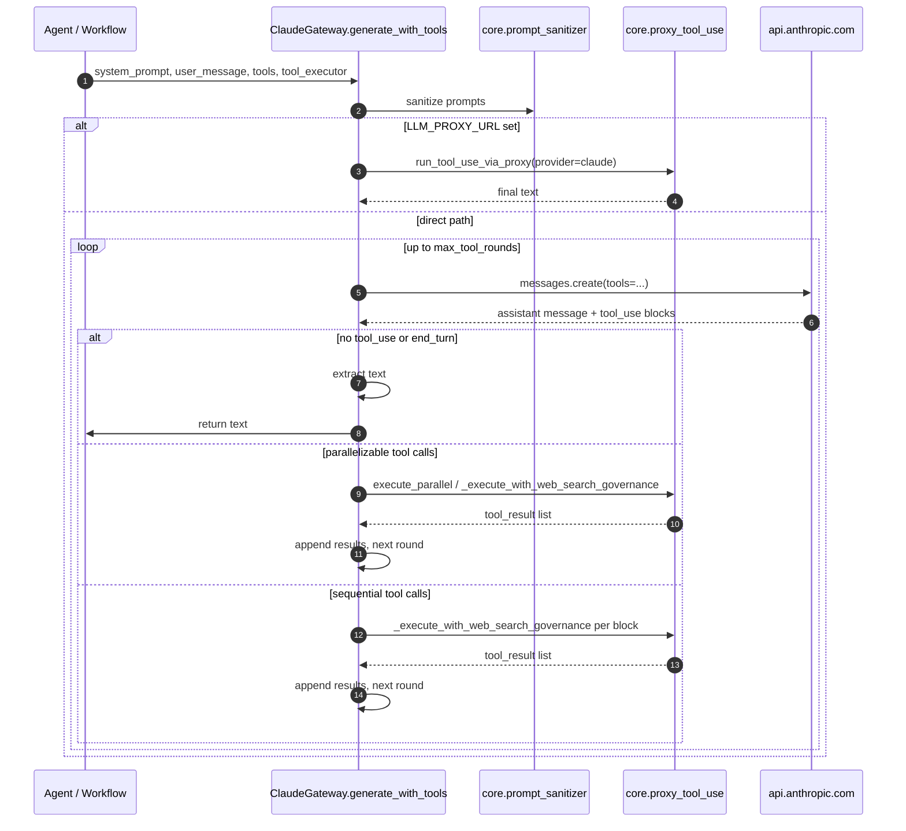
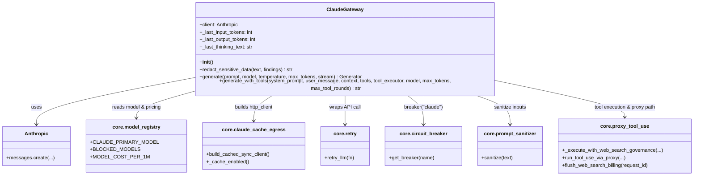

# Claude Gateway

The `claude_gateway` module provides a production-grade, PCI-safe adapter for invoking Anthropic Claude models. It exposes a single class-based gateway, `ClaudeGateway`, that handles streaming and non-streaming text generation, multi-round tool-use loops, prompt caching telemetry, reasoning-delta streaming, and automatic fallback to an upstream LLM proxy when configured.

This module is intentionally thin: all transport-level caching, retry logic, circuit breaking, compliance scanning, prompt sanitization, and web-search governance are delegated to shared core components. The gateway's only job is to marshal requests into the Anthropic Messages API shape, drive tool-use rounds, and yield tokens (or final text) back to callers.

---

## Architecture

### Component Responsibilities

| Component | Responsibility |
|-----------|----------------|
| `ClaudeGateway` | Singleton gateway that wraps the Anthropic sync client and exposes `generate` and `generate_with_tools`. |
| `generate` | Streaming or non-streaming text generation from a single-turn prompt or multi-turn message list. |
| `generate_with_tools` | Multi-round tool-use loop: calls Claude, executes tools, feeds results back, repeats until `end_turn` or `max_tool_rounds`. |
| `redact_sensitive_data` | Simple `[REDACTED]` replacement helper driven by compliance findings. |

---

## Dependencies

The gateway depends on shared core modules for all cross-cutting concerns. See the linked module docs for details rather than duplicating them here.

| Concern | Module | Link |
|---------|--------|------|
| Model registry & pricing | `core.model_registry` | core_model_registry |
| Prompt-cache egress transport | `core.claude_cache_egress` | core_claude_cache_egress |
| Retry policy | `core.retry` | core_retry |
| Circuit breaker | `core.circuit_breaker` | core_circuit_breaker |
| Prompt sanitization | `core.prompt_sanitizer` | core_prompt_sanitizer |
| Tool-use proxy / web-search governance | `core.proxy_tool_use` | core_proxy_tool_use |
| Compliance scanning | `agents.compliance_engine` | agents_compliance_engine |
| Structured logging / request IDs | `core.logger` | core_logger |
| Streaming event markers | `pipeline.stream_events` | pipeline_stream_events |

It also consumes the upstream `llm_proxy` service when `LLM_PROXY_URL` is configured. See [llm_proxy_gateway_claude](llm_proxy_gateway_claude.md) for the proxy-side Claude implementation.

---

## Data Flow

### Streaming Text Generation

### Tool-Use Loop

---

## Component Interaction

---

## Key Behaviors

### Prompt Caching

The gateway **never** adds `cache_control` markers to payloads itself. Caching is applied in exactly one place: the egress transport in `core.claude_cache_egress`, which stamps a single top-level `cache_control` block onto the outbound request and strips any nested markers. This keeps the gateway simple and prevents double-billing mistakes.

After every call, the gateway emits a `[CACHE EFFECTIVENESS]` log line that computes:

- `hit_rate` = `cache_read / (prompt_total + cache_read + cache_created)`
- `savings_est_usd` = `cache_read * input_rate * (1 - 0.10) / 1M`
- `write_surcharge_est_usd` = `cache_created * input_rate * (1.25 - 1) / 1M`

Pricing is read from `MODEL_COST_PER_1M` so the estimates stay in sync with the registry.

### Reasoning Deltas

When Claude emits `thinking_delta` events, the gateway buffers them in `_last_thinking_text` and, if `STREAM_REASONING_DELTAS=true` (default), yields a `ReasoningMarker` per delta. The marker stringifies to `""`, so unaware consumers never see reasoning text mixed into the answer.

### Tool-Use Parallelization

`generate_with_tools` detects when multiple `tool_use` blocks in a single turn are independent:

- All block names are distinct.
- No two blocks share an input key.

When both conditions hold, the tools execute in parallel via `ThreadPoolExecutor` (max 4 workers). Otherwise they execute sequentially to preserve ordering and dependency semantics.

### Proxy vs. Direct Path

If `LLM_PROXY_URL` is set, the gateway forwards tool-use requests to the upstream `llm_proxy` service instead of calling Anthropic directly. This is used in split deployments (e.g., app02 → web02). The proxy path is handled by `core.proxy_tool_use.run_tool_use_via_proxy`.

### Compliance & Sanitization

All system prompts, user messages, and context are passed through `core.prompt_sanitizer.sanitize` before leaving the gateway. The `redact_sensitive_data` helper is available for callers that already have compliance findings and want to redact values from text.

### Temperature Handling

`claude-opus-4` model IDs do not accept a `temperature` parameter. The gateway detects this prefix and omits `temperature` from the API call for those models.

---

## Configuration

| Environment Variable | Default | Purpose |
|----------------------|---------|---------|
| `ANTHROPIC_API_KEY` | — | Required. API key for Anthropic. |
| `LLM_TIMEOUT_SEC` | `300` | Request timeout; `<=0` disables timeout. |
| `LLM_PROXY_URL` | — | If set, route tool-use calls through the LLM proxy. |
| `STREAM_REASONING_DELTAS` | `true` | Yield `ReasoningMarker` events for thinking deltas. |
| `ANTHROPIC_PROMPT_CACHE` | — | Toggle caching in the egress transport. |
| `ANTHROPIC_CACHE_TTL` | `1h` | Cache TTL in the egress transport. |

---

## Integration in the System

`ClaudeGateway` is instantiated once as a module-level singleton (`claude_gateway`). It is consumed by:

- `gateway.py` for chat, agent, and workflow endpoints.
- `model_router.py` in `shared_core` when the routing policy selects a Claude model.
- Agent and workflow factories that need tool-use generation.

Because the gateway is model-provider-specific, higher-level code should prefer routing through `model_router` or `gateway.py` rather than importing `claude_gateway` directly, unless Claude-specific features (e.g., tool-use loop, reasoning deltas) are required.

---

## References

- core_model_registry — model IDs, blocked models, and per-1M token pricing.
- core_claude_cache_egress — Anthropic cache-control transport implementation.
- core_retry and core_circuit_breaker — resilience policies.
- core_prompt_sanitizer — input sanitization.
- core_proxy_tool_use — tool execution governance and proxy path.
- agents_compliance_engine — compliance scanning.
- pipeline_stream_events — `ReasoningMarker` and streaming event types.
- [llm_proxy_gateway_claude](llm_proxy_gateway_claude.md) — proxy-side Claude gateway.
