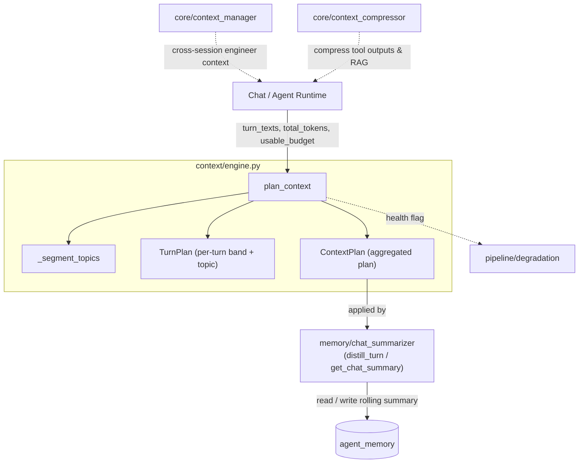
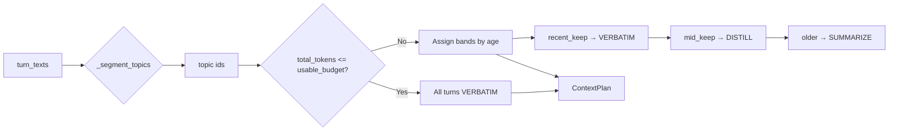
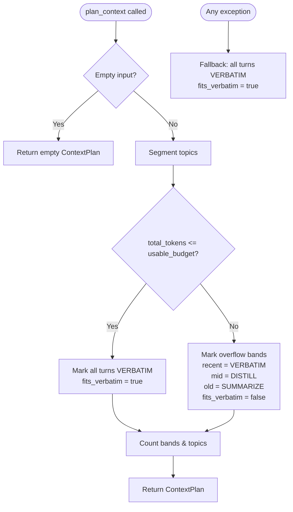

# Context Engine

The **Context Engine** is a pure, deterministic planner that decides how a conversation transcript should be packed into a model's context window. It implements the age-tiered history-assembly strategy described in `docs/architecture/06-context-engineering.md` §6.2–6.5.

Rather than calling an LLM or manipulating raw message text, the engine only produces a **`ContextPlan`**: a per-turn decision about whether a turn should be kept **verbatim**, **distilled**, or **summarized**. Downstream callers apply that plan using the platform's existing summarization and memory machinery. This keeps the engine testable offline, fast, and fail-safe.

---

## Purpose & Scope

- **Budget-aware allocation.** Given a token budget (`usable_budget`) and the size of the full transcript (`total_tokens`), decide which turns survive in which fidelity.
- **Recency-first tiering.** Recent turns are sacred; middle-aged turns are lightly distilled; old turns collapse to a rolling summary.
- **Topic awareness.** Record topic segment IDs so callers can bias the verbatim budget toward the current topic.
- **No information loss on error.** If anything goes wrong, every turn is marked verbatim and the caller falls back to the existing flat-summary path.

The engine intentionally does **not**:

- Call LLMs or summarizers.
- Read from or write to databases.
- Compress tool output, RAG chunks, or code (see [core_infrastructure](../core/core_infrastructure.md) for that).
- Manage durable cross-session memory (see [memory_system](../storage/memory_system.md)).

---

## Core Concepts

| Concept | Description |
|--------|-------------|
| `VERBATIM` | Keep the raw turn text unchanged. Used for the newest turns and, in the fit-first case, the entire transcript. |
| `DISTILL` | Reduce the turn to a short plain-English summary. Applied to mid-history turns when the window overflows. |
| `SUMMARIZE` | Replace the turn with the rolled chat summary. Applied to the oldest turns when the window overflows. |
| `fits_verbatim` | Flag indicating the whole transcript fit in budget, so no compaction was necessary. |
| Topic segment | A numeric ID assigned to each turn based on explicit boundary phrases ("new question", "switching topics", etc.). |

### Fit-first policy

If `total_tokens <= usable_budget`, the engine returns a plan where **every turn is verbatim** and sets `fits_verbatim = True`. This matches the platform's confirmed strategy: do not compact history until compaction is actually required. The vast majority of chats take this fast path.

### Age-tiered overflow

When the transcript exceeds the budget:

- The newest `recent_keep` turns are `VERBATIM`.
- The next `mid_keep` turns are `DISTILL`.
- Everything older is `SUMMARIZE`.

Defaults are `recent_keep=20` and `mid_keep=40`, but these are caller-configurable.

### Topic segmentation

`_segment_topics` scans each turn for explicit boundary markers such as "new question", "different topic", or "unrelated". When a marker is detected, the topic ID is incremented. The engine records the topic ID on every `TurnPlan` but does **not** use it to drop turns; callers may use it to bias verbatim budget toward the current topic.

---

## Architecture

### Components

#### `TurnPlan`

A dataclass representing the decision for a single conversation turn.

- `index`: position of the turn in the input list.
- `band`: one of `VERBATIM`, `DISTILL`, or `SUMMARIZE`.
- `topic`: topic segment ID (default `0`).

#### `ContextPlan`

A dataclass aggregating the full plan.

- `turns`: list of `TurnPlan` objects.
- `recent_verbatim`, `mid_distilled`, `old_summarized`: counts per band.
- `topics`: number of detected topic segments.
- `fits_verbatim`: `True` when no compaction was needed.
- Helpers: `band_of(index)` and `as_dict()` for telemetry.

#### `_segment_topics`

Deterministic topic segmentation based on explicit boundary markers. It is simple, fast, and safe; embedding-based segmentation is reserved for future upgrades.

#### `plan_context`

The public entry point. It never raises; on any exception it returns a safe fallback plan where every turn is `VERBATIM`.

---

## Data Flow

1. Receive the list of turn texts plus token budget metadata.
2. Optionally segment turns into topics.
3. Check fit-first condition.
4. If it fits, mark every turn verbatim.
5. If it overflows, assign age-tiered bands from newest to oldest.
6. Count bands, populate `ContextPlan`, and return.

---

## Process Flow

---

## Integration with the System

The Context Engine sits between the chat/agent runtime and the summarization layer. It is a small, side-effect-free module that can be invoked from any runtime path that assembles a prompt.

### Applying the plan

The engine returns a plan; it does **not** modify messages. The caller is responsible for applying the bands:

- `VERBATIM` turns are injected unchanged.
- `DISTILL` turns are passed through `memory/chat_summarizer.distill_turn` to produce a compact plain-English summary.
- `SUMMARIZE` turns are replaced by the rolling summary returned from `memory/chat_summarizer.get_chat_summary`.

See [memory_system](../storage/memory_system.md) for details on how `chat_summarizer` maintains per-chat rolling summaries and decides what deserves long-term memory.

### Cross-session context

While the Context Engine handles the current conversation transcript, cross-session engineer context is managed separately by `core/context_manager`. That module injects a preface at session start and rebuilds a rolling work summary in the background. See [core_infrastructure](../core/core_infrastructure.md).

### Compression of non-conversation data

Tool outputs, build logs, RAG chunks, and IDE file reads are not handled by the Context Engine. They are compressed by `core/context_compressor` before they reach the context window. See [core_infrastructure](../core/core_infrastructure.md).

### Degradation ladder

The platform's degradation policy treats the Context Engine as a first-class subsystem. If the engine is unhealthy, `pipeline/degradation` sets `rich_context = False` and the runtime falls back to a flat-summary path. See [pipeline](../core/pipeline.md).

---

## Configuration & Tuning

`plan_context` accepts the following parameters:

| Parameter | Default | Description |
|-----------|---------|-------------|
| `turn_texts` | required | List of turn strings, oldest first. |
| `total_tokens` | required | Estimated token count of the full transcript. |
| `usable_budget` | required | Maximum tokens the caller is willing to spend on history. |
| `recent_keep` | `20` | Number of newest turns kept verbatim on overflow. |
| `mid_keep` | `40` | Number of mid-history turns distilled on overflow. |
| `segment` | `True` | Whether to run topic segmentation. |

Boundary markers are defined in `_DEFAULT_BOUNDARIES`:

- `new question`
- `different topic`
- `switching topics`
- `unrelated`
- `change of subject`
- `new topic`

These are intentionally explicit and deterministic so segmentation is reproducible and cheap.

---

## Failure Handling & Safety

- **Never raises.** `plan_context` wraps its logic in a broad `try/except`. Any error returns a fallback plan where every turn is `VERBATIM` and `fits_verbatim = True`.
- **No data mutation.** The engine only reads the input list and returns a plan; it does not touch databases, caches, or message stores.
- **No LLM dependency.** Because it is rule-based, it cannot fail due to model unavailability, rate limits, or parsing errors.
- **Caller fallback.** The engine's safe fallback is complemented by the caller's own fallback to the existing flat recent + summary path, satisfying the architecture's "fail toward today's behavior" rule.

---

## Testing & Offline Use

The pure-planner design makes the Context Engine easy to test offline without a running database or LLM proxy. The platform's context benchmark harness (referenced in `docs/architecture/06-context-engineering.md` §6.7) can validate:

- Fit-first behavior.
- Correct band counts for overflow.
- Topic segmentation boundaries.
- Fallback behavior on malformed input.

Because the engine has no I/O, tests can feed it synthetic turn lists and assert exact `ContextPlan` structures.

---

## References

- [memory_system](../storage/memory_system.md) — rolling chat summaries, `distill_turn`, and long-term memory decisions.
- [core_infrastructure](../core/core_infrastructure.md) — `core/context_manager` for cross-session engineer context and `core/context_compressor` for tool/RAG compression.
- [pipeline](../core/pipeline.md) — `pipeline/degradation` serving-level policy including the Context Engine health flag.
- `docs/architecture/06-context-engineering.md` — full context-engineering strategy and slot model.
