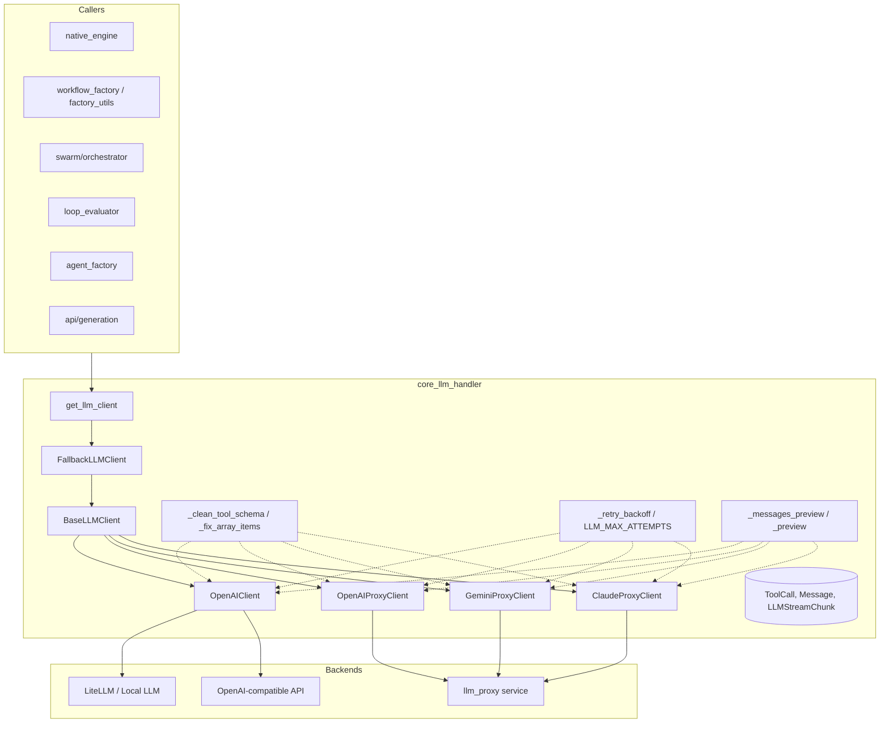
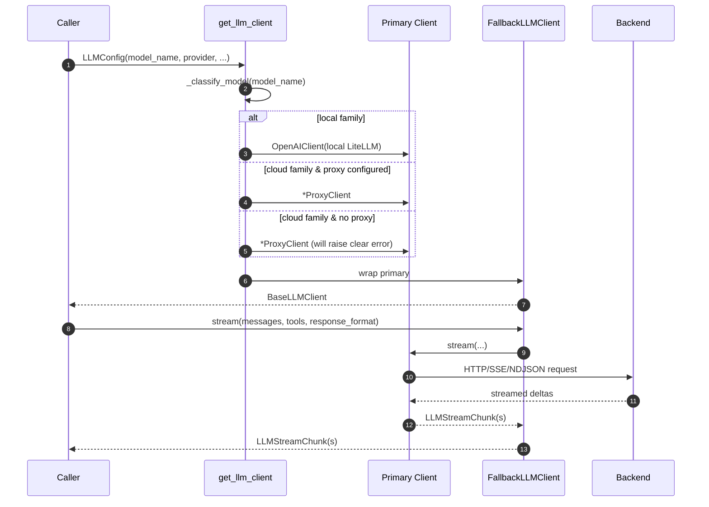
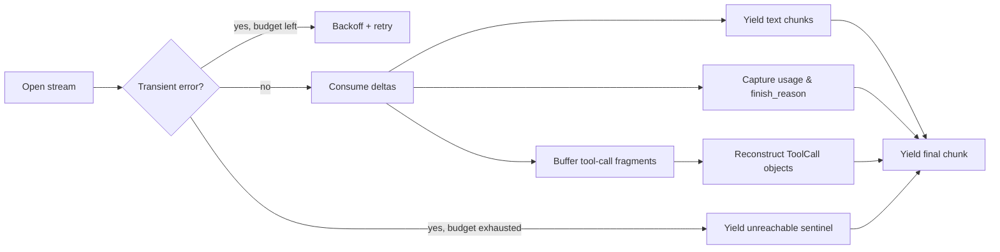
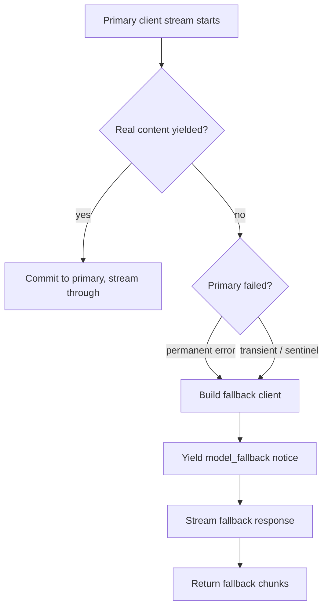
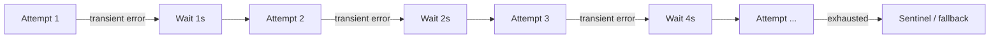

# core_llm_handler

## Brief Introduction

`core_llm_handler` is the **universal LLM client layer** for the ABStudio backend. It provides a single, provider-agnostic async interface for streaming and non-streaming completions, tool calls, and structured output — with **zero LangChain dependency**. The module routes requests to the correct backend (OpenAI-compatible endpoint, Anthropic/Gemini/OpenAI proxy streams, or local LiteLLM) and transparently falls back to a known-good model when the primary model fails.

It is the single point through which ABStudio's engine, orchestrator, factory pipelines, and generation endpoints talk to any large language model.

---

## Core Responsibilities

| Responsibility | Description |
| -------------- | ----------- |
| **Provider abstraction** | Exposes one `BaseLLMClient` interface regardless of whether the model is OpenAI, Anthropic, Gemini, or local. |
| **Smart routing** | Classifies a model id and dispatches to the direct OpenAI-compatible client or the platform `llm_proxy` endpoints. |
| **Streaming & non-streaming** | Supports `stream()`, `complete()`, `complete_nonstream()`, and `complete_with_finish_reason()`. |
| **Tool calls** | Buffers fragmented tool-call deltas and reconstructs complete `ToolCall` objects on the final chunk. |
| **Structured output** | Passes `response_format` schemas to compatible gateways; degrades gracefully when unsupported. |
| **Resilience** | Retries transient errors with exponential backoff and falls back to `claude-sonnet-4-6` on permanent failures or exhausted retries. |
| **Observability** | Emits compact, single-line request/response logs with token usage, finish reason, and short content previews. |

---

## Architecture



### Component Breakdown

#### Data Types

- **`Message`** — Universal message container with `role` (`system` | `user` | `assistant` | `tool`), `content`, `tool_calls`, `tool_call_id`, and `tool_name`.
- **`ToolCall`** — A function call requested by the model: `id`, `name`, `args`.
- **`LLMStreamChunk`** — A single streaming delta. Carries `text`, `tool_calls`, `is_final`, `finish_reason`, `usage`, `notice`, and `model`.

#### Client Implementations

| Client | Backend | Use Case |
| ------ | ------- | -------- |
| `OpenAIClient` | Direct OpenAI SDK over a shared `httpx.AsyncClient` | Local LiteLLM / Ollama / LM Studio / vLLM, or any direct `/v1/chat/completions` endpoint. |
| `OpenAIProxyClient` | `llm_proxy` `/llm/openai-tools-stream` | Cloud OpenAI models (`gpt-*`, `o1-*`, `o3-*`, `openai/*`). |
| `GeminiProxyClient` | `llm_proxy` `/llm/gemini-tools-stream` | Cloud Gemini models (`gemini-*`). |
| `ClaudeProxyClient` | `llm_proxy` `/llm/claude-tools-stream` | Cloud Claude models (`claude-*`). |
| `FallbackLLMClient` | Wraps any of the above | Transparently retries on the fallback model when the primary fails. |

#### Factory

- **`get_llm_client(llm_config)`** — Public entry point. Builds the right primary client and wraps it in `FallbackLLMClient` unless the selected model is already the fallback.
- **`_build_llm_client_for_model(llm_config)`** — Internal unwrapped factory used by the fallback wrapper to avoid infinite recursion.
- **`_classify_model(model_name)`** — Returns `anthropic`, `openai`, `gemini`, or `local`.

---

## Data Flow

### 1. Request Routing



### 2. Streaming Response Handling



### 3. Fallback Activation



---

## Component Interactions

### With the LLM Proxy

Cloud models are routed through the platform [`llm_proxy`](llm_proxy_main.md) service. The proxy exposes three provider-specific streaming endpoints:

- `/llm/openai-tools-stream`
- `/llm/gemini-tools-stream`
- `/llm/claude-tools-stream`

`core_llm_handler` mirrors the CLI's routing logic (see `gateway.py`) so that ABStudio and the CLI behave identically. The proxy clients translate ABStudio's internal `Message` and tool schemas into the wire format expected by each endpoint and parse NDJSON deltas back into `LLMStreamChunk` objects.

### With the Native Engine

[`engine_native_engine`](../agents/engine_native_engine.md) calls `get_llm_client` to obtain a client for the configured model, then drives the agent loop by streaming messages and tool calls. The engine relies on `finish_reason` and `usage` fields to detect truncation and meter token budgets.

### With the Swarm Orchestrator

[`swarm`](../agents/swarm.md) uses `complete_with_finish_reason` to distinguish genuine `stop` completions from `length`-truncated responses, avoiding wasted retries on phantom truncations. It also uses the `notice.model_fallback` signal to inform users when the fallback model has taken over.

### With Factory Pipelines

[`skill_factory_pipeline`](../skills/skill_factory_pipeline.md), [`workflow_factory_pipeline`](../workflows/workflow_factory_pipeline.md), and [`agent_factory_pipeline`](../agents/agent_factory_pipeline.md) call `complete_nonstream` to generate JSON blobs and plans. Non-streaming avoids broken streaming behavior on some gateways for large generations.

### With Generation Endpoints

[`api_generation`](../api/api_generation.md) uses the handler for instruction generation and model listing. [`core_factory_utils`](../agents/core_factory_utils.md) provides `call_factory_llm_with_finish_reason`, which delegates to the handler's `complete_with_finish_reason`.

---

## Process Flows

### Retry Policy



- `LLM_MAX_ATTEMPTS` (default 3) and `LLM_RETRY_BASE_DELAY` (default 1.0s) are configurable via environment variables.
- Only **transient** network errors are retried: `httpx.RemoteProtocolError`, `httpx.ReadError`, `httpx.ConnectError`, `httpx.TimeoutException`.
- **Permanent** errors (HTTP 400/401/403/404, openai SDK `NotFoundError`/`AuthenticationError`/`BadRequestError`/`PermissionDeniedError`) are surfaced immediately so the fallback can engage.

### Observability Logging

Every LLM request emits a compact log line:

```
[AGENT] → LLM request model=... temp=... max_tokens=... tools=... structured=... msgs=N roles=[...] last[...]=...
[AGENT] ← LLM response model=... elapsed=...ms finish=... chars=... tool_calls=[...] tokens(in/out/total)=.../.../... text=...
```

Content previews are capped by `LLM_LOG_PREVIEW_CHARS` (default 160) to keep logs scannable and avoid leaking large prompts.

---

## Configuration

| Environment Variable | Purpose | Default |
| -------------------- | ------- | ------- |
| `LLM_MAX_ATTEMPTS` | Max retry attempts for transient errors | `3` |
| `LLM_RETRY_BASE_DELAY` | Base exponential backoff delay | `1.0` |
| `LLM_RETRY_MAX_DELAY` | Cap on retry delay | `8.0` |
| `LLM_LOG_PREVIEW_CHARS` | Max chars of content in logs | `160` |
| `LLM_HTTP_CONNECT_TIMEOUT` | HTTP connect timeout | `30` |
| `LLM_HTTP_READ_TIMEOUT` | HTTP read timeout (SSE gaps) | `300` |
| `LLM_HTTP_WRITE_TIMEOUT` | HTTP write timeout | `60` |
| `LLM_HTTP_POOL_TIMEOUT` | Connection pool wait timeout | `30` |
| `LLM_HTTP_MAX_CONNECTIONS` | Max HTTP connections | `400` |
| `LLM_HTTP_MAX_KEEPALIVE` | Max keepalive connections | `200` |
| `LLM_PROXY_URL` | Root URL of the LLM proxy (no `/v1`) | — |
| `LLM_PROXY_TOKEN` | Internal token for proxy auth | — |
| `LOCAL_LLM_BASE_URL` / `LITELLM_BASE_URL` / `OPENAI_COMPATIBLE_BASE_URL` | Direct OpenAI-compatible endpoint | `http://localhost:11434/v1` |
| `ABSTUDIO_FALLBACK_LLM_MODEL` | Fallback model id | `claude-sonnet-4-6` |
| `SSL_VERIFY` | Verify TLS certificates | `true` |

---

## Key Design Decisions

1. **No LangChain** — The module uses the `openai` SDK and `httpx` directly to minimize dependencies and keep latency low.
2. **Shared HTTP pool** — A single `httpx.AsyncClient` per `(base_url, ssl_verify)` keeps TLS connections alive and avoids handshake overhead.
3. **Proxy-first for cloud, direct for local** — Cloud models require the platform proxy; local models bypass it because the proxy does not front the internal LLM cluster.
4. **Fallback is model-level, not endpoint-level** — When the primary model is permanently unreachable, the request is re-issued against a different model (`claude-sonnet-4-6`), not just retried on the same endpoint.
5. **Safe mid-stream truncation** — If a stream disconnects after content has been yielded, the partial result is salvaged rather than retried (to avoid duplicate output).
6. **Schema hardening** — `_clean_tool_schema` and `_fix_array_items` remove unsupported JSON Schema fields and ensure array parameters always declare `items`, reducing provider rejections.

---

## References

- [`engine_native_engine`](../agents/engine_native_engine.md) — consumes the handler to run agent/tool loops.
- [`llm_proxy_main`](llm_proxy_main.md) — the proxy service that handles cloud model streams.
- [`swarm`](../agents/swarm.md) — uses `complete_with_finish_reason` and fallback notices.
- [`api_generation`](../api/api_generation.md) — generation endpoints that call through this handler.
- [`core_factory_utils`](../agents/core_factory_utils.md) — factory helper that wraps `complete_with_finish_reason`.
- [`agent_factory_pipeline`](../agents/agent_factory_pipeline.md), [`skill_factory_pipeline`](../skills/skill_factory_pipeline.md), [`workflow_factory_pipeline`](../workflows/workflow_factory_pipeline.md) — factory pipelines that use non-streaming completions.
- [`app_models`](../core/app_models.md) — defines `LLMConfig` and `LLMProvider` consumed by the factory.
- [`core_config`](../core/core_config.md) — resolves `LLM_PROXY_URL`, OpenAI-compatible base URL, and API keys.
