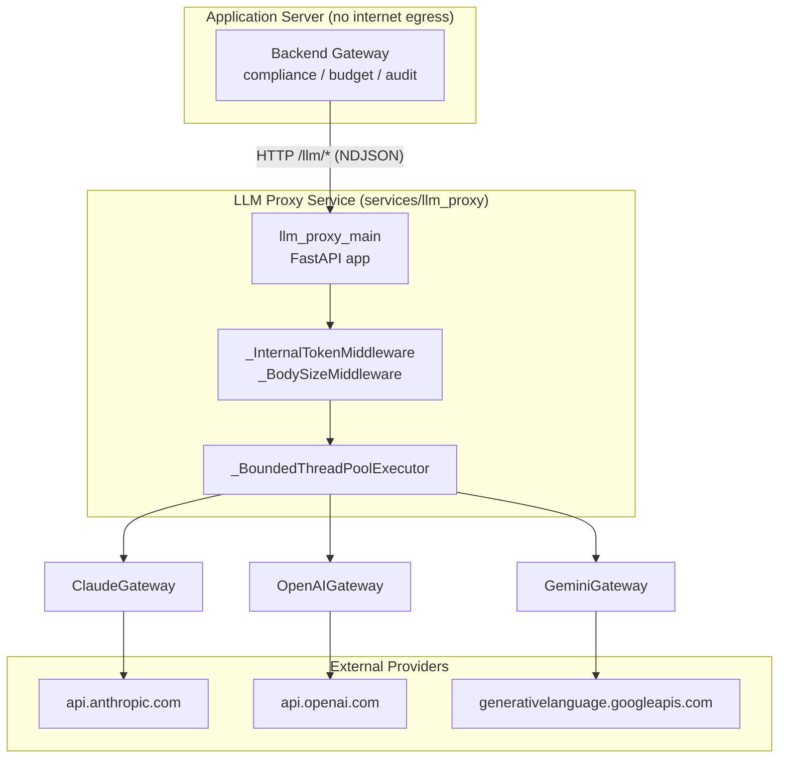
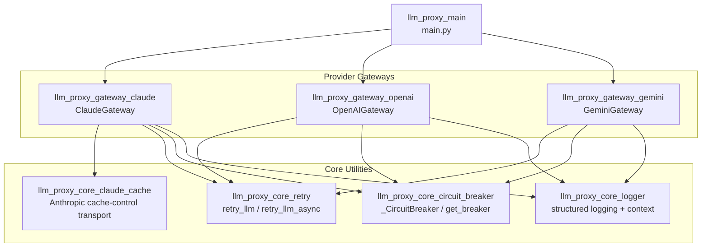
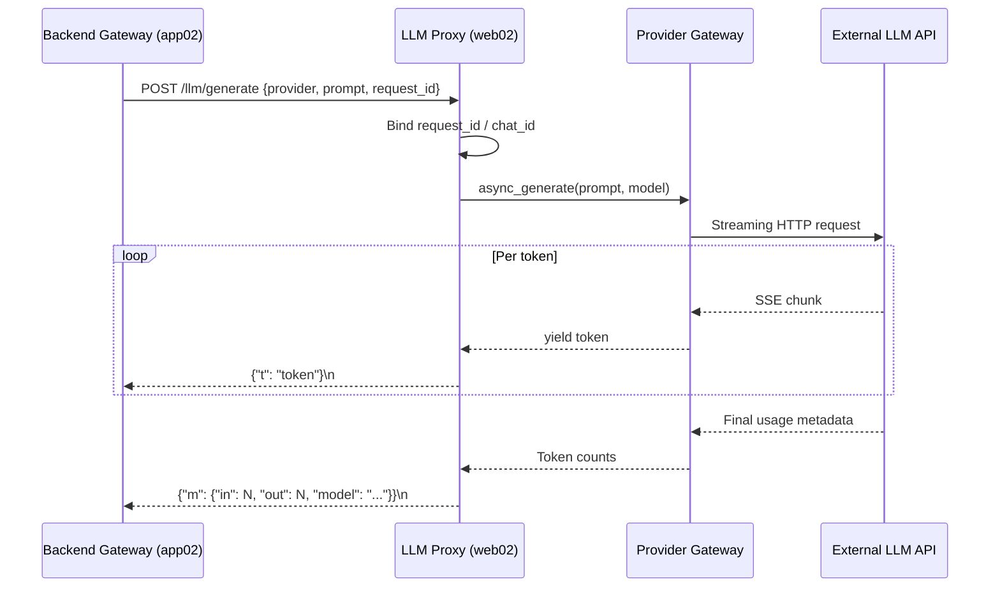

# `llm_proxy` Module Overview

## Purpose

The `llm_proxy` module is a standalone FastAPI service that acts as the **secure internet-egress gateway** for all outbound Large Language Model (LLM) calls. It runs on the only host with direct outbound internet access (`web02`) and proxies requests from the internal application servers (`app02`) to external cloud LLM providers: **Anthropic Claude**, **OpenAI**, and **Google Gemini**.

Key design principles:

- **No compliance logic**: PCI/PII detection, redaction, budget gating, and audit checks are performed upstream by the backend gateway layer before requests reach this proxy.
- **Provider-agnostic streaming**: All text-generation endpoints stream tokens as NDJSON for low-latency delivery across the internal network hop.
- **Resilience by default**: Every outbound provider call is protected by circuit breakers and exponential-backoff retry logic.
- **Bounded concurrency**: A bounded thread pool provides backpressure, returning HTTP 503 when the service is at capacity.

## Architecture

### High-Level System Context

### Internal Module Structure

### Request Lifecycle

## Core Components

| Component | File | Responsibility |
|---|---|---|
| **[llm_proxy_main](llm_proxy_main.md)** | `main.py` | FastAPI application, endpoint routing, request/response models, middleware, and provider dispatch. |
| **[llm_proxy_gateway_claude](llm_proxy_gateway_claude.md)** | `gateway_claude.py` | Anthropic Claude adapter: streaming generation, tool-use, prompt-cache tracking. |
| **[llm_proxy_gateway_openai](llm_proxy_gateway_openai.md)** | `gateway_openai.py` | OpenAI adapter: chat completions, Responses API, DALL·E image generation, TTS. |
| **[llm_proxy_gateway_gemini](llm_proxy_gateway_gemini.md)** | `gateway_gemini.py` | Google Gemini adapter: streaming, vision, Imagen image generation, Veo video generation. |
| **[llm_proxy_core_circuit_breaker](llm_proxy_core_circuit_breaker.md)** | `core/circuit_breaker.py` | Per-provider circuit breaker with CLOSED / OPEN / HALF-OPEN states. |
| **[llm_proxy_core_retry](llm_proxy_core_retry.md)** | `core/retry.py` | Exponential-backoff retry wrapper for transient provider errors. |
| **[llm_proxy_core_logger](llm_proxy_core_logger.md)** | `core/logger.py` | Structured JSON logging with request/chat correlation ContextVars. |
| **[llm_proxy_core_claude_cache](llm_proxy_core_claude_cache.md)** | `core/claude_cache_egress.py` | Transparent injection of Anthropic `cache_control` markers at the HTTP transport layer. |

## Key Endpoints

The proxy exposes endpoints for:

- **Text generation**: `POST /llm/generate`, `POST /llm/chat`
- **Tool-use streaming**: `POST /llm/claude/tools-stream`, `POST /llm/openai/tools-stream`, `POST /llm/gemini/tools-stream`
- **Media generation**: `POST /llm/imagen`, `POST /llm/generate-ppt-image`, `POST /llm/veo`, `POST /llm/tts`
- **Web search**: `POST /llm/web-search`
- **Spend reporting**: `POST /spend/anthropic/{report}`, `POST /spend/openai/{report}`, `POST /spend/gcp/bigquery`
- **Auxiliary**: `POST /llm/atlassian-proxy`, `POST /llm/responses`, `POST /net/forward`, `GET /health`

## References

For detailed documentation of each subsystem, see:

- [llm_proxy_main](llm_proxy_main.md)
- [llm_proxy_gateway_claude](llm_proxy_gateway_claude.md)
- [llm_proxy_gateway_openai](llm_proxy_gateway_openai.md)
- [llm_proxy_gateway_gemini](llm_proxy_gateway_gemini.md)
- [llm_proxy_core_circuit_breaker](llm_proxy_core_circuit_breaker.md)
- [llm_proxy_core_retry](llm_proxy_core_retry.md)
- [llm_proxy_core_logger](llm_proxy_core_logger.md)
- [llm_proxy_core_claude_cache](llm_proxy_core_claude_cache.md)