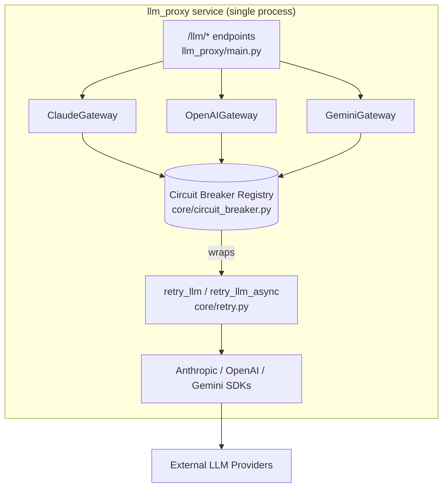
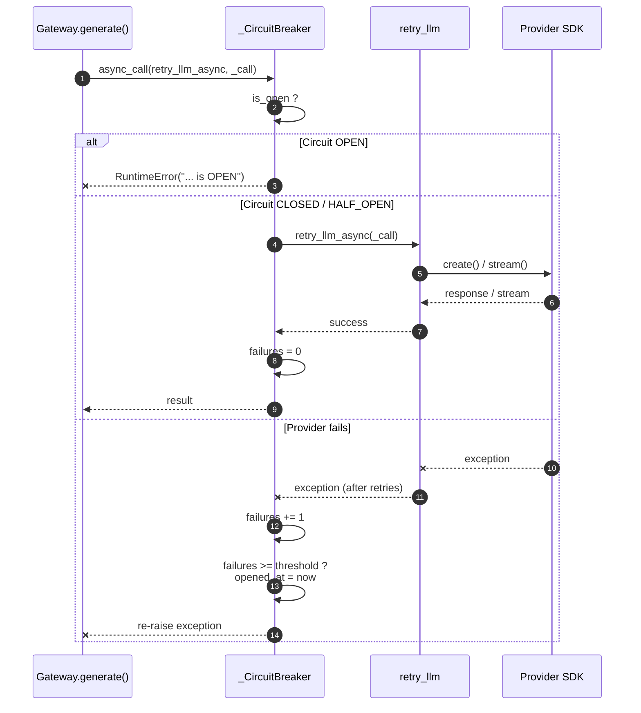
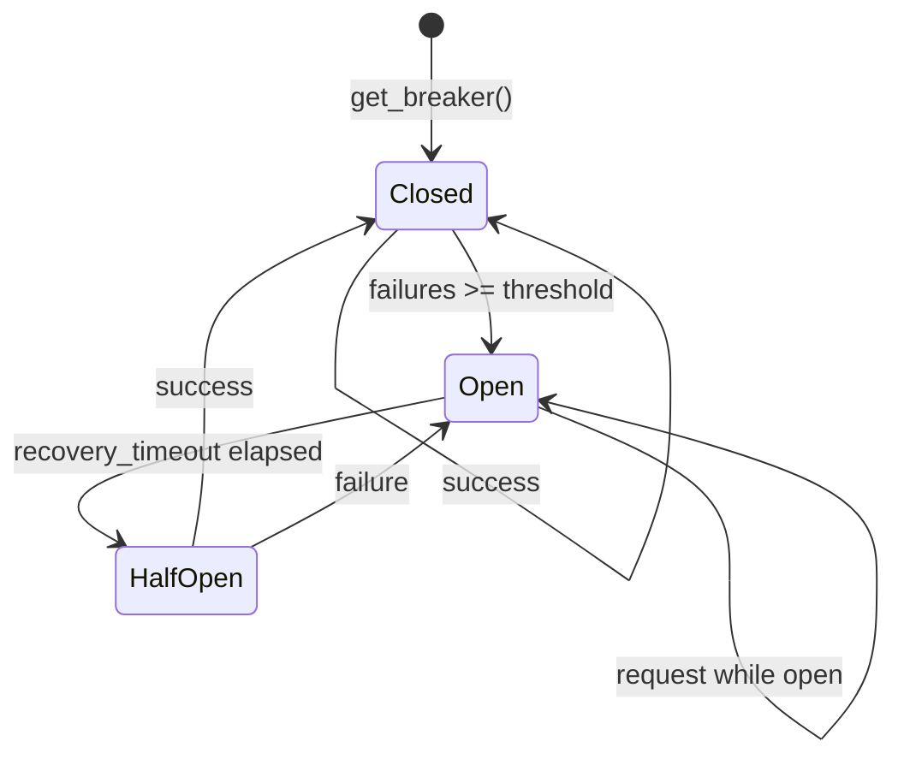

# llm_proxy_core_circuit_breaker

## Brief Introduction

The `llm_proxy_core_circuit_breaker` module provides a **process-local, in-memory circuit breaker** for the standalone `llm_proxy` service. It protects outbound LLM provider calls (Claude, OpenAI, Gemini) by fast-failing repeated requests once a provider crosses a configured failure threshold, then automatically allowing a recovery probe after a cooldown period.

This module is intentionally **Redis-free** and **thread-safe**, making it suitable for the single-process `llm_proxy` deployment on `web02`. It exposes the same public API as the shared `core_circuit_breaker` used by the main gateway, so callers can switch between the two implementations without code changes.

---

## Comprehensive Documentation

### 1. Purpose and Core Functionality

LLM providers occasionally fail due to rate limits, transient network issues, or provider outages. Without a circuit breaker, every incoming request would continue to hit the failing provider, wasting resources and increasing latency. This module implements the classic circuit-breaker pattern:

- **Closed (normal)**: Requests pass through to the provider.
- **Open (tripped)**: Requests are rejected immediately with `RuntimeError`.
- **Half-open (recovery)**: After `recovery_timeout` seconds, one probe request is allowed. If it succeeds, the breaker closes; if it fails, it reopens.

Key design decisions:

| Decision | Rationale |
|----------|-----------|
| In-memory / no Redis | The `llm_proxy` service runs as a single process; distributed state is unnecessary. Avoids Redis dependency in the proxy. |
| Thread-safe via `threading.Lock` | The proxy uses a thread-pool executor; concurrent provider calls must update failure counts safely. |
| Same API as shared `core.circuit_breaker` | Allows the proxy gateways to be tested locally or run standalone without the full backend stack. |
| Singleton registry via `get_breaker()` | Named breakers are reused across the process so all calls to the same provider share state. |

### 2. Architecture and Component Relationships

#### 2.1 Module placement

```text
llm_proxy
├── main.py                    # FastAPI app, /health, /llm/* endpoints
├── gateway_claude.py          # ClaudeGateway
├── gateway_openai.py          # OpenAIGateway
├── gateway_gemini.py          # GeminiGateway
└── core
    ├── circuit_breaker.py     # ← this module
    ├── logger.py              # process-local logging helpers
    ├── retry.py               # retry_llm / retry_llm_async
    └── claude_cache_egress.py # Anthropic cache-control transport
```

The circuit breaker sits between the gateway classes and the actual SDK client calls. Each gateway obtains a named breaker (`"claude"`, `"openai"`, `"gemini"`) and wraps the provider invocation with `breaker.call()` (sync) or `breaker.async_call()` (async).

For the relationship with the broader system, see:

- [`llm_proxy_main`](llm_proxy_main.md) — service entry point and endpoint orchestration.
- [`llm_proxy_gateway_claude`](llm_proxy_gateway_claude.md), [`llm_proxy_gateway_openai`](llm_proxy_gateway_openai.md), [`llm_proxy_gateway_gemini`](llm_proxy_gateway_gemini.md) — provider gateways that consume this breaker.
- [`llm_proxy_core_retry`](llm_proxy_core_retry.md) — retry wrapper typically composed with the breaker.
- `core_circuit_breaker` — the Redis-backed, cluster-wide circuit breaker used by the main `gateway.py`.

#### 2.2 Architecture diagram



#### 2.3 Component interaction diagram



### 3. Core Components

#### 3.1 `_CircuitBreaker`

The internal state machine. Not instantiated directly; use `get_breaker()`.

**State fields:**

| Field | Type | Description |
|-------|------|-------------|
| `name` | `str` | Provider / logical name (e.g., `"claude"`). |
| `failure_threshold` | `int` | Consecutive failures required to open the circuit. |
| `recovery_timeout` | `int` | Seconds before a half-open probe is allowed. |
| `_failures` | `int` | Current consecutive failure count. |
| `_opened_at` | `float \| None` | Unix timestamp when the circuit opened. |
| `_lock` | `threading.Lock` | Guards all state mutations. |

**Public interface:**

```python
@property
def is_open(self) -> bool: ...

def call(self, fn, *args, **kwargs): ...

async def async_call(self, coro_fn, *args, **kwargs): ...
```

Behavior:

- `is_open` checks whether `_opened_at` is set and whether `recovery_timeout` has elapsed. If elapsed, it transitions to half-open by clearing `_opened_at` and `_failures`.
- `call()` runs a synchronous callable. On success, resets `_failures`. On exception, increments `_failures` and opens the circuit when the threshold is reached.
- `async_call()` is the async equivalent; it `await`s `coro_fn(*args, **kwargs)`.

#### 3.2 `get_breaker`

Factory that returns a singleton `_CircuitBreaker` for the given name.

```python
def get_breaker(
    name: str,
    failure_threshold: int = 5,
    recovery_timeout: int = 60,
) -> _CircuitBreaker:
```

The first call for a name creates the breaker; subsequent calls return the same instance. Defaults are `failure_threshold=5` and `recovery_timeout=60` seconds.

### 4. Data Flow and Process Flows

#### 4.1 State machine



#### 4.2 Typical provider call flow

1. The endpoint handler in `llm_proxy/main.py` selects a gateway based on the requested model.
2. The gateway builds the provider-specific payload.
3. The gateway retrieves the breaker: `breaker = get_breaker("claude")`.
4. The gateway wraps the SDK call:
   - Sync: `breaker.call(retry_llm, _call)`
   - Async: `await breaker.async_call(retry_llm_async, _call)`
5. The breaker checks `is_open`.
6. If closed, the retry wrapper executes the SDK call with exponential backoff.
7. On success, the breaker resets its failure counter.
8. On repeated failure, the breaker opens and fast-fails subsequent calls until recovery.

### 5. Configuration and Tuning

Configuration is currently hard-coded at call sites. Example from the gateways:

```python
breaker = get_breaker("claude")  # uses defaults: threshold=5, recovery=60s
```

To tune a provider, change the defaults at the `get_breaker()` call site or introduce environment variables in `llm_proxy/main.py`.

Recommended tuning guidelines:

| Provider | Suggested threshold | Suggested recovery | Rationale |
|----------|--------------------:|-------------------:|-----------|
| Claude / OpenAI / Gemini | 5–10 | 30–60 s | Provider rate limits are usually transient; short recovery avoids long outages. |
| Local / Ollama | 3–5 | 60–120 s | Local model failures often indicate GPU / process issues needing more cooldown. |

### 6. Logging and Observability

The breaker logs state transitions via the local logger (`core.logger`):

- `info`: half-open transition.
- `warning`: circuit opened after threshold failures.

Because this implementation is in-memory, there is no built-in `/health` endpoint specific to it. For cluster-wide breaker health, the main gateway exposes `circuit_breaker_health()` using the Redis-backed `core_circuit_breaker`.

### 7. Comparison with Shared `core.circuit_breaker`

| Feature | `llm_proxy/core/circuit_breaker.py` (this module) | `core/circuit_breaker.py` (shared) |
|---------|---------------------------------------------------|------------------------------------|
| State storage | In-memory, process-local | Redis-backed, cluster-wide |
| Deployment target | Single-process `llm_proxy` on `web02` | Multi-process backend gateway |
| Half-open state | Implicit (clears `_opened_at`) | Explicit `HALF_OPEN` Redis state |
| Disable flag | None | `CIRCUIT_BREAKER_DISABLED` env var |
| `status()` method | No | Yes |
| `all_breaker_states()` | No | Yes (used by `gateway.py` health) |

Both expose `get_breaker(name, failure_threshold, recovery_timeout)` and `breaker.call(fn, ...)`, so provider gateways can run against either implementation depending on PYTHONPATH / deployment.

### 8. Error Handling

When the circuit is open, callers receive:

```python
RuntimeError("CircuitBreaker(<name>) is OPEN")
```

Gateways typically catch this and either:

- Yield a user-facing error message (e.g., `"\nError generating response"`).
- Allow the caller to fall back to another provider.

Because the breaker re-raises the original exception on failure (after counting it), upstream retry logic still sees the underlying SDK error for the first `failure_threshold` attempts.

### 9. Thread Safety

All state reads and writes are protected by a single `threading.Lock` per breaker. The registry of breakers (`_breakers`) is also protected by a module-level lock. This is safe for the proxy's thread-pool model but is **not** safe across multiple OS processes; use the Redis-backed breaker for multi-process deployments.

### 10. References

- [`llm_proxy_main`](llm_proxy_main.md)
- [`llm_proxy_gateway_claude`](llm_proxy_gateway_claude.md)
- [`llm_proxy_gateway_openai`](llm_proxy_gateway_openai.md)
- [`llm_proxy_gateway_gemini`](llm_proxy_gateway_gemini.md)
- [`llm_proxy_core_retry`](llm_proxy_core_retry.md)
- [`llm_proxy_core_logger`](llm_proxy_core_logger.md)
- `core_circuit_breaker`
- [`gateway`](../core/gateway.md)
