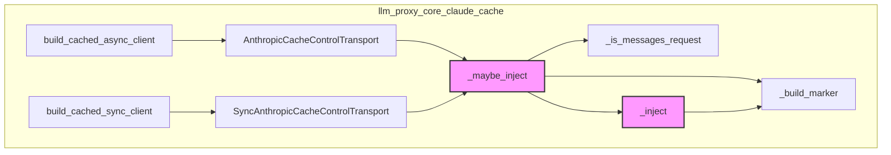
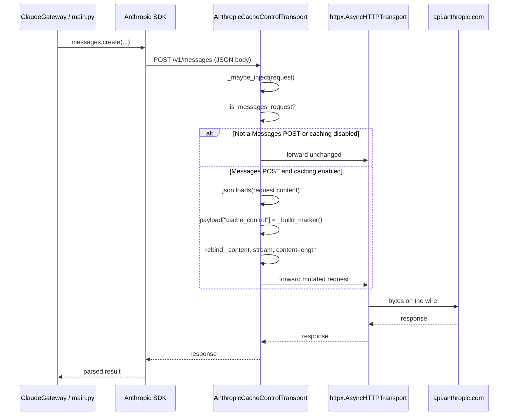
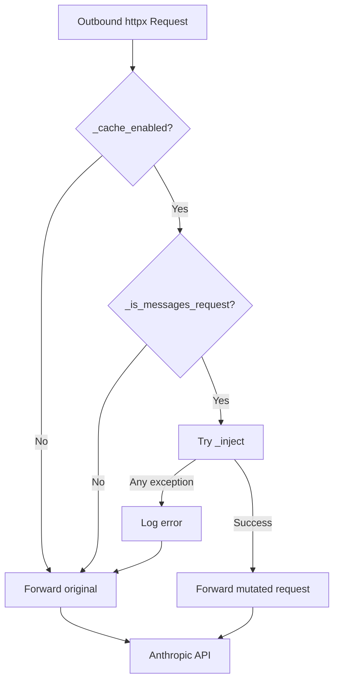

# llm_proxy_core_claude_cache — Anthropic Cache-Control Egress Transport

## Brief Introduction

The `llm_proxy_core_claude_cache` module provides a **single, centralized injection point** for Anthropic `cache_control` markers on all outbound Messages API requests. It lives in `services/llm_proxy/core/claude_cache_egress.py` and is part of the [llm_proxy](llm_proxy.md) service.

Before this module existed, every call site that built an Anthropic payload (gateway methods, tool streams, chat endpoints, web-search helpers) had to remember to add cache breakpoints. That created drift, duplicated logic, and silent opt-outs. Now the marker is added in exactly one place: the HTTP transport that carries the request to `https://api.anthropic.com/v1/messages`.

The design is **failure-safe by construction**: if injection fails for any reason, the original request is forwarded unchanged, so a caching bug can never break inference. It is also **provider-scoped** — only Anthropic Messages POSTs are modified; all other traffic passes through untouched.

---

## Purpose and Core Functionality

### What It Does

1. **Wraps `httpx` transports** with async (`AnthropicCacheControlTransport`) and sync (`SyncAnthropicCacheControlTransport`) variants.
2. **Intercepts outbound Anthropic Messages requests** just before they leave the process.
3. **Injects a top-level `cache_control` field** into the JSON body:
   ```json
   {
     "model": "claude-3-5-sonnet-20241022",
     "max_tokens": 100,
     "cache_control": {"type": "ephemeral"},
     "messages": [...]
   }
   ```
4. **Rebinds the request body and headers** so the mutated bytes are actually written to the wire.
5. **Logs every injection** with request ID, URL, marker value, and byte-size delta.
6. **Falls back to the original request** if anything goes wrong.

### Why a Transport Instead of an Event Hook

`httpx` request event hooks cannot rewrite the outgoing body — by the time the hook runs, the request stream is already bound. A custom transport is the only supported interception point that can mutate the serialized bytes before they are sent.

### Environment Configuration

| Variable | Default | Behavior |
|----------|---------|----------|
| `ANTHROPIC_PROMPT_CACHE` | `true` | Set to `false`, `0`, `no`, or `off` to disable injection entirely. |
| `ANTHROPIC_CACHE_TTL` | *(empty)* | Set to `5m` or `1h` to include a `ttl` field; otherwise only `{"type": "ephemeral"}` is emitted. |

### Cacheable Endpoints

Only these Anthropic paths receive the marker:

- `/v1/messages`
- `/v1/messages/count_tokens`

The second path is included so token estimates are computed against the same body the real call sends.

---

## Architecture and Component Relationships

### Component Overview



### Public API

| Function / Class | Purpose |
|------------------|---------|
| `build_cached_async_client(**kwargs) -> httpx.AsyncClient` | Returns an async `httpx.AsyncClient` whose Anthropic Messages calls carry `cache_control`. |
| `build_cached_sync_client(**kwargs) -> httpx.Client` | Returns a sync `httpx.Client` for the blocking Anthropic SDK. |
| `AnthropicCacheControlTransport` | Async transport wrapper that performs the injection. |
| `SyncAnthropicCacheControlTransport` | Sync transport wrapper for blocking clients. |

### Internal Helpers

| Function | Purpose |
|----------|---------|
| `_cache_enabled()` | Reads `ANTHROPIC_PROMPT_CACHE` env var. |
| `_build_marker()` | Builds the `cache_control` dict, optionally with `ttl`. |
| `_is_messages_request(req)` | Filters to Anthropic Messages POSTs only. |
| `_inject(req)` | Parses JSON, adds the marker, rebinds body/stream/headers. |
| `_maybe_inject(req)` | Gatekeeper: checks enabled + endpoint, catches and logs all errors. |

---

## How It Fits into the Overall System

### Within the LLM Proxy Service

The module is consumed by the Anthropic-specific parts of [llm_proxy](llm_proxy.md):

- **[llm_proxy_gateway_claude](llm_proxy_gateway_claude.md)** — `ClaudeGateway` passes `build_cached_async_client(...)` as the `http_client` for both its long-lived `self.client` and per-call clients created inside `generate()`.
- **[llm_proxy_main](llm_proxy_main.md)** — Claude chat, tool-stream, and web-search paths use the same gateway or build their own Anthropic clients through this transport.

Because the marker is injected at the transport layer, **no call site needs to know about caching**. They build ordinary Anthropic payloads; the egress transport adds the marker transparently.

### System Context

```mermaid
graph LR
    subgraph "Callers"
        A[ClaudeGateway.generate]
        B[ClaudeGateway.generate_with_tools]
        C[llm_proxy.main<br/>claude chat / tools / web-search]
    end

    subgraph "llm_proxy_core_claude_cache"
        D[build_cached_async_client]
        E[build_cached_sync_client]
        F[AnthropicCacheControlTransport]
    end

    subgraph "Anthropic SDK"
        G[AsyncAnthropic]
        H[Anthropic]
    end

    subgraph "Anthropic API"
        I[/v1/messages]
        J[/v1/messages/count_tokens]
    end

    A --> D --> G --> F --> I
    B --> D --> G --> F --> I
    C --> D --> G --> F --> I
    C --> E --> H --> F --> I
    F --> J
```

### Relationship to Other Core Modules

- **[llm_proxy_core_logger](llm_proxy_core_logger.md)** — The transport uses the shared logger and request-ID accessor for consistent observability.
- **[llm_proxy_core_retry](llm_proxy_core_retry.md)** — Retries reuse the same `httpx.Request` object; the injection is idempotent, so re-injection on retry produces byte-identical bodies.
- **[llm_proxy_core_circuit_breaker](llm_proxy_core_circuit_breaker.md)** — Circuit-breaker wrapping happens above this layer; the transport is unaware of breaker state.

---

## Data Flow

### Request Mutation Flow



### Failure-Safe Path



---

## Process Flows

### Building an Async Client

```mermaid
flowchart LR
    A[Caller needs AsyncAnthropic client] --> B[build_cached_async_client]
    B --> C[httpx.AsyncClient]
    C --> D[AnthropicCacheControlTransport]
    D --> E[httpx.AsyncHTTPTransport]
    C --> F[Pass to AsyncAnthropic(http_client=...)]
```

### Building a Sync Client

```mermaid
flowchart LR
    A[Caller needs blocking Anthropic client] --> B[build_cached_sync_client]
    B --> C[httpx.Client]
    C --> D[SyncAnthropicCacheControlTransport]
    D --> E[httpx.HTTPTransport]
    C --> F[Pass to Anthropic(http_client=...)]
```

---

## Design Principles

1. **Single source of truth** — One module owns the shape of `cache_control`.
2. **Transparent to callers** — No payload builder needs to import or think about caching.
3. **Idempotent** — Re-injecting the same request produces the same bytes, safe for retries.
4. **Fail-open** — Any injection error is logged and the original request is sent.
5. **Minimal scope** — Only Anthropic Messages POSTs are touched; everything else is byte-for-byte forwarded.
6. **Observable** — Every injection emits a structured log line with request ID and byte delta.

---

## References

- [llm_proxy](llm_proxy.md) — Parent service that hosts this module.
- [llm_proxy_gateway_claude](llm_proxy_gateway_claude.md) — Primary consumer of the async cached client.
- [llm_proxy_main](llm_proxy_main.md) — Claude chat, tool-stream, and web-search endpoints.
- [llm_proxy_core_logger](llm_proxy_core_logger.md) — Shared logging utilities used for injection logs.
- [llm_proxy_core_retry](llm_proxy_core_retry.md) — Retry logic that benefits from idempotent injection.
- [llm_proxy_core_circuit_breaker](llm_proxy_core_circuit_breaker.md) — Circuit breaker used by Claude gateway calls.
