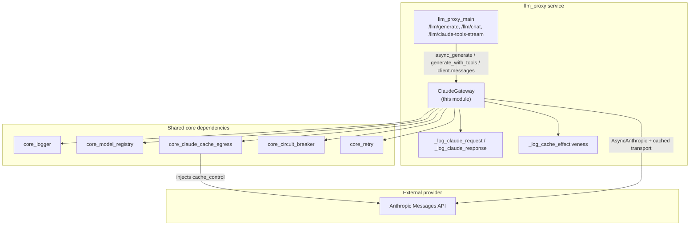
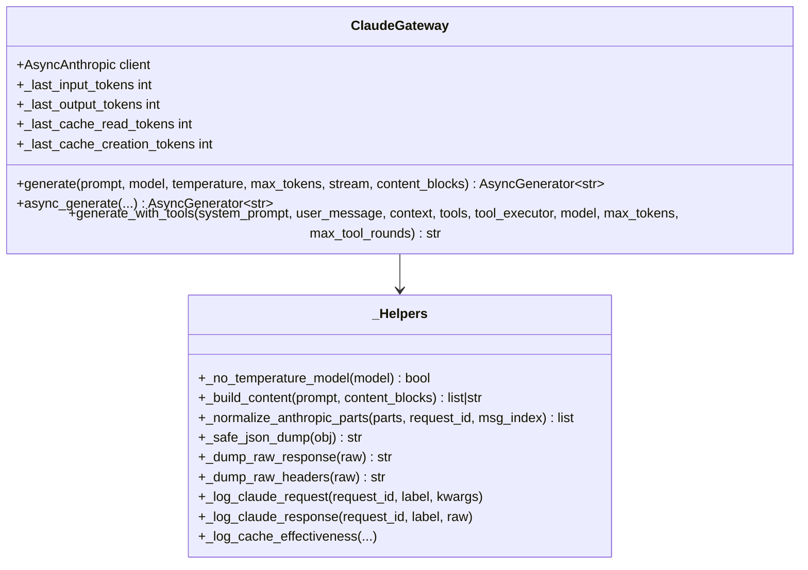
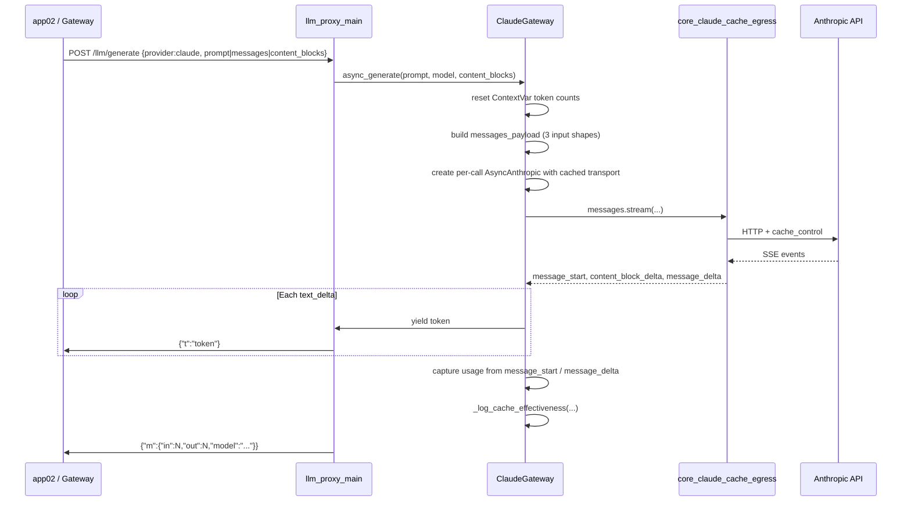
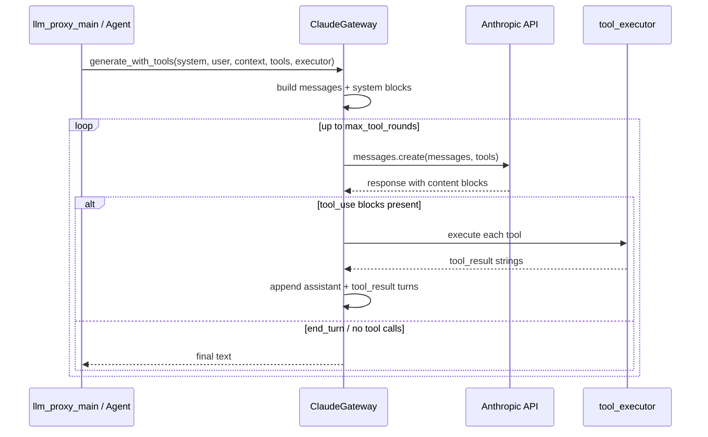

# llm_proxy_gateway_claude

## Brief Introduction

The `llm_proxy_gateway_claude` module is the **Anthropic Claude provider adapter** inside the `llm_proxy` service. It encapsulates all direct interaction with the Anthropic Messages API, exposing both streaming text generation and multi-round tool-use flows. The module is designed as a PCI-safe, enterprise-grade proxy layer: it forwards already-validated and redacted text verbatim to Anthropic, records per-request token usage (including Anthropic prompt-cache read/write tokens), and integrates with shared resiliency primitives (circuit breaker, retry, cache egress transport) without reimplementing compliance logic.

This module lives on the **web02 / LLM proxy tier** and is consumed by `llm_proxy_main` endpoints such as `/llm/generate`, `/llm/chat`, and `/llm/claude-tools-stream`. It is one of three symmetric provider gateways, alongside [`llm_proxy_gateway_openai`](llm_proxy_gateway_openai.md) and [`llm_proxy_gateway_gemini`](llm_proxy_gateway_gemini.md).

---

## Core Responsibilities

1. **Anthropic API Client Management**
   - Initializes an `AsyncAnthropic` client using `ANTHROPIC_API_KEY`.
   - Wires the client to the shared [`llm_proxy_core_claude_cache`](llm_proxy_core_claude_cache.md) egress transport so Anthropic prompt-cache breakpoints are added consistently at the HTTP layer.
   - Creates per-call async clients when invoked via `asyncio.run()` to avoid cross-loop client reuse errors.

2. **Streaming Text Generation**
   - `generate()` / `async_generate()` accept a flat prompt, an OpenAI-style messages list, or Claude `content_blocks`.
   - Yields tokens incrementally for low-latency streaming responses.
   - Captures real input/output token counts and Anthropic cache read/creation tokens from SDK usage events.

3. **Multi-Round Tool-Use**
   - `generate_with_tools()` drives a loop where Claude may emit `tool_use` blocks, the caller-supplied `tool_executor` runs them, and `tool_result` blocks are returned to Claude.
   - Enforces `max_tool_rounds` to prevent unbounded loops.

4. **Observability & Cost Tracking**
   - Logs outgoing requests and raw HTTP responses (with API keys redacted).
   - Emits `[CACHE EFFECTIVENESS]` lines that compute estimated cache savings/surcharges using the shared `core_model_registry` cost table.
   - Stores per-request token counts in `contextvars` so concurrent async tasks remain isolated.

5. **Safety & Resiliency**
   - Honors `DISABLE_ANTHROPIC_API` to block outbound calls in restricted environments.
   - Refuses blocked models via `core_model_registry` `BLOCKED_MODELS`.
   - Wraps non-streaming calls with `core_circuit_breaker` and `core_retry`.
   - Omits the deprecated `temperature` parameter for newer Claude model families (`opus-4`, `opus-5`, `sonnet-5`).

---

## Architecture

### Component Overview



### ClaudeGateway Class Structure



---

## Data Flow

### Streaming Generation (`/llm/generate` → Claude)



### Tool-Use Flow (`/llm/chat` or direct callers)



---

## Component Interaction

### With `llm_proxy_main`

`llm_proxy_main` is the HTTP entry point. It:

- Validates the request and resolves the provider gateway via `_resolve_gateway()`.
- Binds the upstream `request_id` / `chat_id` using `core_logger`.
- Calls `ClaudeGateway.async_generate()` for streaming generation.
- Calls `ClaudeGateway.generate_with_tools()` indirectly through `_chat_claude()` for non-streaming chat/tool-use.
- Accesses `ClaudeGateway.client.messages.stream()` directly in `claude_tools_stream()` for native Anthropic tool-use streaming.

For details on endpoint routing and request/response envelopes, see [`llm_proxy_main`](llm_proxy_main.md).

### With `core_claude_cache_egress`

The gateway never adds `cache_control` markers to payloads itself. Instead, it passes `build_cached_async_client()` as the `http_client` for `AsyncAnthropic`. The transport (`AnthropicCacheControlTransport`) injects cache control at the HTTP egress boundary. This keeps cache policy in one place and applies uniformly to `create`, `stream`, and `with_raw_response` calls.

See [`llm_proxy_core_claude_cache`](llm_proxy_core_claude_cache.md).

### With `core_circuit_breaker` and `core_retry`

Non-streaming `generate()` calls are wrapped in:

```python
breaker = get_breaker("claude")
response = await breaker.async_call(retry_llm_async, _call)
```

Streaming calls currently open the stream directly (to preserve per-token delivery) and rely on the transport-level hooks and exception logging for resiliency. For circuit-breaker semantics and retry policies, see [`llm_proxy_core_circuit_breaker`](llm_proxy_core_circuit_breaker.md) and [`llm_proxy_core_retry`](llm_proxy_core_retry.md).

### With `core_model_registry`

- `CLAUDE_PRIMARY_MODEL` is imported as the default model.
- `BLOCKED_MODELS` is checked at class load time and at call time.
- `MODEL_COST_PER_1M` drives cache-effectiveness cost estimation.

See `core_model_registry`.

### With `core_logger`

All logging uses the shared structured logger. Request IDs are propagated via `contextvars` so every log line in a request carries the same correlation ID. For logger configuration and context binding, see [`llm_proxy_core_logger`](llm_proxy_core_logger.md).

---

## Key Implementation Details

### Input Shape Handling

`generate()` accepts three mutually exclusive input shapes:

| Shape | Handling |
|-------|----------|
| `str` | Wrapped as a single user message with one text content block. |
| `list[dict]` (OpenAI format) | Each dict becomes an Anthropic message. `system` role messages are lifted to the top-level `system=` parameter. Non-string content is normalized via `_normalize_anthropic_parts()`. |
| `content_blocks` | Structured list of `{"text": "..."}` blocks; empty blocks are dropped. |

### Prompt-Cache Cost Logging

`_log_cache_effectiveness()` computes:

- `full_prompt = input_tokens + cache_read + cache_created`
- `hit_rate = cache_read / full_prompt`
- `savings_est_usd = cache_read * input_rate * (1 - 0.10) / 1_000_000`
- `write_surcharge_est_usd = cache_created * input_rate * (1.25 - 1.0) / 1_000_000`

This uses the registry's per-model input rate as the single source of truth for pricing.

### Per-Call Async Client

Because `llm_proxy_main` historically drains `generate()` via `asyncio.run()` inside a thread-pool worker, reusing a long-lived `AsyncAnthropic` client across different event loops causes `RuntimeError: Event loop is closed`. The gateway therefore constructs a fresh `AsyncAnthropic` client inside the coroutine for the streaming path, then closes it in `finally`. The long-lived `self.client` remains available for always-async callers such as `claude_tools_stream()` and `generate_with_tools()`.

### ContextVar Token Counts

Token counts are stored in `contextvars.ContextVar` instances rather than instance attributes. This prevents concurrent async requests from overwriting each other's usage metrics when the singleton `claude_gateway` is shared across many in-flight requests.

### Temperature Gating

`_no_temperature_model()` returns `True` for `opus-4`, `opus-5`, and `sonnet-5` families. The gateway omits `temperature` from the API call for these models to avoid Anthropic 400 errors. This helper is also imported by `llm_proxy_main` so the same rule applies to direct `client.messages.*` calls.

---

## Module Boundaries

- **Does NOT perform PCI/PII compliance.** Compliance (input scanning, redaction) is enforced upstream in the backend gateway tier (Tier 1). The module explicitly forwards already-redacted text verbatim.
- **Does NOT manage conversation persistence.** Chat history, thread state, and checkpointing are handled by `abstudio_backend` and `shared_core_memory_system`.
- **Does NOT route between providers.** Provider selection is owned by `llm_proxy_main`.
- **Does NOT implement its own retry/circuit-breaker state machine.** It delegates to [`llm_proxy_core_circuit_breaker`](llm_proxy_core_circuit_breaker.md) and [`llm_proxy_core_retry`](llm_proxy_core_retry.md).

---

## Configuration & Environment Variables

| Variable | Purpose |
|----------|---------|
| `ANTHROPIC_API_KEY` | Required. API key for Anthropic. |
| `LLM_TIMEOUT_SEC` | Request timeout in seconds (default 300 for `generate()`, 600 for `generate_with_tools()`). |
| `DISABLE_ANTHROPIC_API` | If `true`/`1`/`yes`, all outbound Anthropic calls are blocked and a placeholder message is returned. |
| `CLAUDE_PRIMARY_MODEL` | Default model sourced from `core_model_registry`. |

---

## Related Documentation

- [`llm_proxy_main`](llm_proxy_main.md) — HTTP entry points that consume this gateway.
- [`llm_proxy_gateway_openai`](llm_proxy_gateway_openai.md) — Symmetric OpenAI adapter.
- [`llm_proxy_gateway_gemini`](llm_proxy_gateway_gemini.md) — Symmetric Gemini adapter.
- [`llm_proxy_core_claude_cache`](llm_proxy_core_claude_cache.md) — Cache egress transport.
- [`llm_proxy_core_circuit_breaker`](llm_proxy_core_circuit_breaker.md) — Circuit-breaker primitive.
- [`llm_proxy_core_retry`](llm_proxy_core_retry.md) — Retry helper.
- [`llm_proxy_core_logger`](llm_proxy_core_logger.md) — Structured logging.
- `core_model_registry` — Model IDs, blocked models, and pricing.
