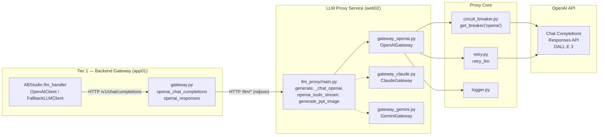
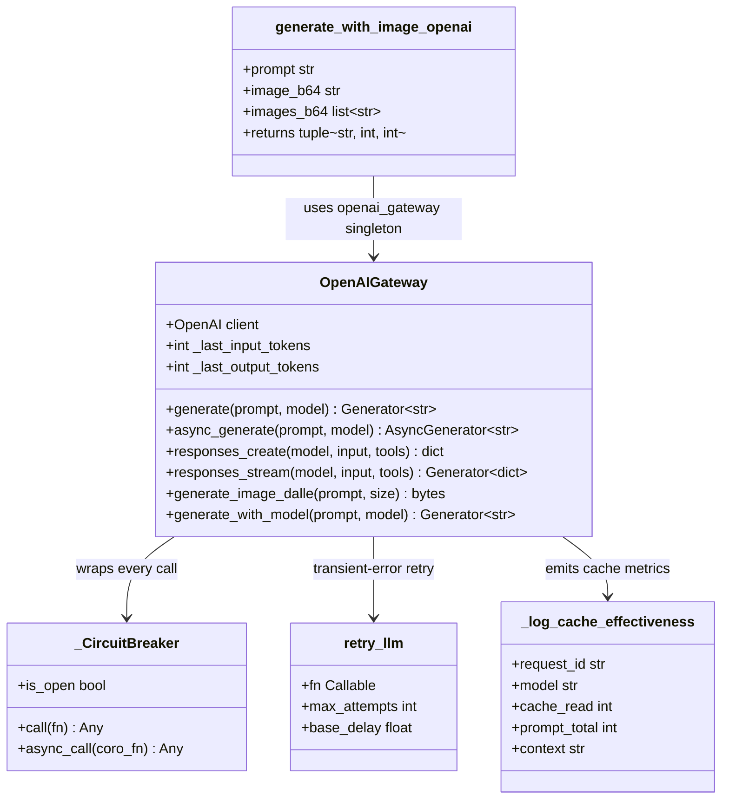
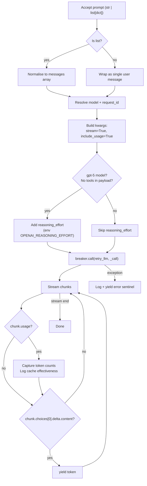
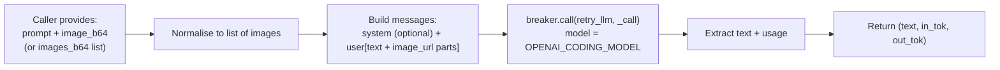
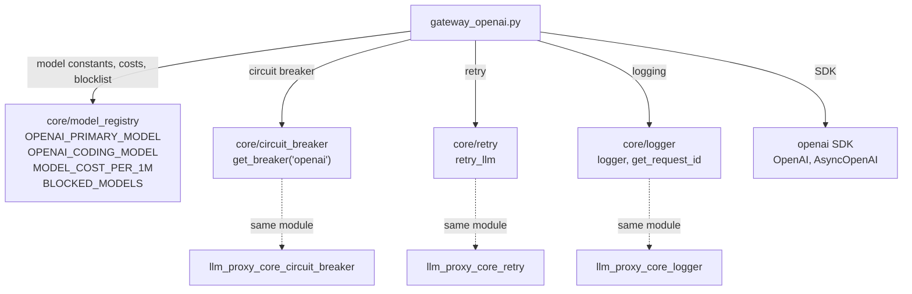
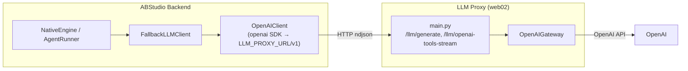
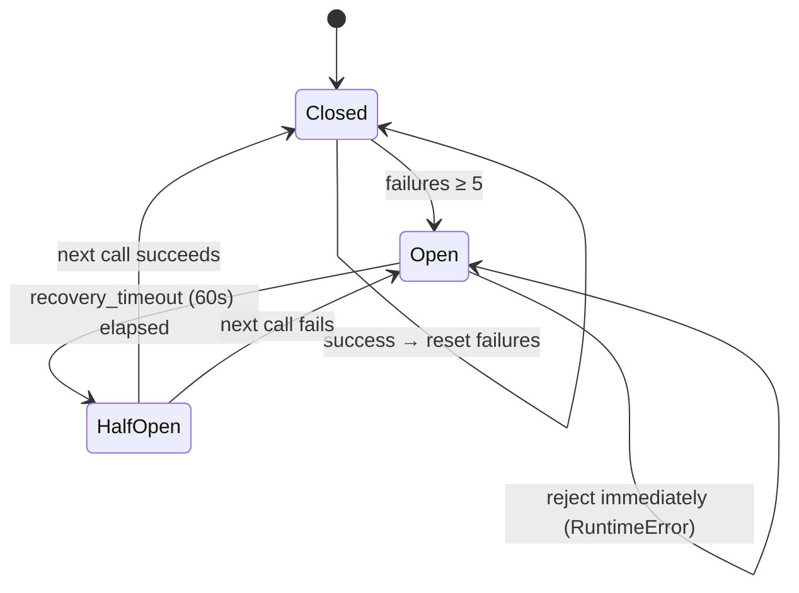
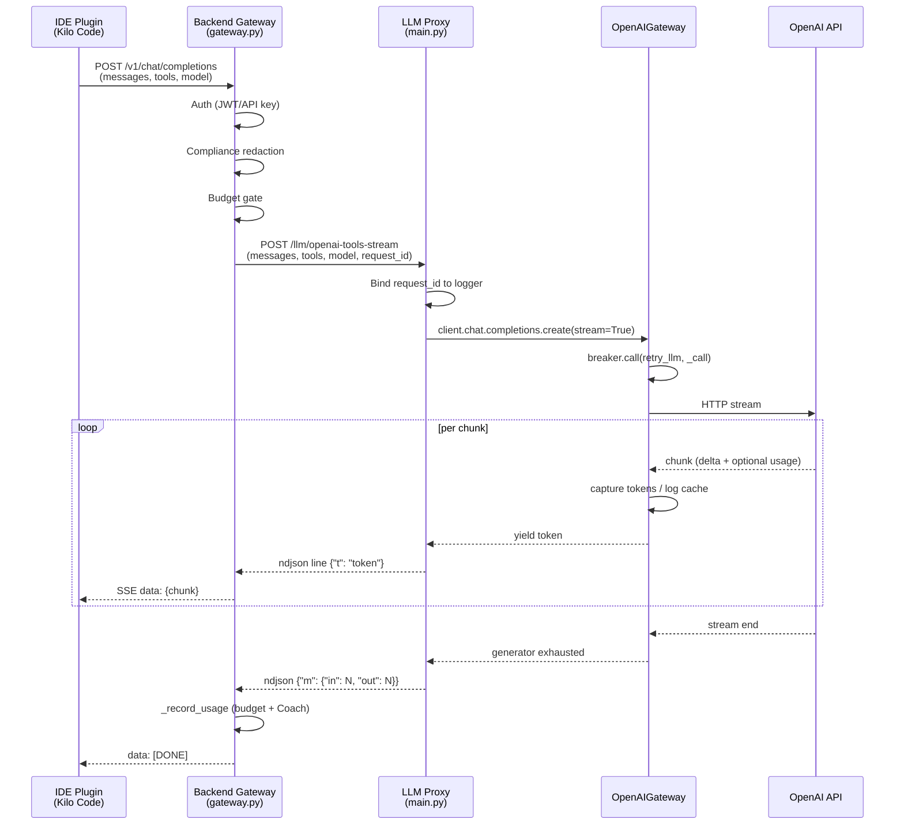

# LLM Proxy Gateway — OpenAI

> **Module:** `services/llm_proxy/gateway_openai.py`
> **Components:** `OpenAIGateway`, `generate_with_image_openai`, `_log_cache_effectiveness`
> **Parent module:** [llm_proxy](#) (LLM Proxy service)

## 1. Introduction

The **OpenAI Gateway** is the OpenAI-specific provider adapter inside the
`llm_proxy` microservice. It is one of three sibling provider gateways —
alongside [llm_proxy_gateway_claude](llm_proxy_gateway_claude.md) and
[llm_proxy_gateway_gemini](llm_proxy_gateway_gemini.md) — that expose a
uniform streaming interface to the proxy's FastAPI surface
([llm_proxy_main](llm_proxy_main.md)).

Its responsibilities are:

| Responsibility | Mechanism |
|---|---|
| **Streaming text generation** (sync + async) | `generate()` / `async_generate()` — token-by-token via OpenAI Chat Completions API |
| **Responses API** (gpt-5.4, deep-research models) | `responses_create()` / `responses_stream()` — non-streaming and streaming variants |
| **Vision / multimodal** (text + inline images) | `generate_with_image_openai()` — single or multi-image analysis |
| **Image generation** (DALL·E 3) | `generate_image_dalle()` — text-to-image bytes |
| **Resilience** | Circuit breaker + exponential-backoff retry wrapping every outbound call |
| **Cost observability** | Automatic prompt-cache effectiveness logging on every call |

A critical design invariant: **this gateway performs no compliance/PII
redaction itself.** All PCI/PII detection and redaction is enforced upstream
in the backend gateway layer (Tier 1) *before* the request reaches this proxy.
The text received here is already validated and redacted, so it is forwarded
to OpenAI verbatim. This separation keeps the proxy thin and fast while
centralising compliance in the orchestrator layer (see
[shared_core](#) → `agents/compliance_engine.py`).

---

## 2. Architecture

### 2.1 Position in the system

The gateway sits on **web02** (the only host with direct outbound internet
access). The backend gateway on app01 never holds OpenAI API keys — it
forwards already-redacted requests to the proxy over an internal HTTP hop,
authenticated via `X-Internal-Token`.

### 2.2 Component overview

---

## 3. Core Components

### 3.1 `OpenAIGateway`

The primary class. A module-level singleton `openai_gateway = OpenAIGateway()`
is instantiated at import time and shared by all callers in the proxy process.

**Initialisation:**
- Reads `OPENAI_API_KEY` from the environment (raises `RuntimeError` if absent).
- Creates a synchronous `openai.OpenAI` client with a configurable timeout
  (`LLM_TIMEOUT_SEC`, default 600 s; `0` or negative disables the timeout).
- No HTTP proxy is configured — web02 has direct outbound internet access.

**Thread-local token accounting:**
Input/output token counts are stored in `threading.local()` so concurrent
requests on the same process don't overwrite each other's counts. The
`_last_input_tokens` / `_last_output_tokens` properties expose these for the
caller (e.g. `main.py::generate` reads them after the stream completes).

#### `generate(prompt, model)` — synchronous streaming

Key behaviours:
- **Model blocking:** `generate_with_model()` checks `BLOCKED_MODELS` from the
  model registry and raises if the requested model is on the blocklist.
- **Reasoning effort:** For `gpt-5*` models, `reasoning_effort` is injected
  from `OPENAI_REASONING_EFFORT` (default `"low"`). It is **suppressed** when
  the payload contains tool calls/results or when the model is in
  `_NO_REASONING_EFFORT_MODELS` (`gpt-5.6-terra`, `gpt-5.6-luna`) — these
  return HTTP 400 if `reasoning_effort` is set alongside tools.
- **Max completion tokens:** Optionally capped via
  `OPENAI_MAX_COMPLETION_TOKENS` (default `0` = uncapped).

#### `async_generate(prompt, model)` — native async streaming

Mirrors `generate()` but uses `AsyncOpenAI` so the entire call runs on the
uvicorn event loop without blocking a thread-pool worker. This is the path
used by `main.py::generate`'s `_stream()` coroutine, giving all three
providers the same native-async token delivery.

> **Circuit-breaker nuance:** The async path does **not** use
> `breaker.async_call()` because that method fully materialises the
> `AsyncStream` before returning it (all tokens buffer server-side for the
> full LLM latency, breaking per-token streaming). Instead, `create()` is
> called directly inside a `try/except` that manually increments/resets the
> breaker's failure counter under its lock. The async iterator is then
> consumed token-by-token as OpenAI pushes each chunk.

#### `responses_create()` / `responses_stream()` — Responses API

Used for models that only support the newer Responses SDK surface
(`gpt-5.4`, `o4-mini-deep-research`, `o3-deep-research`). Requires
`openai >= 1.50.0`.

- **`responses_create`** — non-streaming; returns
  `{"output_text": str, "in_tok": int, "out_tok": int}`.
- **`responses_stream`** — streaming; yields `{"delta": "text chunk"}` for
  each text delta, then a final
  `{"output_text": "full", "in_tok": N, "out_tok": N}`.

#### `generate_image_dalle(prompt, size)` — DALL·E 3

Text-to-image generation returning raw PNG bytes (or `None` on failure).
Used as a **fallback** when Gemini Imagen is unavailable (see
`main.py::generate_ppt_image`). DALL·E exposes no token usage, so token
counts stay at `0`.

### 3.2 `generate_with_image_openai()`

A standalone function (not a method) that sends a prompt plus inline base64
image(s) to OpenAI's vision endpoint. Returns `(text, in_tok, out_tok)`.

**Backward-compatible multi-image support:** When `images_b64` (list) and
matching `mime_types` are provided, all images are analysed in a single call.
When omitted, the original single `image_b64` / `mime_type` pair is used —
every existing caller continues to work unchanged.

This function is used as a **fallback** when Gemini vision is unavailable
(see [llm_proxy_gateway_gemini](llm_proxy_gateway_gemini.md)).

### 3.3 `_log_cache_effectiveness()`

Emits a structured `[CACHE EFFECTIVENESS]` log line for every OpenAI call.
OpenAI's prompt caching is **automatic and transparent** — there is no
explicit flag; OpenAI decides what to cache. Cached tokens are billed at
**50%** of the model's input rate (`_OAI_CACHE_READ_RATIO = 0.50`).

The function derives per-token cost from `MODEL_COST_PER_1M` (the single
source of truth in the model registry) so savings estimates stay accurate
when model pricing changes. Local/in-house models with `(0.0, 0.0)` rates
produce `savings = 0`. The log is **always emitted** — even for zero-cache
calls — so operators can see cache miss rates in production.

This helper is also imported and reused by `main.py` for the non-streaming
chat/tool-use path (`_chat_openai`) and the tools-stream path
(`openai_tools_stream`), ensuring cache metrics are logged consistently
across all OpenAI call sites.

---

## 4. Dependencies

### Internal (proxy core)

| Dependency | Module | Purpose |
|---|---|---|
| `get_breaker("openai")` | [llm_proxy_core_circuit_breaker](llm_proxy_core_circuit_breaker.md) | Per-provider circuit breaker (5 failures → open for 60 s) |
| `retry_llm` | [llm_proxy_core_retry](llm_proxy_core_retry.md) | Exponential-backoff retry on transient errors (1 s → 2 s → 4 s, max 3 attempts) |
| `logger`, `get_request_id` | [llm_proxy_core_logger](llm_proxy_core_logger.md) | Structured logging with request-ID correlation |
| `OPENAI_PRIMARY_MODEL`, `OPENAI_CODING_MODEL`, `MODEL_COST_PER_1M`, `BLOCKED_MODELS` | `core/model_registry` | Model identity, pricing, and blocklist |

### External

| Dependency | Purpose |
|---|---|
| `openai` SDK (`OpenAI`, `AsyncOpenAI`) | Chat Completions, Responses API, DALL·E 3 |
| `threading` | Thread-local token accounting for concurrent requests |
| `uuid` | Fallback request-ID generation when no upstream ID is bound |

### Environment variables

| Variable | Default | Effect |
|---|---|---|
| `OPENAI_API_KEY` | *(required)* | API key for OpenAI; `RuntimeError` if unset |
| `LLM_TIMEOUT_SEC` | `600` | Client timeout in seconds; `0` or negative disables |
| `OPENAI_REASONING_EFFORT` | `low` | Reasoning effort for gpt-5 models (`none`/`low`/`medium`/`high`/`xhigh`) |
| `OPENAI_MAX_COMPLETION_TOKENS` | `0` | Cap on completion tokens; `0` = uncapped |

---

## 5. How callers use this gateway

### 5.1 `llm_proxy/main.py` (primary consumer)

The proxy's FastAPI app instantiates `_openai_gw = OpenAIGateway()` at startup
and routes OpenAI-bound requests through it:

| Endpoint | Handler | Gateway method used |
|---|---|---|
| `POST /llm/generate` (provider=openai) | `generate()` → `_stream()` | `async_generate()` |
| `POST /llm/chat` (provider=openai) | `_chat_openai()` | `client.chat.completions.create` (non-streaming, direct) |
| `POST /llm/openai-tools-stream` | `openai_tools_stream()` | `client.chat.completions.create` (streaming, direct) |
| `POST /llm/generate-ppt-image` (fallback) | `generate_ppt_image()` | `generate_image_dalle()` |
| `POST /llm/responses` | `responses_endpoint()` | `responses_create()` / `responses_stream()` |

The `generate()` endpoint is the unified streaming path: it resolves the
gateway via `_resolve_gateway(req.provider)` and calls
`gw.async_generate()`, reading `gw._last_input_tokens` /
`gw._last_output_tokens` after the stream completes to emit the final
`{"m": {"in": N, "out": N}}` metadata line.

### 5.2 Backend gateway (`gateway.py`) — OpenAI-compatible endpoints

The main backend gateway exposes OpenAI-compatible REST endpoints
(`POST /v1/chat/completions`, `POST /v1/responses`, `GET /v1/models`) for
IDE plugins (Kilo Code, Continue, Cursor) and browser extensions. These
endpoints:

1. Authenticate the caller (JWT or API key — no anonymous access).
2. Run compliance redaction on the assembled prompt.
3. Route to the proxy over HTTP (`LLM_PROXY_URL`) for cloud models, or
   directly to a local LLM for in-house models.

When `LLM_PROXY_URL` is **not** set, the backend gateway falls back to
calling `gateway_openai.openai_gateway` directly (the root-level copy of
this gateway). This is the "direct path" used in single-host deployments.

> **Note:** There are two copies of `gateway_openai.py` in the codebase —
> one inside `services/llm_proxy/` (this module, used by the proxy service)
> and one at the repository root (used by the backend gateway's direct
> fallback path). They share the same class structure and design.

### 5.3 ABStudio backend (`llm_handler.py`)

The ABStudio backend's `OpenAIClient` class
([core_llm_handler](core_llm_handler.md)) is a **separate** client that
talks to the LLM proxy over HTTP using the `openai` SDK pointed at
`${LLM_PROXY_URL}/v1`. It does not import this gateway directly — it
consumes the proxy's OpenAI-compatible surface. The `FallbackLLMClient`
wraps it to transparently switch to a fallback model (e.g. Claude Sonnet)
on permanent or exhaustion errors.

---

## 6. Resilience & Observability

### 6.1 Circuit breaker

Every outbound OpenAI call is wrapped in `get_breaker("openai").call(retry_llm, _call)`.

The async path (`async_generate`) manually manages the breaker's internal
counter under its lock (see §3.1) to preserve true per-token streaming.

### 6.2 Retry

`retry_llm` retries on transient errors only (rate limits, timeouts,
connection errors) with exponential backoff: 1 s → 2 s → 4 s, max 3
attempts. Permanent errors (400/401/403/404) are not retried.

### 6.3 Logging

| Log line | When | Purpose |
|---|---|---|
| `[LLM DISPATCH] provider=openai model=… request_id=…` | Before every call | Request correlation |
| `[OPENAI RAW USAGE] model=… {usage_json}` | On usage chunk (sync path) | Raw token counts |
| `[CACHE EFFECTIVENESS] provider=openai …` | On every call | Cache hit rate + cost savings |
| `[OPENAI VISION] model=… in=… out=…` | After vision call | Vision token accounting |
| `[OPENAI RESPONSES] model=… in=… out=…` | After Responses API call | Responses token accounting |
| `CircuitBreaker(openai): OPENED after N failures` | On breaker trip | Operational alerting |

---

## 7. Data Flow: End-to-end streaming request

---

## 8. Relationship to sibling gateways

All three provider gateways follow the same contract so `main.py` can treat
them polymorphically:

| Method | OpenAIGateway | ClaudeGateway | GeminiGateway |
|---|---|---|---|
| `generate(prompt, model)` | ✅ sync stream | ✅ sync stream | ✅ sync stream |
| `async_generate(prompt, model)` | ✅ async stream | ✅ async stream | ✅ async stream |
| `_last_input_tokens` / `_last_output_tokens` | ✅ thread-local | ✅ ContextVar | ✅ thread-local |
| Image generation | `generate_image_dalle()` | — | `generate_imagen()` |
| Vision | `generate_with_image_openai()` | — | `generate_with_image()` |

The `generate()` endpoint in `main.py` uses `_resolve_gateway(provider)` to
pick the right gateway, then calls `gw.async_generate()` uniformly. Token
counts are read from `gw._last_input_tokens` / `gw._last_output_tokens`
after the stream completes — the storage mechanism (thread-local vs
ContextVar) is an internal detail that is safe because the async path runs
on a single event loop.

See:
- [llm_proxy_gateway_claude](llm_proxy_gateway_claude.md) — Anthropic Claude gateway
- [llm_proxy_gateway_gemini](llm_proxy_gateway_gemini.md) — Google Gemini gateway
- [llm_proxy_main](llm_proxy_main.md) — Proxy FastAPI app and endpoint routing
- [llm_proxy_core_circuit_breaker](llm_proxy_core_circuit_breaker.md) — Circuit breaker implementation
- [llm_proxy_core_retry](llm_proxy_core_retry.md) — Retry logic
- [llm_proxy_core_logger](llm_proxy_core_logger.md) — Structured logging
- [core_llm_handler](core_llm_handler.md) — ABStudio backend LLM client layer
