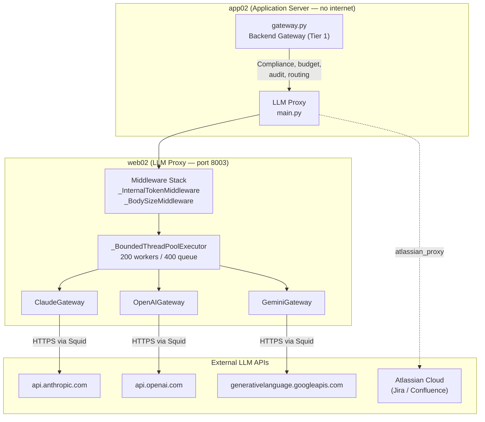
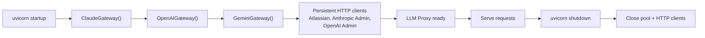
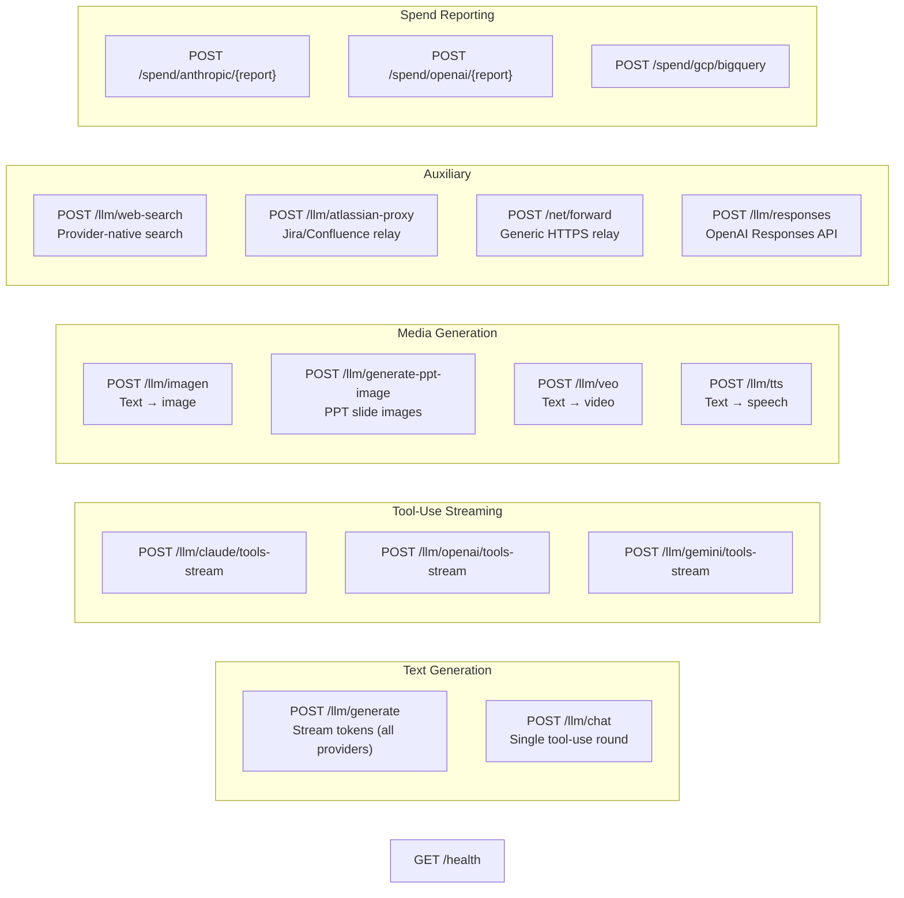
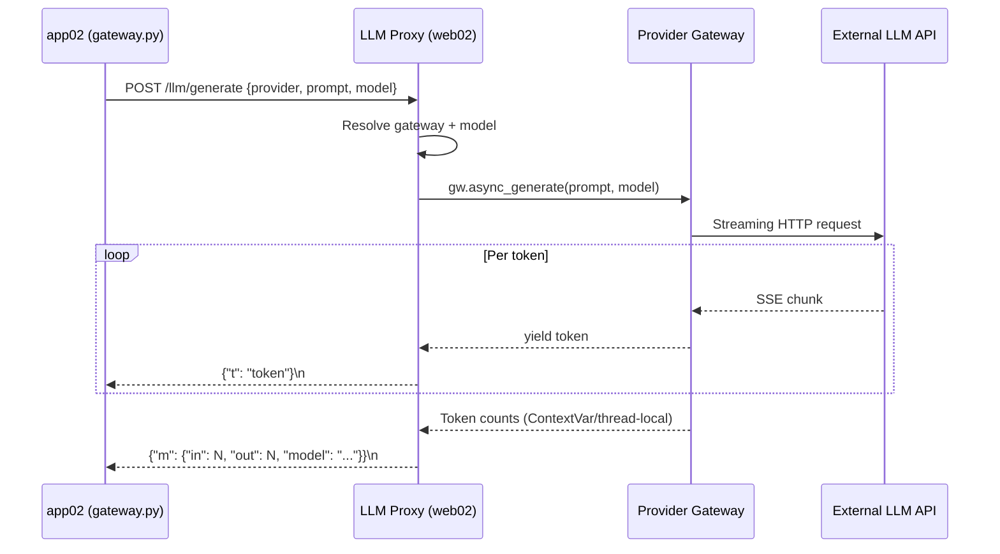
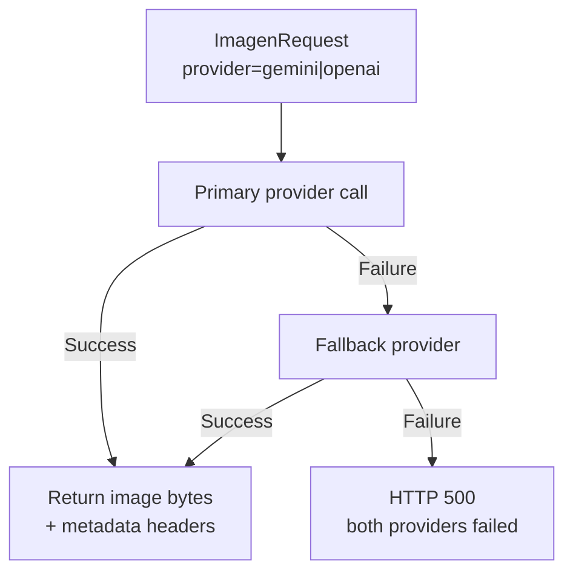
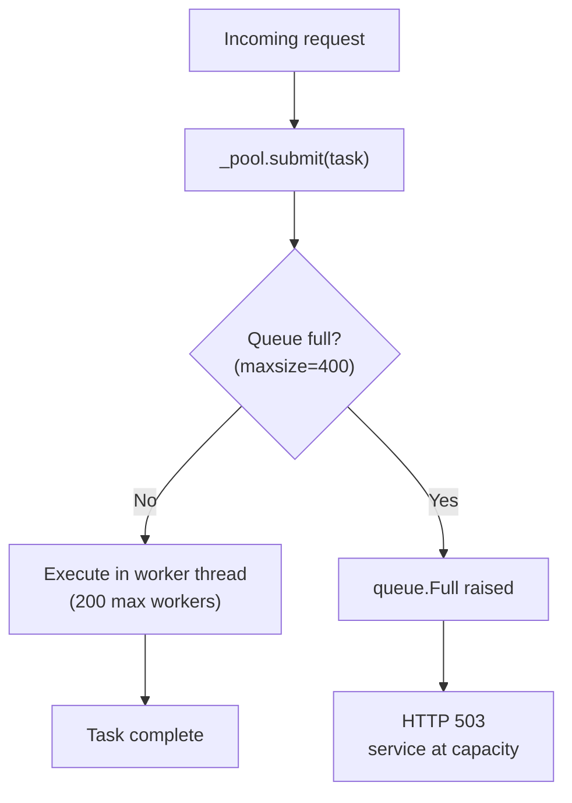
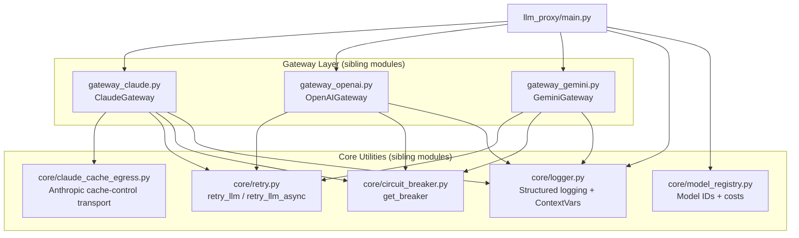
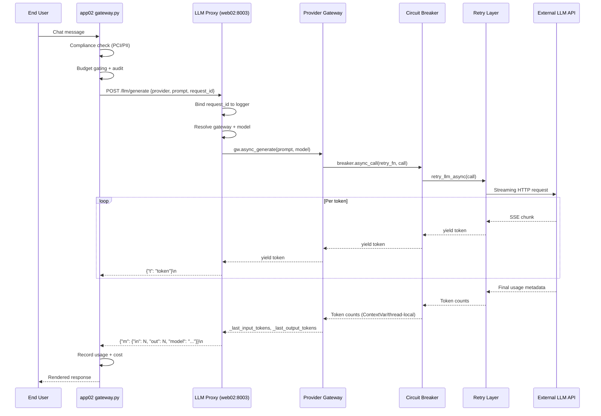

# LLM Proxy Service (`llm_proxy_main`)

> **File:** `services/llm_proxy/main.py` · **Port:** 8003 · **Deployment:** web02 (internet-egress server)

## 1. Purpose

The LLM Proxy is a standalone FastAPI service that runs on **web02** — the only server in the
platform with outbound internet access (via a Squid forward proxy). The application server
(**app02**) has no direct internet egress and therefore cannot reach external LLM provider APIs
(Anthropic, OpenAI, Google Gemini). Instead, app02 calls this proxy over the internal network,
and the proxy forwards each request to the appropriate cloud provider.

**Key design principles:**

| Principle | Detail |
|---|---|
| **No compliance logic** | PCI/PII detection and redaction are performed exclusively in the backend gateway layer (Tier 1) on app02 *before* the request reaches this proxy. The proxy forwards already-validated, already-redacted text verbatim. |
| **Internet LLMs only** | Only the three internet APIs (Anthropic, OpenAI, Gemini) are proxied. The in-house GPU local LLM is on the internal network and called directly by app02. |
| **Per-token streaming** | All text-generation endpoints stream NDJSON (`application/x-ndjson`) so tokens flush immediately across the app02↔web02 hop. |
| **Bounded thread pool** | A bounded `ThreadPoolExecutor` (200 workers, queue max 400) provides backpressure — the 401st submission raises `queue.Full`, converted to HTTP 503. |
| **Correlation IDs** | Every endpoint binds `request_id` and `chat_id` from the caller (JSON body or HTTP headers) into the structured logger so log lines correlate across hops. |

---

## 2. Architecture Overview

### 2.1 Lifespan & Gateway Initialization

The `_lifespan` async context manager eagerly loads all three gateway singletons at startup:

Each gateway is loaded independently — if one fails (e.g. missing API key), the others still
function. The `/health` endpoint reports which providers are available.

### 2.2 Middleware Stack

| Middleware | Purpose |
|---|---|
| `_InternalTokenMiddleware` | Validates `X-Internal-Token` pre-shared secret on sensitive endpoints. Health and docs paths are exempt. |
| `_BodySizeMiddleware` | Rejects request bodies exceeding `_MAX_BODY_BYTES` with HTTP 413. Logs incoming request size for every request. |

---

## 3. Core Endpoints

### 3.1 Endpoint Map

### 3.2 Text Generation — `POST /llm/generate`

**Request model:** `GenerateRequest`

Accepts three mutually-exclusive input modes:
- `prompt` (str) — flat-string prompt
- `messages` (list) — OpenAI-format multi-turn messages
- `content_blocks` (list) — structured blocks (Claude only)

**Response:** `application/x-ndjson` stream. Each line is one JSON object:

| Line type | Format | Meaning |
|---|---|---|
| Token | `{"t": "token text"}` | A streamed text token |
| Metadata | `{"m": {"in": N, "out": N, "model": "..."}}` | Final token counts + resolved model (last line) |
| Error | `{"error": "message"}` | Generation failed |

**Streaming architecture:** The `generate` endpoint uses a unified native-async streaming path.
All three gateways expose `async_generate()` which runs entirely on the uvicorn event loop —
no thread-pool, no `asyncio.Queue`, no blocking `_put()`. Each token is yielded the instant the
provider pushes it.

### 3.3 Single Tool-Use Round — `POST /llm/chat`

**Request model:** `ChatRequest`

Performs a single non-streaming tool-use round (called by app02's `proxy_tool_use` loop).
Accepts Anthropic-format messages and tools, then dispatches to the appropriate provider:

| Provider | Handler | Format Translation |
|---|---|---|
| `claude` | `_chat_claude` | Native Anthropic format (no translation) |
| `openai` | `_chat_openai` | `_anthropic_msgs_to_openai`, `_anthropic_tools_to_openai` |
| `gemini` | `_chat_gemini` | `_anthropic_msgs_to_gemini`, `_anthropic_tools_to_gemini` |

Returns a normalized dict with `stop_reason`, `tool_calls`, `text`, `assistant_message`,
`input_tokens`, `output_tokens`, and `model`.

### 3.4 Tool-Use Streaming Endpoints

Three parallel endpoints serve the IDE/Kilo Code agentic path, each streaming provider-native
tool-call events as NDJSON:

| Endpoint | Request Model | Provider | Key Behaviour |
|---|---|---|---|
| `POST /llm/claude/tools-stream` | `ClaudeToolsRequest` | Anthropic | Uses `AsyncAnthropic.messages.stream()`. Emits `tbs` (tool block start), `txt` (text delta), `tad` (tool arg delta), `stop` events. Captures cache token counts from `message_start`. |
| `POST /llm/openai/tools-stream` | `OpenAIToolsRequest` | OpenAI | Uses sync `chat.completions.create(stream=True)` in thread pool. Forwards raw `ChatCompletionChunk` JSON. Suppresses `reasoning_effort` when tools are present. |
| `POST /llm/gemini/tools-stream` | `GeminiToolsRequest` | Gemini | Uses `generate_content_stream` in thread pool. Translates OpenAI-format messages/tools to Gemini format. Emits OpenAI-format chunks for uniform handling. Disables thinking (`thinking_budget=0`) when tools are active. |

**Gemini tools-stream notable details:**
- Filters out `thought=True` parts (chain-of-thought) so they aren't mistaken for final answers.
- `finish_reason` is driven by the *last* emitted content kind (`fncall` → `tool_calls`, else `stop`).
- Emits a synthetic fallback message when Gemini returns zero visible content (all thoughts / safety filter).
- Carries `thought_signature` via a custom key for round-trip across turns.

### 3.5 Image Generation — `POST /llm/imagen`

**Request model:** `ImagenRequest`

Text → image generation with provider fallback:

- **Gemini path:** Uses `generate_content` with `response_modalities=["IMAGE"]` and `ImageConfig(aspect_ratio)`.
- **OpenAI path:** Tries `gpt-image-1` first, falls back to `dall-e-3` only if the model is not found on the account.
- Returns raw image bytes with metadata headers (`X-Imagen-Model`, `X-Imagen-Input-Tokens`, `X-Imagen-Output-Tokens`, `X-Cost-USD`, `X-Latency-Ms`).

### 3.6 PPT Image Generation — `POST /llm/generate-ppt-image`

**Request model:** `PptImageRequest`

Specialized text → image for PPTX slide backgrounds. Returns JSON with base64-encoded image
plus metadata footer (`model`, `provider`, `in_tok`, `out_tok`, `cost`, `latency`).
Primary: Gemini Imagen; Fallback: DALL-E 3.

### 3.7 Video Generation — `POST /llm/veo`

**Request model:** `VeoRequest`

Text → video via Google Veo 3.1 (Gemini provider only). Veo is a Long-Running Operation:
the proxy polls until done, then returns MP4 bytes. Duration is clamped server-side to 2–16 seconds.

### 3.8 Text-to-Speech — `POST /llm/tts`

**Request model:** `_TtsRequest`

Calls OpenAI TTS API directly (respecting `HTTPS_PROXY` for Squid). Returns `audio/mpeg`.
Text is truncated to 2000 characters.

### 3.9 Web Search — `POST /llm/web-search`

**Request model:** `WebSearchRequest`

The **only** endpoint that performs web searches. Runs exclusively on web02 after governance,
budget gating, and audit checks have passed on app02. Dispatches to the requesting model's
provider with its built-in search tool:

| Provider | Search Tool | API |
|---|---|---|
| OpenAI | `web_search_preview` | Responses API (`responses.create`) |
| Claude | `web_search_20250305` | Messages API |
| Gemini | `google_search` grounding | `GenerateContent` |

### 3.10 Atlassian Proxy — `POST /llm/atlassian-proxy`

**Request model:** `AtlassianProxyRequest`

Forwards Jira or Confluence API calls from app02 to Atlassian Cloud. Requires per-user
credentials (email + token) — no service-account fallback. Returns the upstream response
verbatim.

### 3.11 Net Forward — `POST /net/forward`

**Request model:** `NetForwardRequest`

Generic HTTPS relay for app-server callers with no egress. Validates the target host against
an allowlist (`_NET_FORWARD_ALLOW`). Supports form-encoded, JSON, and base64 raw binary bodies.
Returns `{status, content_type, text}`.

### 3.12 OpenAI Responses API — `POST /llm/responses`

**Request model:** `ResponsesRequest`

Wraps OpenAI's Responses API (`responses.create` / `responses.stream`). Used for models like
gpt-5.4, o4-mini-deep-research, o3-deep-research. Requires `openai>=1.50.0` on web02.

### 3.13 Spend Reporting Endpoints

Three endpoints proxy admin/cost APIs for LLM spend tracking:

| Endpoint | Request Model | Upstream | Notes |
|---|---|---|---|
| `POST /spend/anthropic/{report}` | `AnthropicSpendRequest` | Anthropic Admin API | Retries on 429 with exponential backoff (max 5). Array params use `name[]` form. |
| `POST /spend/openai/{report}` | `OpenAISpendRequest` | OpenAI Organization API | Retries on 429 (max 5, 2s delay). |
| `POST /spend/gcp/bigquery` | `GcpBigQueryRequest` | GCP BigQuery Billing Export | Runs parameterized SQL in thread pool. Caller supplies only date window; SQL/project/table are env-configured on web02. |

### 3.14 Health Check — `GET /health`

Returns provider availability, thread-pool stats (active/pending/max_workers/queue_max/saturated),
HTTPS proxy status, and a note that local LLM is not proxied. The `saturated` flag warns when
active threads exceed 80% of max_workers.

---

## 4. Request/Response Models

```mermaid
classDiagram
    class GenerateRequest {
        +str provider
        +Optional~str~ prompt
        +Optional~list~ messages
        +Optional~list~ content_blocks
        +Optional~str~ model
        +Optional~str~ request_id
        +Optional~str~ chat_id
        +bool compliance_precleared
        +Optional~list~ compliance_findings
    }

    class ChatRequest {
        +str provider
        +Optional~str~ model
        +str system
        +list messages
        +Optional~list~ tools
        +int max_tokens
        +Optional~str~ request_id
        +Optional~str~ chat_id
    }

    class ClaudeToolsRequest {
        +list messages
        +list tools
        +str system
        +str model
        +int max_tokens
        +Optional~str~ request_id
        +Optional~str~ chat_id
    }

    class OpenAIToolsRequest {
        +list messages
        +Optional~list~ tools
        +Optional~object~ tool_choice
        +Optional~str~ model
        +int max_tokens
        +Optional~dict~ stream_options
    }

    class GeminiToolsRequest {
        +list messages
        +Optional~list~ tools
        +Optional~object~ tool_choice
        +Optional~str~ model
        +int max_tokens
    }

    class ImagenRequest {
        +str provider
        +str prompt
        +str aspect_ratio
        +int number_of_images
        +str style_suffix
    }

    class VeoRequest {
        +str prompt
        +str model
        +str aspect_ratio
        +int duration_secs
    }

    class WebSearchRequest {
        +str tool_name
        +dict inputs
        +Optional~str~ model
        +Optional~str~ request_id
        +Optional~str~ user_id
    }

    class AtlassianProxyRequest {
        +str service
        +str method
        +str path
        +Optional~dict~ body
        +Optional~str~ email
        +Optional~str~ token
    }

    class NetForwardRequest {
        +str method
        +str url
        +Optional~dict~ headers
        +Optional~dict~ params
        +Optional~dict~ data
        +Optional~dict~ json_body
        +Optional~str~ content_b64
        +Optional~float~ timeout
    }
```

---

## 5. Thread Pool & Backpressure

The `_BoundedThreadPoolExecutor` replaces `ThreadPoolExecutor`'s default unbounded
`SimpleQueue` with a bounded `queue.Queue(maxsize=400)`. This prevents unbounded memory
growth under traffic spikes — the 401st submission raises `queue.Full` immediately, which
is caught and converted to HTTP 503 so app02 can surface a clean "service busy" error.

**Pool stats** (active/pending/max_workers) are exposed via `/health` and updated atomically
under a lock.

---

## 6. Dependency Graph

### 6.1 Gateway Modules

| Module | Class | Key Methods |
|---|---|---|
| [llm_proxy_gateway_claude](llm_proxy_gateway_claude.md) | `ClaudeGateway` | `generate()` (async gen), `async_generate` (alias), `generate_with_tools()` |
| [llm_proxy_gateway_openai](llm_proxy_gateway_openai.md) | `OpenAIGateway` | `generate()` (sync gen), `async_generate()`, `responses_create()`, `responses_stream()`, `generate_image_dalle()` |
| [llm_proxy_gateway_gemini](llm_proxy_gateway_gemini.md) | `GeminiGateway` | `generate()` (sync gen), `async_generate()`, `generate_imagen()`, `generate_veo_video()` |

### 6.2 Core Utility Modules

| Module | Purpose |
|---|---|
| [llm_proxy_core_logger](llm_proxy_core_logger.md) | Structured logger with `set_request_id`, `set_chat_context`, `bind_context` for cross-hop correlation |
| [llm_proxy_core_retry](llm_proxy_core_retry.md) | `retry_llm` / `retry_llm_async` — exponential backoff on transient errors (rate-limit, timeout, connection) |
| [llm_proxy_core_circuit_breaker](llm_proxy_core_circuit_breaker.md) | `get_breaker(name)` — per-provider circuit breaker (5 failures → open for 60s) |
| [llm_proxy_core_claude_cache](llm_proxy_core_claude_cache.md) | `build_cached_async_client` — httpx transport that injects Anthropic `cache_control` markers at egress |

---

## 7. Data Flow: Full Request Lifecycle

---

## 8. Token Count Capture Strategy

Token counts are captured differently per provider due to SDK architecture:

| Provider | Mechanism | Scope | Read Location |
|---|---|---|---|
| **Claude** | `ContextVar` (`_cv_input_tokens`, `_cv_output_tokens`) | Per-asyncio-context | Inside `asyncio.run()` for sync path; on event loop for async path |
| **OpenAI** | Thread-local (`_tl.openai_in`, `_tl.openai_out`) | Per-thread | Same thread that ran the SDK call |
| **Gemini** | Thread-local (`_tl.gemini_in`, `_tl.gemini_out`) | Per-thread | Same thread that ran the SDK call |

The `_run_sync_generator` helper (used by the legacy thread-pool path) captures Claude's
ContextVar-based token counts *inside* the `asyncio.run()` coroutine, because reads outside
that context always return 0 (ContextVars don't propagate back to the calling thread).

---

## 9. Cache Effectiveness Logging

All gateways log cache effectiveness via `_log_cache_effectiveness()`:

| Provider | Cache Metric | Source |
|---|---|---|
| Claude | `cache_read_input_tokens`, `cache_creation_input_tokens` | `message_start` event (streaming) or `response.usage` (non-streaming) |
| OpenAI | `prompt_tokens_details.cached_tokens` | Final usage chunk |
| Gemini | `cached_content_token_count` | `usage_metadata` on final chunk |

Claude's cache-control markers are injected by the egress transport
([llm_proxy_core_claude_cache](llm_proxy_core_claude_cache.md)), not in payload construction.

---

## 10. Error Handling

| Scenario | HTTP Status | Behaviour |
|---|---|---|
| Gateway not loaded (missing API key) | 503 | `"{provider} gateway not available"` |
| Thread pool queue full | 503 | `"LLM proxy is at capacity — too many concurrent requests"` |
| Request body too large | 413 | `"Request body too large"` |
| Provider generation error | 200 (stream) | `{"error": "message"}` line in NDJSON stream |
| Provider generation error (non-stream) | 500 | `HTTPException(500, str(e))` |
| Atlassian proxy timeout | 504 | `"Atlassian {service} request timed out"` |
| Net forward host not allowlisted | 403 | `"host not allowed for /net/forward"` |
| Both image providers failed | 500 | `{"error": "image_generation_failed", "primary": ..., "fallback": ...}` |
| Spend API 429 | Retried | Exponential backoff, then upstream status returned |

---

## 11. Environment Variables

| Variable | Purpose |
|---|---|
| `ANTHROPIC_API_KEY` | Claude API authentication |
| `OPENAI_API_KEY` | OpenAI API authentication (chat, images, TTS) |
| `GEMINI_API_KEY` | Gemini API authentication |
| `ANTHROPIC_ADMIN_API_KEY` | Anthropic admin spend API |
| `OPENAI_ADMIN_API_KEY` | OpenAI admin spend API |
| `LLM_PROXY_TOKEN` | Internal pre-shared secret for middleware auth |
| `HTTPS_PROXY` / `https_proxy` | Squid forward proxy URL (set on web02 for outbound) |
| `LLM_TIMEOUT_SEC` | Per-call timeout (default 600s) |
| `JIRA_URL` / `CONFLUENCE_URL` | Atlassian service base URLs |
| `GCP_BILLING_BQ_PROJECT` / `GCP_BILLING_BQ_TABLE` | BigQuery billing export config |
| `OPENAI_REASONING_EFFORT` | Default reasoning effort for GPT-5 models |
| `OPENAI_MAX_COMPLETION_TOKENS` | Max completion tokens for OpenAI |
| `SSL_CERT_FILE` / `REQUESTS_CA_BUNDLE` | Custom CA bundle for TLS |

---

## 12. Related Documentation

| Module | Relationship |
|---|---|
| [llm_proxy_gateway_claude](llm_proxy_gateway_claude.md) | Claude (Anthropic) gateway — async streaming, tool-use, cache-control |
| [llm_proxy_gateway_openai](llm_proxy_gateway_openai.md) | OpenAI gateway — sync/async streaming, Responses API, DALL-E |
| [llm_proxy_gateway_gemini](llm_proxy_gateway_gemini.md) | Gemini gateway — streaming, Imagen, Veo video generation |
| [llm_proxy_core_logger](llm_proxy_core_logger.md) | Structured logging with request/chat correlation ContextVars |
| [llm_proxy_core_retry](llm_proxy_core_retry.md) | Exponential-backoff retry for transient LLM errors |
| [llm_proxy_core_circuit_breaker](llm_proxy_core_circuit_breaker.md) | Per-provider circuit breaker pattern |
| [llm_proxy_core_claude_cache](llm_proxy_core_claude_cache.md) | Anthropic prompt cache-control egress transport |
| [gateway](../core/gateway.md) | Backend gateway (Tier 1) on app02 — calls this proxy for internet LLM access |
