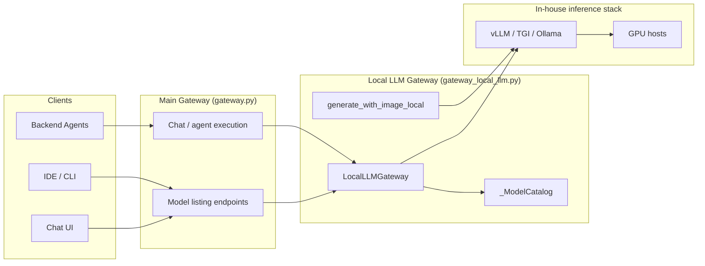
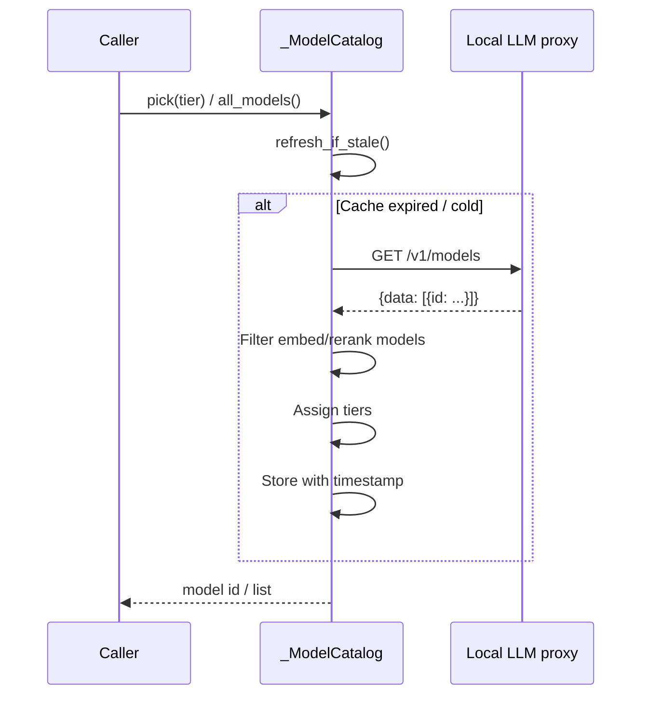
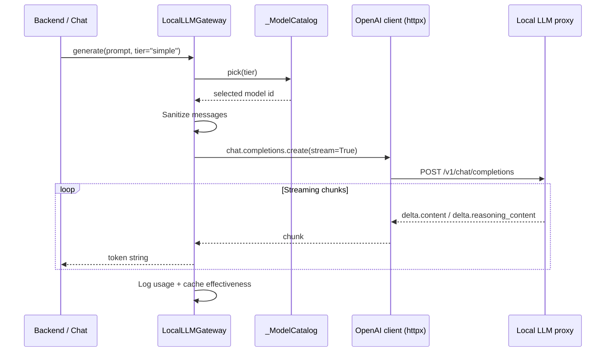
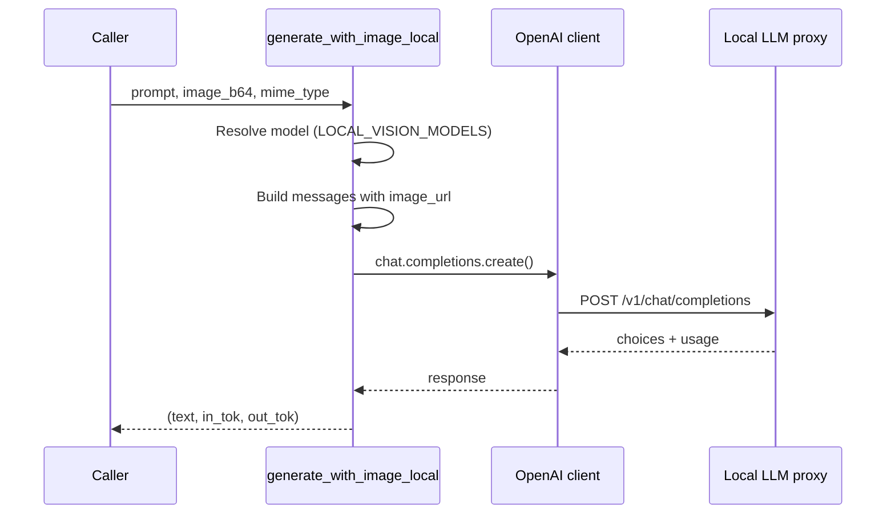
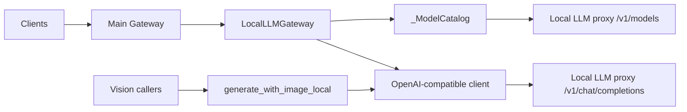

# Local LLM Gateway

The **Local LLM Gateway** is an OpenAI-compatible proxy layer that fronts one or more in-house hosted large language models (e.g., vLLM, Ollama, TGI) behind a single URL. It discovers models dynamically, classifies them by capability tier, and exposes a streaming generation interface identical to the cloud-provider gateways (`ClaudeGateway`, `OpenAIGateway`, `GeminiGateway`).

This module lets the platform route traffic to on-premise or self-hosted models, mark them as zero-cost in billing, and surface them in the Chat/IDE model selectors alongside paid third-party providers.

---

## 1. Purpose & Core Functionality

| Concern | What the gateway does |
|--------|----------------------|
| **Model discovery** | Fetches `/v1/models` from the configured local proxy and caches the list with a TTL. |
| **Tier classification** | Assigns discovered models to `simple`, `medium`, or `complex` tiers using explicit env vars or a parameter-count heuristic. |
| **Streaming generation** | Provides `LocalLLMGateway.generate(...)` which yields tokens from the selected local model. |
| **Vision support** | Provides `generate_with_image_local(...)` for vision-capable in-house models via the OpenAI chat-completions format. |
| **Cost tracking** | Reports token usage and KV-cache effectiveness; local models are always billed at `$0`. |
| **UI integration** | Filters out embedding/reranking models and exposes the rest to the Chat/IDE model picker. |

The gateway is intentionally thin: it does not implement its own inference engine. It relies on an external OpenAI-compatible endpoint (typically vLLM, LiteLLM, or Ollama) running on a GPU host.

---

## 2. Architecture

### 2.1 High-level placement



### 2.2 Component diagram

```mermaid
flowchart TB
    subgraph Config["Environment configuration"]
        C1[LOCAL_LLM_BASE_URL]
        C2[LOCAL_LLM_API_KEY]
        C3[LOCAL_SIMPLE_MODELS<br/>LOCAL_MEDIUM_MODELS<br/>LOCAL_COMPLEX_MODELS]
        C4[LOCAL_VISION_MODELS]
        C5[LOCAL_MODEL_REFRESH_SECS]
        C6[LOCAL_HIDDEN_MODELS]
    end

    subgraph Catalog["_ModelCatalog"]
        F1[Thread-safe TTL cache]
        F2[Fetch /v1/models]
        F3[Tier assignment]
        F4[pick(tier)]
        F5[all_models()]
    end

    subgraph GatewayClass["LocalLLMGateway"]
        G1[generate(prompt, model, tier)]
        G2[list_models()]
        G3[models_by_tier()]
        G4[Token counters]
    end

    subgraph ClientPool["Connection pool"]
        P1[_get_openai_client()]
        P2[Persistent httpx.Client]
    end

    subgraph Vision["Vision helper"]
        H1[generate_with_image_local()]
    end

    C1 --> P1
    C2 --> P1
    C3 --> F3
    C4 --> H1
    C5 --> F1
    C6 --> F2
    F2 --> F3
    F3 --> F4
    F3 --> F5
    F4 --> G1
    G1 --> P1
    P1 --> P2
    H1 --> P1
```

### 2.3 Key components

| Component | File | Responsibility |
|-----------|------|----------------|
| `_ModelCatalog` | `gateway_local_llm.py` | Discovers, caches, and classifies local models by tier. |
| `LocalLLMGateway` | `gateway_local_llm.py` | Streaming text generation facade with OpenAI-compatible semantics. |
| `generate_with_image_local` | `gateway_local_llm.py` | One-shot vision call for local vision models. |
| `is_local_model` | `gateway_local_llm.py` | Non-blocking check to decide whether a model id belongs to the local catalog. |
| `get_local_gateway` | `gateway_local_llm.py` | Thread-safe singleton accessor. |

---

## 3. Model Discovery & Tiering

### 3.1 Discovery flow



### 3.2 Tier assignment priority

1. **Explicit env vars** — `LOCAL_SIMPLE_MODELS`, `LOCAL_MEDIUM_MODELS`, `LOCAL_COMPLEX_MODELS` (comma-separated, first = preferred). Only models actually returned by `/v1/models` are used.
2. **Size heuristic** — parameter count parsed from the model name:
   - `≥ 30B` → `complex`
   - `10B–30B` → `medium`
   - `< 10B` → `simple`
   - no hint → `medium`
3. **Single-model fallback** — if only one model is discovered, it is used for all tiers.

### 3.3 Hidden models

Embedding and reranking models are hidden from the UI by default. The built-in patterns are:

```text
embed, nomic, bge-, minilm, e5-, gte-, rerank, all-minilm, sentence-transformers
```

Admins can extend the list via `LOCAL_HIDDEN_MODELS`.

---

## 4. Data Flow

### 4.1 Text generation request



### 4.2 Vision request



---

## 5. Configuration

| Variable | Required | Default | Purpose |
|----------|----------|---------|---------|
| `LOCAL_LLM_BASE_URL` | Yes¹ | — | Base URL of the in-house OpenAI-compatible proxy. |
| `LOCAL_LLM_API_KEY` | Yes¹ | `sk-local` | Bearer token for the proxy. |
| `LOCAL_SIMPLE_MODELS` | No | — | Comma-separated preferred simple models. |
| `LOCAL_MEDIUM_MODELS` | No | — | Comma-separated preferred medium models. |
| `LOCAL_COMPLEX_MODELS` | No | — | Comma-separated preferred complex models. |
| `LOCAL_VISION_MODELS` | No | — | Comma-separated local vision models. |
| `LOCAL_MODEL_REFRESH_SECS` | No | `300` | TTL for the cached model list. |
| `LOCAL_HIDDEN_MODELS` | No | — | Extra substrings to hide from the UI. |

¹ Falls back to legacy names `LITELLM_BASE_URL` / `LITELLM_API_KEY` for backward compatibility.

---

## 6. Dependencies

### 6.1 Internal modules

| Dependency | Role in this module |
|------------|---------------------|
| `core.logger` | Structured logging and request-id propagation. |
| `core.model_registry` | Cost registry (`MODEL_COST_PER_1M`), generic local sentinel (`LOCAL_LLM_MODEL_NAME`), and vision model list (`LOCAL_VISION_MODELS`). |
| `core.prompt_sanitizer` | Sanitizes message content before sending to the local proxy. |
| `core.ckms.bootstrap` | Decrypts `LOCAL_LLM_API_KEY` / `LITELLM_API_KEY` at import time. |
| [`gateway.py`](../core/gateway.md) | Exposes `/local-models` and `/all-models` endpoints that call this gateway. |

### 6.2 External libraries

- `openai` — OpenAI SDK used as the OpenAI-compatible client.
- `httpx` — Persistent HTTP connection pool.

---

## 7. Integration with the wider system

### 7.1 Model selection UI

The main gateway's `get_all_models` and `get_local_models` endpoints consume `LocalLLMGateway.list_models()` and `models_by_tier()` to populate the Chat/IDE model picker. Local models are stamped with `"tier": "free"` so the UI can distinguish them from paid cloud providers.

See [`gateway.md`](../core/gateway.md) for the full model-listing logic.

### 7.2 Routing

`is_local_model(model_id)` is used by the model router to decide whether a requested model id should be treated as an in-house model. It strips the optional `local:` prefix and checks the cached catalog without blocking the request path.

See `models/model_router.md` for routing policy details.

### 7.3 LLM proxy service

The standalone `llm_proxy` service (`services/llm_proxy/main.py`) provides its own OpenAI/Claude/Gemini gateways for direct proxy use. The `LocalLLMGateway` in this module is the backend-gateway counterpart used by the main application gateway and agents.

See [`llm_proxy.md`](llm_proxy.md) for the external proxy architecture.

---

## 8. Operational considerations

- **Connection pooling**: A single `httpx.Client` is reused per process to avoid TLS/TCP handshake overhead on every request.
- **Non-blocking discovery**: The first catalog fetch happens in a background thread so gateway startup is not delayed if the local proxy is slow.
- **Cold-cache behavior**: `is_local_model()` returns `False` when the catalog is cold and triggers a background refresh; callers fall back to static heuristics until the cache warms.
- **Reasoning models**: The streaming parser handles both `delta.content` and `delta.reasoning_content`, emitting reasoning content as a fallback when no regular content is produced.
- **Cache effectiveness**: KV-cache hits reported by the proxy are logged via `_log_cache_effectiveness`; savings are always `$0` because local inference has no cloud billing cost.

---

## 9. Mermaid summary


