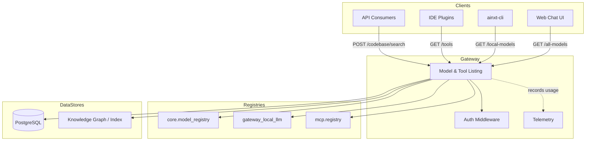
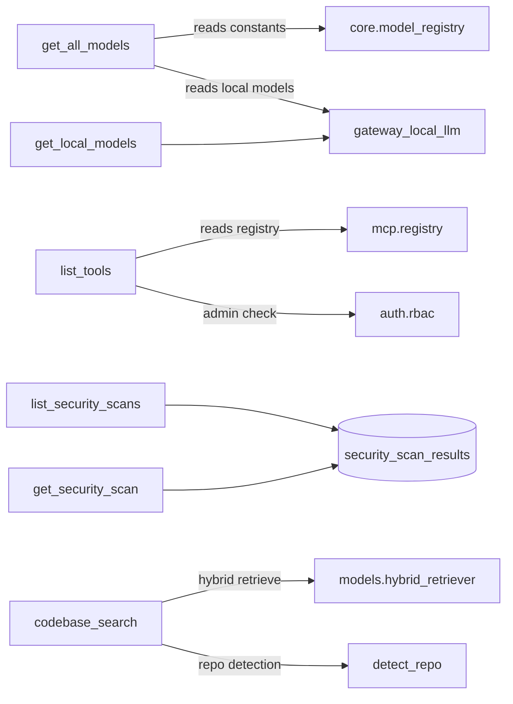
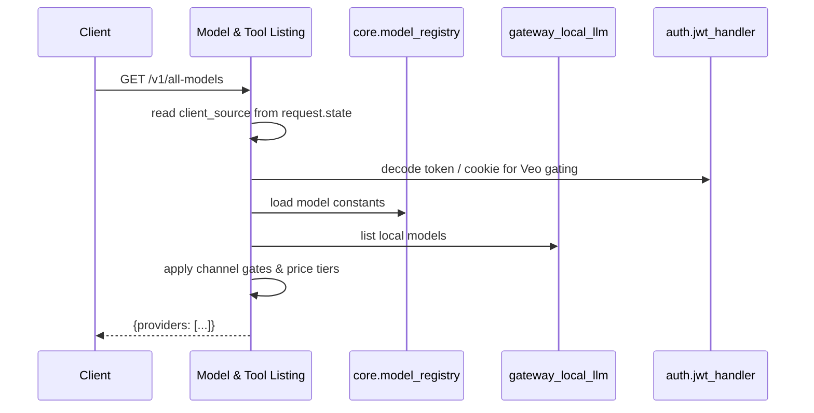
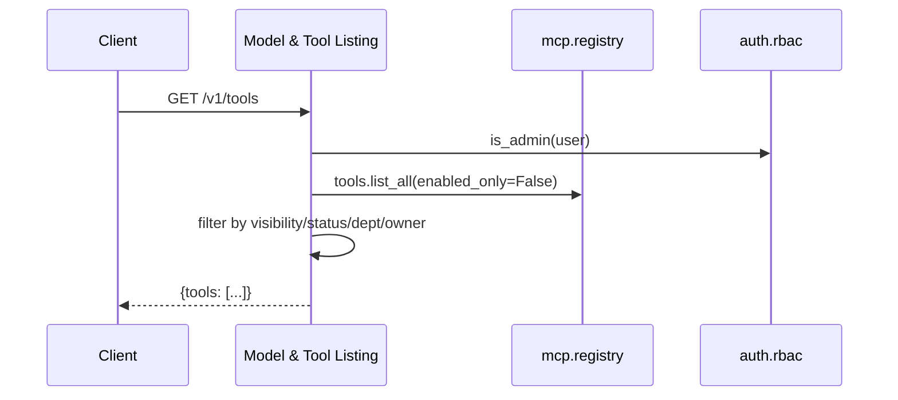
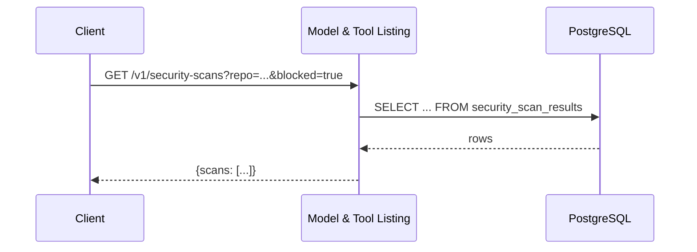
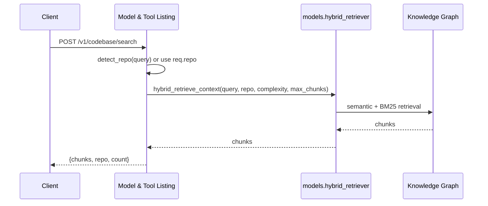

# Model and Tool Listing Module

## Brief Introduction

The **Model and Tool Listing** module is a read-heavy gateway subsystem that exposes discovery endpoints for clients (web Chat UI, CLI, IDE plugins, and API consumers). It aggregates information about available LLM models, registered tools, security scan history, and indexed codebase chunks, presenting a unified catalog that downstream components use for model selection, tool invocation, audit review, and semantic code search.

This module does not execute agents or workflows itself; its responsibility is **discovery, filtering, and lightweight retrieval**. It sits inside the [gateway](../core/gateway.md) service and reuses authentication, telemetry, and registry infrastructure defined elsewhere.

---

## Core Functionality

| Capability | Purpose | Primary Endpoint |
|------------|---------|------------------|
| **Model discovery** | Return all usable LLM models grouped by provider, with channel-specific gating and price-tier metadata. | `GET /v1/all-models` |
| **Local model discovery** | Return models hosted by the in-house Local LLM proxy. | `GET /v1/local-models` |
| **Tool catalog** | List registered tools from the MCP registry, filtered by visibility, status, department, and ownership. | `GET /v1/tools` |
| **Security scan listing** | Query historical security scan summaries with repo/PR/blocking filters. | `GET /v1/security-scans` |
| **Security scan detail** | Retrieve full findings for a single scan. | `GET /v1/security-scans/{scan_id}` |
| **Codebase semantic search** | Expose hybrid (semantic + BM25) search over indexed repositories as a first-class tool. | `POST /v1/codebase/search` |

---

## Architecture

### High-level Placement

### Component Responsibilities

---

## Component Reference

### `get_all_models`

Returns the comprehensive model catalog used by the Chat UI, CLI, and IDE model selectors.

**Key behaviors:**
- Groups models by provider: `Auto`, `Anthropic (Claude)`, `OpenAI`, `Google (Gemini)`, and `Local (In-house)`.
- Uses short aliases (`id`) for request hints and full model IDs (`modelId`) for governance matching.
- Applies channel-specific gates:
  - **Opus 4.8 / Opus 5**: visible only to `cli`, `ide-vscode`, `ide-jetbrains`, and `api` clients.
  - **Veo 3.1**: visible only to the web Chat UI (`platform`) and only for allow-listed users.
  - **Sonnet 5**: available on all channels when globally enabled.
- Stamps each model with a price tier: `paid` for third-party vendors, `free` for local/in-house, and `null` for `Auto`.

**Dependencies:**
- [core.model_registry](../core/shared_core.md#model_routing) for canonical model constants.
- [gateway_local_llm](local_llm_gateway.md) for in-house hosted models.
- [ClientSourceMiddleware](../core/gateway.md) for `request.state.client_source`.
- [auth.jwt_handler](../auth/authentication.md) for Veo user claim resolution.

### `get_local_models`

Returns the list of models exposed by the Local LLM proxy, organized by tier, plus an `available` flag.

**Dependencies:**
- [gateway_local_llm](local_llm_gateway.md)

### `list_tools`

Lists tools from the MCP registry with authorization-aware filtering.

**Filtering rules:**
- Admins see all tools.
- Non-admins see:
  - Public tools with `APPROVED` or `PRODUCTION` status.
  - Private tools belonging to the caller's department.
  - Tools created by the caller.
  - Legacy tools without a visibility field.

**Dependencies:**
- [mcp.registry](../mcp/mcp_system.md)
- [auth.rbac](../auth/authentication.md)

### `list_security_scans`

Queries `security_scan_results` with optional filters for repo, PR number, and blocked status. Returns a paginated summary of scan metadata.

**Dependencies:**
- [db.database](../storage/database.md)

### `get_security_scan`

Retrieves a single scan record including the full `findings_json` payload.

**Dependencies:**
- [db.database](../storage/database.md)

### `codebase_search`

Performs semantic + BM25 search over indexed codebases. Accepts a query, optional repo scope, chunk limit, and complexity hint. If no repo is provided, the gateway attempts to detect one from the query.

**Request model:** `_CodebaseSearchReq`

| Field | Type | Default | Description |
|-------|------|---------|-------------|
| `query` | `str` | required | Search query. |
| `repo` | `Optional[str]` | `None` | Repository scope (`owner/name`). |
| `max_chunks` | `int` | `6` | Maximum chunks to return (clamped to 1–20). |
| `complexity` | `Optional[str]` | `"medium"` | Context complexity hint (`simple`, `medium`, `complex`). |

**Dependencies:**
- [models.hybrid_retriever](../core/shared_core.md#model_routing)

---

## Data Flows

### Model Catalog Request

### Tool Catalog Request

### Security Scan Query

### Codebase Search

---

## Security and Governance

- All endpoints except `/v1/all-models` and `/v1/local-models` require authentication via `_require_auth`.
- `/v1/all-models` performs inline token decoding only for Veo gating; it does not enforce a full auth dependency so unauthenticated clients can still retrieve the model catalog.
- Tool visibility is enforced at the gateway layer so private or non-production tools are never leaked to unauthorized callers.
- Security scan endpoints require a valid authenticated caller; additional role checks are delegated to the auth middleware.

---

## Integration Points

| External System | Module | Usage |
|-----------------|--------|-------|
| LLM model registry | [core.model_registry](../core/shared_core.md#model_routing) | Canonical model IDs and display labels. |
| Local LLM proxy | [gateway_local_llm](local_llm_gateway.md) | In-house model discovery. |
| MCP tool registry | [mcp.registry](../mcp/mcp_system.md) | Tool catalog source. |
| Hybrid retriever | [models.hybrid_retriever](../core/shared_core.md#model_routing) | Codebase semantic search. |
| PostgreSQL | [db.database](../storage/database.md) | Security scan storage. |
| Auth / RBAC | [auth.rbac](../auth/authentication.md), [auth.jwt_handler](../auth/authentication.md) | Admin checks and claim resolution. |
| Telemetry | [core.telemetry](../core/shared_core.md#core_infrastructure) | Usage and latency metrics. |

---

## Error Handling

| Scenario | Behavior |
|----------|----------|
| Local LLM proxy unavailable | `get_local_models` returns empty list with `available: false`; `get_all_models` silently omits the Local provider. |
| Repo not detected in codebase search | Returns empty `chunks` with a note instructing the caller to pass `repo`. |
| Security scan not found | Returns HTTP 404. |
| Hybrid retriever failure | Returns HTTP 500 with the exception message. |

---

## Related Documentation

- [gateway](../core/gateway.md) — Parent service and routing context.
- [local_llm_gateway](local_llm_gateway.md) — In-house model hosting.
- [mcp_system](../mcp/mcp_system.md) — Tool registry and MCP infrastructure.
- [shared_core model_routing](../core/shared_core.md#model_routing) — Model registry and hybrid retriever.
- [database](../storage/database.md) — PostgreSQL schema and session management.
- [authentication](../auth/authentication.md) — RBAC and JWT handling.
