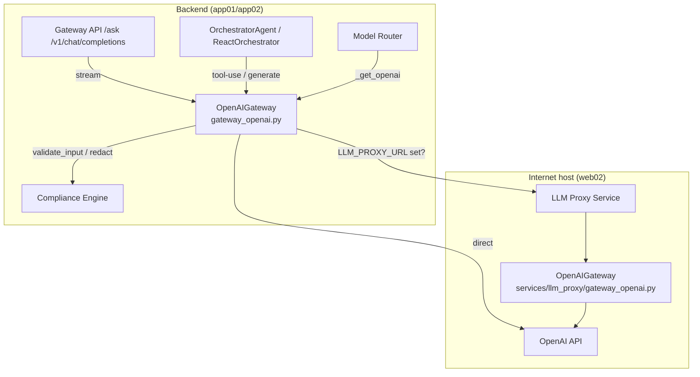
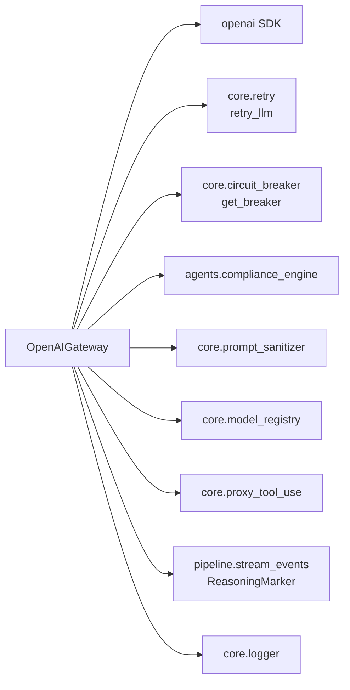
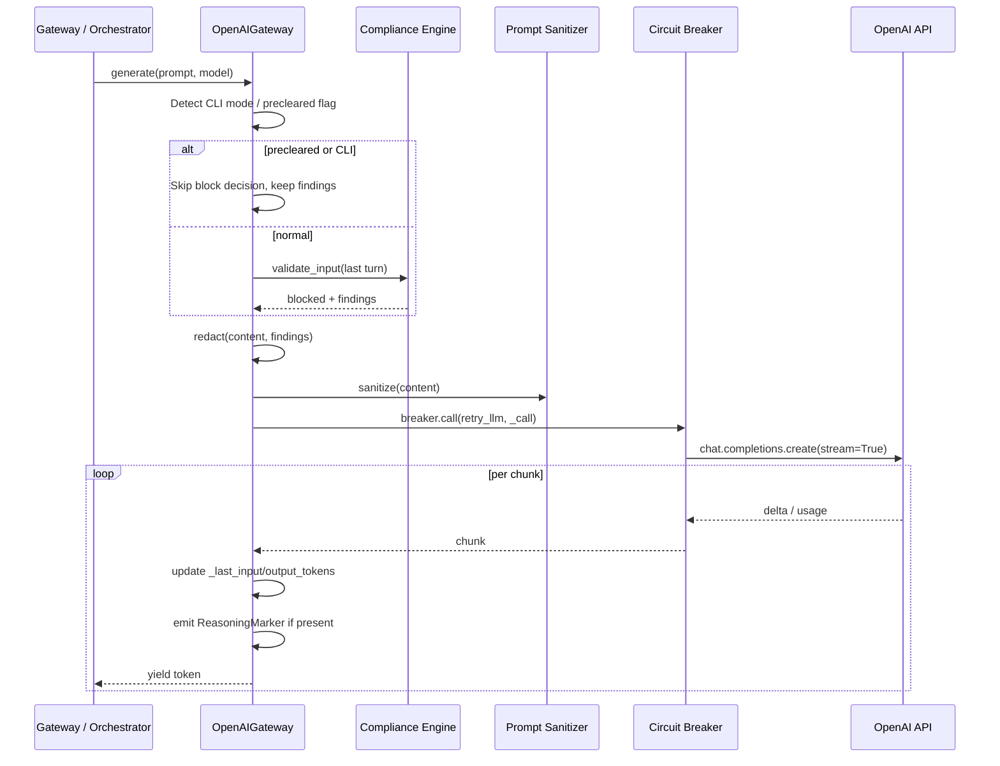
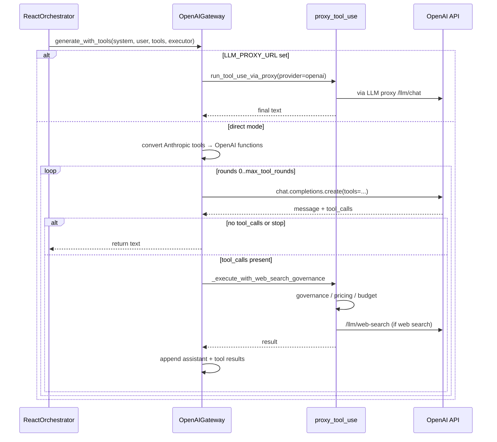

# openai_gateway

The `openai_gateway` module is the production OpenAI provider adapter for the AiNxt platform. It exposes a unified `OpenAIGateway` class that streams chat completions, runs multi-round tool-use loops, generates images via DALL-E, handles vision input, and supports the OpenAI Responses API. The module is designed for RBI/NPCI production constraints: it enforces PCI/DSS input compliance, tracks real token usage, logs prompt-cache effectiveness, and integrates with the platform-wide circuit breaker and retry layers.

Two physical copies of the gateway exist:

* `gateway_openai.py` — the **backend gateway** used by `gateway.py` and internal orchestrators. This copy performs compliance validation/redaction and can run in direct mode or proxy mode.
* `services/llm_proxy/gateway_openai.py` — the **LLM proxy service** running on the internet-facing host (`web02`). This copy assumes upstream compliance has already been applied and focuses on high-throughput proxying, async streaming, and the Responses API.

Both implementations share the same `OpenAIGateway` public interface so callers can swap environments without changing call sites.

---

## Architecture



The backend gateway sits behind the FastAPI application (`gateway.py`). When `LLM_PROXY_URL` is configured, tool-use and chat requests are forwarded to the LLM proxy service; otherwise the backend gateway calls OpenAI directly. The model router (`models/model_router.py`) selects the OpenAI tier for medium-complexity prompts and returns an `OpenAIGateway` instance.

---

## Core Components

### `OpenAIGateway`

The single public class in this module. It wraps the official `openai.OpenAI` client and exposes:

| Method | Purpose |
|--------|---------|
| `generate()` | Stream text from `chat.completions.create` with compliance, retry, and circuit breaker. |
| `generate_with_model()` | Same as `generate()` but rejects models in the `BLOCKED_MODELS` list. |
| `generate_with_tools()` | Non-streaming multi-round function-calling loop (OpenAI-compatible). |
| `generate_image()` / `generate_image_dalle()` | Text-to-image via DALL-E 3. |
| `generate_with_image_openai()` | Single-image vision call (direct/dev mode only). |
| `responses_create()` / `responses_stream()` | OpenAI Responses API for reasoning/deep-research models. |
| `async_generate()` | Async streaming generator used by the LLM proxy. |

The gateway also records the last call's token counts in `_last_input_tokens` and `_last_output_tokens`, which the model router reads for cost accounting.

---

## Dependencies



* **[core.retry](../core/core_infrastructure.md)** — exponential-backoff retry for transient OpenAI errors.
* **[core.circuit_breaker](../core/core_infrastructure.md)** — named `openai` circuit breaker prevents cascading failures.
* **[agents.compliance_engine](../agents/agent_system.md)** — validates input for PCI/PII/secrets and supplies findings for redaction.
* **[core.prompt_sanitizer](../core/core_infrastructure.md)** — strips control characters and normalises line endings before sending to OpenAI.
* **[core.model_registry](model_routing.md)** — provides `OPENAI_PRIMARY_MODEL`, `BLOCKED_MODELS`, and `MODEL_COST_PER_1M`.
* **[core.proxy_tool_use](../core/shared_core.md)** — governs web-search tools, budget checks, and proxy forwarding.
* **[pipeline.stream_events](../core/shared_core.md)** — emits `ReasoningMarker` deltas when the model exposes reasoning text.
* **[core.logger](../core/core_infrastructure.md)** — structured request-scoped logging.

---

## Data Flow

### Text Generation Flow



The gateway only validates the **last user turn** by default, not the full flattened history. This prevents stale prior-turn PII from blocking benign new prompts. When `precleared=True` (used by `/ask` after the gateway's own compliance gate), the block decision is skipped but redaction still runs using the caller-supplied findings.

### Tool-Use Flow



The tool-use loop accepts Anthropic-format tool schemas and converts them to OpenAI function-calling format internally via `_anthropic_to_openai_tools()`. Web-search tools are routed through `core.proxy_tool_use` for governance, budget, and audit tracking.

---

## Configuration

| Environment Variable | Default | Description |
|----------------------|---------|-------------|
| `OPENAI_API_KEY` | — | Required. API key for the OpenAI client. |
| `OPENAI_PRIMARY_MODEL` | from `core.model_registry` | Default model used when none is supplied. |
| `OPENAI_MAX_COMPLETION_TOKENS` | `8000` | Hard cap on completion tokens; `0` disables the cap. |
| `OPENAI_REASONING_EFFORT` | `low` | Reasoning effort for GPT-5 reasoning models; valid values: `none`, `low`, `medium`, `high`, `xhigh`. |
| `STREAM_REASONING_DELTAS` | `true` | Emit `ReasoningMarker` deltas when the provider exposes reasoning text. |
| `LLM_TIMEOUT_SEC` | `300` (backend) / `600` (proxy) | Request timeout; `0` means no timeout. |
| `LLM_PROXY_URL` | — | If set, tool-use and some chat paths are forwarded to the LLM proxy. |

---

## Cost & Cache Observability

The gateway logs two structured events on every call:

* **`[OPENAI USAGE]`** — real prompt/completion token counts, cached tokens, billed prompt tokens, reasoning tokens, and audio tokens when available.
* **`[CACHE EFFECTIVENESS]`** — cache hit rate and estimated USD savings derived from `MODEL_COST_PER_1M`.

OpenAI's prompt cache is automatic for prompts ≥ 1,024 tokens and bills cached input at 50% of the normal input rate. The gateway computes savings using the single source of truth in `core.model_registry` so pricing changes stay accurate.

---

## Security & Compliance

* **Input validation** — every non-CLI, non-precleared request runs `compliance_engine.validate_input()` on the last user turn.
* **Redaction** — detected sensitive values are replaced with `[REDACTED]` before the prompt leaves the process.
* **Sanitization** — `core.prompt_sanitizer` removes null bytes, control characters, and surrogates while preserving printable content.
* **Blocked models** — `generate_with_model()` refuses models listed in `BLOCKED_MODELS`.
* **Circuit breaker** — OpenAI failures trip the named `openai` breaker to protect downstream callers.

---

## Integration with the Rest of the System

* **[gateway.py](../core/gateway.md)** — exposes `/v1/chat/completions`, `/v1/responses`, and internal `/ask` endpoints. Routes medium-tier chat to `OpenAIGateway.generate()` and delegates tool streaming to the LLM proxy.
* **[models/model_router.py](model_routing.md)** — selects OpenAI for `TIER_MEDIUM` prompts and reads `_last_input_tokens` / `_last_output_tokens` for cost estimation.
* **[services/llm_proxy](llm_proxy.md)** — hosts the internet-facing `OpenAIGateway` copy and exposes `/llm/openai-tools-stream`, `/llm/responses`, `/llm/generate-ppt-image`, and `/llm/web-search`.
* **[agents/react_orchestrator.py](../agents/agent_system.md)** — calls `generate_with_tools()` to drive ReAct-style agent loops.
* **[core.proxy_tool_use](../core/shared_core.md)** — provides the web-search governance and proxy forwarding used inside tool-use loops.

---

## Module Tree Location

```
gateway
   gateway.py: ... openai_chat_completions, openai_responses ...
llm_proxy
   services/llm_proxy/gateway_openai.py: OpenAIGateway
openai_gateway (current module)
   gateway_openai.py: OpenAIGateway
```

The `openai_gateway` module is a sibling to `claude_gateway`, `gemini_gateway`, `local_llm_gateway`, and `ollama_gateway`. All provider gateways implement a similar surface so `models/model_router.py` can choose among them transparently.
