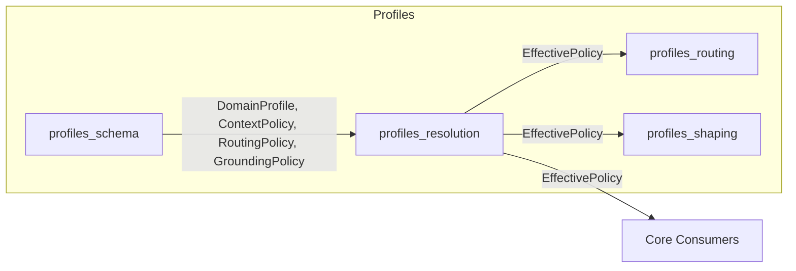
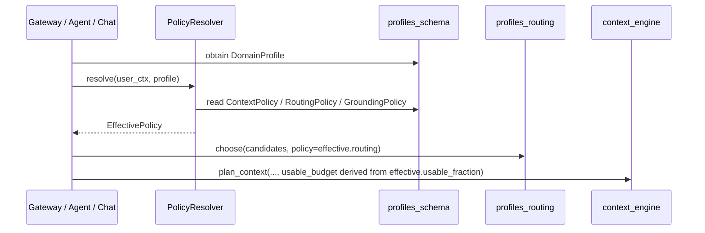

# profiles_resolution

## Brief Introduction

`profiles_resolution` is the policy-resolution layer of the `profiles` subsystem. It converts a layered `DomainProfile` (platform defaults, org, role, user) into a single, flat `EffectivePolicy` that the rest of the core reads per request. In Wave 1 the resolver only materialises the platform-default layer, which is deliberately calibrated to reproduce today's hard-coded gateway constants exactly (for example, `usable_fraction == 0.75`). The module is pure stdlib and has no external dependencies, so it can be imported and unit-tested in a bare environment.

---

## Comprehensive Documentation

### 1. Purpose and Scope

The resolver sits between **policy definition** ([profiles_schema](profiles_schema.md)) and **policy consumption** ([model_routing](model_routing.md), [context_engine](context_engine.md), [profiles_shaping](profiles_shaping.md)). Its job is to collapse the multi-layer profile hierarchy into one immutable value object that downstream code can use without understanding merge semantics.

Wave 1 behaviour:

- Accepts an optional `DomainProfile` and an optional `user_ctx` dictionary.
- If no profile is supplied, falls back to `ENTERPRISE_DEFAULT` (`DomainProfile()`).
- Returns an `EffectivePolicy` whose scalar fields are copied from `profile.context` and whose nested `routing` / `grounding` objects are passed through by reference.
- `user_ctx` is accepted for API stability but is **not yet used** for org/role/user merging.

Future waves (documented in `docs/architecture/17-personalization.md`) will implement the full most-specific-wins merge:

```text
PLATFORM DEFAULTS ◄ DOMAIN PROFILE ◄ ORG ◄ ROLE ◄ USER
```

### 2. Core Components

#### 2.1 `EffectivePolicy`

A frozen dataclass that is the single source of truth for resolved policy values during a request.

| Field | Source | Description |
|-------|--------|-------------|
| `usable_fraction` | `ContextPolicy.usable_fraction` | Fraction of the model context window that may be filled with conversation history (default `0.75`). |
| `history_retrieval_enabled` | `ContextPolicy.history_retrieval_enabled` | Whether overflow history may be retrieved from durable memory (default `False`). |
| `durable_memory_max_tokens` | `ContextPolicy.durable_memory_max_tokens` | Cap on durable-memory slots (default `800`). |
| `profile_id` | `DomainProfile.profile_id` | Identifier of the profile that produced this policy. |
| `routing` | `DomainProfile.routing` | Resolved routing weights and hard constraints. |
| `grounding` | `DomainProfile.grounding` | Resolved grounding / per-claim verification posture. |

Because the dataclass is `frozen=True`, resolved policies are immutable and safe to share across threads.

#### 2.2 `ENTERPRISE_DEFAULT`

Module-level constant: `ENTERPRISE_DEFAULT = DomainProfile()`. This is the fallback when no profile is provided and is calibrated to match the current production runtime constants so that switching downstream code from inline constants to `EffectivePolicy` is behaviour-neutral.

#### 2.3 `PolicyResolver`

The only public class in the module. It exposes a single method:

```python
resolver = PolicyResolver()
policy = resolver.resolve(
    user_ctx={"org_id": "...", "role": "..."},  # accepted, not yet used
    profile=some_domain_profile,                  # optional
)
```

`resolve()` is intentionally simple in Wave 1: it maps the profile's context fields onto `EffectivePolicy` and returns it. The method signature is stable for future waves.

### 3. Architecture and Data Flow

#### 3.1 Position in the Profiles Subsystem



- [profiles_schema](profiles_schema.md) defines the data model.
- `profiles_resolution` (this module) flattens the model.
- [profiles_routing](profiles_routing.md) consumes `RoutingPolicy` to score and choose model candidates.
- [profiles_shaping](profiles_shaping.md) consumes style/tone/grounding signals to shape responses.

#### 3.2 Request-Level Data Flow



### 4. Dependencies

#### 4.1 Internal Dependencies

| Dependency | Module | Purpose |
|------------|--------|---------|
| `DomainProfile` | [profiles_schema](profiles_schema.md) | The layered policy bundle to resolve. |
| `ContextPolicy` | [profiles_schema](profiles_schema.md) | Source of scalar context knobs. |
| `RoutingPolicy` | [profiles_schema](profiles_schema.md) | Source of routing weights and constraints. |
| `GroundingPolicy` | [profiles_schema](profiles_schema.md) | Source of grounding posture. |

#### 4.2 Downstream Consumers

| Consumer | Module | What it reads from `EffectivePolicy` |
|----------|--------|--------------------------------------|
| `choose()` | [profiles_routing](profiles_routing.md) | `EffectivePolicy.routing` |
| `shape_response()` | [profiles_shaping](profiles_shaping.md) | Grounding/style signals (future) |
| Context planning | [context_engine](context_engine.md) | `EffectivePolicy.usable_fraction` |
| Model router | [model_routing](model_routing.md) | Routing constraints and privacy floor |

### 5. Design Decisions

1. **Pure stdlib**: No third-party imports so the resolver can be tested without the full application stack.
2. **Frozen output**: `EffectivePolicy` is immutable, making it safe to cache or pass across thread boundaries.
3. **Pass-through nested policies**: `routing` and `grounding` are shared by reference rather than deep-copied. They are themselves frozen/immutable values, so aliasing is safe.
4. **API stability**: `user_ctx` is accepted now so callers do not need to change when org/role/user merging lands.
5. **Fail-safe default**: Omitting the profile yields the enterprise default, ensuring the system behaves exactly as before Wave 1.

### 6. Integration Notes

- Downstream code that currently reads gateway constants (for example, `_CONTEXT_USABLE_FRACTION`) should migrate to `EffectivePolicy.usable_fraction` via `PolicyResolver.resolve()`.
- The resolver is stateless; a single instance can be reused across requests.
- Because Wave 1 does not merge org/role/user layers, any per-tenant or per-user overrides must still be applied by the caller until later waves land.

### 7. Future Work

- Implement most-specific-wins merge using `user_ctx` (org, role, user layers).
- Add profile inheritance resolution via `DomainProfile.extends`.
- Expose resolver metrics / audit logging for compliance.
