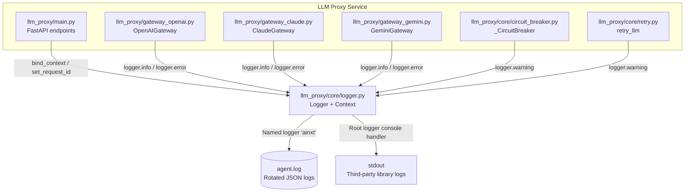
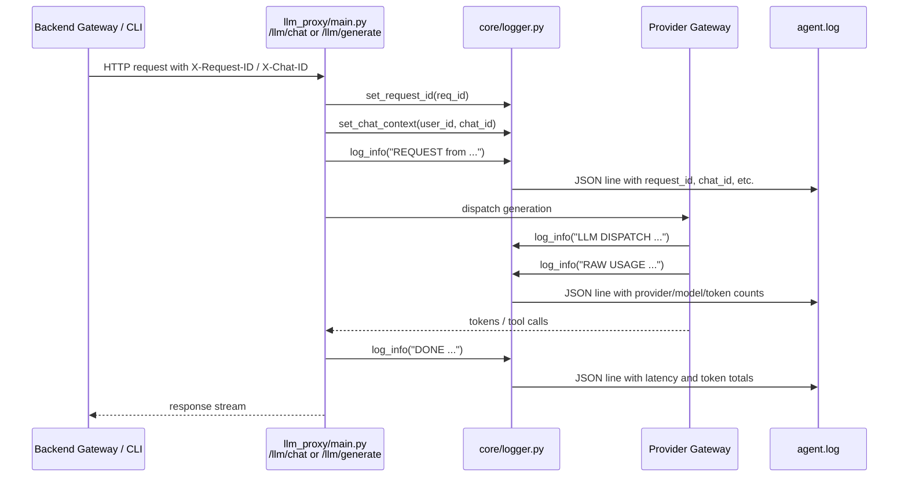
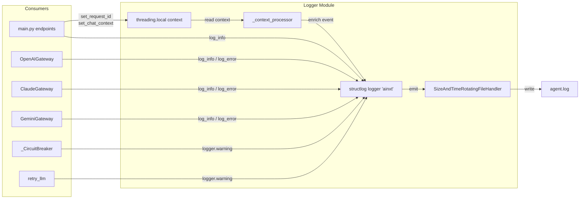
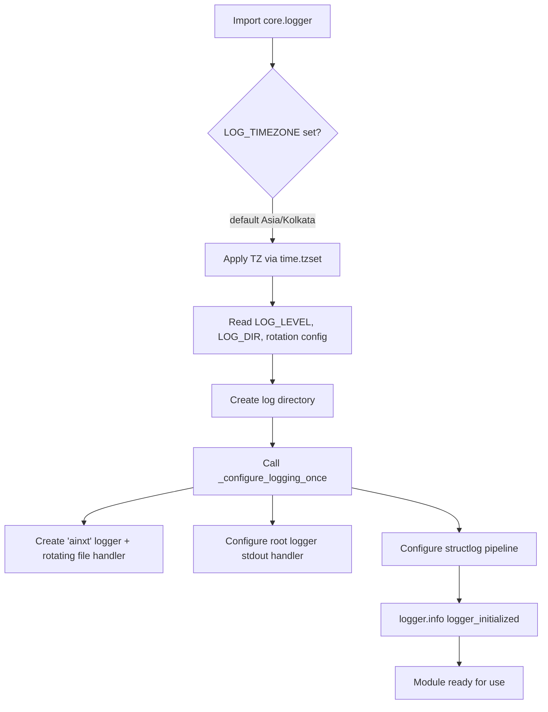

# llm_proxy_core_logger

## Brief Introduction

The `llm_proxy_core_logger` module is the production-grade logging subsystem for the **LLM Proxy** service. It provides structured, JSON-formatted logs with thread-local request context, combined size-and-time log rotation, and a unified `structlog`-based logger used across all LLM provider gateways and proxy endpoints.

This module ensures that every log line emitted by the LLM Proxy carries consistent observability fields—such as `request_id`, `span_id`, `user_id`, `chat_id`, `client_source`, `agent_id`, and `service`—so that operators can correlate events across the distributed AI platform.

---

## Core Responsibilities

1. **Structured Logging**: Configures `structlog` with a JSON renderer and a custom context processor.
2. **Thread-Local Context**: Binds request-scoped identifiers to `threading.local()` so that downstream log calls automatically include them.
3. **Log Rotation**: Implements a combined size-and-time rotating file handler that rotates logs when either limit is reached first.
4. **Timezone-Aware Timestamps**: Defaults to `Asia/Kolkata` (IST) but is configurable via environment variables.
5. **Safe Logging Helpers**: Exposes simple `log_info`, `log_warning`, `log_debug`, and `log_error` functions used by gateway code.

---

## Architecture



### Key Design Decisions

- **Named logger `ainxt` writes only to `agent.log`**: It does not propagate to `stdout`, preventing duplicate log lines.
- **Root logger writes to `stdout`**: Captures logs from third-party libraries without writing them to the application log file.
- **Thread-local context**: Avoids passing context dictionaries through every call stack; gateway code simply calls `set_request_id()` once per request.
- **Combined rotation**: The custom `SizeAndTimeRotatingFileHandler` rotates when either the size threshold or the time schedule fires, whichever comes first.

---

## Core Components

### `SizeAndTimeRotatingFileHandler`

A subclass of `logging.handlers.TimedRotatingFileHandler` that also enforces a maximum file size. It checks the current file size first (cheap seek), and if the size limit is not reached, falls through to the standard time-based rollover check.

**Environment variables:**

| Variable | Default | Description |
|----------|---------|-------------|
| `LOG_MAX_BYTES` | `52428800` (50 MB) | Maximum size before rotation |
| `LOG_BACKUP_COUNT` | `30` | Number of rotated files to keep |
| `LOG_ROTATION_WHEN` | `h` | Rotation schedule (`midnight`, `h`, `d`, `w0`–`w6`, `s`) |
| `LOG_ROTATION_INTERVAL` | `1` | Interval units for `h`/`d`/`s` |
| `LOG_ROTATION_UTC` | `false` | Whether rollover timing uses UTC |

### Thread-Local Context Functions

The module stores request context in `threading.local()`. The following functions set or clear values:

| Function | Purpose |
|----------|---------|
| `set_request_id(request_id)` | Binds the upstream request ID |
| `set_chat_context(user_id, chat_id)` | Binds user/chat identifiers |
| `set_span_id(span_id)` | Binds a distributed tracing span ID |
| `set_client_source(source)` | Binds the client source (`platform`, `cli`, `ide-vscode`, `ide-jetbrains`) |
| `bind_context(...)` | Binds agent/pipeline/task/correlation IDs |
| `clear_chat_context()` | Clears user/chat/span/client context |
| `clear_bound_context()` | Clears agent/pipeline/task/correlation context |

These values are automatically merged into every log record by `_context_processor`.

### `_context_processor`

A `structlog` processor that injects the following fields into every log event:

- `service`
- `host`
- `request_id`
- `span_id`
- `user_id`
- `chat_id`
- `client_source`
- `agent_id`
- `pipeline_stage`
- `task_id`
- `correlation_id`

This guarantees that a single log line contains enough context for tracing a request end-to-end.

### `_configure_logging_once`

Initializes the logging pipeline once at module import time:

1. Creates the `ainxt` named logger and attaches the rotating file handler.
2. Configures the root logger with a `stdout` stream handler.
3. Configures `structlog` with the context processor, log level, timestamp, stack info, exception info, and JSON renderer.

Because the module calls `_configure_logging_once()` on import, any file that imports `core.logger` gets a fully configured logger.

### Safe Logging Helpers

Convenience wrappers around the configured `structlog` logger:

- `log_info(message)`
- `log_warning(message)`
- `log_debug(message)`
- `log_error(message, exc=None)`

These are used throughout the LLM Proxy gateways to keep logging calls short and consistent.

---

## Data Flow: Request Lifecycle



### Context Binding in Practice

In [`llm_proxy/main.py`](llm_proxy_main.md), the `/llm/chat` and `/llm/generate` endpoints extract `request_id` and `chat_id` from either the JSON body or HTTP headers, then bind them:

```python
from core.logger import set_request_id, set_chat_context

req_id = upstream_request_id or str(uuid.uuid4())
set_request_id(req_id)
if upstream_chat_id:
    set_chat_context("-", upstream_chat_id)
```

From that point on, every `logger.info(...)` call inside the gateway automatically includes `request_id` and `chat_id`.

---

## Component Interaction



---

## Process Flow: Log Setup



---

## Integration with the Broader System

The LLM Proxy logger is consumed by multiple upstream services:

- **[`llm_proxy/main.py`](llm_proxy_main.md)**: Binds request context at the API layer and logs endpoint activity.
- **[`llm_proxy/gateway_openai.py`](llm_proxy_gateway_openai.md)**, **[`llm_proxy/gateway_claude.py`](llm_proxy_gateway_claude.md)**, **[`llm_proxy/gateway_gemini.py`](llm_proxy_gateway_gemini.md)**: Log provider dispatches, raw usage, cache effectiveness, and errors.
- **[`llm_proxy/core/circuit_breaker.py`](llm_proxy_core_circuit_breaker.md)**: Logs circuit breaker open/half-open state transitions.
- **[`llm_proxy/core/retry.py`](llm_proxy_core_retry.md)**: Logs retry attempts and delays.
- **[`ABStudio/backend/app/core/llm_handler.py`](abstudio_backend_core_llm_handler.md)**: The backend's LLM client uses the same logging conventions when calling the proxy.
- **[`gateway.py`](gateway.md)**: The main backend gateway orchestrates agent/workflow/chat runs and relies on correlated proxy logs for debugging.

Because the logger writes structured JSON, downstream log aggregation (Loki, ELK, etc.) can index fields like `request_id` and `chat_id` to reconstruct a full request trace across the backend gateway, LLM proxy, and provider APIs.

---

## Configuration Reference

| Environment Variable | Default | Description |
|----------------------|---------|-------------|
| `LOG_TIMEZONE` | `Asia/Kolkata` | IANA timezone for log timestamps |
| `LOG_LEVEL` | `INFO` | Minimum log level |
| `LOG_DIR` | `<llm_proxy>/log/app` | Directory for log files |
| `LOG_MAX_BYTES` | `52428800` | Size threshold for rotation |
| `LOG_BACKUP_COUNT` | `30` | Rotated files to retain |
| `LOG_ROTATION_WHEN` | `h` | Time rotation schedule |
| `LOG_ROTATION_INTERVAL` | `1` | Time rotation interval |
| `LOG_ROTATION_UTC` | `false` | Use UTC for rollover timing |
| `SERVICE_NAME` | `ainxt-llm-proxy` | Service name injected into every log |

---

## Notes for Maintainers

- The logger is configured at **import time**; avoid importing `core.logger` in modules that must remain side-effect free during tests.
- Context is stored in `threading.local()`. In async code, ensure context is set on the same thread that will emit logs, or use `structlog` contextvars if cross-task propagation is required.
- The `ainxt` logger does **not** propagate to `stdout`; use the root logger or third-party library logs for console output.
- Rotated filenames include the timestamp suffix based on the active rotation schedule (e.g., `agent.log.2026-03-23_06`).
