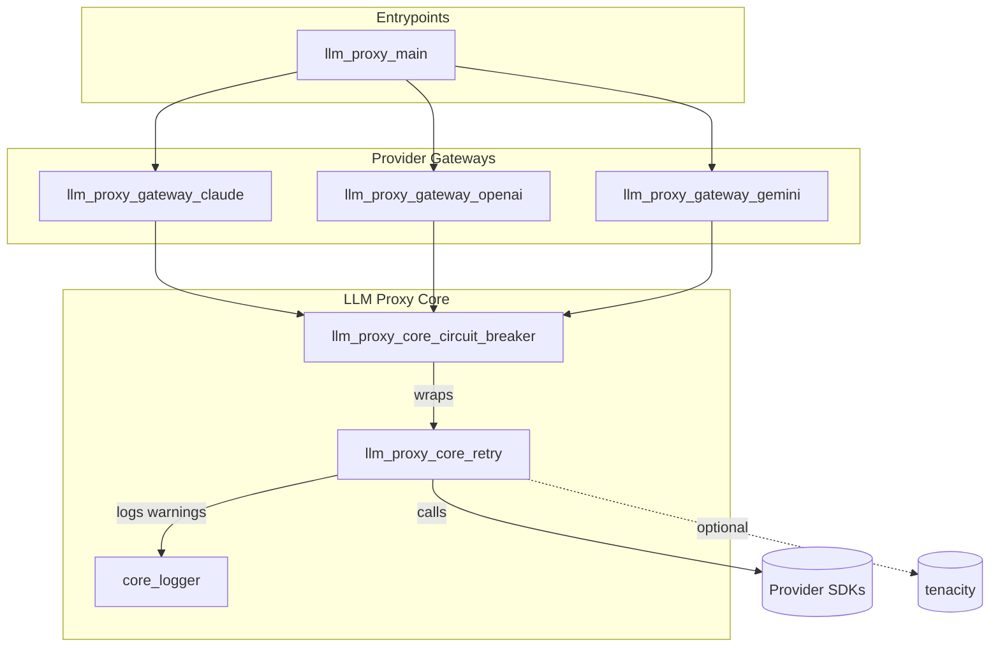
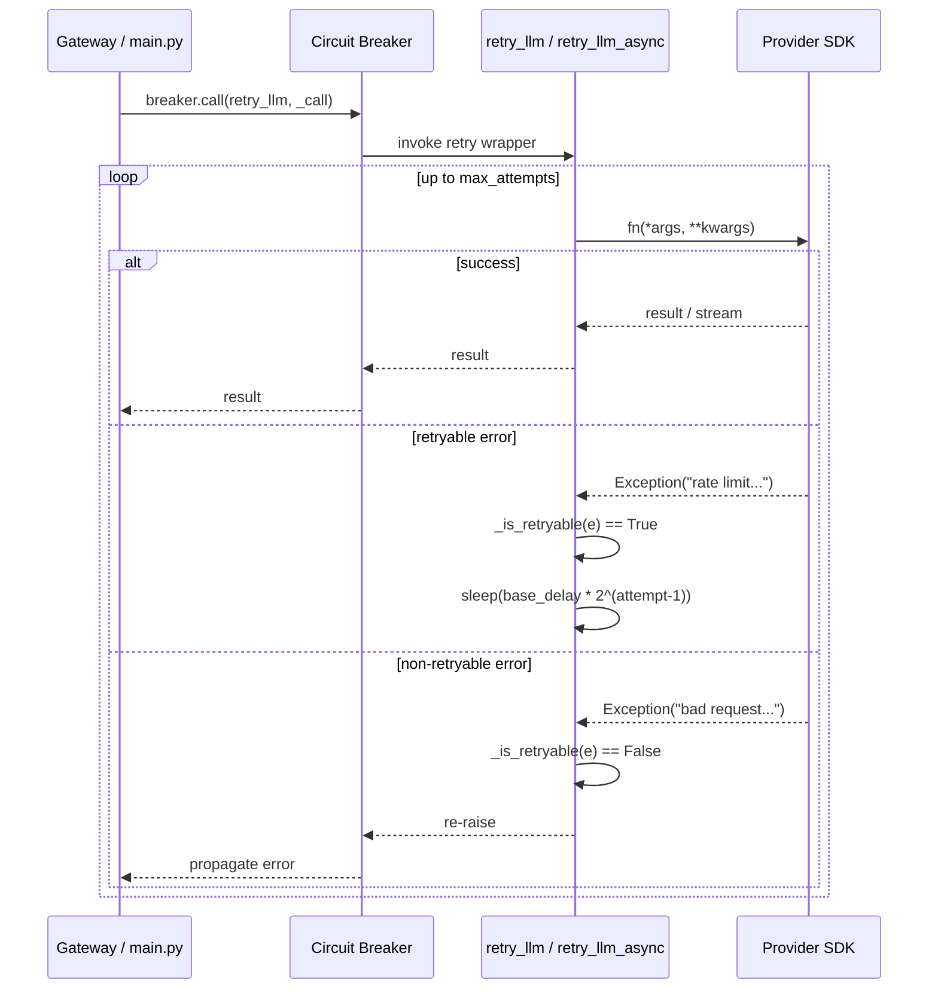
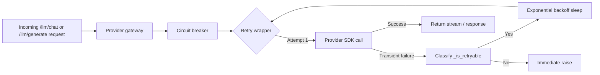

# llm_proxy_core_retry

## Brief Introduction

`llm_proxy_core_retry` provides a small, provider-agnostic retry layer for outbound Large Language Model (LLM) calls in the `llm_proxy` service. It exposes two public helpers:

- `retry_llm(...)` — synchronous exponential-backoff wrapper.
- `retry_llm_async(...)` — asynchronous equivalent using `asyncio.sleep`.

Both helpers only retry on *transient* failures: rate limits, timeouts, connection errors, and common HTTP 502/503/429 responses. Non-retryable errors are re-raised immediately. The module prefers the [`tenacity`](https://github.com/jd/tenacity) library when available, but falls back to a simple manual loop so the proxy remains functional even if `tenacity` is not installed.

This module is intentionally thin: it does not know about Anthropic, OpenAI, or Gemini SDKs. It only knows how to call a supplied function, inspect the exception message, and back off. The actual provider logic, circuit-breaker protection, and request/response streaming live in the gateway modules that consume this retry layer.

---

## File Location

```text
services/llm_proxy/core/retry.py
```

---

## Core Components

| Component | Type | Responsibility |
|-----------|------|----------------|
| `retry_llm` | Function | Sync wrapper that calls `fn(*args, **kwargs)` with exponential backoff. |
| `retry_llm_async` | Coroutine | Async wrapper that calls `await fn(*args, **kwargs)` with non-blocking backoff. |
| `_is_retryable` | Helper | Classifies an exception as transient by scanning its string representation. |
| `_RETRYABLE_MSGS` | Constant | Substrings that mark an exception as retryable. |
| `_TENACITY` | Flag | `True` when `tenacity` is installed; enables the richer retry implementation. |

### Retryable Error Signatures

The following substrings in an exception message trigger a retry:

```python
_RETRYABLE_MSGS = (
    "rate limit", "rate_limit", "ratelimit",
    "timeout", "timed out",
    "connection", "connection error",
    "503", "502", "429",
    "overloaded",
)
```

This covers the most common provider-side transient failures without taking a dependency on provider-specific exception hierarchies.

---

## Architecture



### Component Interaction



---

## Data Flow



---

## Retry Process Flow

```mermaid
flowchart TD
    Start([Call fn]) --> Try{Attempt <= max_attempts?}
    Try -->|No| RaiseLast[Raise last exception]
    Try -->|Yes| Invoke[Invoke fn]
    Invoke --> OK{Success?}
    OK -->|Yes| Return[Return result]
    OK -->|No| Catch[Catch exception]
    Catch --> Retryable{_is_retryable?}
    Retryable -->|No| RaiseNow[Re-raise exception]
    Retryable -->|Yes| Delay[Compute delay = base_delay * 2^(attempt-1)]
    Delay --> Sleep[Sleep / asyncio.sleep]
    Sleep --> Try
```

---

## How It Fits into the System

`llm_proxy_core_retry` sits at the bottom of the LLM call stack, just above the provider SDKs. It is always used *inside* a circuit-breaker call so that:

1. **Retry** handles short-lived transient problems (rate limit, blip, overload).
2. **Circuit breaker** handles sustained outages by opening after a failure threshold.

Typical call chain:

```text
HTTP endpoint (llm_proxy_main)
  → Provider gateway (Claude/OpenAI/Gemini)
    → Circuit breaker (llm_proxy_core_circuit_breaker)
      → Retry wrapper (llm_proxy_core_retry)
        → Provider SDK
```

### Sync Usage Example

From `llm_proxy_gateway_openai`:

```python
from core.retry import retry_llm
from core.circuit_breaker import get_breaker

breaker = get_breaker("openai")
response = breaker.call(retry_llm, _call)
```

### Async Usage Example

From `llm_proxy_gateway_claude`:

```python
from core.retry import retry_llm_async
from core.circuit_breaker import get_breaker

breaker = get_breaker("claude")
response = await breaker.async_call(retry_llm_async, _call)
```

---

## Configuration & Defaults

| Parameter | Default | Description |
|-----------|---------|-------------|
| `max_attempts` | `3` | Maximum number of call attempts (including the first). |
| `base_delay` | `1.0` | Initial backoff delay in seconds. |

With the defaults, the delay schedule is:

| Attempt | Delay before next attempt |
|---------|---------------------------|
| 1 → 2   | 1.0 s                     |
| 2 → 3   | 2.0 s                     |
| 3 → fail| 4.0 s (not used if last)  |

Callers can override these per invocation:

```python
retry_llm(_call, max_attempts=5, base_delay=0.5)
```

There are no module-level environment variables; retry policy is controlled by the caller.

---

## Implementation Notes

### `tenacity` Path

When `tenacity` is installed, `retry_llm` builds a `Retrying` object with:

- `stop_after_attempt(max_attempts)`
- `wait_exponential(multiplier=base_delay, min=base_delay, max=base_delay * 8)`
- `retry_if_exception(_is_retryable)`
- `reraise=True`

The `max=base_delay * 8` caps the delay at 8 seconds for the default configuration.

### Fallback Path

If `tenacity` is missing, both sync and async variants use an explicit `for` loop with `time.sleep` / `asyncio.sleep`. A warning is logged at import time.

### Async Variant

`retry_llm_async` does **not** currently use `tenacity`; it always uses the manual async loop. This keeps the async path free of synchronous `time.sleep` calls and avoids blocking the uvicorn event loop.

---

## Observability

- Import-time warning if `tenacity` is unavailable.
- Per-attempt warning logs when a retryable failure occurs:

```text
retry_llm: attempt 1/3 failed (<exception>), retrying in 1.0s
```

Logs are emitted through [`core_logger`](core_logger.md), which enriches them with request/chat IDs when bound.

---

## Error Handling

- **Retryable errors** are swallowed (up to `max_attempts`) and retried after backoff.
- **Non-retryable errors** are re-raised on first occurrence.
- If all attempts are exhausted, the last captured exception is re-raised.

Because the retry wrapper is invoked *inside* the circuit breaker, a final re-raised exception also increments the breaker's failure counter and may open the circuit for the provider.

---

## References

- [llm_proxy_core_circuit_breaker.md](llm_proxy_core_circuit_breaker.md) — wraps the retry layer and opens on sustained failures.
- [llm_proxy_gateway_claude.md](llm_proxy_gateway_claude.md) — uses `retry_llm_async` for Claude calls.
- [llm_proxy_gateway_openai.md](llm_proxy_gateway_openai.md) — uses `retry_llm` for OpenAI calls.
- [llm_proxy_gateway_gemini.md](llm_proxy_gateway_gemini.md) — uses `retry_llm` for Gemini calls.
- [llm_proxy_main.md](llm_proxy_main.md) — top-level proxy endpoints that drive the gateways.
- [core_logger.md](core_logger.md) — logging utilities used by the retry module.

---

## When to Modify

Consider updating this module when:

- A new provider returns transient error messages not covered by `_RETRYABLE_MSGS`.
- The desired backoff strategy changes (e.g., jitter, fixed delay, longer max).
- You want to add per-provider retry policies.

Avoid adding provider-specific logic here; keep it generic so all gateways share the same retry semantics.
