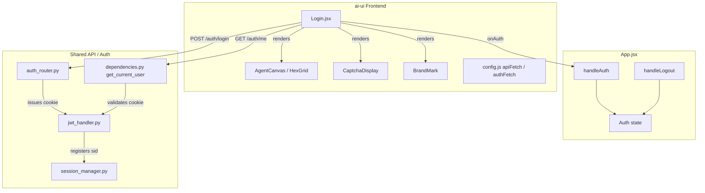
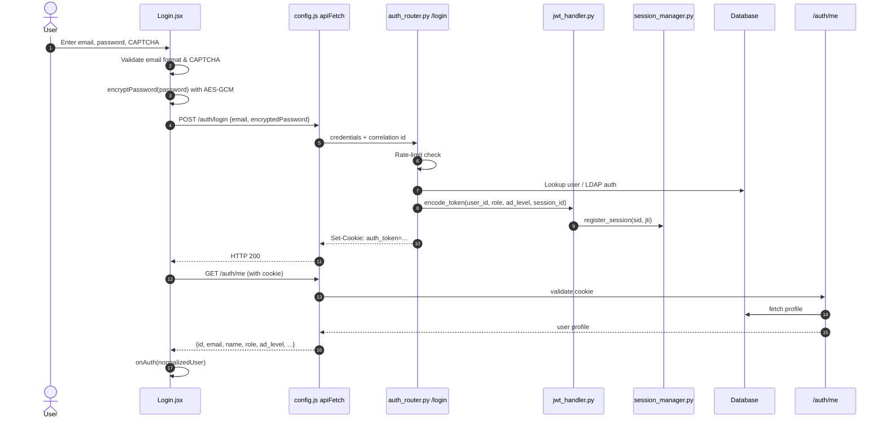
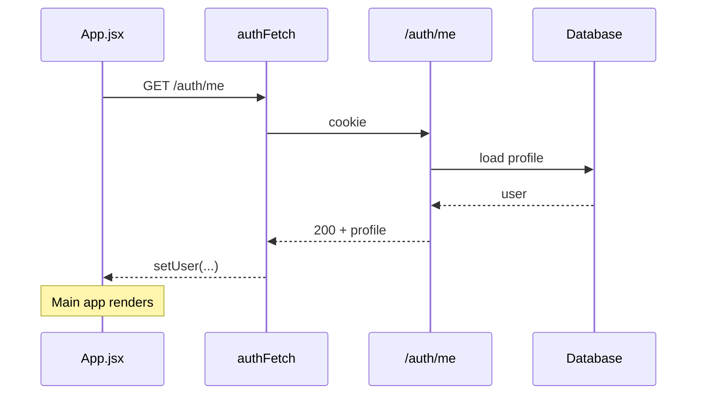
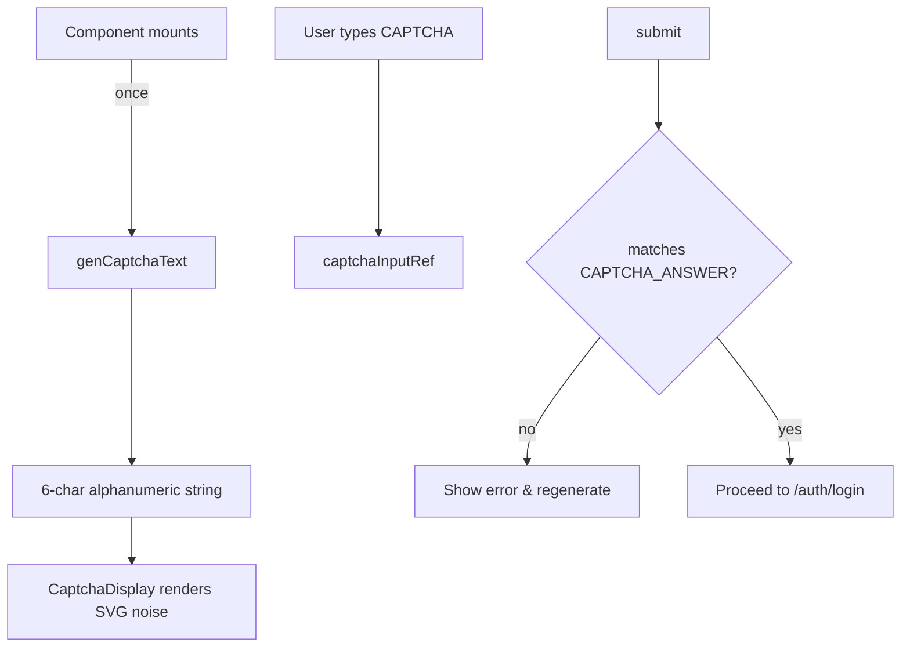
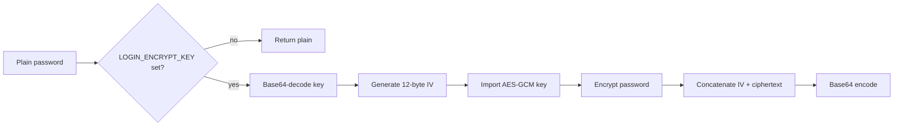

# Login Module

The **Login module** is the authentication entry point for the `ai-ui` frontend. It renders the branded sign-in screen, collects user credentials, validates a CAPTCHA challenge, encrypts the password in the browser, and submits them to the backend. After a successful login it verifies the server-side session via `/auth/me` and hands the normalized user profile to the application shell.

This module is intentionally thin: it owns only the UI surface and client-side validation. All credential verification, session minting, token storage, and RBAC enrichment happen in the backend [auth_router](auth_router.md) and [authentication](authentication.md) layers.

---

## Core Responsibilities

| Responsibility | Description |
| -------------- | ----------- |
| Credential capture | Email and password input with client-side format validation. |
| CAPTCHA challenge | Generate and render a visual CAPTCHA; validate the user response before submission. |
| Password encryption | Encrypt the password with AES-GCM using a runtime public key before it leaves the browser. |
| Backend login | POST credentials to `/auth/login` and handle error states. |
| Session verification | Confirm the httpOnly cookie session by calling `/auth/me` before marking the user as authenticated. |
| Branded UX | Render the AiNxt marketing panel, animated agent constellation, dark/light mode toggle, and feature badges. |

---

## Architecture



### Component Breakdown

| Component | File | Purpose |
| --------- | ---- | ------- |
| `Login` | `ai-ui/src/components/Login.jsx` | Main container. Manages form state, validation, submission, and error display. |
| `AgentCanvas` | `ai-ui/src/components/Login.jsx` | Animated HTML5 canvas showing the agent constellation (orchestrator, compliance, router, coder, reviewer, model providers). |
| `HexGrid` | `ai-ui/src/components/Login.jsx` | Subtle hexagonal background grid rendered on a canvas. |
| `CaptchaDisplay` | `ai-ui/src/components/Login.jsx` | SVG-based CAPTCHA with noise lines, dots, waves, scratches, and distorted characters. |
| `BrandMark` | `ai-ui/src/components/BrandMark.jsx` | AiNxt logo rendered in the header and mobile view. |
| `submit` | `ai-ui/src/components/Login.jsx` | Async handler that validates inputs, checks CAPTCHA, encrypts the password, and calls the backend. |
| `encryptPassword` | `ai-ui/src/components/Login.jsx` | AES-GCM encryption helper using `VITE_LOGIN_ENCRYPT_KEY`. |

---

## Dependencies

### Internal Frontend Dependencies

| Dependency | Module | Role |
| ---------- | ------ | ---- |
| `BrandMark` | [brand_mark](brand_mark.md) | Logo component. |
| `apiFetch` | [config](config.md) | Unauthenticated fetch wrapper that sends `credentials: include` and a correlation id. |
| `authFetch` | [config](config.md) | Authenticated fetch wrapper with a single retry for idempotent GETs. |
| `App` / `handleAuth` | [ai_ui_frontend_app_core](ai_ui_frontend_app_core.md) | Receives the normalized user object and promotes it to global auth state. |
| `AuthProvider` / `useAuth` | [auth](auth.md) | React context that exposes session state to descendants (currently not persisted). |

### Backend Dependencies

| Dependency | Module | Role |
| ---------- | ------ | ---- |
| `POST /auth/login` | [auth_router](auth_router.md) | Validates credentials, issues JWT, sets httpOnly `auth_token` cookie, registers session. |
| `GET /auth/me` | [auth_router](auth_router.md) | Returns the authenticated user's profile from the database. |
| `encode_token` | [authentication](authentication.md) | Creates a signed JWT with minimal claims (no PII). |
| `get_current_user` | [authentication](authentication.md) | Extracts and validates the JWT or API key from the request. |
| `session_manager` | [authentication](authentication.md) | Registers and enforces concurrent session limits. |

---

## Data Flow

### Login Submission Flow



### Session Restoration Flow

When the application reloads, `App.jsx` does not rely on `localStorage`. It calls `/auth/me` with the existing httpOnly cookie and, if valid, restores the session without ever rendering `Login`.



---

## Component Interaction

```mermaid
flowchart LR
    subgraph LoginScreen["Login.jsx"]
        Form[Login Form]
        Captcha[CaptchaDisplay]
        Agent[AgentCanvas]
        Hex[HexGrid]
    end

    Form -->|triggers| Submit[submit handler]
    Submit -->|validates| Captcha
    Submit -->|encrypts| Pwd[password]
    Submit -->|POST| API[/auth/login]
    API -->|sets cookie| Cookie[httpOnly auth_token]
    Submit -->|GET with cookie| Me[/auth/me]
    Me -->|returns| Profile[user profile]
    Submit -->|calls| onAuth[onAuth prop]
    onAuth -->|updates| AppState[App.jsx user state]
```

---

## Process Flows

### CAPTCHA Generation and Validation



The CAPTCHA uses a seeded pseudo-random generator so the same challenge text always produces the same noise pattern, preventing visual flicker while still making automated parsing difficult.

### Password Encryption



### Error Handling

| Error Source | Behavior |
| ------------ | -------- |
| Empty email/password | Inline error: "Email and password are required" |
| Invalid email format | Inline error: "Please enter a valid email address" |
| Missing/invalid CAPTCHA | Inline error under CAPTCHA; challenge regenerated on mismatch |
| Backend 403 + `LAUNCHING_SOON` | "AiNxt is launching soon" banner |
| Backend 401 / other | Inline error with server detail or generic message |
| Network failure | "Cannot connect to server. Is the backend running?" |
| `/auth/me` failure | "Session verification failed. Please try again." |

---

## Security Considerations

1. **No localStorage tokens** — The frontend never stores the JWT in `localStorage` or `sessionStorage`. The token lives in an `httpOnly` cookie set by the backend.
2. **Server-side session verification** — After `/auth/login`, the frontend calls `/auth/me` to confirm the cookie was genuinely set. This mitigates response-manipulation attacks where an attacker alters the login response body.
3. **Client-side password encryption** — Passwords are encrypted with AES-GCM before transmission so they are never sent in plaintext over the wire.
4. **CAPTCHA** — A visual challenge is required on every login to slow automated credential-stuffing attacks.
5. **Autocomplete disabled** — Sensitive inputs use `autoComplete="off"` to discourage browser credential caching on shared machines.
6. **Rate limiting** — The backend enforces IP-based rate limits on `/auth/login` and `/auth/refresh`.
7. **Concurrent session control** — Each login mints a unique session id (`sid`) registered in Redis/Postgres; evicted sessions are rejected even if the JWT has not expired.

---

## How It Fits into the System

`Login.jsx` is the gate between unauthenticated visitors and the rest of the `ai-ui` application. It is rendered by `App.jsx` only when `/auth/me` returns 401 or no user exists. Once authenticated, the user object flows into:

- [ai_ui_frontend_app_core](ai_ui_frontend_app_core.md) — global auth state and routing.
- [chat](chat.md) / [kb_chat](kb_chat.md) — personalized chat history and scopes.
- [budget_manager](budget_manager.md) / [level_overrides](level_overrides.md) — RBAC/ABAC-gated features.
- [inbox](inbox.md) — unread approvals and notifications.

The backend counterpart lives in the shared [auth_router](auth_router.md) and [authentication](authentication.md) modules, which are also used by the desktop app, IDE integrations, and API-key clients.

---

## References

- [ai_ui_frontend_app_core](ai_ui_frontend_app_core.md) — application shell, `handleAuth`, `handleLogout`, and route guards.
- [auth](auth.md) — React auth context (`AuthProvider`, `useAuth`).
- [config](config.md) — `apiFetch` and `authFetch` wrappers.
- [brand_mark](brand_mark.md) — AiNxt logo component.
- [auth_router](auth_router.md) — backend login, logout, refresh, and `/auth/me` endpoints.
- [authentication](authentication.md) — JWT handling, session management, and dependency injection.
