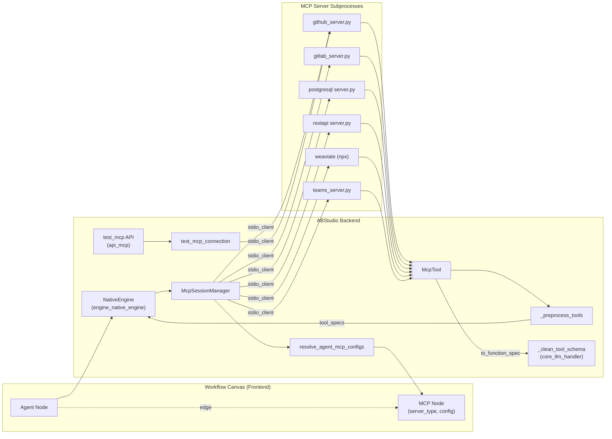
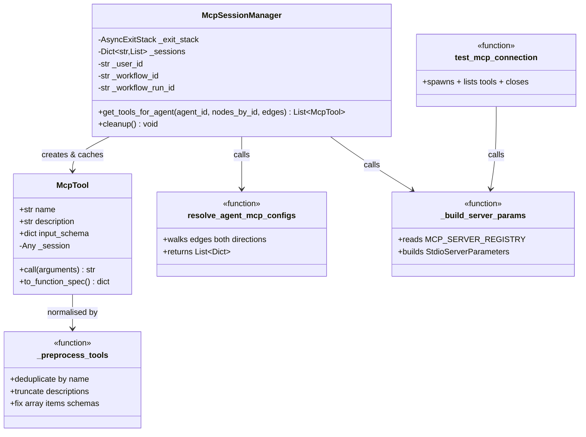
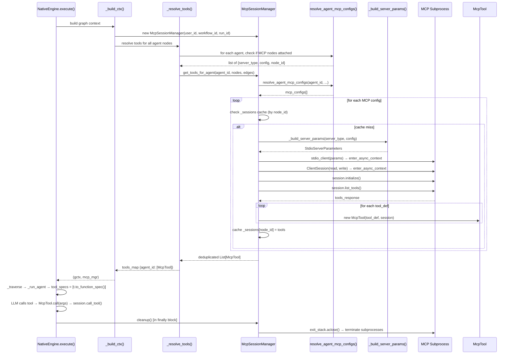
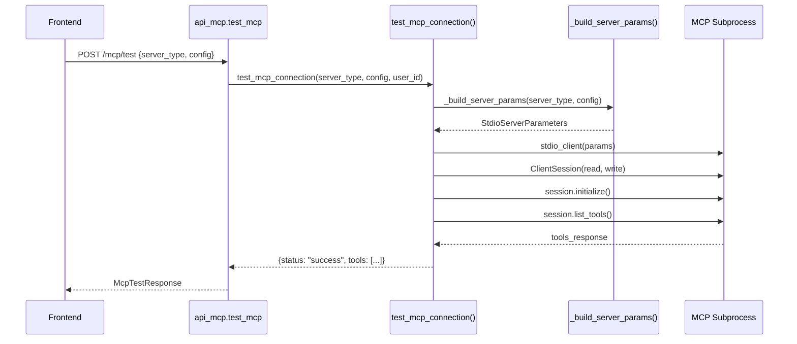

# core_mcp_manager

> **File:** `ABStudio/backend/app/core/mcp_manager.py`
> **Components:** `McpTool`, `_preprocess_tools`, `McpSessionManager`

## 1. Introduction

The `core_mcp_manager` module is the ABStudio backend's **Model Context Protocol (MCP) session and tool lifecycle manager**. It bridges the visual workflow canvas — where users attach MCP server nodes to agent nodes — and the live subprocess-based MCP servers that expose callable tools to LLM-driven agents at runtime.

In concrete terms, the module is responsible for:

| Responsibility | Where it lives |
|---|---|
| Discovering which MCP servers are attached to a given agent node (by walking workflow edges) | `resolve_agent_mcp_configs()` |
| Spawning MCP server subprocesses on demand and caching their sessions for the duration of a workflow run | `McpSessionManager` |
| Wrapping raw MCP tool definitions into a pure-Python `McpTool` object (no LangChain dependency) | `McpTool` |
| Normalising tool schemas for Gemini / OpenAI function-calling compatibility (dedup, truncation, array-`items` fix) | `_preprocess_tools`, `_fix_tool_schemas` |
| Testing MCP server connectivity from the UI ("Test connection" button) | `test_mcp_connection()` |
| Tearing down all subprocess sessions when a workflow execution finishes | `McpSessionManager.cleanup()` |

The module is consumed primarily by the **NativeEngine** (see [engine_native_engine](../agents/engine_native_engine.md)), which instantiates a `McpSessionManager` per workflow execution, resolves tools for every agent node, and cleans up in a `finally` block. The **MCP test API** (see [api_mcp](api_mcp.md)) delegates to `test_mcp_connection()` for the UI's connection-probe feature.

---

## 2. Architecture

### 2.1 High-level position in the system

### 2.2 Component relationships

---

## 3. Core Components

### 3.1 `McpSessionManager`

The central orchestrator. One instance is created **per workflow execution** (not per agent) by `NativeEngine._build_ctx()`. Its lifecycle is tightly coupled to the engine's `execute()` / `resume()` methods — the engine calls `cleanup()` in a `finally` block so subprocesses are always terminated, even on cancellation or error.

**Key design decisions:**

- **Session caching by node ID:** When multiple agents in the same workflow share the same MCP node, the subprocess is spawned only once. The `_sessions` dict maps `node_id → List[McpTool]` and is checked before any new spawn.
- **Cross-node deduplication:** After collecting tools from all MCP nodes attached to an agent, `get_tools_for_agent()` deduplicates by tool name so two REST API nodes exposing `http_request` don't produce a Gemini "Duplicate function declaration" error.
- **Caller context threading:** `user_id`, `workflow_id`, and `workflow_run_id` are captured at construction time and forwarded to `_build_server_params()` so every spawned MCP server can resolve `*_credential_id` references via vault decryption (RBAC + audit honoured).
- **Graceful cleanup:** `cleanup()` closes the `AsyncExitStack` (which terminates all subprocesses). A `RuntimeError` from anyio's cancel scope — common when cleanup runs from a different task than the one that created the session (e.g. an SSE generator's `finally` block) — is caught and logged at debug level since the OS will reclaim the subprocesses regardless.

**Public API:**

| Method | Purpose |
|---|---|
| `get_tools_for_agent(agent_id, nodes_by_id, edges)` | Returns a deduplicated `List[McpTool]` for all MCP nodes connected to the agent. Spawns subprocesses on first access, reuses cached sessions thereafter. |
| `cleanup()` | Terminates all MCP server subprocesses. Called by the engine in `finally`. |

### 3.2 `McpTool`

A lightweight, pure-Python wrapper around a single MCP tool definition and its live session. Deliberately avoids any LangChain `BaseTool` dependency so the engine's tool-calling loop can work with any LLM client.

| Attribute / Method | Description |
|---|---|
| `name` | Tool name from the MCP `list_tools()` response. |
| `description` | Tool description, truncated to 500 chars at construction. |
| `input_schema` | JSON schema dict (from `tool_def.inputSchema`). Falls back to `{"type": "object", "properties": {}}` when missing or unparseable. |
| `call(arguments)` | Executes the tool via `session.call_tool()`. Joins all text/data content parts into a single string. Errors are caught and returned as `"Tool '<name>' error: <e>"` rather than raised. |
| `to_function_spec()` | Converts to the standard `{"name", "description", "parameters"}` dict consumed by LLM function-calling APIs. Delegates schema cleaning to `_clean_tool_schema` from [core_llm_handler](../llm/core_llm_handler.md). |

### 3.3 `_preprocess_tools(tools, max_description_length=500)`

A module-level function that normalises a list of `McpTool` objects before they are passed to LLM clients. It performs three transformations in order:

1. **Deduplication by name** — keeps the first occurrence of each tool name. Prevents Gemini 400 "Duplicate function declaration" errors when two MCP nodes expose tools with identical names (e.g. two REST API nodes both providing `http_request`).
2. **Description truncation** — caps each tool's description at `max_description_length` characters (default 500). Many MCP servers (especially GitLab with 50+ tools) emit multi-paragraph descriptions that overwhelm function-calling payloads and cause models to dump schemas as text instead of invoking them.
3. **Array-schema fix** — delegates to `_fix_tool_schemas()` → `_fix_array_items()`, which recursively ensures every `type: "array"` property has a valid `items` field with a `type`. Gemini rejects tool schemas where array parameters are missing `items` or have an empty `{}` items object.

> **Note:** `_preprocess_tools` is defined in this module but is called by the NativeEngine's tool-resolution path, not directly by `McpSessionManager.get_tools_for_agent()`. The session manager performs its own lighter-weight dedup (by name within a single node and across nodes); the full preprocessing (including truncation and schema fixing) is applied by the engine before building `tool_specs` for the LLM.

---

## 4. Supporting Functions

### 4.1 `resolve_agent_mcp_configs(agent_id, nodes_by_id, edges)`

Walks the workflow's edge list to find all MCP nodes connected to a given agent. Handles **both edge directions**:

- **MCP → Agent** (`source=mcp_id, target=agent_id`) — MCP in the main flow, feeding into the agent.
- **Agent → MCP** (`source=agent_id, target=mcp_id`) — MCP as a side attachment.

Returns a list of `{server_type, config, node_id}` dicts, deduplicated by node ID. This function is called both by `McpSessionManager.get_tools_for_agent()` and by `NativeEngine._resolve_tools()` (which uses it to decide which agents need MCP tool resolution at all).

### 4.2 `_build_server_params(server_type, config, *, user_id, workflow_id, workflow_run_id)`

Builds a `StdioServerParameters` object from the `MCP_SERVER_REGISTRY` entry for the given server type and the user-supplied config. The environment-assembly order is:

1. Start with a copy of `os.environ`.
2. Apply `env_defaults` from the registry entry (only if the variable is absent or empty).
3. Apply config overrides via `env_mapping` — each config key is mapped to an environment variable name and written only if the config value is non-empty.

This three-layer approach lets the registry define sensible defaults (e.g. `MCP_AGENT_SCOPES=read,write,modify` for GitHub) while still allowing per-node config overrides from the UI.

### 4.3 `test_mcp_connection(server_type, config, *, user_id)`

A standalone function (not part of `McpSessionManager`) used by the [api_mcp](api_mcp.md) endpoint's "Test connection" feature. It spawns the MCP server, initialises a session, calls `list_tools()`, returns the tool names/descriptions, and then closes the connection. This is a fire-and-forget probe — no session is cached.

### 4.4 `MCP_SERVER_REGISTRY`

A module-level dict mapping server type strings to their launch configuration:

| Server Type | Command | Key Env Mapping |
|---|---|---|
| `github` | `python github_server.py` | `GITHUB_TOKEN`, `MCP_AGENT_SCOPES`, `GITHUB_WRITE_ALLOWED_REPOS`, … |
| `gitlab` | `python gitlab_server.py` | `GITLAB_TOKEN`, `GITLAB_API` |
| `postgres` | `python server.py` | `POSTGRES_HOST/PORT/DB/USER/PASSWORD`, `POSTGRES_SENSITIVE_TABLES` |
| `rest_api` | `python server.py` | `REST_API_BASE_URL`, `REST_API_AUTH_TYPE`, `REST_API_AUTH_TOKEN` |
| `weaviate` | `npx -y mcp-server-weaviate` | `WEAVIATE_URL`, `WEAVIATE_API_KEY` |
| `teams` | `python teams_server.py` | `TEAMS_REFRESH_TOKEN` (from UI), `TEAMS_TENANT_ID/CLIENT_ID/CLIENT_SECRET` (from `.env`) |

The registry also supports optional `env_defaults` (applied when the env var is unset) and `cwd` (working directory for the subprocess). The `_MCP_ROOT` path is resolved relative to this file so the project works regardless of where it is cloned.

The `McpServerType` enum in [app_models](../core/app_models.md) mirrors these keys (`GITHUB`, `GITLAB`, `REST_API`, `POSTGRES`, `WEAVIATE`, `TEAMS`).

---

## 5. Data Flow

### 5.1 Workflow execution: MCP tool resolution

### 5.2 MCP connection test (UI probe)

---

## 6. Integration Points

### 6.1 NativeEngine (primary consumer)

The [engine_native_engine](../agents/engine_native_engine.md) module is the sole runtime consumer of `McpSessionManager`. The integration happens in three places:

1. **`_build_ctx()`** — creates the `McpSessionManager` instance and calls `_resolve_tools()` which, for every agent node that has MCP nodes attached, calls `get_tools_for_agent()` concurrently via `asyncio.gather()`.
2. **`_run_agent()`** — the resolved `McpTool` objects are combined with catalog tools, skills, and swarm tools into `raw_tools`. Each tool's `to_function_spec()` is called to build `tool_specs` for the LLM. During the ReAct loop, `McpTool.call()` is invoked when the LLM issues a tool call.
3. **`execute()` / `resume()` `finally` blocks** — `mcp_mgr.cleanup()` is always called, ensuring subprocess termination even on `GeneratorExit` / `CancelledError` (user clicks Stop).

### 6.2 LLM Handler (schema cleaning)

`McpTool.to_function_spec()` imports and calls `_clean_tool_schema` from [core_llm_handler](../llm/core_llm_handler.md). This function strips unsupported JSON-schema fields (`title`, `$defs`, `$schema`, `additionalProperties`, `default`) and ensures a valid `type` and `properties` structure before the schema is sent to any LLM provider.

### 6.3 App Models (data types)

The [app_models](../core/app_models.md) module defines:
- `McpNode` — the Pydantic model for MCP nodes on the workflow canvas (`id`, `type="mcp"`, `server_type`, `config`).
- `McpServerType` — the enum of supported server types, mirroring `MCP_SERVER_REGISTRY` keys.
- `McpTestRequest` — the request body for the test-connection API endpoint.

### 6.4 MCP Test API

The [api_mcp](api_mcp.md) module exposes a single endpoint that delegates to `test_mcp_connection()`, forwarding the authenticated user's `user_id` so credential references in the config can be decrypted with proper RBAC.

### 6.5 External MCP Servers

The subprocess-based servers launched by this module live under the `mcp/` directory (resolved via `_MCP_ROOT`). These are distinct from the broader MCP infrastructure in [shared_core's mcp_system](../mcp/mcp_system.md) (which includes `MCPBridge`, `MCPRegistry`, `ToolRegistry`, `SkillRegistry`, and SSE/stdio clients). The ABStudio backend's `mcp_manager` is a self-contained, subprocess-focused manager that does not depend on the shared-core MCP registry — it launches servers directly via the `mcp` Python SDK's `stdio_client` + `ClientSession`.

---

## 7. Error Handling & Resilience

| Scenario | Behaviour |
|---|---|
| Unknown server type in config | `_build_server_params()` raises `ValueError`; caught by `get_tools_for_agent()`, logged at error level, that MCP node's tools are skipped. |
| Subprocess fails to start / session init fails | Exception caught in `get_tools_for_agent()`'s per-config `try` block; logged at error level; remaining MCP configs still processed. |
| Tool call raises an exception | `McpTool.call()` catches it and returns `"Tool '<name>' error: <e>"` as a string — the LLM sees the error and can react. |
| `cleanup()` called from a different task | `RuntimeError` from anyio cancel scope is caught and logged at debug level (harmless — OS reclaims subprocesses). |
| Large tool sets (>40 tools) | Warning logged at both the per-node level (in `get_tools_for_agent`) and the aggregate level (in `_preprocess_tools`) suggesting the operator filter to essential tools. |

---

## 8. Cross-References

| Topic | Module |
|---|---|
| NativeEngine — workflow execution, ReAct loop, tool dispatch | [engine_native_engine](../agents/engine_native_engine.md) |
| LLM client, `_clean_tool_schema`, function-calling format | [core_llm_handler](../llm/core_llm_handler.md) |
| `McpNode`, `McpServerType`, `McpTestRequest` data models | [app_models](../core/app_models.md) |
| `test_mcp` API endpoint | [api_mcp](api_mcp.md) |
| Shared-core MCP infrastructure (bridge, registry, clients) | [mcp_system](../mcp/mcp_system.md) |
| MCP server implementations (github, gitlab, postgres, etc.) | `mcp_servers` |
