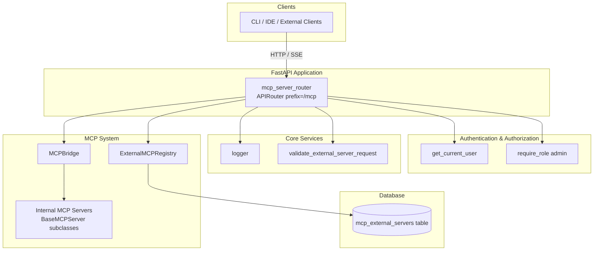
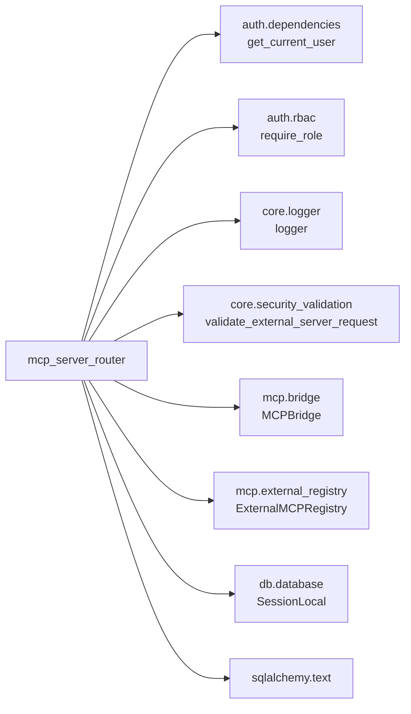
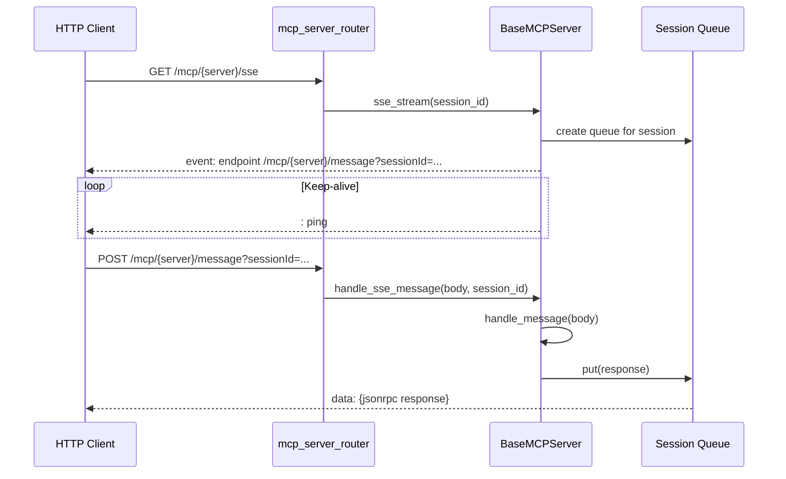
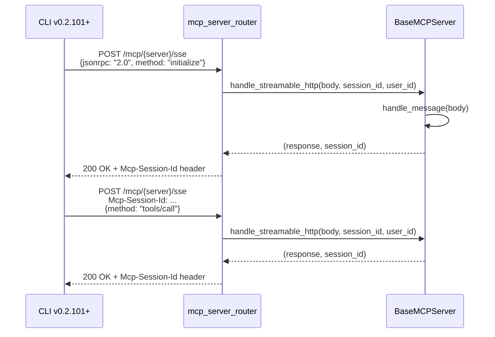
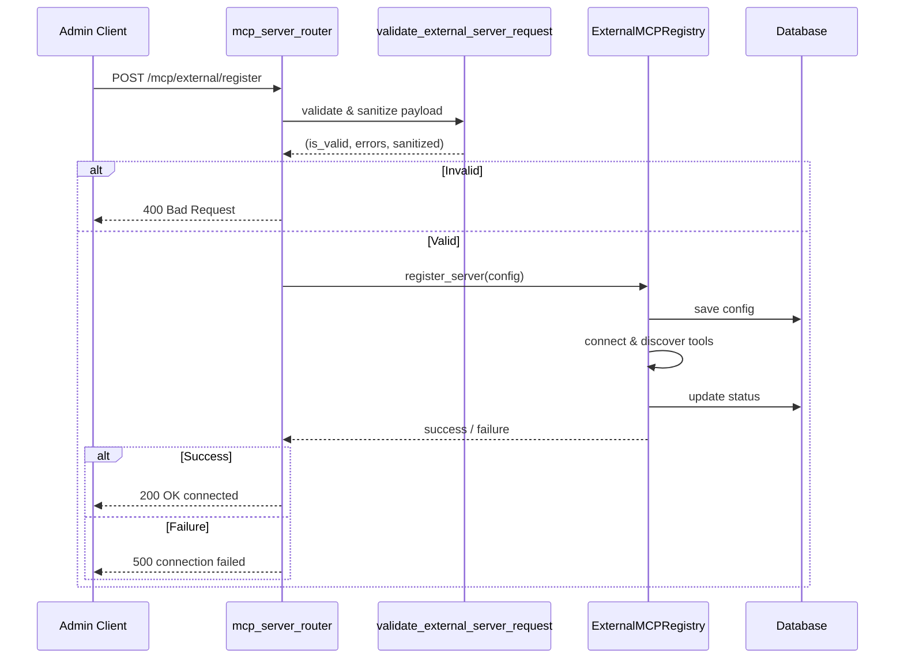
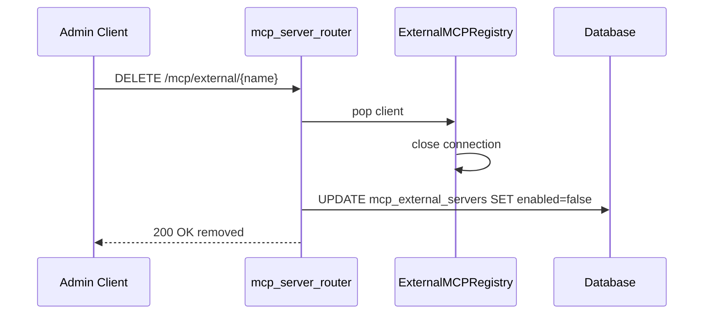
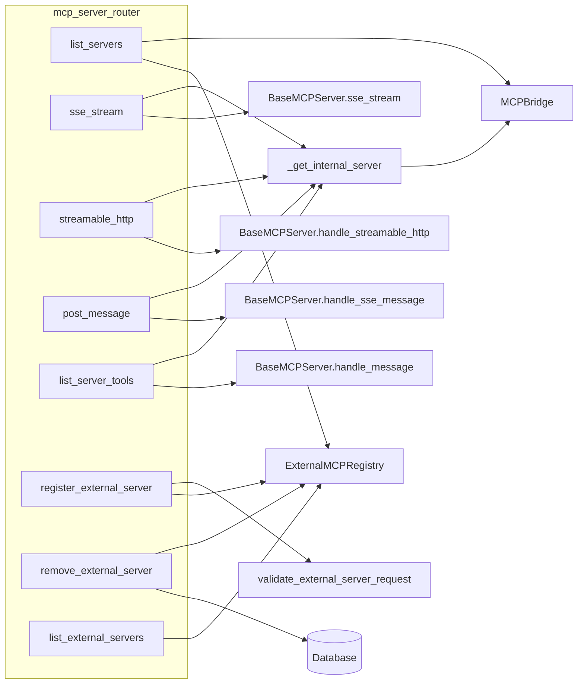

# MCP Server Router

## Brief Introduction

The `mcp_server_router` module is the HTTP-facing API layer that exposes the platform's internal and external [MCP (Model Context Protocol)](https://modelcontextprotocol.io) servers over FastAPI. It provides discovery endpoints, SSE (Server-Sent Events) and Streamable HTTP transports, JSON-RPC message dispatch, and administrative controls for registering or removing external MCP servers.

This router acts as the bridge between HTTP clients (such as the CLI, IDE plugins, or external integrations) and the underlying [MCP system](../mcp/mcp_system.md), authentication layer, and database persistence.

---

## Module Purpose and Core Functionality

The module implements a single FastAPI `APIRouter` mounted at `/mcp`. Its responsibilities are:

1. **Server Discovery** — List all available internal and external MCP servers, including their exposed tools.
2. **SSE Transport** — Establish long-lived Server-Sent Events streams for JSON-RPC communication with internal MCP servers.
3. **Streamable HTTP Transport** — Support the MCP 2024-11-05 Streamable HTTP spec for stateless request/response JSON-RPC calls.
4. **JSON-RPC Message Dispatch** — Accept `POST /mcp/{server}/message` requests and route them to the correct internal server, forwarding the authenticated user's identity.
5. **Tool Discovery Shortcut** — Provide a REST shortcut to list tools for a server without requiring SSE setup.
6. **External Server Lifecycle Management** — Allow administrators to register, list, and remove external MCP server connections, with validation and database persistence.

### Core Components

| Component | Type | Responsibility |
|-----------|------|----------------|
| `list_servers` | Route handler | Returns all internal and external MCP servers with tool summaries. |
| `sse_stream` | Route handler | Opens an SSE stream to an internal MCP server. |
| `streamable_http` | Route handler | Handles MCP Streamable HTTP POST requests. |
| `post_message` | Route handler | Accepts JSON-RPC messages for SSE or synchronous dispatch. |
| `list_server_tools` | Route handler | REST shortcut to list tools exposed by an internal server. |
| `register_external_server` | Route handler | Admin-only endpoint to register and connect an external MCP server. |
| `remove_external_server` | Route handler | Admin-only endpoint to disconnect and disable an external MCP server. |
| `list_external_servers` | Route handler | Lists external server connection status and registered tools. |
| `ExternalServerRegisterRequest` | Pydantic model | Validates registration payloads for external servers. |
| `_get_internal_server` | Helper | Resolves an internal server slug to a `BaseMCPServer` instance. |

---

## Architecture and Component Relationships

### High-Level Architecture

### Dependency Map

The router intentionally delegates all transport, protocol, and registry logic to the [MCP system](../mcp/mcp_system.md). It only concerns itself with HTTP routing, authentication, input validation, and response formatting.

---

## How the Module Fits into the Overall System

The `mcp_server_router` is one of many [shared API routers](../core/shared_api_routers.md) mounted into the main FastAPI application. It exposes the platform's MCP capabilities to authenticated clients while keeping the protocol implementation inside the dedicated [MCP system](../mcp/mcp_system.md).

Key integration points:

- **[MCP System](../mcp/mcp_system.md)**: The router relies on `MCPBridge` for internal server discovery and `ExternalMCPRegistry` for external server lifecycle management. Internal servers inherit from `BaseMCPServer`, which implements the actual JSON-RPC dispatch, SSE stream, and Streamable HTTP handlers.
- **[Authentication](../auth/authentication.md)**: All endpoints require a valid JWT via `get_current_user`. External server mutation endpoints additionally require the `admin` role via `require_role("admin")`.
- **[Core Infrastructure](../core/core_infrastructure.md)**: Uses the shared `logger` for observability and `validate_external_server_request` for sanitizing external server registration payloads.
- **[Database](../storage/database.md)**: External server removal updates the `mcp_external_servers` table directly to mark the server as disabled.

---

## Endpoint Reference

### Discovery

| Method | Path | Auth | Description |
|--------|------|------|-------------|
| `GET` | `/mcp/servers` | JWT | List internal and external MCP servers with tools. |
| `GET` | `/mcp/{server_name}/tools` | JWT | List tools for a specific internal server. |

### Internal Server Transports

| Method | Path | Auth | Description |
|--------|------|------|-------------|
| `GET` | `/mcp/{server_name}/sse` | JWT | Open an SSE stream to an internal server. |
| `POST` | `/mcp/{server_name}/sse` | JWT | Streamable HTTP JSON-RPC request/response. |
| `POST` | `/mcp/{server_name}/message` | JWT | Post a JSON-RPC message (SSE or sync). |

### External Server Management

| Method | Path | Auth | Description |
|--------|------|------|-------------|
| `POST` | `/mcp/external/register` | Admin | Register and connect an external MCP server. |
| `DELETE` | `/mcp/external/{name}` | Admin | Disconnect and disable an external server. |
| `GET` | `/mcp/external/servers` | JWT | List external server connection status. |

---

## Data Flows

### SSE Transport Flow

### Streamable HTTP Transport Flow

The `Mcp-Session-Id` header is echoed on every response as required by the MCP 2024-11-05 Streamable HTTP specification. Without this header, the CLI's `StreamableHttpClientWorker` rejects the handshake.

### External Server Registration Flow

### External Server Removal Flow

---

## Component Interaction

---

## Security and Governance

- **Authentication**: All endpoints require a valid JWT token resolved by `get_current_user`.
- **Authorization**: External server registration and removal are restricted to users with the `admin` role.
- **Input Validation**: External server registration payloads are sanitized and validated by `validate_external_server_request` before being passed to the registry.
- **User Identity Forwarding**: `post_message`, `streamable_http`, and tool calls forward the authenticated `user_id` to internal servers. This enables per-user credential injection for servers such as `GitLabMCPServer`.
- **Compliance**: Internal servers run input and output compliance checks inside `BaseMCPServer._handle_tools_call`. PCI-audited tools are logged to the `tool_audit_log` table.

---

## Related Documentation

- [MCP System](../mcp/mcp_system.md) — Internal server base class, bridge, external registry, and tool registration.
- [Authentication](../auth/authentication.md) — JWT dependency and role-based access control.
- [Core Infrastructure](../core/core_infrastructure.md) — Shared logging and security validation utilities.
- [Database](../storage/database.md) — SQLAlchemy session management and `mcp_external_servers` persistence.
- [Shared API Routers](../core/shared_api_routers.md) — Overview of all platform API routers.
