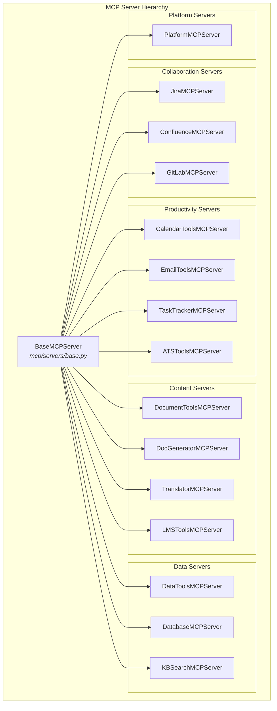
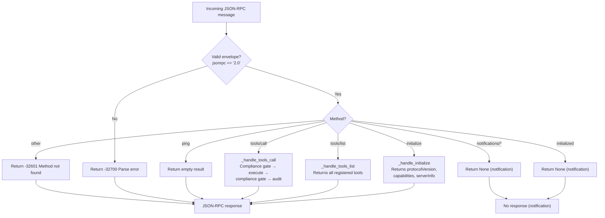
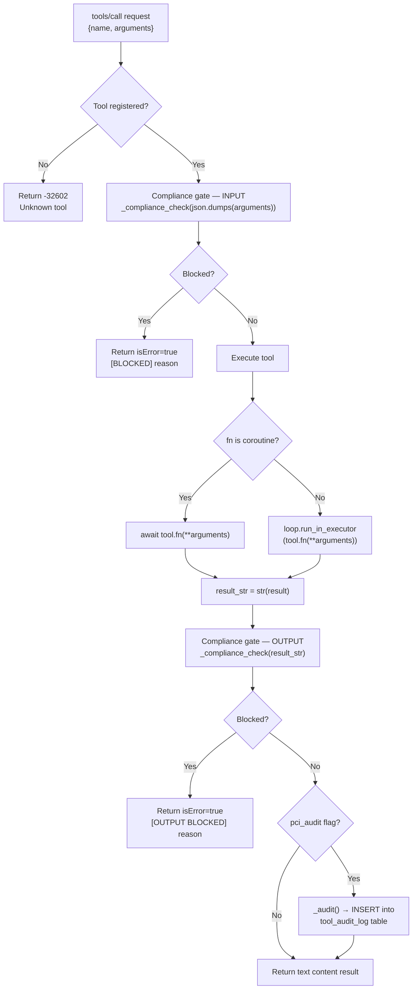
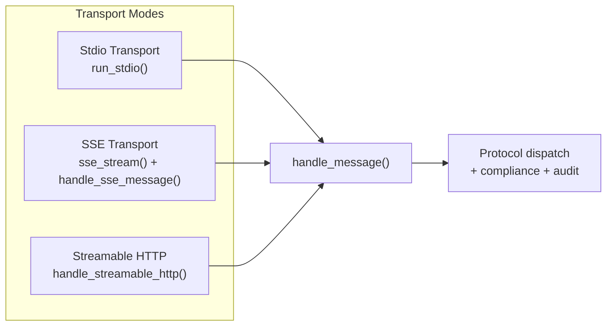
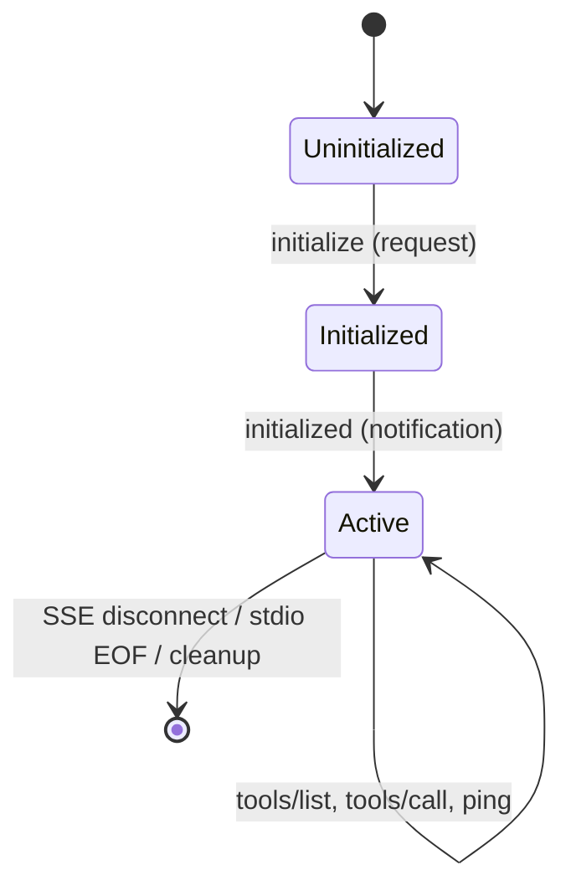
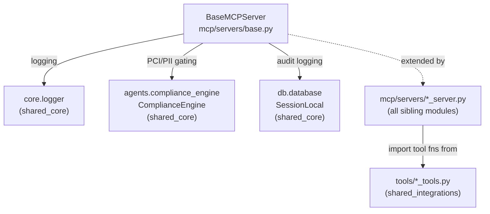
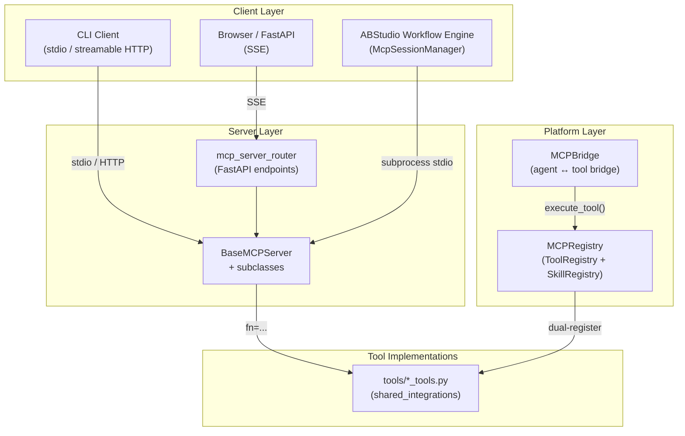

# MCP Servers Base (`mcp_servers_base`)

## Overview

The `mcp_servers_base` module provides the foundational `BaseMCPServer` class — a spec-compliant JSON-RPC 2.0 MCP (Model Context Protocol) server implementation that all concrete MCP server subclasses in the platform inherit from. It handles the full MCP lifecycle: protocol handshake, tool discovery (`tools/list`), tool invocation (`tools/call`), PCI/PII compliance gating on both input and output, and audit logging for sensitive tools. The base class supports three transport modes — **stdio**, **SSE (Server-Sent Events)**, and **Streamable HTTP** — enabling the same server to be consumed by CLI clients, browser-based SSE consumers, and modern streamable-HTTP MCP clients alike.

Every domain-specific MCP server (Jira, Confluence, GitLab, Calendar, Email, Database, Platform, etc.) extends `BaseMCPServer`, overriding only `_setup_tools()` to register its tool catalogue. All protocol dispatch, compliance enforcement, error serialization, and transport logic is centralised in the base class.

---

## Architecture



### Core Components

| Component | Type | Description |
|-----------|------|-------------|
| `BaseMCPServer` | Class | Abstract base for all MCP servers. Manages tool registry, session state, protocol dispatch, compliance gates, and transport. |
| `MCPTool` | Dataclass | Tool descriptor holding name, description, callable, JSON-schema input definition, and PCI audit flag. |
| `_compliance_check` | Function | Wrapper around `ComplianceEngine.validate_input()` that returns a block reason string if PCI/PII is detected, or `None` if clean. |
| `_ok` / `_err` / `_text_content` | Functions | JSON-RPC 2.0 response builders for success, error, and text-content envelopes. |

### Protocol Constants

| Constant | Value | Description |
|----------|-------|-------------|
| `MCP_PROTOCOL_VERSION` | `"2024-11-05"` | MCP protocol version advertised during `initialize` handshake. |
| `MCP_SERVER_VERSION` | `"1.0.0"` | Default server version (overridden by subclasses via `server_version`). |

---

## Class: `BaseMCPServer`

### Design Pattern

`BaseMCPServer` follows the **Template Method** pattern. The base class implements the complete JSON-RPC dispatch loop, transport handling, and compliance/audit pipeline. Subclasses override a single hook — `_setup_tools()` — to populate the tool registry by calling `self._register(MCPTool(...))`.

### Key Attributes

| Attribute | Type | Description |
|-----------|------|-------------|
| `server_name` | `str` | Identifier used in SSE endpoint paths and logs (e.g. `"jira"`, `"platform"`). Overridden by subclasses. |
| `server_version` | `str` | Version string returned in `initialize` response. Defaults to `MCP_SERVER_VERSION`. |
| `_tools` | `Dict[str, MCPTool]` | In-memory tool registry keyed by tool name. |
| `_sessions` | `Dict[str, dict]` | Active session state keyed by session ID. Tracks initialization status and SSE message queues. |

### Tool Registration

Subclasses register tools in `_setup_tools()`:

```python
class JiraMCPServer(BaseMCPServer):
    server_name = "jira"

    def _setup_tools(self):
        self._register(MCPTool(
            name="jira_create_issue",
            description="Create a new Jira issue...",
            fn=jira_create_issue,
            pci_audit=True,  # full I/O logged to audit table
            input_schema={
                "type": "object",
                "properties": { ... },
                "required": ["summary", "description"],
            },
        ))
```

The `MCPTool` dataclass fields:

| Field | Type | Default | Description |
|-------|------|---------|-------------|
| `name` | `str` | — | Unique tool name (required). |
| `description` | `str` | — | Human-readable description surfaced in `tools/list`. |
| `fn` | `Callable` | — | The tool's implementation function (sync or async). |
| `input_schema` | `Dict[str, Any]` | `{"type": "object", "properties": {}}` | JSON Schema for tool arguments. |
| `pci_audit` | `bool` | `False` | If `True`, full input/output is logged to the `tool_audit_log` Postgres table. |

---

## Protocol Dispatch

The `handle_message()` method is the central dispatch point for all JSON-RPC requests. It validates the envelope, routes to the appropriate handler, and catches unhandled exceptions.



### Supported JSON-RPC Methods

| Method | Type | Handler | Description |
|--------|------|---------|-------------|
| `initialize` | Request | `_handle_initialize` | Protocol handshake. Returns version, capabilities, and server info. Creates session. |
| `initialized` | Notification | — | Client confirmation. No response sent. |
| `tools/list` | Request | `_handle_tools_list` | Returns all registered tools with name, description, and inputSchema. |
| `tools/call` | Request | `_handle_tools_call` | Executes a named tool with arguments. Subject to compliance gates. |
| `ping` | Request | — | Health check. Returns empty result. |
| `notifications/*` | Notification | — | Server notifications are silently ignored. |

### JSON-RPC Error Codes

| Code | Meaning | When |
|------|---------|------|
| `-32700` | Parse error | Message is not valid JSON or not a dict. |
| `-32600` | Invalid Request | `jsonrpc` field is not `"2.0"`. |
| `-32601` | Method not found | Unknown method on a request (not notification). |
| `-32602` | Invalid params | Unknown tool name or argument type mismatch. |
| `-32603` | Internal error | Unhandled exception during dispatch. |

---

## Tool Execution Pipeline (`tools/call`)

The `_handle_tools_call` method implements a multi-stage pipeline that enforces compliance before and after tool execution, with optional audit logging.



### Compliance Gating

Both input and output pass through `_compliance_check()`, which delegates to `ComplianceEngine.validate_input()` from the [shared_core](../core/shared_core.md) module's `agent_system` subsystem. The compliance engine uses a combination of regex detectors and an optional ML privacy service to detect PCI/PII patterns (PAN, CVV, Aadhaar, API keys, secrets, etc.).

- **Input gate**: If blocked, the tool is never executed. A `[BLOCKED]` response with `isError: true` is returned.
- **Output gate**: If blocked, the tool result is suppressed. A `[OUTPUT BLOCKED]` response with `isError: true` is returned.
- **Fail-open on errors**: If the compliance engine itself throws, the check logs a warning and returns `None` (no block), allowing execution to proceed. This prevents compliance infrastructure failures from taking down all MCP tools.

### Audit Logging

Tools flagged with `pci_audit=True` have their full input arguments, output (truncated to 2000 chars), and execution duration persisted to the `tool_audit_log` Postgres table via `_audit()`. This provides a tamper-evident trail for PCI-sensitive operations like Jira issue creation or platform agent invocations. Audit failures are logged at debug level and do not interrupt the response.

---

## Transport Layer

`BaseMCPServer` supports three transport mechanisms, all sharing the same `handle_message()` dispatch core.



### 1. Stdio Transport (`run_stdio`)

Used by CLI clients and subprocess-based MCP consumers. The server reads JSON-RPC messages line-by-line from `stdin` and writes responses to `stdout`.

- **Session**: A single UUID session is created at startup.
- **Loop**: `sys.stdin.readline()` is run in a thread executor to avoid blocking the event loop.
- **Lifecycle**: Runs until EOF or unrecoverable error.
- **Usage**: `asyncio.run(server.run_stdio())`

### 2. SSE Transport (`sse_stream` + `handle_sse_message`)

Used by browser-based and FastAPI-integrated consumers. Exposed via two endpoints:

| Endpoint | Method | Handler | Description |
|----------|--------|---------|-------------|
| `/mcp/{name}/sse` | GET | `sse_stream(session_id)` | Opens a persistent SSE stream. First event is `endpoint` with the POST URL. Keep-alive pings every 15s. |
| `/mcp/{name}/message` | POST | `handle_sse_message(body, session_id)` | Processes a JSON-RPC message and pushes the response onto the session's SSE queue. |

The SSE stream uses an `asyncio.Queue` per session. Responses from `handle_message()` are pushed to the queue, and the stream generator yields them as `data:` events. If no message arrives within 15 seconds, a `: ping` keep-alive comment is sent.

### 3. Streamable HTTP Transport (`handle_streamable_http`)

Used by CLI v0.2.101+ and modern MCP clients that POST JSON-RPC directly and expect inline responses without a persistent SSE stream.

- **Session**: Generates a session ID if not provided. The caller (typically `mcp_server_router`) must echo the returned `Mcp-Session-Id` header on every reply.
- **Returns**: `(response_dict, mcp_session_id)` tuple.
- **Shared logic**: Thin wrapper over `handle_message()` — all dispatch, compliance, and audit logic is identical to the SSE path.

---

## Session Management



Sessions are tracked in `_sessions: Dict[str, dict]`. Each session entry contains:

| Field | Description |
|-------|-------------|
| `initialized` | Whether the `initialize` handshake has completed. |
| `client_version` | Protocol version reported by the client. |
| `queue` | (SSE only) `asyncio.Queue` for pushing responses to the stream. |

Sessions are created on `initialize` (SSE/HTTP) or at stdio startup, and cleaned up when the SSE stream disconnects or the stdio loop ends.

---

## Dependencies



### Internal Dependencies

| Dependency | Module | Purpose |
|------------|--------|---------|
| `core.logger` | [shared_core](../core/shared_core.md) → `core_infrastructure` | Structured logging for all server operations. |
| `agents.compliance_engine.ComplianceEngine` | [shared_core](../core/shared_core.md) → `agent_system` → `decision_engines` | PCI/PII detection and blocking for tool I/O. |
| `db.database.SessionLocal` | [shared_core](../core/shared_core.md) → `database` | Postgres session for audit log inserts. |

### Downstream Consumers

| Consumer | Module | How it uses `BaseMCPServer` |
|----------|--------|-----------------------------|
| All MCP server subclasses | [mcp_servers_collaboration](mcp_servers_collaboration.md), [mcp_servers_productivity](mcp_servers_productivity.md), [mcp_servers_content](mcp_servers_content.md), [mcp_servers_data](mcp_servers_data.md), [mcp_servers_platform](mcp_servers_platform.md) | Extend `BaseMCPServer`, override `_setup_tools()`. |
| `mcp_server_router` | [shared_api_routers](../core/shared_api_routers.md) → `mcp_server_router` | Mounts each server's SSE and streamable-HTTP endpoints on FastAPI. Calls `sse_stream()` and `handle_streamable_http()`. |
| `McpSessionManager` | abstudio_backend → `core_mcp_manager` | Spawns MCP server subprocesses (stdio transport) for workflow execution. Uses the MCP client SDK to connect to `BaseMCPServer` instances. |
| `MCPRegistry` | [shared_core](../core/shared_core.md) → `mcp_system` | Dual-registers the same tool functions from MCP servers into the platform's in-memory `ToolRegistry` for direct agent access. |

---

## Integration with the Broader MCP Ecosystem



The `BaseMCPServer` sits at the centre of the MCP ecosystem. It serves as:

1. **Protocol gateway**: Translates JSON-RPC 2.0 MCP protocol into direct Python function calls.
2. **Compliance enforcement point**: Every tool invocation passes through PCI/PII gates before and after execution.
3. **Audit capture**: PCI-flagged tools have their full I/O recorded for regulatory compliance.
4. **Transport abstraction**: The same server instance can serve stdio, SSE, and streamable-HTTP clients without code changes.

The `MCPRegistry` in [shared_core](../core/shared_core.md) → `mcp_system` provides a parallel, in-memory registry that dual-registers the same tool functions for direct agent access (bypassing the JSON-RPC layer when the agent runtime is in-process). This means tools are accessible both via MCP protocol (for external clients) and via direct Python calls (for internal agent orchestration).

---

## Subclass Implementation Guide

To create a new MCP server:

1. **Create the server file** at `mcp/servers/{name}_server.py`.
2. **Implement tool functions** in `tools/{name}_tools.py` (see [shared_integrations](../skills/shared_integrations.md)).
3. **Subclass `BaseMCPServer`**:

```python
from mcp.servers.base import BaseMCPServer, MCPTool

class MyToolsMCPServer(BaseMCPServer):
    server_name = "my_tools"

    def _setup_tools(self):
        self._register(MCPTool(
            name="my_tool",
            description="Does something useful.",
            fn=my_tool_function,
            pci_audit=False,
            input_schema={
                "type": "object",
                "properties": {
                    "param": {"type": "string", "description": "A parameter"}
                },
                "required": ["param"],
            },
        ))
```

4. **Register with the router**: The `mcp_server_router` in [shared_api_routers](../core/shared_api_routers.md) auto-mounts servers at `/mcp/{name}/sse` and `/mcp/{name}/message`.
5. **Dual-register with MCPRegistry**: Add the tool functions to `MCPRegistry._register_tools()` in [shared_core](../core/shared_core.md) → `mcp_system` for in-process agent access.

### Key Implementation Notes

- **Async tools**: If `tool.fn` is a coroutine function, it is awaited directly. Sync functions are executed via `loop.run_in_executor()` to avoid blocking the event loop.
- **Error handling**: Tool execution errors are caught and returned as `isError: true` responses (not JSON-RPC errors), allowing the client to see the error message. Only `TypeError` (argument mismatch) returns a JSON-RPC `-32602` error.
- **Compliance fail-open**: If `ComplianceEngine` throws, the gate returns `None` (no block) and logs a warning. This ensures compliance infrastructure outages don't take down all MCP tools.
- **Audit truncation**: Audit output is truncated to 2000 characters to prevent oversized log entries.
- **Session cleanup**: SSE sessions are removed from `_sessions` in the `finally` block of `sse_stream()`, ensuring no session leaks even on client disconnect.

---

## Related Documentation

| Module | Relationship |
|--------|-------------|
| [mcp_servers_collaboration](mcp_servers_collaboration.md) | Jira, Confluence, GitLab MCP servers extending `BaseMCPServer` |
| [mcp_servers_productivity](mcp_servers_productivity.md) | Calendar, Email, Task Tracker, ATS MCP servers |
| [mcp_servers_content](mcp_servers_content.md) | Document, Doc Generator, Translator, LMS MCP servers |
| [mcp_servers_data](mcp_servers_data.md) | Data, Database, KB Search MCP servers |
| [mcp_servers_platform](mcp_servers_platform.md) | Platform MCP server (RAG, agent invocation, health) |
| [shared_core](../core/shared_core.md) | `MCPRegistry`, `MCPBridge`, `ToolRegistry`, `ComplianceEngine`, `core.logger` |
| [shared_api_routers](../core/shared_api_routers.md) | `mcp_server_router` — FastAPI endpoint mounting |
| [shared_integrations](../skills/shared_integrations.md) | Tool function implementations (`tools/*_tools.py`) |
| abstudio_backend | `McpSessionManager` — subprocess MCP client for workflow execution |
