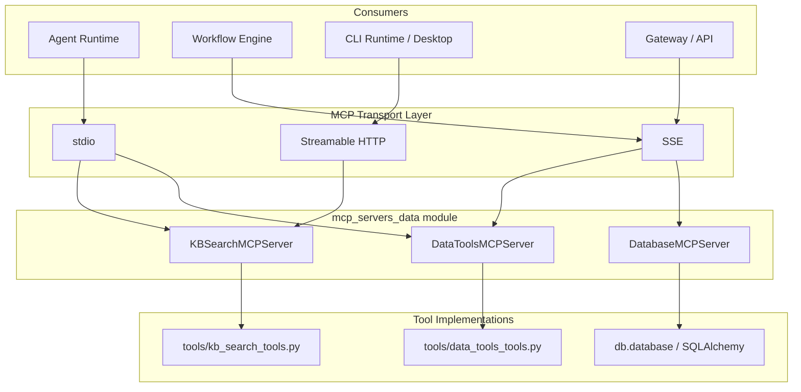
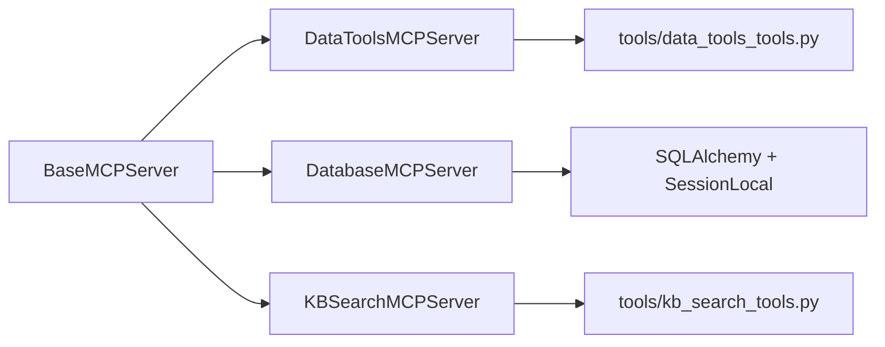
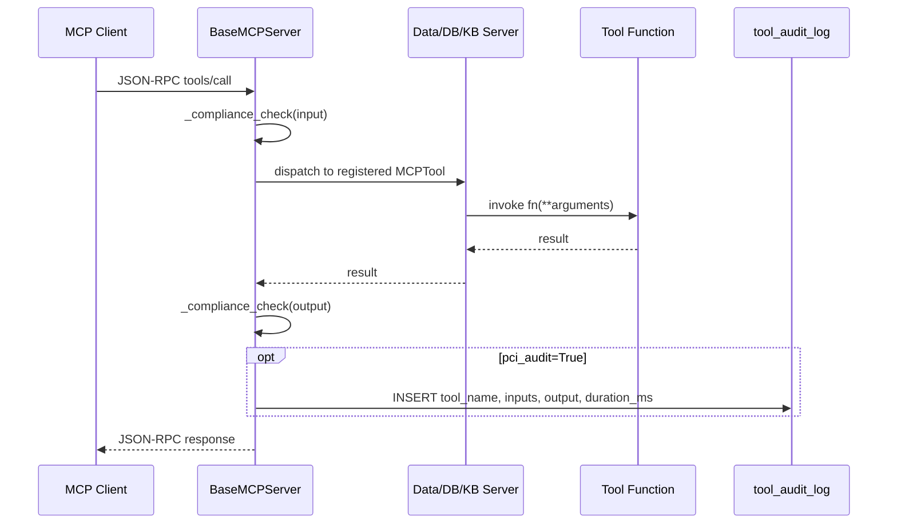
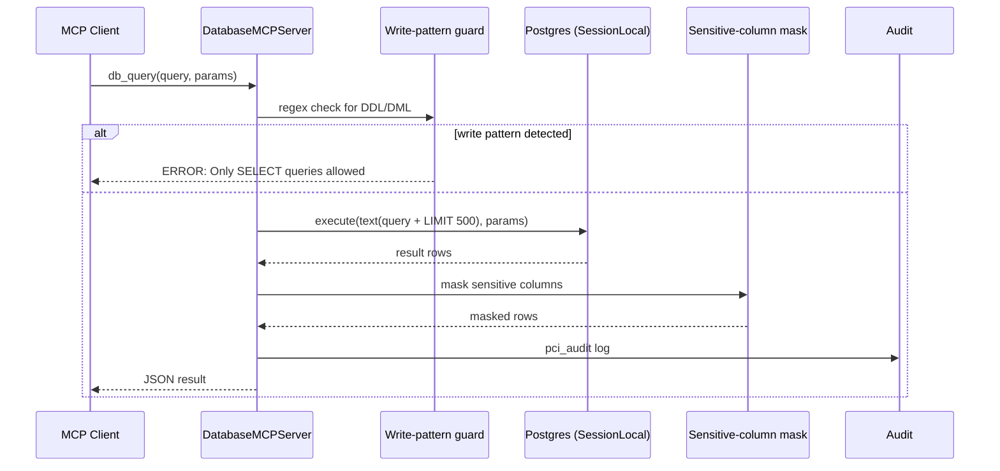
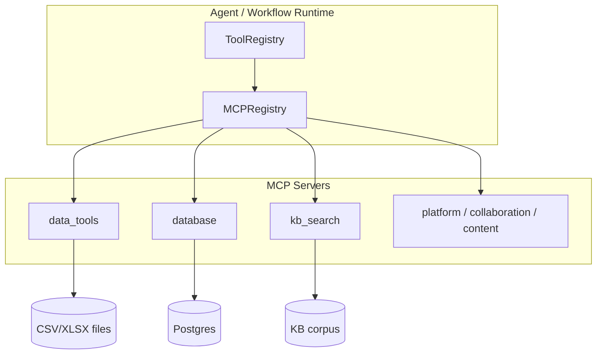

# MCP Servers — Data Module

## Brief Introduction

The `mcp_servers_data` module exposes three Model Context Protocol (MCP) servers that give agents deterministic, auditable access to tabular files, read-only relational data, and knowledge-base documents. Each server is a thin adapter that wraps existing tool implementations from [`shared_integrations`](../reference/shared_integrations.md) / [`shared_core`](../reference/shared_core.md) and exposes them as spec-compliant MCP tools over stdio, SSE, or streamable HTTP transports.

| Server | File | Purpose |
|--------|------|---------|
| `data_tools` | `mcp/servers/data_tools_server.py` | CSV/XLSX discovery, querying, variance analysis, reconciliation, and charting. |
| `database` | `mcp/servers/database_server.py` | Read-only SQL access to the NPCI Postgres database with PCI-sensitive column masking. |
| `kb_search` | `mcp/servers/kb_search_server.py` | Namespace listing, keyword search, and full-document retrieval from the knowledge base. |

These servers inherit from [`BaseMCPServer`](mcp_servers_base.md) and are registered through the shared [`MCPRegistry`](../reference/shared_core.md#mcp_system), allowing them to be consumed by the agent runtime, workflow engine, and CLI runtime.

---

## Architecture

### High-level component diagram

### Module structure

---

## Core Components

### `DataToolsMCPServer`

Wraps [`tools/data_tools_tools.py`](../reference/shared_integrations.md#data_tools) to expose tabular-file operations as MCP tools. It is intended for deterministic analysis of CSV/XLSX files stored under a configured data root.

| Tool | Function | Description |
|------|----------|-------------|
| `list_tables` | `list_tables` | Discover CSV/XLSX files under the data root. |
| `describe_table` | `describe_table` | Return schema, row count, sample rows, and numeric summary. |
| `query_table` | `query_table` | Apply pandas filter expressions, grouping, and aggregation. |
| `variance_report` | `variance_report` | Compute budget-vs-actual variance and flag outliers. |
| `reconcile` | `reconcile` | Fuzzy-match two transaction tables by reference and amount. |
| `make_chart` | `make_chart` | Render line/bar/scatter charts to PNG. |

Tools marked with `pci_audit=True` (`variance_report`, `reconcile`, `make_chart`) are written to the `tool_audit_log` table by the base class.

### `DatabaseMCPServer`

Provides read-only, audited access to the internal Postgres database. Security is enforced at multiple layers:

- **Parse-time block**: `INSERT/UPDATE/DELETE/DROP/CREATE/ALTER/TRUNCATE/GRANT/REVOKE/EXEC/COPY/CALL` are rejected by regex.
- **Row limit**: every query is suffixed with `LIMIT 500`.
- **Timeout**: enforced by the underlying execution path (10s target).
- **PII masking**: columns named `pan`, `card_number`, `cvv`, `aadhaar`, `mobile`, `email`, etc. are replaced with `***`.

| Tool | Function | Description |
|------|----------|-------------|
| `db_query` | `_db_query` | Execute a parameterized `SELECT` query. |
| `db_list_tables` | `_db_list_tables` | List tables in a schema. |
| `db_describe` | `_db_describe` | Describe columns, types, and whether a column is masked. |

`db_query` is flagged `pci_audit=True`.

### `KBSearchMCPServer`

Wraps [`tools/kb_search_tools.py`](../reference/shared_integrations.md#kb_search_tools) to let agents retrieve grounded knowledge for reply drafting, HR policy Q&A, and RFP content lookup.

| Tool | Function | Description |
|------|----------|-------------|
| `list_namespaces` | `list_namespaces` | List configured KB namespaces and ACL band. |
| `search` | `search` | Keyword search a namespace; returns scored passages. |
| `get_document` | `get_document` | Fetch full document text by `doc_id`. |

---

## Data Flow

### Tool invocation flow

### Database query flow

---

## Component Relationships

- All three servers extend [`BaseMCPServer`](mcp_servers_base.md), which provides JSON-RPC dispatch, compliance scanning, audit logging, and transport implementations.
- `DataToolsMCPServer` and `KBSearchMCPServer` delegate to the shared tool layer documented in [`shared_integrations`](../reference/shared_integrations.md).
- `DatabaseMCPServer` uses [`db.database.SessionLocal`](../reference/shared_core.md#database) directly, bypassing the tool layer because it needs fine-grained control over SQL parsing, parameter binding, and masking.
- The `pci_audit` flag on [`MCPTool`](mcp_servers_base.md) ties these servers into the platform audit subsystem.

---

## How It Fits into the System

The data MCP servers are one category within the broader [`mcp_servers`](mcp_servers.md) family. They are typically consumed as follows:

1. **Agent runtime** — [`AgentBuilder`](../reference/shared_core.md#agent_system) / [`MultiAgentRunner`](../reference/shared_core.md#agent_system) resolves tool names through [`ToolRegistry`](../reference/shared_core.md#mcp_system) and calls the appropriate MCP server.
2. **Workflow engine** — [`WorkflowEngine`](../reference/shared_core.md#workflow_system) and [`NativeEngine`](../ui/abstudio_backend.md#engine_native_engine) can include MCP nodes that invoke `data_tools` or `kb_search` tools.
3. **CLI runtime** — [`AbstudioMcpServer`](../ui/abstudio_backend.md#cli_runtime) and the desktop client use stdio/streamable HTTP to reach these servers.
4. **Gateway** — [`mcp_server_router`](../api/shared_api_routers.md#mcp_server_router) exposes SSE and streamable HTTP endpoints that route to the running MCP server instances.

---

## Security & Compliance Notes

- `DatabaseMCPServer` is **read-only by design**. Any query containing a write keyword is rejected before execution.
- Sensitive columns are masked by column name; this is a defense-in-depth measure and should be complemented by database-level RLS.
- `variance_report`, `reconcile`, and `make_chart` are audited because they may process financial or PCI-adjacent tabular data.
- All tool inputs and outputs pass through the shared `_compliance_check` gate in [`BaseMCPServer`](mcp_servers_base.md).

---

## References

- [`mcp_servers_base.md`](mcp_servers_base.md) — `BaseMCPServer` and `MCPTool` framework.
- [`shared_integrations.md`](../reference/shared_integrations.md) — underlying tool implementations (`data_tools_tools.py`, `kb_search_tools.py`).
- [`shared_core.md`](../reference/shared_core.md) — database layer, MCP registry, and audit infrastructure.
- [`abstudio_backend.md`](../ui/abstudio_backend.md) — workflow engine, CLI runtime, and API routes that consume these servers.
- [`shared_api_routers.md`](../api/shared_api_routers.md) — `mcp_server_router` exposing SSE/streamable HTTP endpoints.
