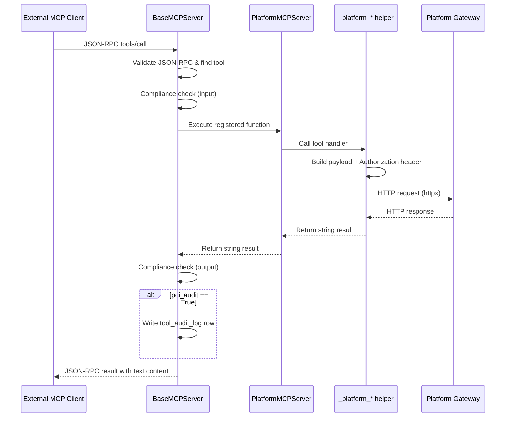
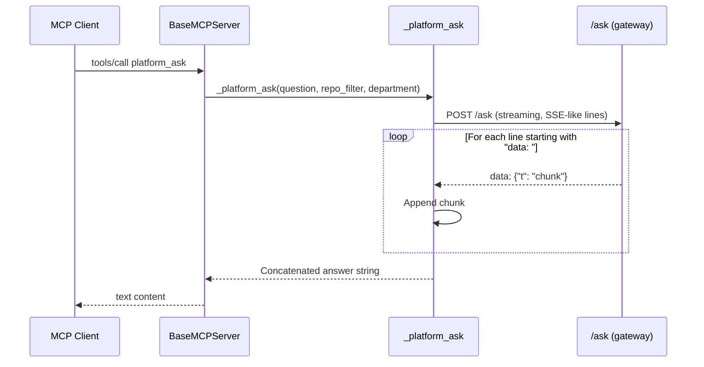
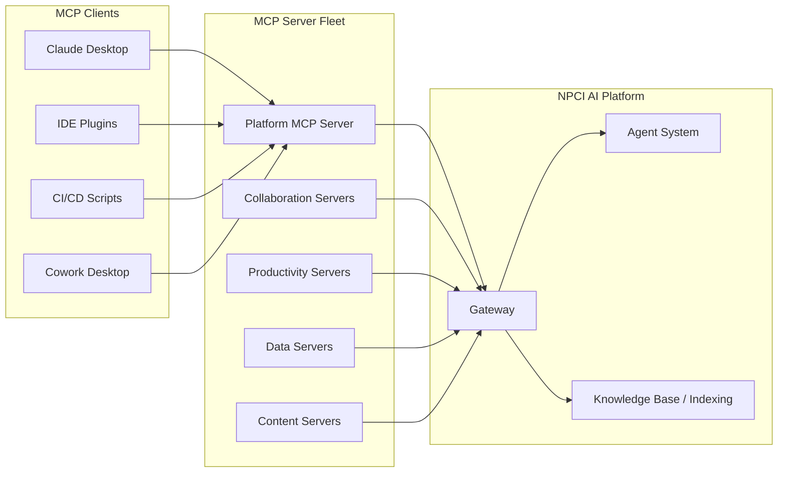

# MCP Servers Platform Module

## Brief Introduction

The `mcp_servers_platform` module implements the **Platform MCP Server** — a [Model Context Protocol (MCP)](https://modelcontextprotocol.io) server that exposes core NPCI AI platform capabilities as discoverable tools. It allows external MCP clients (other AI assistants, IDE plugins, CI/CD pipelines, or automation scripts) to query the platform's knowledge base, invoke production agents, and check platform health over the MCP protocol.

The module is intentionally thin: it translates MCP `tools/call` requests into authenticated HTTP calls against the platform's REST API (the [gateway](../models/gateway.md)), then returns the results as MCP-compliant text content. It reuses the shared `BaseMCPServer` infrastructure for protocol handling, compliance gating, and audit logging.

---

## Core Responsibilities

1. **Expose platform capabilities as MCP tools** — RAG Q&A, agent execution, agent discovery, indexing status, and health checks.
2. **Authenticate service-to-service** using a bearer token (`PLATFORM_SERVICE_TOKEN`) when calling the platform API.
3. **Bridge transport protocols** by inheriting stdio, SSE, and streamable-HTTP transports from `BaseMCPServer`.
4. **Participate in governance** by marking the agent-invocation tool for PCI audit and routing all tool I/O through the base class compliance checks.

---

## Architecture

### Component Overview

```mermaid
flowchart TB
    subgraph Client["External MCP Client"]
        A[Claude Desktop / IDE / CI]
    end

    subgraph MCPTransport["MCP Transport Layer"]
        B[stdio]
        C[SSE]
        D[Streamable HTTP]
    end

    subgraph PlatformMCPServer["mcp_servers_platform"]
        E[PlatformMCPServer]
        F[_platform_ask]
        G[_platform_agent_run]
        H[_platform_list_agents]
        I[_platform_index_status]
        J[_platform_health]
    end

    subgraph BaseMCPServer["mcp_servers_base"]
        K[BaseMCPServer]
        L[handle_message]
        M[_handle_tools_call]
        N[Compliance Check]
        O[Audit Logging]
    end

    subgraph PlatformAPI["Platform API (gateway)"]
        P[/ask]
        Q[/agents/{name}/run]
        R[/agents]
        S[/index/{repo}/status]
        T[/health]
    end

    A -->|MCP JSON-RPC| B
    A -->|MCP JSON-RPC| C
    A -->|MCP JSON-RPC| D
    B --> E
    C --> E
    D --> E

    E -->|inherits| K
    E --> F
    E --> G
    E --> H
    E --> I
    E --> J

    K --> L
    L --> M
    M --> N
    M --> O

    M -->|calls| F
    M -->|calls| G
    M -->|calls| H
    M -->|calls| I
    M -->|calls| J

    F -->|HTTP POST| P
    G -->|HTTP POST| Q
    H -->|HTTP GET| R
    I -->|HTTP GET| S
    J -->|HTTP GET| T
```

### Key Components

| Component | File | Role |
|-----------|------|------|
| `PlatformMCPServer` | `mcp/servers/platform_server.py` | Concrete MCP server that registers the five platform tools. |
| `BaseMCPServer` | `mcp/servers/base.py` | Shared base class providing JSON-RPC dispatch, transport adapters, compliance, and audit. See [mcp_servers_base](mcp_servers_base.md). |
| `MCPTool` | `mcp/servers/base.py` | Data class describing an MCP tool (name, description, function, input schema, PCI audit flag). |
| `_platform_*` helpers | `mcp/servers/platform_server.py` | Synchronous HTTP wrappers around the platform REST API. |

---

## Exposed MCP Tools

| Tool Name | HTTP Method | Platform Endpoint | Purpose | PCI Audit |
|-----------|-------------|-------------------|---------|-----------|
| `platform_ask` | `POST` | `/ask` | RAG-powered Q&A against indexed codebases and documents. | No |
| `platform_agent_run` | `POST` | `/agents/{agent_name}/run` | Invoke a named production agent with a message. | Yes |
| `platform_list_agents` | `GET` | `/agents` | Discover available production agents. | No |
| `platform_index_status` | `GET` | `/index/{repo}/status` | Check indexing status, chunk count, and last-indexed date. | No |
| `platform_health` | `GET` | `/health` | Verify platform service health. | No |

### Tool Schemas

#### `platform_ask`

```json
{
  "type": "object",
  "properties": {
    "question":    { "type": "string", "description": "The question to ask" },
    "repo_filter": { "type": "string", "description": "Limit search to a specific repo" },
    "department":  { "type": "string", "description": "Department context for scoping" }
  },
  "required": ["question"]
}
```

#### `platform_agent_run`

```json
{
  "type": "object",
  "properties": {
    "agent_name": { "type": "string", "description": "Agent name as registered in the platform" },
    "message":    { "type": "string", "description": "Message to send to the agent" },
    "session_id": { "type": "string", "description": "Session ID for memory continuity (optional)" }
  },
  "required": ["agent_name", "message"]
}
```

#### `platform_list_agents`

Accepts no arguments. Returns a markdown list of production agents with names and descriptions.

#### `platform_index_status`

```json
{
  "type": "object",
  "properties": {
    "repo": { "type": "string", "description": "Repository name or 'org/project' path" }
  },
  "required": ["repo"]
}
```

#### `platform_health`

Accepts no arguments. Returns the JSON response from the platform `/health` endpoint.

---

## Data Flow

### Tool Invocation Flow



### RAG Q&A Streaming Flow (`platform_ask`)



---

## Configuration

| Environment Variable | Default | Purpose |
|----------------------|---------|---------|
| `PLATFORM_BASE_URL` | `http://localhost:8000` | Base URL of the platform REST API (gateway). |
| `PLATFORM_SERVICE_TOKEN` | `""` | Bearer token used for service-to-service authentication. If empty, requests are sent unauthenticated. |

---

## Dependencies

### Internal Modules

| Module | Relationship | Description |
|--------|--------------|-------------|
| [mcp_servers_base](mcp_servers_base.md) | Extends | `PlatformMCPServer` inherits `BaseMCPServer`, `MCPTool`, transport, compliance, and audit behavior. |
| [gateway](../models/gateway.md) | Calls HTTP API | All tool handlers invoke endpoints served by the platform gateway. |
| [core_logger](../reference/shared_core.md#logging) | Uses | Logs server lifecycle and errors via `core.logger`. |

### External Libraries

- `httpx` — HTTP client used for streaming and synchronous requests to the platform API.
- Standard library: `asyncio`, `json`, `os`.

---

## How It Fits into the System

The Platform MCP Server is one of several domain-specific MCP servers in the `mcp_servers` family. While servers such as [mcp_servers_collaboration](mcp_servers_collaboration.md) (Jira, Confluence, GitLab) and [mcp_servers_productivity](mcp_servers_productivity.md) (calendar, email, tasks) expose third-party integrations, the platform server exposes **first-party NPCI AI platform capabilities**.



It enables external AI systems to:

- **Answer engineering questions** grounded in indexed codebases (`platform_ask`).
- **Orchestrate platform agents** from outside the web UI (`platform_agent_run`).
- **Discover and monitor** platform resources (`platform_list_agents`, `platform_index_status`, `platform_health`).

---

## Security & Governance

- **Service token authentication**: All mutating and sensitive reads use `PLATFORM_SERVICE_TOKEN` as a bearer token. The token must be provisioned by the platform operator.
- **Compliance gating**: Every tool input and output is scanned by the shared compliance check in `BaseMCPServer` before execution and before returning to the client.
- **PCI audit**: `platform_agent_run` sets `pci_audit=True`, so its inputs, outputs, and latency are persisted to the `tool_audit_log` table via `BaseMCPServer._audit`.
- **No PII in schemas**: Tool schemas accept only question text, repo/department scopes, agent names, and messages; file uploads or credentials are not handled here.

---

## Running the Server

The server can be started as a standalone stdio MCP server:

```bash
export PLATFORM_BASE_URL=https://platform.example.com
export PLATFORM_SERVICE_TOKEN=<service-token>
python -m mcp.servers.platform_server
```

It can also be registered with the platform's MCP registry and exposed through the [mcp_server_router](../api/shared_api_routers.md#mcp_server_router) over SSE or streamable HTTP.

---

## Error Handling

All helper functions are wrapped in broad `try/except` blocks. On failure they return a human-readable error string such as:

- `Platform ask error: <exception>`
- `Agent run error: <exception>`
- `Health check error: <exception>`

These strings are returned as MCP text content with `isError: false` (the tool itself did not crash; the downstream platform call failed). Lower-level MCP protocol errors (invalid JSON-RPC, unknown tool, invalid arguments) are handled by `BaseMCPServer`.

---

## Related Documentation

- [mcp_servers_base](mcp_servers_base.md) — Base class, transport, compliance, and audit details.
- [gateway](../models/gateway.md) — Platform REST API that the platform MCP server calls.
- [mcp_servers_collaboration](mcp_servers_collaboration.md) — Jira, Confluence, and GitLab MCP servers.
- [mcp_servers_productivity](mcp_servers_productivity.md) — Calendar, email, task tracker MCP servers.
- [mcp_servers_data](mcp_servers_data.md) — Database, data tools, and KB search MCP servers.
- [shared_api_routers.md#mcp_server_router](../api/shared_api_routers.md#mcp_server_router) — HTTP/SSE registration and routing for MCP servers.
