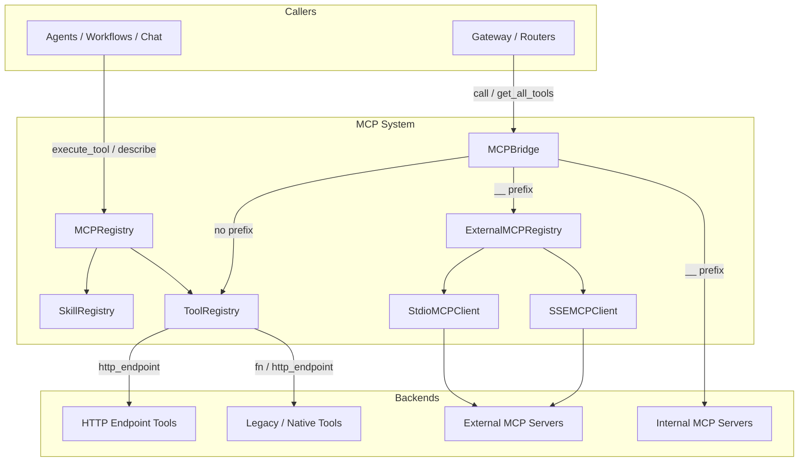
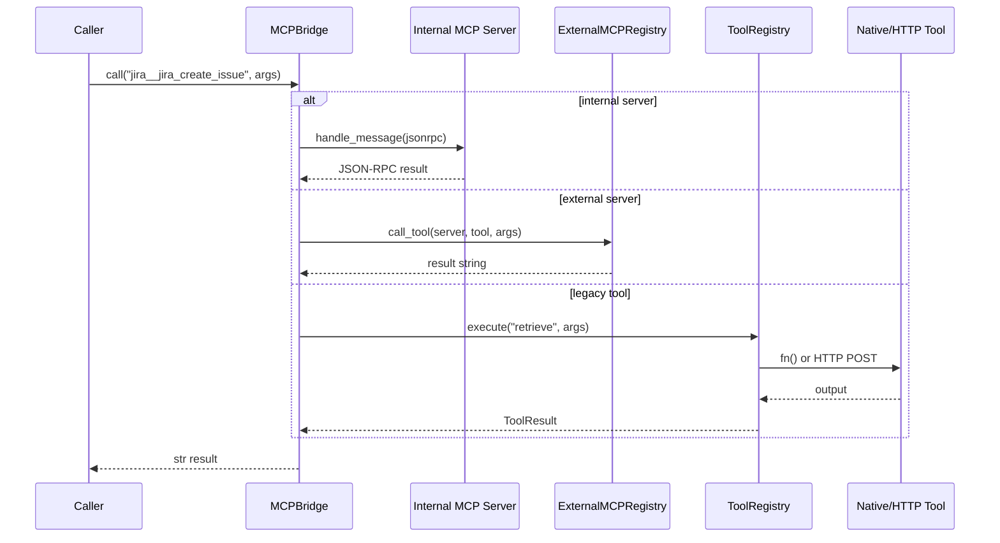

# MCP System

## Introduction

The **MCP System** is the central tool-and-skill integration layer of the NPCI Agentic Platform. It implements the [Model Context Protocol (MCP)](https://modelcontextprotocol.io) pattern: a unified registry where agents, workflows, and chat interfaces can discover and invoke capabilities by name, without knowing whether a capability is implemented as a local Python function, an in-process MCP server, an external MCP server over SSE/stdio, or a remote HTTP endpoint.

The module's responsibilities are:

1. **Register** every platform-native tool and skill at startup.
2. **Route** tool calls to the correct backend (internal MCP server, external MCP server, or legacy registry).
3. **Discover** tools and skills by tag, keyword, or semantic ranking.
4. **Execute** tools safely with timing, error capture, retries, parallel batching, and governance gates.
5. **Connect** to external MCP servers dynamically from database configuration.

MCP System sits between the higher-level agent/workflow engines and the concrete integrations. It is consumed by [agent_system](../agents/agent_system.md), [workflow_system](../workflows/workflow_system.md), [shared_api_routers](../core/shared_api_routers.md) (e.g. `mcp_server_router`, `mcp_governance_router`, `marketplace_router`), and the [gateway](../core/gateway.md).

---

## Architecture Overview



### Key Design Decisions

| Decision | Rationale |
|----------|-----------|
| **Single registry (`mcp_registry`)** | All callers use one import; bootstrapping is automatic on first import. |
| **Tool name namespaces** | `server__tool` (double underscore) disambiguates external/internal MCP tools from legacy tools. |
| **Synchronous bridge, async clients** | `MCPBridge.call()` blocks so legacy sync code can use it; external clients run in a dedicated event-loop thread. |
| **DB-loaded + hot-registered tools** | Production MCP server rows and marketplace submissions are loaded without restarts. |
| **Governance gate in `execute_tool`** | Non-`PRODUCTION` user-registered tools are blocked until approved. |
| **Web-search governance wrapper** | Search tools are intercepted and routed through the LLM proxy for budget/governance enforcement. |

---

## Sub-modules

| Sub-module | Files | Responsibility | Documentation |
|------------|-------|----------------|---------------|
| **Registry** | `mcp/registry.py`, `mcp/tool_registry.py`, `mcp/skill_registry.py` | Master registry, tool/skill metadata, execution, ranking, parallel batching, DB loading. | [mcp_system_registry.md](mcp_system_registry.md) |
| **Bridge & External Registry** | `mcp/bridge.py`, `mcp/external_registry.py` | Unified router between internal MCP servers, external MCP servers, and the legacy registry. | mcp_system_bridge.md |
| **Clients** | `mcp/client/sse_client.py`, `mcp/client/stdio_client.py` | Async MCP client transports over SSE and stdio. | mcp_system_clients.md |

---

## High-Level Functionality

### 1. Tool & Skill Registration

At platform startup, `MCPRegistry._bootstrap()`:

- Registers built-in tools: retrieval, compliance, code execution, self-healing, LLM generation, workflow runner, memory, A2A agent calls, Jira, GitLab, Confluence, Zoho leave, and the full set of non-engineering MCP tools (KB search, documents, calendar, email, tasks, data, ATS, doc generator, translator, LMS).
- Registers built-in skills: `answer_question`, `fix_bug`, `generate_code`, `run_tests`, `code_review`, `deploy_service`, `incident_response`.
- Loads `PRODUCTION` `MCPServer` rows from Postgres as HTTP tools.
- Syncs platform skills to `SkillRecord` rows in Postgres.

See [mcp_system_registry.md](mcp_system_registry.md) for the full registration flow.

### 2. Tool Call Routing

`MCPBridge.call(tool_name, arguments)` is the unified entry point:

- `server__tool` → internal MCP server (in-process `BaseMCPServer`).
- `server__tool` (not internal) → `ExternalMCPRegistry.call_tool()`.
- `tool` (no `__`) → legacy `ToolRegistry.execute()`.

This lets a single string name address any backend. See mcp_system_bridge.md.

### 3. External MCP Server Lifecycle

`ExternalMCPRegistry` loads enabled servers from the `mcp_external_servers` table, connects each via SSE or stdio, performs the MCP initialize handshake, discovers tools, and registers them in `ToolRegistry` with a `server__` prefix. Calls are dispatched to a dedicated background event-loop thread so the main process is never blocked. See mcp_system_bridge.md and mcp_system_clients.md.

### 4. Execution Safety

`ToolRegistry.execute()` guarantees:

- **Never raises** — errors are captured in `ToolResult.error`.
- **Timing** — every call records `duration_ms` and `executed_at`.
- **SSRF guard** — `_validate_tool_endpoint()` blocks private IPs and non-HTTPS endpoints by default.
- **Tool-name allow-list** — DB-loaded names are validated to prevent stored XSS / SQL-injection artifacts.
- **Governance** — user-registered tools not in `PRODUCTION` state are blocked.
- **Web-search gating** — search tools route through `core.proxy_tool_use` for budget and policy checks.
- **Parallel execution** — `execute_parallel()` runs read-only tools concurrently and write ops sequentially.

Details are in [mcp_system_registry.md](mcp_system_registry.md).

---

## Data Flow

### Synchronous Tool Call



### External Server Bootstrap

```mermaid
sequenceDiagram
    participant Main
    participant ER as ExternalMCPRegistry
    participant DB as Postgres
    participant Loop as Background Event Loop
    participant Client as SSEMCPClient / StdioMCPClient
    participant Server as External MCP Server

    Main->>ER: connect_all()
    ER->>DB: SELECT mcp_external_servers
    DB-->>ER: configs
    ER->>Loop: start thread + new event loop
    Loop->>Client: start() / initialize() / list_tools()
    Client->>Server: MCP handshake
    Server-->>Client: tools
    Client-->>Loop: tools
    Loop->>ToolReg: register server__tool
```

---

## Integration with Other Modules

| Module | How MCP System is used |
|--------|------------------------|
| [agent_system](../agents/agent_system.md) | `AgentBuilder` and `AgentRunner` discover tools/skills from `mcp_registry` and invoke them by name. |
| [workflow_system](../workflows/workflow_system.md) | `WorkflowEngine` runs workflows that call MCP tools; `run_workflow` is itself a registered tool. |
| [shared_api_routers](../core/shared_api_routers.md) | `mcp_server_router` mounts SSE endpoints for internal servers; `mcp_governance_router` manages tool approvals; `marketplace_router` hot-registers tools. |
| [gateway](../core/gateway.md) | Exposes agent/workflow/chat endpoints that ultimately route through `MCPBridge` or `MCPRegistry`. |
| [mcp_servers](mcp_servers.md) | Internal `BaseMCPServer` subclasses are instantiated by `MCPBridge.bootstrap()`. |
| [shared_integrations](../skills/shared_integrations.md) | Concrete Jira/GitLab/Confluence/etc. adapters back the registered MCP tools. |

---

## Operational Notes

- **Startup order**: `mcp_registry` is imported first (registers native tools), then `_bootstrap_mcp_infrastructure()` instantiates internal MCP servers and connects external ones.
- **Failure isolation**: A failing internal server is logged but does not crash the bridge; a failing external server is logged and its other tools remain unavailable until re-registered.
- **No restart required**: Hot registration via `ToolRegistry.hot_register()` and runtime server registration via `ExternalMCPRegistry.register_server()` allow dynamic expansion.
- **Security defaults**: HTTP tools default to HTTPS-only endpoints; tool names from untrusted DB rows are strictly validated.
