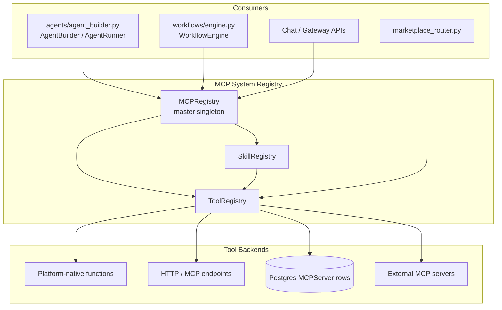
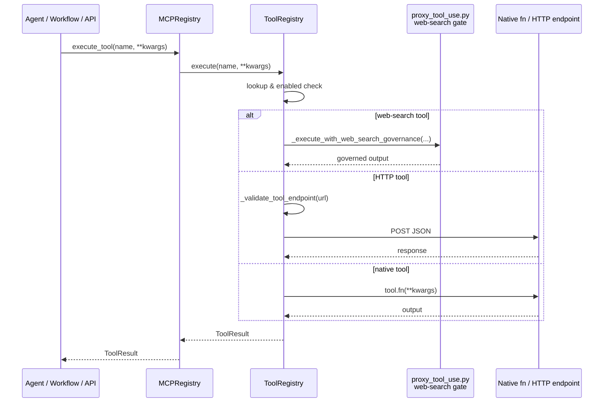
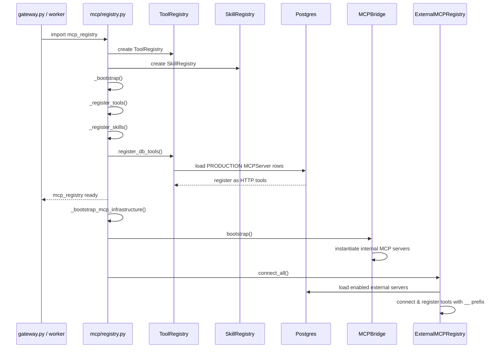

# MCP System Registry

## Overview

The **MCP System Registry** is the central capability catalogue for the NPCI Agentic Platform. It provides a unified, name-addressable registry for every tool and skill that agents, workflows, and orchestrators can invoke. At platform startup, the registry auto-discovers and registers all platform-native tools and skills, loads production-grade MCP server records from Postgres, and exposes a single API surface for discovery and execution.

The module is the authoritative source of truth for:

- **Tools** — individual executable capabilities (e.g., `retrieve`, `execute_code`, `jira_create_issue`, `llm_generate`).
- **Skills** — higher-level composed capabilities that reference an ordered set of tools (e.g., `fix_bug`, `code_review`, `incident_response`).

By centralising tool/skill metadata, the registry enables the agent builder, workflow engine, and chat interfaces to discover capabilities by tag or keyword, execute them safely, and enforce governance gates consistently.

---

## Architecture



### Component Responsibilities

| Component | File | Responsibility |
|-----------|------|----------------|
| `MCPRegistry` | `mcp/registry.py` | Master singleton that owns `ToolRegistry` and `SkillRegistry`; bootstraps built-in tools/skills and DB-backed tools at startup; provides convenience methods for execution, search, and catalogue export. |
| `ToolRegistry` | `mcp/tool_registry.py` | Thread-safe registry for tools. Handles registration, discovery, ranking, synchronous and HTTP execution, parallel batch execution, retry/timeouts, web-search governance, and hot-loading from the marketplace or Postgres. |
| `SkillRegistry` | `mcp/skill_registry.py` | In-memory registry for reusable skills composed of tool names, workflows, or direct callables. |

### Relationship to the Broader MCP System

The MCP System Registry is one of three sub-modules under the parent `mcp_system` module:

- **[mcp_system_registry](mcp_system_registry.md)** (this file) — the master tool/skill catalogue.
- **[mcp_system_bridge](../mcp_system_bridge.md)** — `MCPBridge` and `ExternalMCPRegistry`, which route calls to internal/external MCP servers and bridge the legacy `ToolRegistry` with the MCP protocol.
- **[mcp_system_clients](../mcp_system_clients.md)** — `SSEMCPClient` and `StdioMCPClient`, the transport clients used by the external registry.

At module import time, `mcp/registry.py` calls `_bootstrap_mcp_infrastructure()`, which initialises the bridge and connects external MCP servers. This ensures that by the time the gateway or workers import `mcp_registry`, all internal and external tools are discoverable.

---

## High-Level Functionality

### 1. Bootstrap and Initialisation

`MCPRegistry.__init__()` creates the sub-registries and calls `_bootstrap()`, which:

1. Registers all platform-native tools via `_register_tools()`.
2. Registers all platform-native skills via `_register_skills()`.
3. Loads `PRODUCTION` `MCPServer` rows from Postgres via `ToolRegistry.register_db_tools()`.

After the singleton `mcp_registry` is created, `_bootstrap_mcp_infrastructure()` is invoked to:

- Bootstrap `MCPBridge` internal servers.
- Connect external MCP servers via `ExternalMCPRegistry`.

### 2. Tool Registration

Tools are registered as `ToolDefinition` objects containing:

- `name` — unique identifier.
- `description` — human-readable purpose.
- `fn` — Python callable (for native tools).
- `http_endpoint` — remote URL (for HTTP/MCP tools).
- `tags`, `input_schema`, `version`, `author`, `enabled`.
- Execution config: `timeout_sec`, `retry_count`, `is_write_op`.

Native tools registered by `MCPRegistry` include retrieval, compliance scanning, code execution, self-healing execution, LLM generation, workflow execution, memory access, agent-to-agent delegation, and integrations such as Jira, GitLab, Confluence, Zoho, and many MCP-style tools (KB search, documents, calendar, email, tasks, data, ATS, doc generator, translator, LMS).

### 3. Skill Registration

Skills are registered as `SkillDefinition` objects that declare:

- `name`, `description`, `tags`, `examples`.
- `tools` — ordered list of tool names to execute.
- Optional `workflow_name` or `fn`.

Built-in skills include `answer_question`, `fix_bug`, `generate_code`, `run_tests`, `code_review`, `deploy_service`, and `incident_response`. After registration, skills are synced to Postgres `SkillRecord` rows so that API listings remain consistent.

### 4. Execution and Governance

`MCPRegistry.execute_tool(name, ...)` delegates to `ToolRegistry.execute(...)`. The execution path:

1. Looks up the tool.
2. Enforces governance for non-`PRODUCTION` user-registered tools.
3. Intercepts web-search tools and routes them through the governance/budget gate in `core/proxy_tool_use.py`.
4. Executes HTTP tools via `urllib` with SSRF validation.
5. Executes native tools via the registered callable.
6. Returns a `ToolResult` with timing, output, and error details.

### 5. Discovery and Ranking

Both registries support `discover(tag=..., query=...)` for tag/keyword search. `ToolRegistry` additionally provides `rank_tools(query)` for TF-IDF cosine ranking of tools against a natural-language goal, and `execute_parallel(...)` for safe parallel execution of independent tool calls.

---

## Sub-modules

The MCP System Registry is split into three focused sub-modules. Detailed documentation for each is linked below:

- **[mcp_system_registry_master](mcp_system_registry_master.md)** — `MCPRegistry` and `_bootstrap_mcp_infrastructure`: master orchestration, built-in tool/skill bootstrap, DB sync, and convenience APIs.
- **[mcp_system_registry_tools](mcp_system_registry_tools.md)** — `ToolRegistry`, `ToolDefinition`, and `ToolResult`: tool lifecycle, execution, ranking, parallel execution, security guards, and hot-loading.
- **[mcp_system_registry_skills](../mcp_system_registry_skills.md)** — `SkillRegistry` and `SkillDefinition`: skill registration, discovery, and composition of tool sequences.

---

## Data Flow

### Tool Execution Flow



### Startup Bootstrap Flow



---

## Security and Governance

- **SSRF protection** (`_validate_tool_endpoint`) blocks `file`, `gopher`, `ftp`, `data`, and `javascript` schemes, enforces an HTTPS allowlist by default, and rejects private/reserved IP literals.
- **Tool-name validation** (`_validate_tool_name`) restricts DB-loaded tool names to a safe charset, preventing stored-XSS and identifier-injection attacks from malformed `MCPServer.name` rows.
- **Governance gate** (`MCPRegistry.execute_tool`) blocks user-registered tools that are not in `PRODUCTION` status, directing users to the governance approval flow.
- **Web-search gate** (`core/proxy_tool_use.py`) applies budget and policy checks before any web-search tool runs.
- **Parallel safety** (`execute_parallel`) executes write operations sequentially after read operations to avoid interleaved mutations.

---

## Integration Points

| Consumer / Dependency | Purpose |
|-----------------------|---------|
| `agents/agent_builder.py` | Builds agents from registry-discoverable tools and skills. |
| `workflows/engine.py` | Runs workflows that invoke registry tools. |
| `gateway.py` | Exposes agent/workflow/chat APIs that ultimately call registry tools. |
| `routers/marketplace_router.py` | Registers user-submitted tools via `hot_register()`. |
| `routers/mcp_server_router.py` | Serves internal MCP servers over SSE/HTTP; tools are dual-registered in the legacy registry. |
| `routers/mcp_governance_router.py` | Manages approval lifecycle for user-registered MCP tools. |
| `core/proxy_tool_use.py` | Enforces web-search governance and budget gating. |
| `db/models.py` (`MCPServer`, `SkillRecord`) | Persistence layer for DB-loaded tools and skill sync. |

---

## Usage Example

```python
from mcp.registry import mcp_registry

# Discover capabilities
retrieval_tools = mcp_registry.tools.discover(tag="retrieval")
engineering_skills = mcp_registry.skills.discover(tag="engineering")

# Execute a tool
result = mcp_registry.execute_tool("retrieve", query="UPI payment flow")
print(result.output)

# Export full catalogue
catalogue = mcp_registry.describe()
```

---

## See Also

- [mcp_system_registry_master](mcp_system_registry_master.md)
- [mcp_system_registry_tools](mcp_system_registry_tools.md)
- [mcp_system_registry_skills](../mcp_system_registry_skills.md)
- [mcp_system_bridge](../mcp_system_bridge.md)
- [mcp_system_clients](../mcp_system_clients.md)
