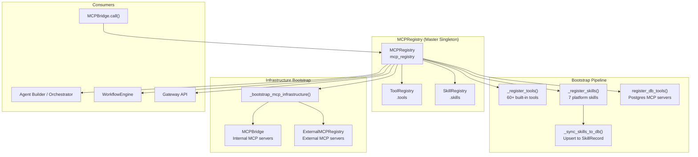
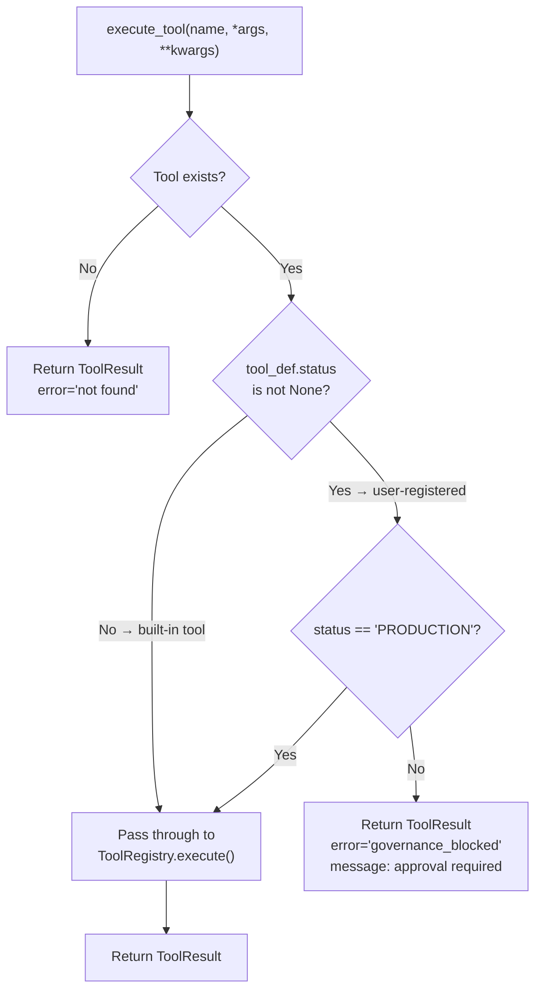
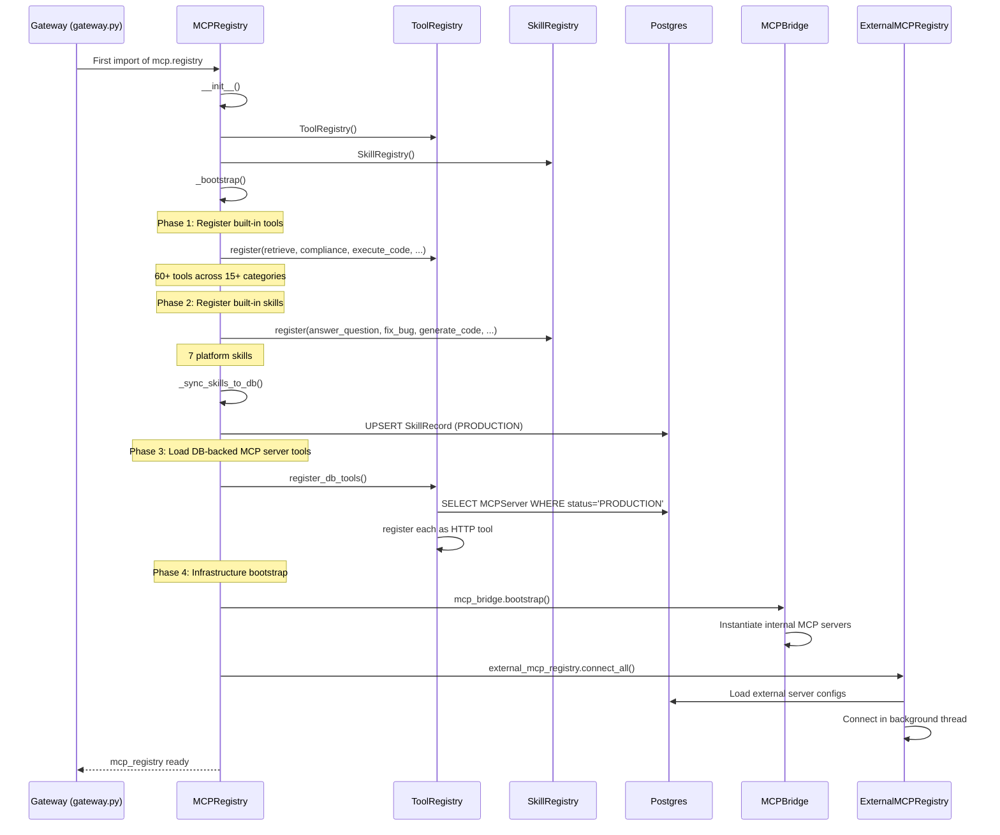
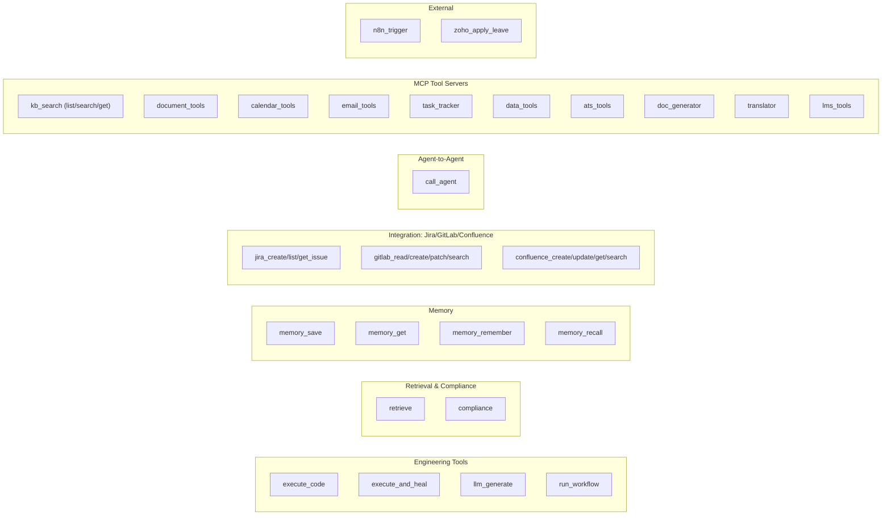
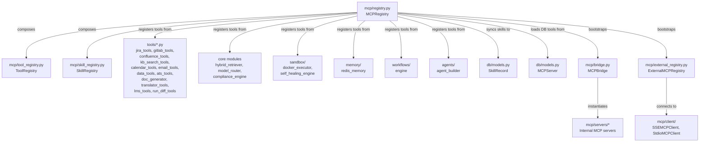
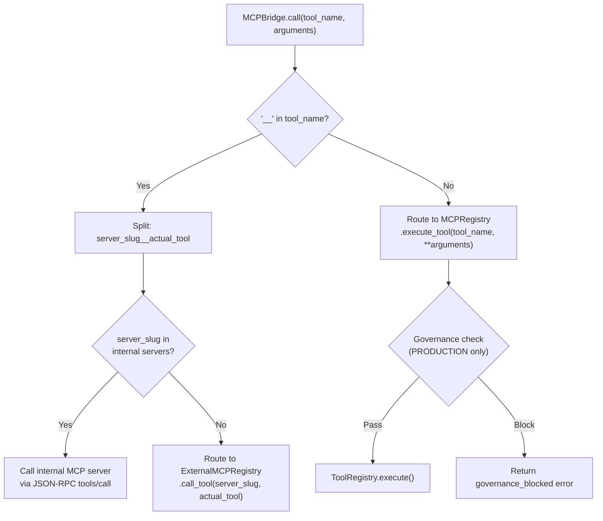
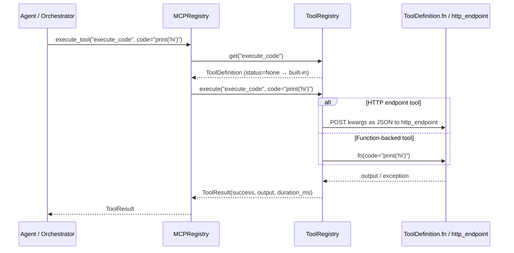
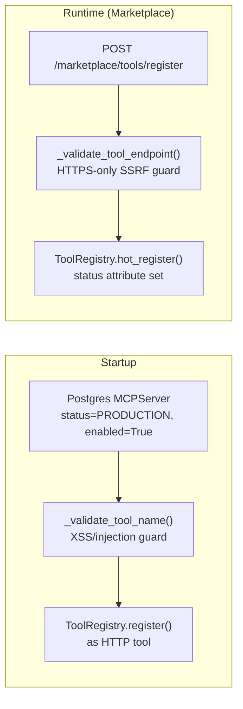
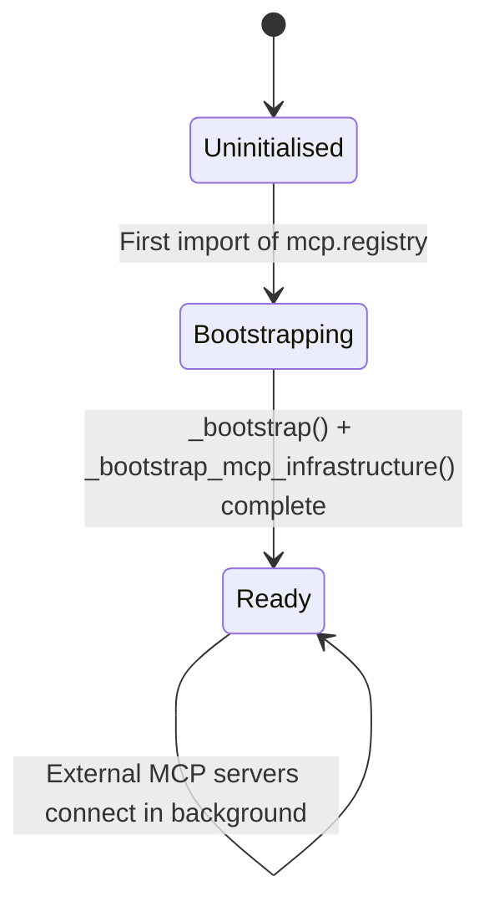

# MCP System Registry — Master Registry

## 1. Introduction

The **MCPRegistry** (`mcp/registry.py`) is the single entry point for all platform tools and skills in the NPCI Agentic Platform. It acts as a master catalogue that auto-registers every built-in tool and skill at startup, enabling the agent builder, orchestrator, and workflow engine to discover and invoke capabilities by name.

The registry is implemented as a **process-level singleton** (`mcp_registry`) that composes two sub-registries — [`ToolRegistry`](mcp_system_registry_tools.md) and [`SkillRegistry`](../mcp_system_registry_skills.md) — and then bootstraps the broader MCP infrastructure (internal MCP servers via `MCPBridge`, external MCP servers via `ExternalMCPRegistry`).

### Key Responsibilities

| Responsibility | Description |
|---|---|
| **Tool Registration** | Auto-registers 60+ built-in platform tools (retrieval, compliance, code execution, LLM generation, Jira, GitLab, Confluence, calendar, email, data, ATS, document generation, translation, LMS, etc.) |
| **Skill Registration** | Registers 7 platform-native skills that compose tools into multi-step workflows (answer_question, fix_bug, generate_code, run_tests, code_review, deploy_service, incident_response) |
| **DB Synchronisation** | Upserts all skills into Postgres (`SkillRecord`) and loads PRODUCTION MCP server rows from Postgres as HTTP-backed tools |
| **Governance Enforcement** | Blocks execution of user-registered tools that are not in `PRODUCTION` state |
| **Discovery & Search** | Provides tag-based and keyword-based discovery across both tools and skills |
| **Infrastructure Bootstrap** | Triggers `MCPBridge` (internal servers) and `ExternalMCPRegistry` (external servers) on first import |

---

## 2. Architecture Overview



### Module Hierarchy

The master registry sits at the top of the MCP system module tree:

```
mcp_system
├── mcp_system_registry
│   ├── mcp_system_registry_master  ← (this module)
│   ├── mcp_system_registry_tools   → ToolRegistry, ToolDefinition, ToolResult
│   └── mcp_system_registry_skills  → SkillRegistry, SkillDefinition
├── mcp_system_bridge               → MCPBridge, ExternalMCPRegistry
└── mcp_system_clients              → SSEMCPClient, StdioMCPClient
```

---

## 3. Core Components

### 3.1 MCPRegistry

The central orchestrator class. On instantiation it:

1. Creates a `ToolRegistry` and `SkillRegistry` instance.
2. Calls `_bootstrap()` which registers all built-in tools, registers all built-in skills, and loads DB-backed MCP server tools.
3. Logs the final tool/skill counts.

```python
class MCPRegistry:
    def __init__(self):
        self.tools  = ToolRegistry()
        self.skills = SkillRegistry()
        self._bootstrap()
```

#### Key Methods

| Method | Signature | Description |
|---|---|---|
| `execute_tool` | `(name: str, *args, **kwargs) → ToolResult` | Execute a tool by name with governance enforcement. Blocks non-PRODUCTION user-registered tools. |
| `describe` | `() → Dict[str, Any]` | Returns the full catalogue (all tools + skills) as a serialisable dict. |
| `search` | `(query: Optional[str], tag: Optional[str]) → Dict[str, List]` | Search across both tools and skills simultaneously by tag and/or keyword. |

#### Governance Enforcement in `execute_tool`



Built-in platform tools have no `status` attribute (it defaults to `None`), so they always pass through. Only user-registered tools (registered via the marketplace/governance API with an explicit `status` field) are subject to the PRODUCTION gate.

### 3.2 _bootstrap_mcp_infrastructure

A module-level function called at the bottom of `registry.py` (runs on first import). It bootstraps the full MCP infrastructure:

1. **MCPBridge** — instantiates all internal MCP servers (Jira, Confluence, GitLab, Database, Platform, etc.) from `mcp.servers.INTERNAL_SERVERS`.
2. **ExternalMCPRegistry** — loads enabled external MCP server configs from Postgres and connects to them in a background thread (non-blocking).

```python
def _bootstrap_mcp_infrastructure() -> None:
    from mcp.bridge import mcp_bridge
    mcp_bridge.bootstrap()           # Internal servers

    from mcp.external_registry import external_mcp_registry
    external_mcp_registry.connect_all()  # External servers (async, non-blocking)
```

Both steps are wrapped in try/except so a failure in one does not prevent the other from initialising.

---

## 4. Bootstrap Sequence



---

## 5. Tool Categories

The `_register_tools()` method registers built-in tools across the following categories. Each tool is wrapped in a try/except so a failure in one category (e.g., missing optional dependency) does not prevent others from loading.



### Tool Registration Pattern

Every tool follows the same registration pattern:

```python
try:
    from some_module import some_function

    def _adapter(query: str = "") -> str:
        # Wrap the underlying function to match the tool's input_schema
        ...

    self.tools.register(ToolDefinition(
        name="tool_name",
        description="Human-readable description for discovery.",
        fn=_adapter,
        tags=["category", "subcategory"],
        input_schema={
            "type": "object",
            "properties": { ... },
            "required": [ ... ],
        },
    ))
except Exception as e:
    logger.warning(f"MCPRegistry: could not register tool_name → {e}")
```

Key design decisions:
- **Adapter functions** bridge the gap between the tool's declared `input_schema` and the underlying function's signature.
- **Lazy imports** inside try/except blocks ensure optional dependencies (Docker, Redis, external SDKs) don't crash startup.
- **Tags** enable tag-based discovery (e.g., `discover(tag="docker")`).

---

## 6. Skill Definitions

Skills are higher-level compositions of tools. Each skill declares an ordered list of tool names that it calls in sequence.

| Skill | Description | Tools | Tags |
|---|---|---|---|
| `answer_question` | Retrieve context then generate a PCI-safe answer | `retrieve`, `compliance`, `llm_generate` | qa, retrieval, generation |
| `fix_bug` | Analyse a bug, generate a fix, execute and verify | `llm_generate`, `execute_and_heal` | engineering, debugging, self-healing |
| `generate_code` | Generate production-grade code for a specification | `compliance`, `llm_generate` | engineering, code-generation |
| `run_tests` | Execute a test suite in Docker sandbox | `execute_code` | engineering, testing, docker |
| `code_review` | Review code for bugs, security, PCI compliance | `compliance`, `llm_generate` | engineering, review, security |
| `deploy_service` | Execute deployment scripts and verify health | `execute_code`, `llm_generate` | devops, deployment |
| `incident_response` | Analyse incident, generate root-cause report | `retrieve`, `llm_generate` | sre, incident, monitoring |

After registration, `_sync_skills_to_db()` upserts every skill into the `SkillRecord` Postgres table with `status="PRODUCTION"` and `is_production=True`, making Postgres the source of truth for the `GET /skills` API.

---

## 7. Data Models

### ToolDefinition

| Field | Type | Default | Description |
|---|---|---|---|
| `name` | `str` | — | Unique snake_case tool name |
| `description` | `str` | — | Human-readable description for discovery |
| `fn` | `Optional[Callable]` | `None` | Python callable (None for HTTP-only tools) |
| `tags` | `List[str]` | `[]` | Discovery tags |
| `input_schema` | `Dict[str, Any]` | `{}` | JSON-schema describing expected input |
| `version` | `str` | `"1.0.0"` | Semver string |
| `author` | `str` | `"platform"` | Who registered the tool |
| `enabled` | `bool` | `True` | Can be disabled without unregistering |
| `http_endpoint` | `Optional[str]` | `None` | Remote MCP tool server URL (Phase 13) |
| `timeout_sec` | `int` | `30` | Wall-clock timeout per execution |
| `retry_count` | `int` | `0` | Retry on transient failure |
| `is_write_op` | `bool` | `False` | Write ops excluded from parallel batches |

### ToolResult

| Field | Type | Description |
|---|---|---|
| `tool_name` | `str` | Name of the executed tool |
| `success` | `bool` | Whether execution succeeded |
| `output` | `Any` | Tool output (type varies) |
| `error` | `Optional[str]` | Error message if failed |
| `duration_ms` | `float` | Execution duration in milliseconds |
| `executed_at` | `str` | ISO timestamp of execution |

### SkillDefinition

| Field | Type | Default | Description |
|---|---|---|---|
| `name` | `str` | — | Unique snake_case skill name |
| `description` | `str` | — | What the skill does |
| `tools` | `List[str]` | `[]` | Ordered tool names called in sequence |
| `workflow_name` | `Optional[str]` | `None` | If set, executes via WorkflowEngine |
| `fn` | `Optional[Callable]` | `None` | Direct callable (highest priority) |
| `tags` | `List[str]` | `[]` | Discovery tags |
| `input_schema` | `Dict[str, Any]` | `{}` | JSON schema for expected input |
| `version` | `str` | `"1.0.0"` | Semver string |
| `author` | `str` | `"platform"` | Who registered the skill |
| `enabled` | `bool` | `True` | Disabled skills hidden from discovery |
| `examples` | `List[str]` | `[]` | Example inputs for documentation |

> For full implementation details of `ToolRegistry` and `SkillRegistry`, see [mcp_system_registry_tools.md](mcp_system_registry_tools.md) and [mcp_system_registry_skills.md](../mcp_system_registry_skills.md).

---

## 8. Dependency Graph



---

## 9. Integration with MCPBridge

The `MCPBridge` is the unified routing layer that sits above the registry. When an agent or orchestrator calls `mcp_bridge.call(tool_name, arguments)`, the bridge routes based on the tool name format:



The `__` (double-underscore) convention distinguishes MCP server tools (`jira__jira_create_issue`) from legacy platform tools (`execute_code`). External MCP server tools are auto-registered into the `ToolRegistry` with the `server_name__tool_name` prefix by `ExternalMCPRegistry._register_discovered_tools()`.

> For details on the bridge and external registry, see [mcp_system_bridge.md](../mcp_system_bridge.md).

---

## 10. Execution Flow

### 10.1 Tool Execution via MCPRegistry



### 10.2 Parallel Execution

The `ToolRegistry` supports parallel execution of independent tool calls via `execute_parallel()`. Read-only tools run concurrently in a thread pool; write operations (`is_write_op=True`) execute sequentially after all reads complete. Per-tool `timeout_sec` and `retry_count` are honoured.

### 10.3 Web-Search Governance Gate

Tools in the `_WEB_SEARCH_TOOL_NAMES` set are intercepted before execution and routed through `_execute_with_web_search_governance()`, which enforces governance and budget gating before delegating to the proxy server (web02) — the only server with internet egress.

---

## 11. Discovery and Search

### Tag-Based Discovery

```python
# Find all Docker-related tools
mcp_registry.tools.discover(tag="docker")

# Find all engineering skills
mcp_registry.skills.discover(tag="engineering")
```

### Keyword Search

```python
# Search tools by name/description
mcp_registry.tools.discover(query="jira")
```

### Combined Search (Tools + Skills)

```python
# Search across both registries simultaneously
mcp_registry.search(query="code", tag="engineering")
# → {"tools": [...], "skills": [...]}
```

### Full Catalogue

```python
mcp_registry.describe()
# → {"tools": [{name, description, tags, version, enabled}, ...],
#    "skills": [{name, description, tools, tags, enabled, examples}, ...]}
```

### TF-IDF Tool Ranking

The `ToolRegistry.rank_tools()` method ranks tools by TF-IDF cosine similarity between query tokens and each tool's name + description + tags. This is pure token math (no LLM call) and caps results at 15 tools.

---

## 12. Hot Registration & DB-Loaded Tools

### Hot Registration (Marketplace)

User-defined tools can be registered live via `ToolRegistry.hot_register(tool_data)` without a restart. This path validates the endpoint URL (HTTPS-only SSRF guard) and is used by the [marketplace router](../api/shared_api_routers.md). Hot-registered tools carry a `status` attribute and are subject to governance enforcement in `execute_tool()`.

### DB-Loaded Tools (Startup)

At startup, `ToolRegistry.register_db_tools()` loads all `MCPServer` rows with `status='PRODUCTION'` and `enabled=True` from Postgres and registers them as HTTP-backed tools. Tool names are validated via `_validate_tool_name()` to prevent XSS/injection from untrusted DB rows.



---

## 13. Relationship to System Modules

| System Module | Relationship |
|---|---|
| [mcp_system_registry_tools](mcp_system_registry_tools.md) | `ToolRegistry` — sub-registry for tools, handles registration, execution, parallel execution, ranking, and DB/hot loading |
| [mcp_system_registry_skills](../mcp_system_registry_skills.md) | `SkillRegistry` — sub-registry for skills, handles registration and discovery |
| [mcp_system_bridge](../mcp_system_bridge.md) | `MCPBridge` and `ExternalMCPRegistry` — routing layer above the registry, bootstrapped by `_bootstrap_mcp_infrastructure()` |
| [mcp_system_clients](../mcp_system_clients.md) | `SSEMCPClient` and `StdioMCPClient` — MCP client transports used by `ExternalMCPRegistry` |
| [agent_system](../agents/agent_system.md) | `AgentBuilder` / `AgentRunner` — the `call_agent` tool delegates to `agent_runner.run()` for agent-to-agent communication |
| [core_infrastructure](../infrastructure/core_infrastructure.md) | `compliance_engine`, `model_router`, `hybrid_retriever` — provide the underlying functions for the `compliance`, `llm_generate`, and `retrieve` tools |
| [sandbox](../storage/sandbox.md) | `DockerExecutor` and `SelfHealingEngine` — back the `execute_code` and `execute_and_heal` tools |
| [memory_system](../reference/memory_system.md) | `RedisMemory` and episodic memory store — back the `memory_save`, `memory_get`, `memory_remember`, `memory_recall` tools |
| [workflow_system](../workflows/workflow_system.md) | `WorkflowEngine` — backs the `run_workflow` tool |
| [database](../storage/database.md) | `SkillRecord` and `MCPServer` models — persistence layer for skills and DB-loaded tools |
| [shared_integrations](../reference/shared_integrations.md) | Tool implementations (`jira_tools`, `gitlab_tools`, `confluence_tools`, etc.) registered by the master registry |
| [shared_api_routers](../api/shared_api_routers.md) | `marketplace_router` and `mcp_governance_router` — APIs for hot-registering tools and managing governance approval lifecycle |

---

## 14. Singleton Lifecycle



The singleton (`mcp_registry = MCPRegistry()`) is created at module load time. The `_bootstrap_mcp_infrastructure()` call at the bottom of the module runs immediately after singleton creation, ensuring the bridge and external registry are initialised before any consumer accesses the registry.

> **Note:** Because the singleton is created at import time, any import errors in tool dependencies are caught per-tool (try/except) and logged as warnings. The platform starts successfully even if optional tools (Docker, Redis, external SDKs) are unavailable.
