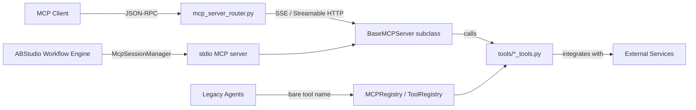

# MCP Servers Module

## Overview

The `mcp_servers` module implements the **Model Context Protocol (MCP)** server layer for the NPCI AI platform. It exposes platform capabilities and third-party integrations as spec-compliant MCP tools that can be consumed by MCP clients (Claude Desktop, IDE extensions, external agents, CI/CD pipelines, and the platform's own agent runtime).

The module is built on a shared foundation — `BaseMCPServer` — which handles the MCP JSON-RPC 2.0 protocol, transport abstraction (stdio, SSE, streamable HTTP), input/output compliance gating, and audit logging. Each concrete server subclasses this base and registers a focused set of tools that delegate to the corresponding `tools/*_tools.py` implementation or to platform APIs.

## Purpose

- Provide a **standardised, protocol-compliant interface** for tools and integrations.
- Enable **external MCP clients** to call platform capabilities without knowing internal APIs.
- Support **dual registration**: tools are available both as MCP tools (`server__tool_name`) and through the legacy `MCPRegistry`/`ToolRegistry` for existing agents and workflows.
- Enforce **PCI/PII compliance gates** and audit logging at the protocol boundary.
- Allow **per-user credential injection** for integrations such as GitLab.

## Architecture

```mermaid
flowchart TB
    subgraph Clients["MCP Clients"]
        C1[Claude Desktop / IDE]
        C2[External Agents]
        C3[ABStudio Workflow Engine]
        C4[Gateway / API]
    end

    subgraph Transports["MCP Transports"]
        T1[stdio]
        T2[SSE /mcp/{name}/sse]
        T3[Streamable HTTP]
    end

    subgraph MCP_Server_Layer["MCP Server Layer"]
        B[BaseMCPServer]
        B -->|registers| S1[Collaboration Servers]
        B -->|registers| S2[Productivity Servers]
        B -->|registers| S3[Content Servers]
        B -->|registers| S4[Data Servers]
        B -->|registers| S5[Platform Server]
    end

    subgraph Tool_Implementations["Tool Implementations"]
        I1[tools/jira_tools.py]
        I2[tools/gitlab_tools.py]
        I3[tools/confluence_tools.py]
        I4[tools/calendar_tools_tools.py]
        I5[tools/data_tools_tools.py]
        I6[tools/doc_generator.py]
        I7[Platform REST APIs]
    end

    C1 --> T1
    C2 --> T2
    C3 --> T3
    C4 --> T2

    T1 --> B
    T2 --> B
    T3 --> B

    S1 --> I1
    S1 --> I2
    S1 --> I3
    S2 --> I4
    S4 --> I5
    S3 --> I6
    S5 --> I7
```

### Key Design Decisions

| Decision | Rationale |
|----------|-----------|
| **Single base class** | All protocol, compliance, and transport logic lives in `BaseMCPServer`; concrete servers only declare tools. |
| **Tool delegation** | Each MCP tool wraps an existing function from `tools/*_tools.py`, avoiding duplication and keeping business logic in one place. |
| **Dual registration** | `MCPRegistry._register_tools()` imports the same tool functions and registers them under bare names, so legacy agents continue to work. |
| **Per-user tokens** | `GitLabMCPServer` overrides `handle_message()` to inject the caller's PAT before dispatch, matching the SDLC pipeline pattern. |
| **Compliance at the boundary** | `BaseMCPServer._handle_tools_call()` runs `ComplianceEngine.validate_input()` on both request and response. |
| **Audit for mutating tools** | Tools marked `pci_audit=True` write to `tool_audit_log` after execution. |

## Module Structure

The module is organised into sub-modules by capability domain:

| Sub-module | Files | Purpose | Documentation |
|------------|-------|---------|---------------|
| `mcp_servers_base` | `base.py` | MCP protocol foundation, transports, compliance, audit | [mcp_servers_base.md](mcp_servers_base.md) |
| `mcp_servers_collaboration` | `confluence_server.py`, `jira_server.py`, `gitlab_server.py` | Enterprise collaboration tools (Confluence, Jira, GitLab) | [mcp_servers_collaboration.md](mcp_servers_collaboration.md) |
| `mcp_servers_productivity` | `calendar_tools_server.py`, `email_tools_server.py`, `task_tracker_server.py`, `ats_tools_server.py` | Personal/team productivity tools | [mcp_servers_productivity.md](mcp_servers_productivity.md) |
| `mcp_servers_content` | `document_tools_server.py`, `doc_generator_server.py`, `translator_server.py`, `lms_tools_server.py` | Document processing, generation, translation, and learning | [mcp_servers_content.md](mcp_servers_content.md) |
| `mcp_servers_data` | `data_tools_server.py`, `database_server.py`, `kb_search_server.py` | Tabular data, read-only database access, and knowledge-base search | [mcp_servers_data.md](mcp_servers_data.md) |
| `mcp_servers_platform` | `platform_server.py` | Bridge to platform-wide RAG, agents, indexing, and health APIs | [mcp_servers_platform.md](mcp_servers_platform.md) |

## How It Fits into the System

The MCP server layer sits between external/internal clients and the platform's tool implementations:



### Integration Points

- **`mcp_server_router.py`** exposes every internal MCP server at `/mcp/{name}/sse` and `/mcp/{name}/message`, plus streamable HTTP endpoints. See [shared_api_routers.md](shared_api_routers.md) for router details.
- **`MCPBridge`** (`mcp/bridge.py`) bootstraps all internal servers at startup and routes calls with the `server__tool_name` convention. See [shared_core.md](shared_core.md) → MCP system.
- **`McpSessionManager`** (`ABStudio/backend/app/core/mcp_manager.py`) spawns MCP servers as subprocesses during workflow execution and discovers tools via the MCP protocol. See [abstudio_backend.md](abstudio_backend.md) → `core_mcp_manager`.
- **`MCPRegistry`** (`mcp/registry.py`) registers the same tool functions under legacy bare names so existing agents and the agent builder UI can use them without protocol changes. See [shared_core.md](shared_core.md) → MCP system.
- **Compliance engine** (`agents/compliance_engine.py`) is invoked by `BaseMCPServer` for input/output scanning. See [shared_core.md](shared_core.md) → agent system.

## Tool Naming Convention

When accessed through `MCPBridge`, internal server tools are addressed as:

```
{server_name}__{tool_name}
```

Examples:

- `jira__jira_create_issue`
- `gitlab__gitlab_create_mr`
- `data_tools__query_table`
- `platform__platform_ask`

The same functions are also registered under their bare names (e.g. `jira_create_issue`) in `MCPRegistry` for backward compatibility.

## Security & Compliance

- **Input/output scanning**: every tool call and result is passed through `ComplianceEngine.validate_input()`; blocked content returns a `[BLOCKED]` or `[OUTPUT BLOCKED]` response.
- **Read-only database**: `DatabaseMCPServer` blocks DDL/DML via regex, limits rows to 500, applies a 10-second timeout, and masks sensitive columns (PAN, CVV, AADHAAR, etc.).
- **Audit logging**: tools marked `pci_audit=True` persist tool name, inputs, truncated output, and duration to `tool_audit_log`.
- **Per-user credentials**: `GitLabMCPServer` injects the caller's PAT from `core/platform_credentials` and clears it in a `finally` block to prevent leakage across concurrent requests.

## Running a Server

Each server can be executed standalone via stdio:

```bash
python -m mcp.servers.jira_server
python -m mcp.servers.gitlab_server
python -m mcp.servers.platform_server
```

In production, servers are typically instantiated by `MCPBridge.bootstrap()` and exposed through `mcp_server_router.py` over SSE or streamable HTTP.

## See Also

- [mcp_servers_base.md](mcp_servers_base.md) — protocol foundation and transports
- [mcp_servers_collaboration.md](mcp_servers_collaboration.md) — Confluence, Jira, GitLab
- [mcp_servers_productivity.md](mcp_servers_productivity.md) — calendar, email, tasks, ATS
- [mcp_servers_content.md](mcp_servers_content.md) — documents, generation, translation, LMS
- [mcp_servers_data.md](mcp_servers_data.md) — data tools, database, KB search
- [mcp_servers_platform.md](mcp_servers_platform.md) — platform RAG/agent bridge
- [shared_core.md](shared_core.md) — `MCPBridge`, `MCPRegistry`, compliance engine
- [shared_api_routers.md](shared_api_routers.md) — `mcp_server_router`
- [abstudio_backend.md](abstudio_backend.md) — `McpSessionManager` and workflow integration
