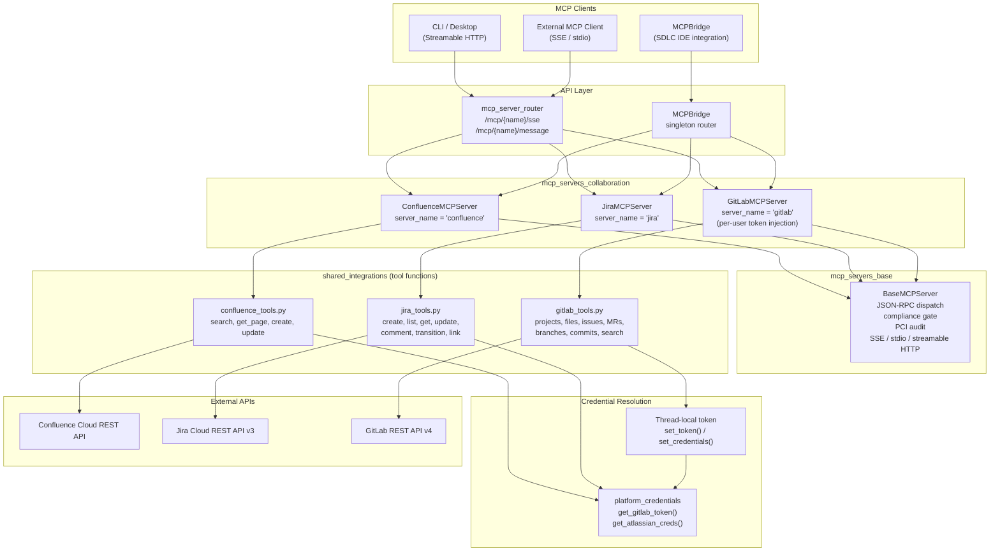
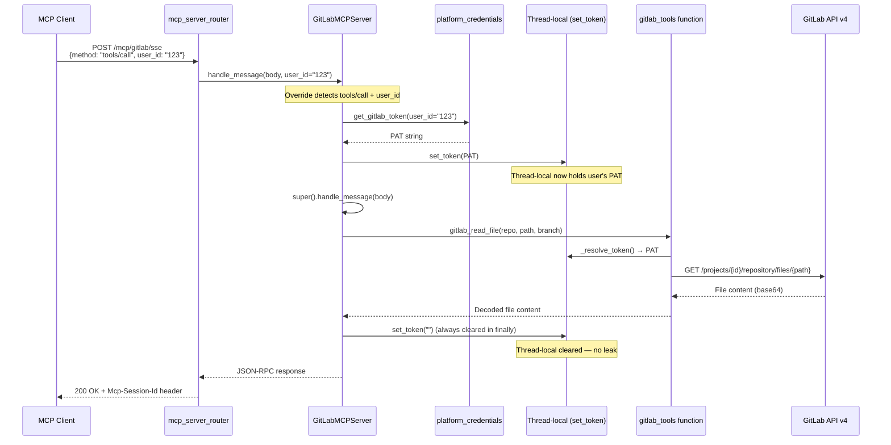
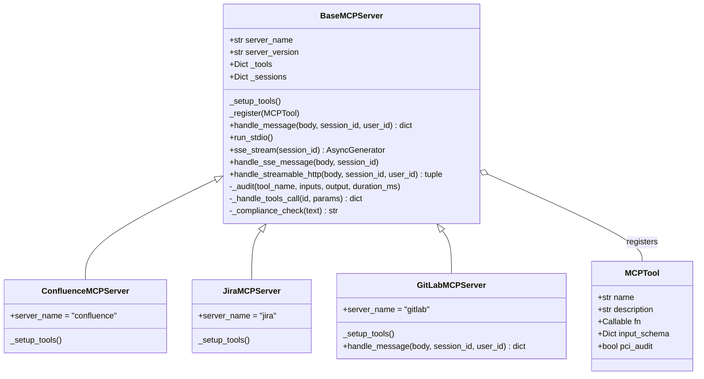
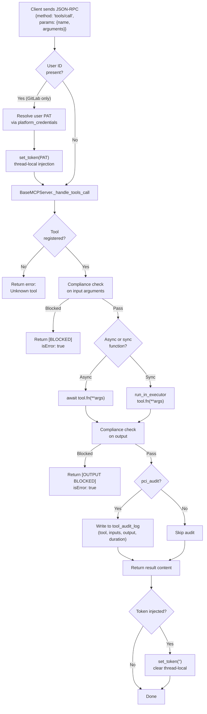
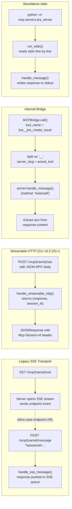
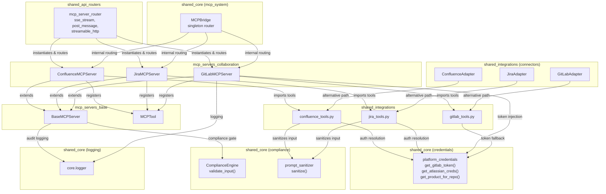

# MCP Servers — Collaboration

## Introduction

The `mcp_servers_collaboration` module provides three spec-compliant MCP (Model Context Protocol) servers that expose **Confluence**, **Jira**, and **GitLab** collaboration tools to AI agents, the SDLC pipeline, and external MCP clients. Each server wraps the underlying tool functions from the [shared_integrations](shared_integrations.md) module, registering them as JSON-RPC 2.0 callable tools with typed input schemas, compliance gating, and optional PCI audit logging.

These servers are the **collaboration backbone** of the platform — they enable agents to search documentation, create and track issues, read and write source code, open merge requests, and perform code reviews without leaving the MCP tool-calling interface.

---

## Architecture Overview



### Key Design Principles

1. **Thin wrapper pattern** — Each server class is a lightweight registration layer; all business logic lives in the underlying `tools/*.py` functions, ensuring a single code path shared with the SDLC pipeline and connector adapters.

2. **Spec-compliant protocol** — All servers inherit from `BaseMCPServer`, which implements the MCP JSON-RPC 2.0 protocol (`initialize`, `tools/list`, `tools/call`, `ping`) with session management, compliance gating, and audit logging.

3. **Per-user credential isolation** — The GitLab server overrides `handle_message()` to inject the requesting user's Personal Access Token (PAT) into a thread-local before any tool dispatch, ensuring all Git operations are attributed to the correct user rather than a shared service account.

4. **Dual transport support** — Servers are accessible via legacy SSE (`GET /mcp/{name}/sse` + `POST /mcp/{name}/message`) and modern Streamable HTTP (`POST /mcp/{name}/sse` with `Mcp-Session-Id` header), serving both older and CLI v0.2.101+ clients.

---

## Component Reference

### ConfluenceMCPServer

**File:** `mcp/servers/confluence_server.py`
**Server name:** `confluence`

Wraps `tools/confluence_tools.py` to expose Confluence wiki/documentation operations as MCP tools.

| Tool | Description | PCI Audit | Key Parameters |
|------|-------------|-----------|----------------|
| `confluence_search` | Full-text CQL search across spaces | No | `query` (required), `space_key` |
| `confluence_get_page` | Retrieve full page content by numeric ID | No | `page_id` (required) |
| `confluence_get_page_by_title` | Find page by exact title within a space | No | `title` (required), `space_key` |
| `confluence_create_page` | Create a new page (publish docs, post-mortems) | **Yes** | `title`, `body`, `space_key` (required), `parent_id` |
| `confluence_update_page` | Update existing page content (auto-increments version) | **Yes** | `page_id`, `title`, `body` (required) |

**Authentication:** Resolves the user's stored Atlassian API token via `core.platform_credentials.get_atlassian_creds()`. Service-account credentials are never used — a `PermissionError` is raised if no user token is found.

**Space resolution:** `confluence_create_page` resolves the target space through: explicit `space_key` arg → product linked to `repo_name` (via `product_repos` table) → `CONFLUENCE_SPACE_KEY` env var.

---

### JiraMCPServer

**File:** `mcp/servers/jira_server.py`
**Server name:** `jira`

Wraps `tools/jira_tools.py` to expose Jira issue tracking operations as MCP tools.

| Tool | Description | PCI Audit | Key Parameters |
|------|-------------|-----------|----------------|
| `jira_create_issue` | Create a new issue (bug, story, task, epic, incident) | **Yes** | `summary`, `description` (required), `project`, `priority`, `issue_type`, `user_id` |
| `jira_list_issues` | List issues by project and status | No | `project` (required), `status` |
| `jira_get_issue` | Get full issue details by key | No | `issue_key` (required) |
| `jira_update_issue` | Update status, comment, assignee, or priority | **Yes** | `issue_key` (required), `status`, `comment`, `assignee_account_id`, `priority` |
| `jira_add_comment` | Add a comment to an issue | No | `issue_key`, `comment` (required) |
| `jira_transition_issue` | Transition issue to a new workflow status | No | `issue_key`, `status` (required) |
| `jira_link_issues` | Link two issues (blocks, relates to, duplicates) | No | `inward_key`, `outward_key` (required), `link_type` |

**Authentication:** Uses the same `get_atlassian_creds()` resolution as Confluence, with a fallback to `JIRA_EMAIL` + `JIRA_API_TOKEN` environment variables for service-account access.

**Project resolution:** `jira_create_issue` resolves the project key through: explicit `project` arg → product linked to `repo_name` → `JIRA_PROJECT` env var.

**Transition handling:** `jira_update_issue` fetches available workflow transitions and, if the requested status is not valid from the issue's current state, returns the list of valid transitions so the caller can retry intelligently.

---

### GitLabMCPServer

**File:** `mcp/servers/gitlab_server.py`
**Server name:** `gitlab`

Wraps `tools/gitlab_tools.py` to expose GitLab source-code collaboration operations as MCP tools. This is the most feature-rich server in the module, with **14 registered tools** and a custom `handle_message()` override for per-user token injection.

| Tool | Description | PCI Audit | Key Parameters |
|------|-------------|-----------|----------------|
| `gitlab_list_projects` | List projects the user has access to | No | `limit`, `membership`, `search` |
| `gitlab_read_file` | Read file contents from a repo branch | No | `repo`, `path` (required), `branch` |
| `gitlab_list_issues` | List open/closed issues in a repo | No | `repo` (required), `state`, `limit` |
| `gitlab_create_issue` | Create a new issue in a repo | **Yes** | `repo`, `title` (required), `body`, `labels` |
| `gitlab_list_mrs` | List merge requests in a repo | No | `repo` (required), `state`, `limit` |
| `gitlab_create_mr` | Create a merge request (idempotent on 409) | **Yes** | `repo`, `title`, `body`, `head` (required), `base` |
| `gitlab_create_branch` | Create a new branch (idempotent) | No | `repo`, `branch` (required), `from_branch` |
| `gitlab_comment_on_mr` | Post a comment on a merge request | No | `repo`, `mr_iid`, `body` (required) |
| `gitlab_merge_mr` | Merge an approved MR (squash/merge/rebase) | **Yes** | `repo`, `mr_iid` (required), `merge_method` |
| `gitlab_get_mr_files` | Get changed files with diff content | No | `repo`, `mr_iid` (required), `max_files` |
| `gitlab_create_or_update_file` | Create or update a file via commit | **Yes** | `repo`, `path`, `content`, `message` (required), `branch` |
| `gitlab_list_commits` | List recent commits on a branch | No | `repo` (required), `ref_name`, `limit` |
| `gitlab_get_project` | Get project metadata | No | `repo` (required) |
| `gitlab_search_code` | Search for a text pattern in source files | No | `repo`, `query` (required), `max_results` |

#### Per-User Token Injection (GitLab-specific)

GitLabMCPServer is the only server in this module that overrides `handle_message()`. This override intercepts `tools/call` requests and injects the requesting user's GitLab PAT into the thread-local before dispatch:



**Why this matters:** Without the override, `gitlab_tools._resolve_token()` falls back to the `GITLAB_TOKEN` environment variable (a service-account token), meaning all MCP tool calls would execute as the service account rather than the requesting user. The token is always cleared in a `finally` block to prevent leakage across concurrent requests.

> **Note:** Buddy/Cowork does **not** use this MCP path. It routes through `connectors/mcp_bridge.py` → `connectors/adapters/gitlab.GitLabAdapter`, which performs its own `set_token()` injection via `context.access_token`. See [shared_integrations](shared_integrations.md) for details.

---

## Base Class Inheritance

All three servers extend `BaseMCPServer` from the [mcp_servers_base](mcp_servers_base.md) module, which provides:



### Shared Base Class Responsibilities

| Responsibility | Description |
|----------------|-------------|
| **JSON-RPC dispatch** | Routes `initialize`, `tools/list`, `tools/call`, `ping`, and notification methods |
| **Compliance gate** | Runs `ComplianceEngine.validate_input()` on both tool inputs and outputs; blocks PCI/PII violations |
| **PCI audit logging** | For tools with `pci_audit=True`, logs tool name, inputs, output (truncated to 2000 chars), and duration to `tool_audit_log` table |
| **Transport support** | stdio (for standalone execution), SSE (legacy persistent stream), and Streamable HTTP (MCP spec 2024-11-05) |
| **Session management** | Tracks initialized sessions with client protocol version |

---

## Request Flow

### Tool Call Lifecycle



### Transport Paths



---

## Dependency Map



---

## Integration Points

### 1. MCP Server Router (HTTP API)

The servers are exposed as HTTP endpoints by the `mcp_server_router` in [shared_api_routers](shared_api_routers.md):

| Endpoint | Method | Transport | Description |
|----------|--------|-----------|-------------|
| `/mcp/{name}/sse` | GET | SSE | Opens persistent SSE stream with 15s keep-alive pings |
| `/mcp/{name}/message` | POST | SSE | Sends JSON-RPC message; response pushed to SSE queue |
| `/mcp/{name}/sse` | POST | Streamable HTTP | Single request/response with `Mcp-Session-Id` header |

The router resolves `user_id` from the authenticated user's JWT (`sub` / `id` / `user_id` claims) and forwards it to `handle_message()`, enabling per-user credential injection.

### 2. MCPBridge (Internal Tool Routing)

The `MCPBridge` singleton in [shared_core](shared_core.md) bootstraps all internal MCP servers at startup and routes tool calls using the `server_slug__tool_name` naming convention (e.g., `jira__jira_create_issue`). This is used by the SDLC pipeline and IDE integrations that call tools programmatically without an HTTP round-trip.

### 3. Connector Adapters (Buddy/Cowork Path)

The [shared_integrations](shared_integrations.md) connector adapters (`GitLabAdapter`, `JiraAdapter`, `ConfluenceAdapter`) provide an alternative access path through the `ConnectorEngine`. These adapters call the same underlying `tools/*.py` functions but inject credentials via `context.access_token` rather than the MCP `handle_message()` override. This ensures Buddy/Cowork and the SDLC pipeline share identical code paths.

### 4. Standalone stdio Execution

Each server can be run independently as a stdio MCP server:
```bash
python -m mcp.servers.confluence_server
python -m mcp.servers.jira_server
python -m mcp.servers.gitlab_server
```
This is useful for local development, testing, and integration with MCP clients that prefer stdio transport.

---

## Security & Compliance

### Compliance Gating

Every `tools/call` request passes through two compliance checks in `BaseMCPServer._handle_tools_call()`:

1. **Input gate** — `ComplianceEngine.validate_input()` runs on the JSON-serialized tool arguments before execution
2. **Output gate** — The same check runs on the stringified tool result after execution

If either gate detects a PCI/PII violation, the response is returned with `isError: true` and a `[BLOCKED]` or `[OUTPUT BLOCKED]` prefix.

### PCI Audit Logging

Tools marked with `pci_audit=True` (all write operations: create issue, create/update page, create/merge MR, create/update file) have their full I/O logged to the `tool_audit_log` database table:

| Field | Content |
|-------|---------|
| `tool_name` | MCP tool name (e.g., `jira_create_issue`) |
| `inputs` | JSON-serialized input arguments |
| `output` | Result string (truncated to 2000 chars) |
| `duration_ms` | Execution time in milliseconds |
| `created_at` | Timestamp |

### Credential Isolation

| Server | Credential Source | Injection Mechanism | Fallback |
|--------|------------------|---------------------|----------|
| Confluence | `get_atlassian_creds(user_id, email)` | Direct function call per tool invocation | None (raises `PermissionError`) |
| Jira | `get_atlassian_creds(user_id, email)` | Direct function call per tool invocation | `JIRA_EMAIL` + `JIRA_API_TOKEN` env vars |
| GitLab | `get_gitlab_token(user_id)` | `handle_message()` override → `set_token()` thread-local | `GITLAB_TOKEN` env var (service account) |

The GitLab server's token is **always cleared** in a `finally` block after tool execution, preventing leakage across concurrent requests on the same thread.

### Input Sanitization

Confluence and Jira tool functions apply `core.prompt_sanitizer.sanitize()` to user-supplied text fields (titles, descriptions, bodies) before sending them to the external API, mitigating prompt injection through collaboration tool content.

---

## Cross-Module References

| Module | Relationship |
|--------|-------------|
| [mcp_servers_base](mcp_servers_base.md) | Provides `BaseMCPServer` and `MCPTool` — the protocol, transport, compliance, and audit infrastructure all servers inherit |
| [shared_integrations](shared_integrations.md) | Provides the underlying `confluence_tools.py`, `jira_tools.py`, and `gitlab_tools.py` functions; also provides `GitLabAdapter`, `JiraAdapter`, and `ConfluenceAdapter` for the connector engine path |
| [shared_core](shared_core.md) | Provides `platform_credentials` for token resolution, `ComplianceEngine` for compliance gating, `prompt_sanitizer` for input sanitization, `MCPBridge` for internal routing, and `core.logger` for logging |
| [shared_api_routers](shared_api_routers.md) | Provides `mcp_server_router` that exposes these servers as HTTP endpoints with authentication and session management |
| [mcp_servers_productivity](mcp_servers_productivity.md) | Sibling module providing Calendar, Email, Task Tracker, and ATS MCP servers |
| [mcp_servers_content](mcp_servers_content.md) | Sibling module providing Document, Doc Generator, Translator, and LMS MCP servers |
| [mcp_servers_data](mcp_servers_data.md) | Sibling module providing Data, Database, and KB Search MCP servers |
| [mcp_servers_platform](mcp_servers_platform.md) | Sibling module providing the Platform MCP server for agent execution and health checks |
