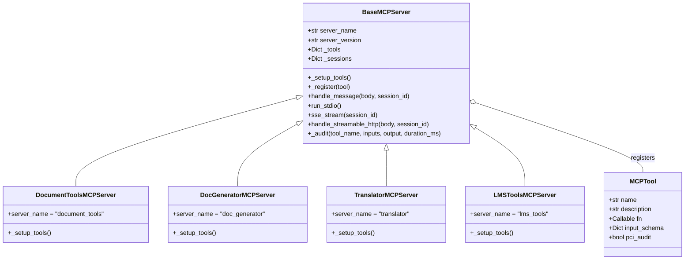
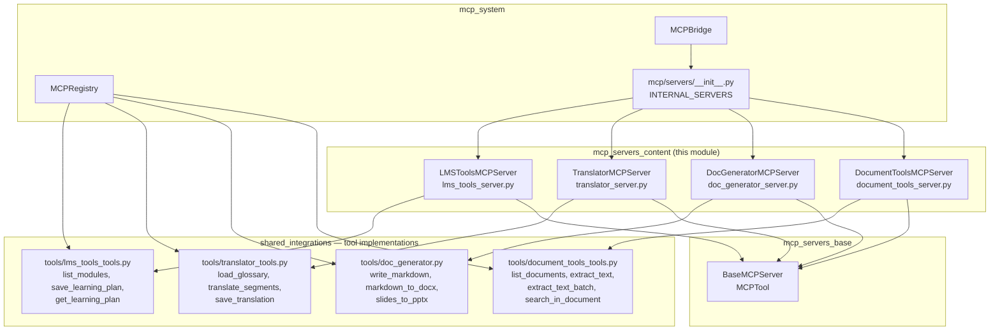
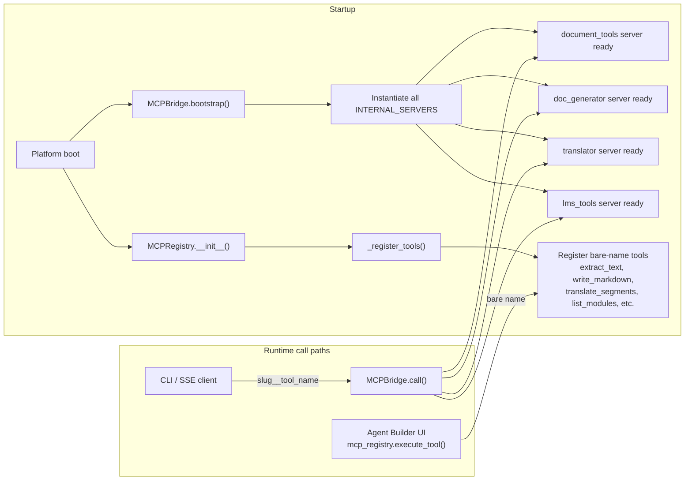
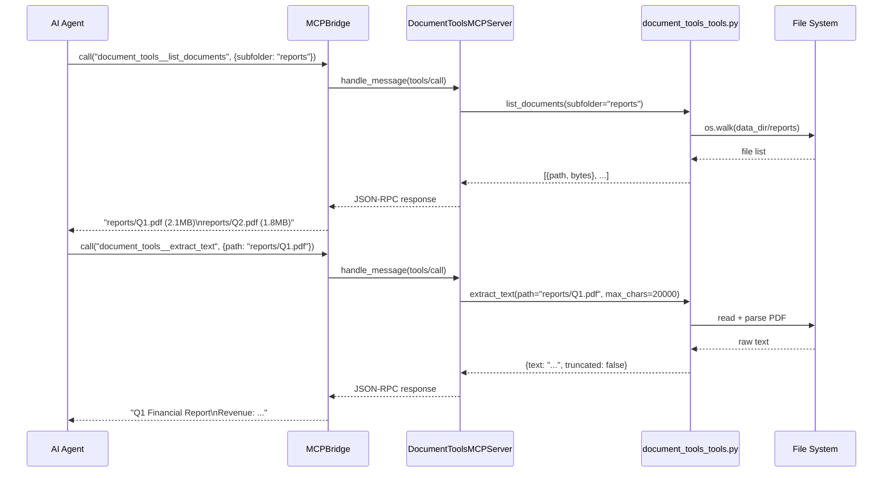
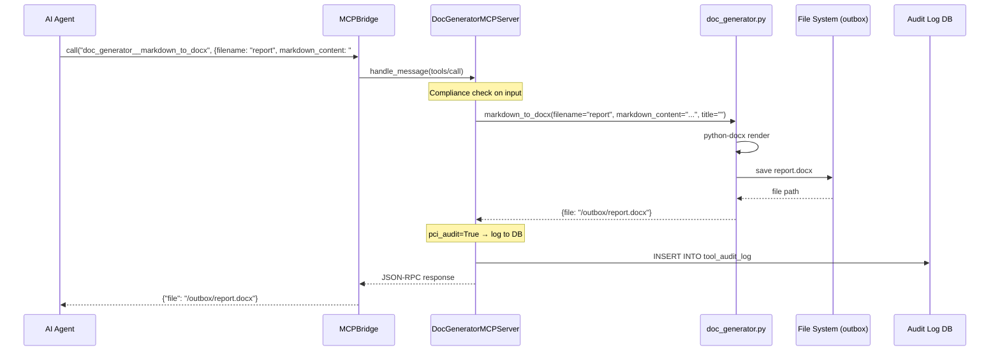
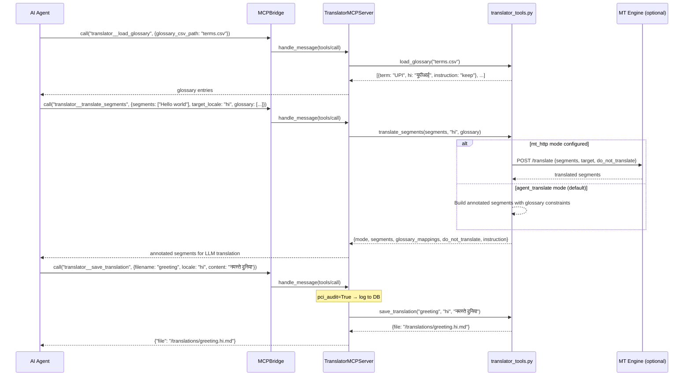
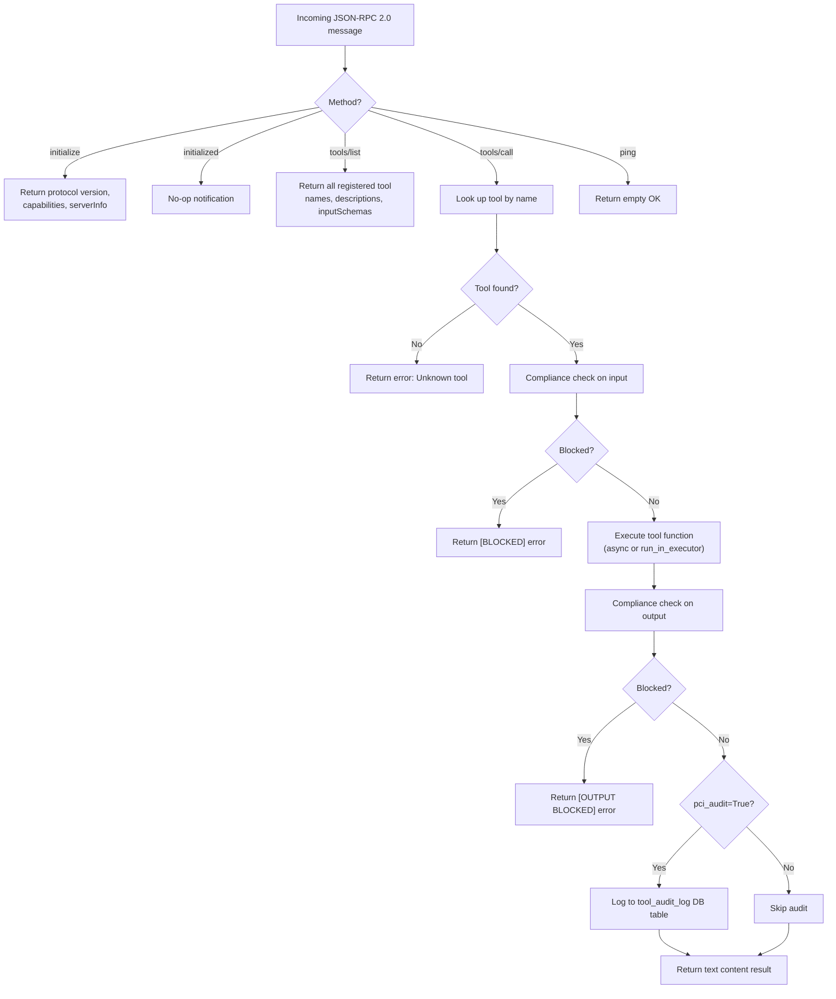
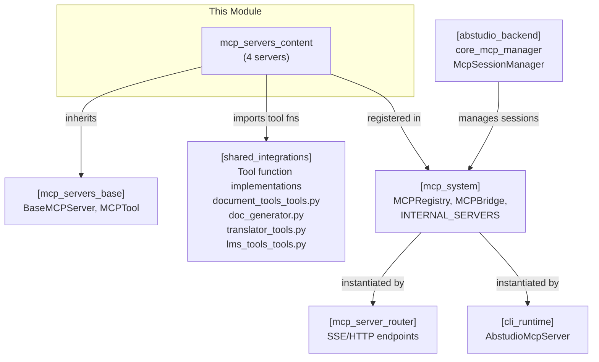

# MCP Servers — Content Module

## Introduction

The `mcp_servers_content` module groups four MCP (Model Context Protocol) servers that provide AI agents with content-oriented capabilities: document ingestion, document generation, translation/localization, and learning management. Each server is a thin wrapper that registers tool functions from the shared `tools/` package into the spec-compliant MCP framework, making them callable by any MCP-compatible client (CLI, SSE endpoint, or the platform's internal `MCPBridge`).

The four servers in this module are:

| Server | Slug | Tools | Purpose |
|--------|------|-------|---------|
| `DocumentToolsMCPServer` | `document_tools` | `list_documents`, `extract_text`, `extract_text_batch`, `search_in_document` | Read and search documents (PDF, DOCX, XLSX, HTML, MD, TXT, etc.) |
| `DocGeneratorMCPServer` | `doc_generator` | `write_markdown`, `markdown_to_docx`, `slides_to_pptx` | Generate Markdown, Word, and PowerPoint files |
| `TranslatorMCPServer` | `translator` | `load_glossary`, `translate_segments`, `save_translation` | Translate text segments with glossary constraints |
| `LMSToolsMCPServer` | `lms_tools` | `list_modules`, `save_learning_plan`, `get_learning_plan` | Manage learning modules and personalized learning plans |

---

## Architecture

### Class Hierarchy

All four servers inherit from `BaseMCPServer` (defined in [mcp_servers_base](mcp_servers_base.md)) and follow the same pattern:

1. **Subclass** `BaseMCPServer` and set a unique `server_name` (the URL slug).
2. **Override** `_setup_tools()` to import tool functions from `tools/<slug>_tools.py` and register each as an `MCPTool` via `self._register(MCPTool(...))`.
3. **Run** via `asyncio.run(MyServer().run_stdio())` for CLI/subprocess transport, or via the platform's SSE/streamable-HTTP endpoints for web transport.



### Module Dependencies



### How Servers Are Registered and Discovered

The four content servers participate in a **dual-registration** scheme:

1. **MCP Server registration** — Each server class is imported and added to the `INTERNAL_SERVERS` dict in `mcp/servers/__init__.py`. At platform startup, `MCPBridge.bootstrap()` instantiates every entry, making tools callable via the `slug__tool_name` convention (e.g., `document_tools__extract_text`) over JSON-RPC.

2. **ToolRegistry registration** — The same underlying tool functions are also registered directly in `MCPRegistry._register_tools()` under their bare names (e.g., `extract_text`). This allows the agent builder UI and `mcp_registry.execute_tool()` to reach them without the MCP protocol layer.



---

## Component Documentation

### 1. DocumentToolsMCPServer

**File:** `mcp/servers/document_tools_server.py`
**Server name (slug):** `document_tools`

Wraps `tools/document_tools_tools.py` to provide document ingestion and search capabilities. Supports PDF, Word (.docx), Excel (.xls/.xlsx), HTML, Markdown, plain text, CSV, EML, and JSON files.

#### Registered Tools

| Tool | Description | PCI Audit | Key Parameters |
|------|-------------|-----------|----------------|
| `list_documents` | List readable documents under the configured document root, optionally within a subfolder | No | `subfolder` (optional) |
| `extract_text` | Extract plain text from a single document given its path relative to the document root | No | `path` (required), `max_chars` (default 20000) |
| `extract_text_batch` | Extract text from many documents in one call — caps per-file and total text to fit in one agent turn | No | `paths` (required, array), `max_chars_each` (default 4000), `total_char_budget` (default 120000) |
| `search_in_document` | Find case-insensitive occurrences of a query string inside a document; returns surrounding context snippets (max 20 hits) | No | `path` (required), `query` (required), `context_chars` (default 300) |

#### Design Notes

- **`extract_text_batch`** is a critical optimization for agents that need to read dozens or hundreds of files. Without it, calling `extract_text` repeatedly would exhaust the agent's turn/context budget. The batch tool enforces a hard file-count cap (`_MAX_BATCH_FILES`) and a total character budget, reporting skipped files for follow-up calls.
- All tools operate relative to a configured `_DATA_DIR` document root, with path traversal protection via `_safe()`.

#### Use Cases

Use cases 59, 62, 67, 72, 73, 74, 93 — any flow that ingests a PDF/MD/TXT document.

---

### 2. DocGeneratorMCPServer

**File:** `mcp/servers/doc_generator_server.py`
**Server name (slug):** `doc_generator`

Wraps `tools/doc_generator.py` to provide document generation capabilities. All tools write to a configured generated-docs outbox directory.

#### Registered Tools

| Tool | Description | PCI Audit | Key Parameters |
|------|-------------|-----------|----------------|
| `write_markdown` | Write markdown content to a `.md` file in the generated-docs outbox | Yes | `filename` (required), `content` (required) |
| `markdown_to_docx` | Render simple markdown (headings, bullets, paragraphs) into a `.docx` file | Yes | `filename` (required), `markdown_content` (required), `title` (optional) |
| `slides_to_pptx` | Render a list of slides into a `.pptx` file. Each slide: `{title, bullets, notes?}` | Yes | `filename` (required), `slides` (required, array of objects) |

#### Design Notes

- All three tools have `pci_audit=True`, meaning every invocation is logged to the `tool_audit_log` database table with tool name, inputs, output (truncated to 2000 chars), and duration.
- `markdown_to_docx` supports `#`/`##`/`###` heading levels, `-`/`*` bullet lists, and plain paragraphs. It uses the `python-docx` library.
- `slides_to_pptx` uses `python-pptx` and supports speaker notes per slide.

#### Use Cases

Use cases 71 (financial report), 82 (press release), 91 (deck generation), 93 (RFP response), 95 (policy/SOP drafting), 96 (training material).

---

### 3. TranslatorMCPServer

**File:** `mcp/servers/translator_server.py`
**Server name (slug):** `translator`

Wraps `tools/translator_tools.py` to provide translation and localization capabilities with glossary support.

#### Registered Tools

| Tool | Description | PCI Audit | Key Parameters |
|------|-------------|-----------|----------------|
| `load_glossary` | Load a glossary CSV (term, per-locale columns, instruction) to constrain translation | No | `glossary_csv_path` (required) |
| `translate_segments` | Translate text segments to `target_locale` honouring glossary rules. Supports two modes: `agent_translate` (returns annotated segments for the LLM to translate) and `mt_http` (calls a configured MT engine) | No | `segments` (required, array), `target_locale` (required), `glossary` (optional, array of objects) |
| `save_translation` | Persist a translated document to the translations outbox as `<filename>.<locale>.md` | Yes | `filename` (required), `locale` (required), `content` (required) |

#### Design Notes

- **Two translation modes:**
  - **`agent_translate`** (default): Returns segments annotated with glossary constraints (`do_not_translate` terms, `glossary_mappings`) and an instruction for the LLM to perform the translation. This leverages the agent's language capabilities while enforcing terminology consistency.
  - **`mt_http`**: When `_PROVIDER == "mt_http"` and `_MT_ENDPOINT` is configured, calls an external Machine Translation engine via HTTP POST with Bearer token authentication. The `do_not_translate` terms are passed to the MT engine.
- Glossary entries with `"keep"` in their instruction field are added to the `do_not_translate` list, ensuring domain-specific terms remain untranslated.
- `save_translation` has `pci_audit=True` for audit trail of persisted translations.

#### Use Cases

Use case 94 (document translation & localization).

---

### 4. LMSToolsMCPServer

**File:** `mcp/servers/lms_tools_server.py`
**Server name (slug):** `lms_tools`

Wraps `tools/lms_tools_tools.py` to provide Learning Management System capabilities.

#### Registered Tools

| Tool | Description | PCI Audit | Key Parameters |
|------|-------------|-----------|----------------|
| `list_modules` | List learning modules from the configured catalog CSV, filterable by level and max duration | No | `level` (optional), `max_duration_min` (optional, default 0 = no limit) |
| `save_learning_plan` | Persist a learning plan (list of `{week, modules, milestone, quiz_topic}`) for a learner as JSON | Yes | `learner_id` (required), `plan` (required, array of objects) |
| `get_learning_plan` | Fetch a previously saved learning plan for a learner | No | `learner_id` (required) |

#### Design Notes

- `list_modules` reads from a configured catalog CSV (`_CATALOG_CSV`) using pandas, supporting filtering by difficulty level and maximum duration in minutes.
- Learning plans are persisted as JSON files named `plan_<learner_id>.json` in a configured plans directory (`_PLANS_DIR`).
- `save_learning_plan` has `pci_audit=True` since it writes persistent learner data.

#### Use Cases

Use cases 96 (training material creation), 100 (personalized learning tutor).

---

## Data Flow

### Document Ingestion Flow



### Document Generation Flow



### Translation Flow



---

## Request Processing Lifecycle

All four servers share the same request processing lifecycle inherited from `BaseMCPServer`:



---

## Transport Mechanisms

Each server supports three transport mechanisms, all handled by `BaseMCPServer`:

| Transport | Method | Use Case |
|-----------|--------|----------|
| **stdio** | `run_stdio()` | CLI subprocess mode — reads JSON-RPC from stdin, writes to stdout |
| **SSE** | `sse_stream(session_id)` / `handle_sse_message(body, session_id)` | Persistent Server-Sent Events stream with 15s keep-alive pings |
| **Streamable HTTP** | `handle_streamable_http(body, session_id)` | Direct POST with inline response (MCP spec 2024-11-05); used by CLI v0.2.101+ |

All transports share the same `handle_message()` dispatch, ensuring consistent compliance checks, audit logging, and error handling.

---

## Relationship to Other Modules



### Key Relationships

- **[mcp_servers_base](mcp_servers_base.md)**: Provides `BaseMCPServer` and `MCPTool` — the foundational classes that handle JSON-RPC 2.0 protocol dispatch, compliance gating, audit logging, and all transport mechanisms.
- **[mcp_system](mcp_system.md)**: The `MCPRegistry` dual-registers the same tool functions under bare names, and `MCPBridge` instantiates these servers at startup for internal `slug__tool_name` routing.
- **[shared_integrations](shared_integrations.md)**: Contains the actual tool function implementations (`tools/document_tools_tools.py`, `tools/doc_generator.py`, `tools/translator_tools.py`, `tools/lms_tools_tools.py`) that the servers wrap.
- **[mcp_server_router](shared_api_routers.md)**: Exposes each server's tools over SSE and streamable HTTP endpoints at `/mcp/<slug>/sse` and `/mcp/<slug>/message`.
- **[abstudio_backend](abstudio_backend.md)**: The `McpSessionManager` in `core/mcp_manager.py` manages MCP server sessions for the ABStudio agent platform, connecting agents to these content tools.

---

## Security & Compliance

### Compliance Gating

Every `tools/call` request passes through two compliance checks in `BaseMCPServer._handle_tools_call()`:

1. **Input check** — The JSON-serialized arguments are scanned before tool execution. If blocked, the tool is never invoked.
2. **Output check** — The tool's string result is scanned after execution. If blocked, the output is replaced with an `[OUTPUT BLOCKED]` message.

### PCI Audit Logging

Tools marked with `pci_audit=True` have their full invocation logged to the `tool_audit_log` database table:

| Field | Description |
|-------|-------------|
| `tool_name` | Name of the invoked tool |
| `inputs` | JSON-serialized input arguments |
| `output` | Tool output (truncated to 2000 characters) |
| `duration_ms` | Execution time in milliseconds |
| `created_at` | Timestamp |

In this module, the following tools have PCI audit enabled:
- `doc_generator`: `write_markdown`, `markdown_to_docx`, `slides_to_pptx`
- `translator`: `save_translation`
- `lms_tools`: `save_learning_plan`

Read-only tools (`list_documents`, `extract_text`, `search_in_document`, `load_glossary`, `translate_segments`, `list_modules`, `get_learning_plan`) do not require audit logging.

---

## Configuration

Each server's underlying tool functions rely on environment-configured paths and settings:

| Server | Config Key | Description |
|--------|-----------|-------------|
| `document_tools` | `_DATA_DIR` | Root directory for readable documents |
| `doc_generator` | Generated-docs outbox | Output directory for generated files |
| `translator` | `_PROVIDER`, `_MT_ENDPOINT`, `_AUTH_TOKEN_ENV` | Translation provider mode and MT engine endpoint |
| `translator` | `_OUTPUT_DIR` | Output directory for translated documents |
| `lms_tools` | `_DATA_DIR`, `_CATALOG_CSV` | Root directory and catalog CSV filename |
| `lms_tools` | `_PLANS_DIR` | Directory for persisted learning plan JSON files |

---

## Running Servers Standalone

Each server can be run independently as a stdio MCP server:

```bash
# Document tools
python -m mcp.servers.document_tools_server

# Document generator
python -m mcp.servers.doc_generator_server

# Translator
python -m mcp.servers.translator_server

# LMS tools
python -m mcp.servers.lms_tools_server
```

When run standalone, the server reads JSON-RPC 2.0 messages from stdin and writes responses to stdout, following the MCP stdio transport protocol.
