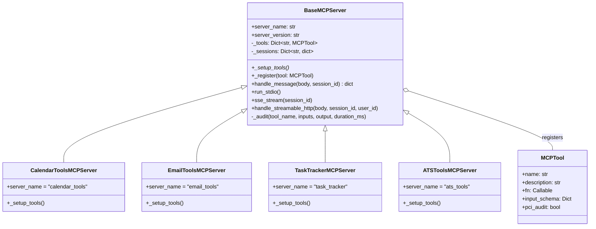
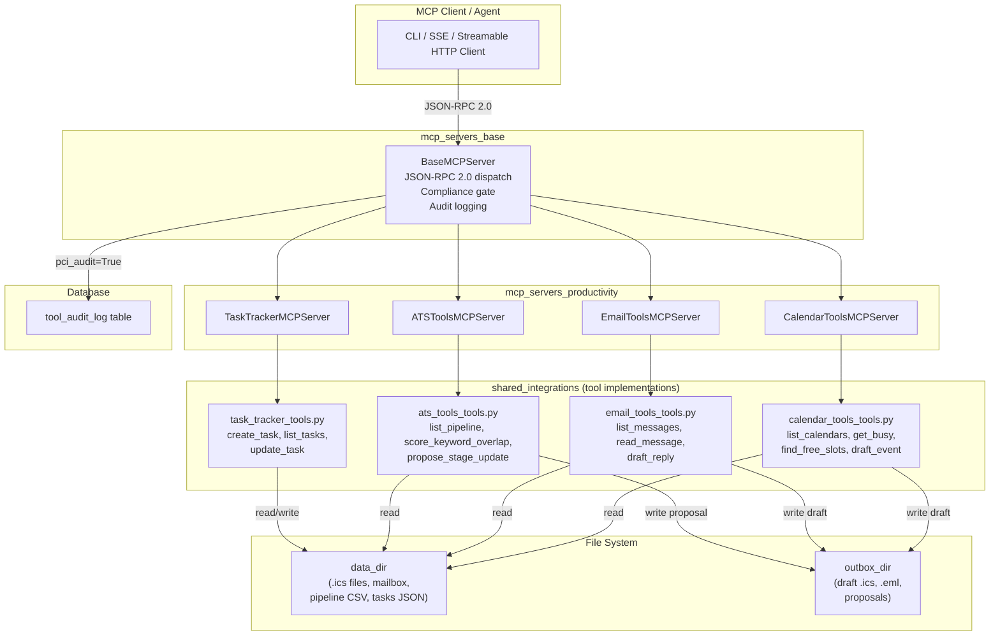
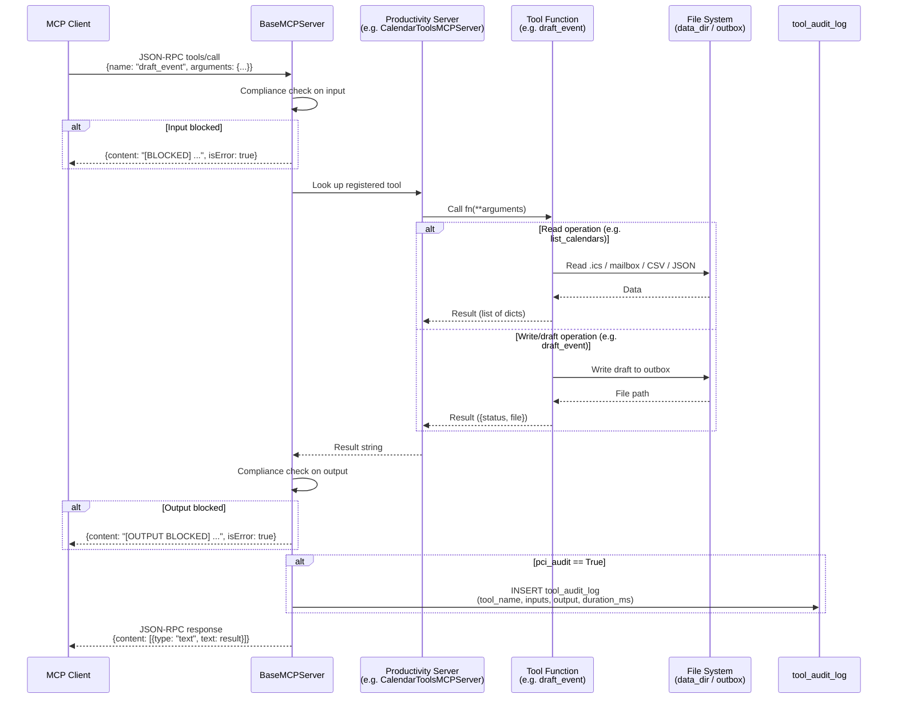
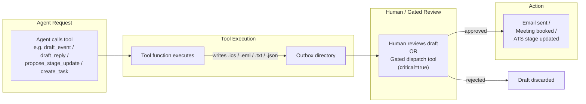
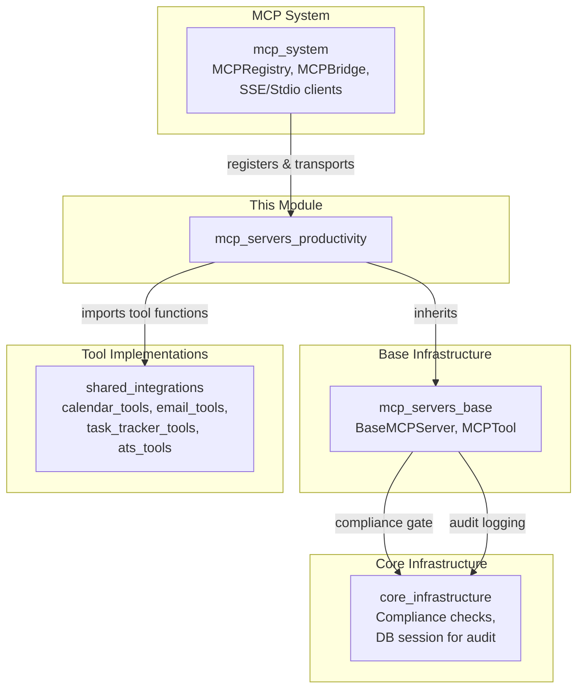
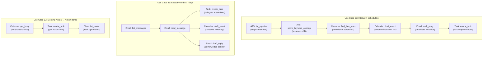

# MCP Servers — Productivity

## Introduction

The **mcp_servers_productivity** module provides a suite of Model Context Protocol (MCP) servers that expose everyday productivity tools — calendar management, email triage, task tracking, and applicant tracking — to AI agents and workflows. Each server is a thin wrapper that registers tool functions (implemented in the [shared_integrations](shared_integrations.md) module) as JSON-RPC-callable MCP tools, inheriting all protocol handling, compliance gating, and audit logging from the [mcp_servers_base](mcp_servers_base.md) module.

A defining design principle across all four servers is the **outbox pattern**: operations that would normally have side effects (sending an email, booking a meeting, updating an ATS pipeline stage) are *not* executed directly. Instead, a draft or proposal file is written to a configurable outbox directory, deferring the actual action to a human reviewer or a separately-gated, `critical=true` dispatch tool. This keeps the productivity servers safe for autonomous agent use while preserving a full audit trail.

---

## Module Structure

```
mcp_servers_productivity
├── calendar_tools_server.py   → CalendarToolsMCPServer
├── email_tools_server.py      → EmailToolsMCPServer
├── task_tracker_server.py     → TaskTrackerMCPServer
└── ats_tools_server.py        → ATSToolsMCPServer
```

| Server | `server_name` | Tools Exposed | Use Cases |
|---|---|---|---|
| `CalendarToolsMCPServer` | `calendar_tools` | `list_calendars`, `get_busy`, `find_free_slots`, `draft_event` | Meeting notes (57), interview scheduling (63), exec inbox (86), calendar management (87) |
| `EmailToolsMCPServer` | `email_tools` | `list_messages`, `read_message`, `draft_reply` | Exec inbox triage (86), candidate follow-up drafting (64) |
| `TaskTrackerMCPServer` | `task_tracker` | `create_task`, `list_tasks`, `update_task` | Action items from meeting notes (57), onboarding checklist (65), executive inbox delegation (86) |
| `ATSToolsMCPServer` | `ats_tools` | `list_pipeline`, `score_keyword_overlap`, `propose_stage_update` | Resume-to-JD matching (62), interview scheduling (63), candidate follow-up sequences (64) |

---

## Architecture

### Class Hierarchy

All four servers inherit from `BaseMCPServer` and follow an identical registration pattern:



### High-Level Architecture



---

## Component Documentation

### CalendarToolsMCPServer

**File:** `mcp/servers/calendar_tools_server.py`
**Server name:** `calendar_tools`

Wraps four calendar utility functions from `tools/calendar_tools_tools.py`. The server reads `.ics` files from a configured data directory and writes draft events to an outbox.

| Tool | PCI Audit | Description | Key Parameters |
|---|---|---|---|
| `list_calendars` | No | Lists all `.ics` files under the data root | — |
| `get_busy` | No | Returns busy intervals (start, end, title) from a calendar | `calendar_path` (required) |
| `find_free_slots` | No | Finds common free slots across multiple calendars on a given date within working hours | `calendar_paths` (required), `date` YYYY-MM-DD (required), `duration_min` (default 60), `earliest`/`latest` HH:MM (optional) |
| `draft_event` | **Yes** | Writes a tentative `.ics` event to the outbox (not booked) | `title`, `start_iso`, `end_iso`, `attendees` (all required) |

**Free-slot algorithm:** The tool iterates from the earliest working hour to the latest in 30-minute increments. A slot of `duration_min` length is considered free if it does not overlap any busy interval. Results are capped at 10 slots.

---

### EmailToolsMCPServer

**File:** `mcp/servers/email_tools_server.py`
**Server name:** `email_tools`

Wraps three email utility functions from `tools/email_tools_tools.py`. The server reads messages from a configured mailbox directory and writes draft replies to an outbox.

| Tool | PCI Audit | Description | Key Parameters |
|---|---|---|---|
| `list_messages` | No | Lists message metadata (id, from, subject, date) | — |
| `read_message` | No | Reads the full body of a message by id | `message_id` (required) |
| `draft_reply` | **Yes** | Writes a DRAFT reply `.eml` to the outbox (never sends) | `message_id`, `body` (both required) |

> **Design note:** Sending is intentionally absent from this server. Actual email dispatch is a gated tool registered separately with `critical=true`, ensuring a human-in-the-loop or an explicitly approved automation path is required.

---

### TaskTrackerMCPServer

**File:** `mcp/servers/task_tracker_server.py`
**Server name:** `task_tracker`

Wraps three task management functions from `tools/task_tracker_tools.py`. Tasks are persisted as a JSON file in the data directory.

| Tool | PCI Audit | Description | Key Parameters |
|---|---|---|---|
| `create_task` | **Yes** | Creates a task with a UUID-based 8-char id, status `open` | `title` (required), `owner`, `due` YYYY-MM-DD, `details` |
| `list_tasks` | No | Lists tasks, optionally filtered by status and/or owner | `status` (open/done), `owner` |
| `update_task` | **Yes** | Updates a task's status, owner, or due date | `task_id` (required), `status`, `owner`, `due` |

**Persistence:** Tasks are stored as a JSON array in the data directory. Each `create_task` and `update_task` call loads the full list, modifies it, and writes it back atomically.

---

### ATSToolsMCPServer

**File:** `mcp/servers/ats_tools_server.py`
**Server name:** `ats_tools`

Wraps three applicant tracking functions from `tools/ats_tools_tools.py`. The server reads candidate pipeline data from a CSV file and writes stage-change proposals to an outbox.

| Tool | PCI Audit | Description | Key Parameters |
|---|---|---|---|
| `list_pipeline` | No | Lists candidates from the pipeline CSV, optionally filtered by stage | `stage` |
| `score_keyword_overlap` | No | Deterministic keyword-coverage score (0–100) of a resume against JD requirements | `resume_text`, `jd_must_have[]`, `jd_nice_to_have[]` (all required) |
| `propose_stage_update` | **Yes** | Writes a PROPOSED stage change to the outbox for recruiter confirmation (no direct ATS write) | `candidate_id`, `new_stage`, `rationale` (all required) |

**Scoring formula:** The score is weighted as `70% × (must_have_hits / total_must_have) + 30% × (nice_to_have_hits / total_nice_to_have)`, rounded to the nearest integer. A requirement phrase is considered a "hit" if any word of 4+ characters from the phrase appears in the lowercased resume text.

---

## Request Processing Flow

The following sequence diagram illustrates how a `tools/call` request flows through the system, from the MCP client through the base server's compliance and audit gates to the underlying tool function:



---

## Outbox Pattern

A critical safety mechanism shared by all four servers is the **outbox pattern**. Write operations that could have real-world consequences never execute the action directly. Instead, they produce a draft or proposal artifact in a designated outbox directory:



| Server | Outbox Artifact | Format | Deferred Action |
|---|---|---|---|
| Calendar | `draft_<start>_<title>.ics` | ICS with `STATUS:TENTATIVE` | Meeting booking |
| Email | `draft_re_<subject>.eml` | EML with `X-Status: DRAFT` | Email send |
| ATS | `proposed_<candidate>_<stage>.txt` | Plain text proposal | ATS stage update |
| Task Tracker | tasks JSON (direct write) | JSON | — (tasks are low-risk, written directly) |

> **Note:** The Task Tracker is the exception — `create_task` and `update_task` write directly to the tasks JSON file because task management is considered low-risk. However, both operations still carry `pci_audit=True` for full audit logging.

---

## Dependencies



### Dependency Summary

| Dependency | Type | Purpose |
|---|---|---|
| [mcp_servers_base](mcp_servers_base.md) | Inheritance | `BaseMCPServer` provides JSON-RPC 2.0 dispatch, compliance gating, audit logging, and stdio/SSE/streamable-HTTP transports |
| [shared_integrations](shared_integrations.md) | Import | Tool function implementations (`calendar_tools_tools`, `email_tools_tools`, `task_tracker_tools`, `ats_tools_tools`) |
| [mcp_system](mcp_system.md) | Registration | `MCPRegistry` discovers and registers server instances; `MCPBridge` and client transports connect agents to servers |
| [core_infrastructure](core_infrastructure.md) | Runtime | Compliance checks (`_compliance_check`) on tool inputs/outputs; database session for `tool_audit_log` inserts |

---

## Transport Support

All four servers inherit the full transport stack from `BaseMCPServer`:

| Transport | Method | Use Case |
|---|---|---|
| **stdio** | `run_stdio()` | Standalone execution via `__main__` block; reads JSON-RPC from stdin, writes to stdout |
| **SSE** | `sse_stream(session_id)` / `handle_sse_message(body, session_id)` | Persistent Server-Sent Events stream with 15s keep-alive pings; messages POSTed to `/mcp/{name}/message` |
| **Streamable HTTP** | `handle_streamable_http(body, session_id, user_id)` | MCP spec 2024-11-05; inline JSON-RPC response with `Mcp-Session-Id` header; used by CLI v0.2.101+ |

Each server's `__main__` block runs the stdio transport:

```python
if __name__ == "__main__":
    asyncio.run(CalendarToolsMCPServer().run_stdio())
```

---

## PCI Audit & Compliance

Tools marked with `pci_audit=True` trigger full input/output logging to the `tool_audit_log` database table after execution. The base class records:

| Field | Content |
|---|---|
| `tool_name` | Registered tool name (e.g., `draft_event`) |
| `inputs` | JSON-serialized arguments |
| `output` | Result string (truncated to 2000 chars) |
| `duration_ms` | Execution time |
| `created_at` | Timestamp |

Additionally, **all** tool calls (regardless of `pci_audit`) pass through dual compliance gates — one on input and one on output — via `_compliance_check()`. If either gate blocks, the response is returned with `isError: true` and the tool function is either not called (input block) or its result is suppressed (output block).

### PCI-Audited Tools by Server

| Server | Audited Tools |
|---|---|
| Calendar | `draft_event` |
| Email | `draft_reply` |
| Task Tracker | `create_task`, `update_task` |
| ATS | `propose_stage_update` |

---

## Cross-Server Use Case Flows

Several use cases span multiple productivity servers. The diagram below illustrates how an agent might orchestrate tools across servers:



---

## Configuration

Tool implementations in [shared_integrations](shared_integrations.md) rely on environment-configured paths:

| Config | Used By | Purpose |
|---|---|---|
| `_DATA_DIR` | Calendar, Email, ATS, Task Tracker | Root directory for `.ics` files, mailbox, pipeline CSV, and tasks JSON |
| `_OUTBOX_DIR` | Calendar, Email, ATS | Directory where draft/proposal artifacts are written |
| `_WORK_HOURS` | Calendar | Default working hours (e.g., `09:00-18:00`) for `find_free_slots` |
| `_TIMEZONE` | Calendar | Timezone for draft `.ics` events |
| `_PIPELINE_CSV` | ATS | Filename of the candidate pipeline CSV within `_DATA_DIR` |

---

## Related Documentation

- [mcp_servers_base](mcp_servers_base.md) — `BaseMCPServer` and `MCPTool` base classes, JSON-RPC protocol handling, transport implementations
- [shared_integrations](shared_integrations.md) — Tool function implementations for calendar, email, task tracker, and ATS tools
- [mcp_system](mcp_system.md) — `MCPRegistry`, `MCPBridge`, and client transports for server registration and agent connectivity
- [core_infrastructure](core_infrastructure.md) — Compliance checking and database session management for audit logging
- [mcp_servers_collaboration](mcp_servers_collaboration.md) — Sibling MCP servers for Confluence, Jira, and GitLab
- [mcp_servers_content](mcp_servers_content.md) — Sibling MCP servers for document tools, doc generation, translation, and LMS
- [mcp_servers_data](mcp_servers_data.md) — Sibling MCP servers for data tools, database access, and KB search
- [mcp_servers_platform](mcp_servers_platform.md) — Sibling MCP server for platform-level agent and health operations
