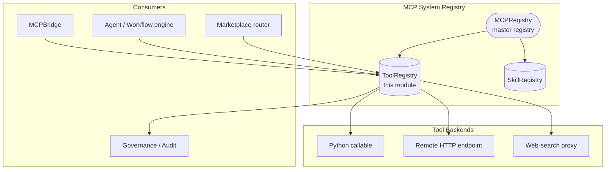
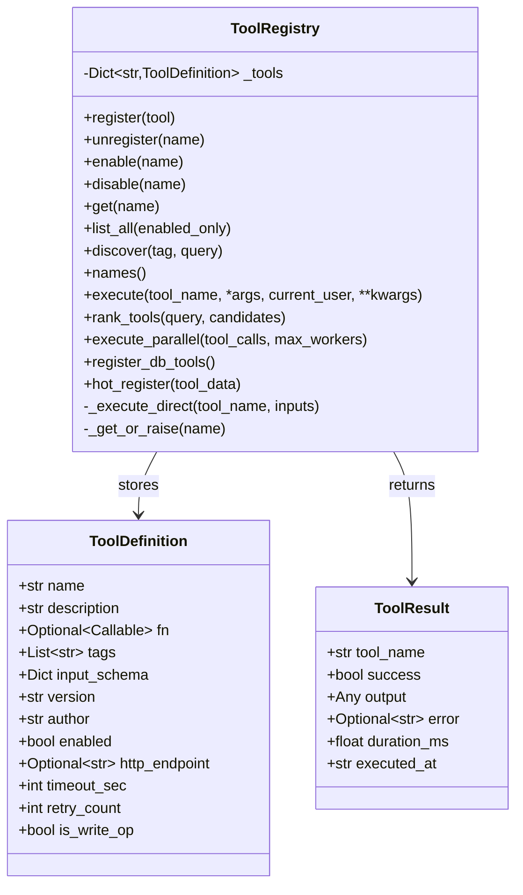
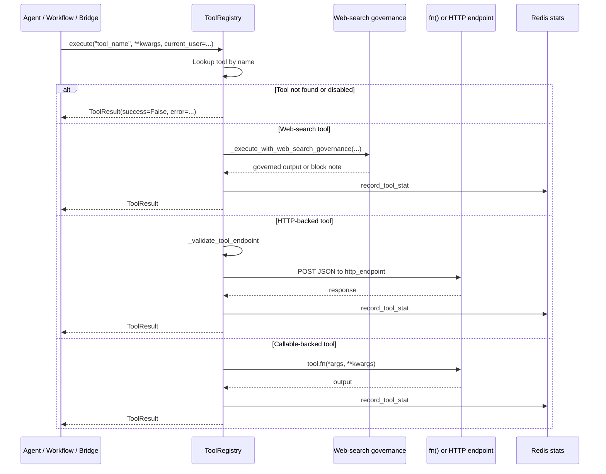
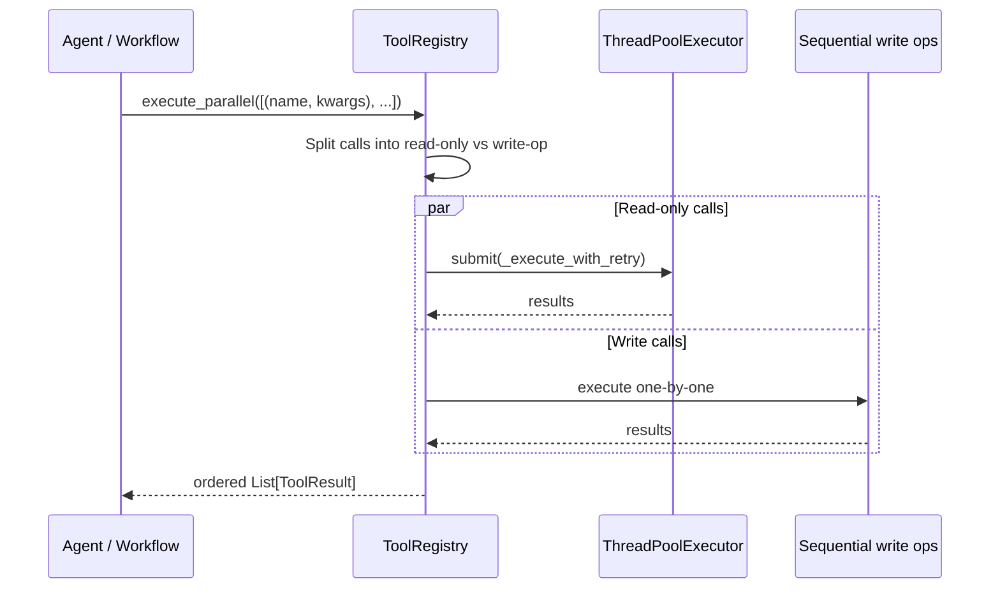
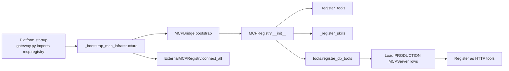

# MCP System Registry — Tools (`mcp_system_registry_tools`)

## Brief Introduction

The **Tool Registry** is the central, thread-safe registry for every executable tool available to agents, workflows, and chat in the NPCI Agentic Platform. It stores metadata-backed `ToolDefinition` objects, supports discovery by tag or keyword, executes tools safely with timing/error capture, and can back tools by either a local Python callable or a remote HTTP endpoint. It is one of three sibling registries under the [MCP System Registry](mcp_system_registry.md) (the others being the master [MCPRegistry](mcp_system_registry_master.md) and the [SkillRegistry](mcp_system_registry_skills.md)).

This module is the implementation home of `ToolRegistry` (`mcp/tool_registry.py`). It is consumed directly by the master registry, by the [MCP Bridge](mcp_system_bridge.md), by the [marketplace router](shared_api_routers_marketplace_router.md), and by any agent or workflow engine that needs to invoke a tool by name.

---

## Core Responsibilities

| Responsibility | Description |
| --- | --- |
| **Tool registration** | Accept `ToolDefinition` objects (name, description, callable/HTTP endpoint, schema, tags, execution config) and store them in-memory. |
| **Safe naming** | Enforce a strict identifier charset for names loaded from untrusted sources (DB rows, external discovery) to prevent stored-XSS / identifier injection. |
| **SSRF protection** | Validate HTTP tool endpoints against an allowlist and block private/reserved IP ranges. |
| **Execution** | Run a tool by name, capture timing, success/failure, and errors in a `ToolResult`. Never raises — errors are returned. |
| **Governance gating** | Intercept web-search tools and route them through governance, budget, and audit checks before execution. |
| **Discovery & ranking** | List, filter by tag/keyword, and rank tools with a local TF-IDF cosine similarity (no LLM call). |
| **Parallel execution** | Execute independent read-only tool calls in parallel while running write operations sequentially. |
| **Hot loading** | Load production MCP server rows from Postgres at startup and register live tools from API payloads without a restart. |
| **Marketplace stats** | Record per-tool call/error/last-used counters in Redis for marketplace analytics. |

---

## Architecture

### Component Overview

### Class Diagram

---

## Data Flows

### Single Tool Execution

### Parallel Tool Execution

---

## Security Controls

### SSRF Guard (SEC-01)

HTTP tool endpoints are validated by `_validate_tool_endpoint`:

1. **Scheme blocklist** — `file`, `gopher`, `ftp`, `data`, `javascript` are rejected.
2. **Prefix allowlist** — endpoints must start with an approved prefix (default `https://`; configurable via `TOOL_ENDPOINT_ALLOWLIST`).
3. **Private/reserved IP block** — hostnames that are IP literals in `10.0.0.0/8`, `172.16.0.0/12`, `192.168.0.0/16`, `127.0.0.0/8`, `169.254.0.0/16`, `::1/128`, or `fc00::/7` are rejected.

> DNS names are not resolved at validation time; the HTTP client enforces runtime SSRF protection when the call is made.

### Tool-Name Allow-List (SEC-02)

Names loaded from untrusted sources (Postgres `MCPServer` rows, external discovery) are validated with `_validate_tool_name`:

- Charset: letters, digits, `_`, `-`, `.`
- Length: 1–128 characters
- Must start with a letter or digit

This prevents stored-XSS and SQL-injection-style identifiers from becoming live tool names in discovery lists, agent pickers, and marketplace stats.

### Governance Gate for Web Search

When a tool name is in the web-search set, `execute()` delegates to `_execute_with_web_search_governance` (see [core_proxy_tool_use](core_proxy_tool_use.md)) before any backend call. The gate performs:

1. Model/user/department governance check
2. Pricing configuration lookup
3. Budget gate
4. Execution via `/llm/web-search` on the proxy server (the only host with internet egress)
5. Billing and audit recording

---

## Key Components

### `ToolDefinition`

A dataclass that describes a single tool. Important fields:

| Field | Purpose |
| --- | --- |
| `name` | Unique tool identifier. |
| `description` | Human-readable summary for discovery and LLM tool selection. |
| `fn` | Python callable (for local tools). |
| `http_endpoint` | Remote URL (for MCP/HTTP tools). |
| `tags` | Discovery categories. |
| `input_schema` | JSON Schema for expected arguments. |
| `timeout_sec` | Per-call wall-clock timeout. |
| `retry_count` | Number of retries on transient failure. |
| `is_write_op` | If true, excluded from parallel batches. |

### `ToolResult`

Standard execution result returned by `execute()` and `execute_parallel()`:

| Field | Purpose |
| --- | --- |
| `tool_name` | Name of the executed tool. |
| `success` | Whether execution succeeded. |
| `output` | Tool output (any type). |
| `error` | Error message if `success` is false. |
| `duration_ms` | Wall-clock execution time. |
| `executed_at` | ISO timestamp. |

### `ToolRegistry`

The main registry class. It is instantiated once as the module-level singleton `tool_registry`.

#### Registration & lifecycle

- `register(tool: ToolDefinition)` — add or overwrite a tool.
- `unregister(name)` — remove a tool.
- `enable(name)` / `disable(name)` — toggle availability without removing metadata.

#### Query

- `get(name)` — fetch a single definition.
- `list_all(enabled_only=True)` — list all (or only enabled) tools.
- `discover(tag=None, query=None)` — filter by tag and/or keyword.
- `names()` — list registered names.

#### Execution

- `execute(tool_name, *args, current_user=None, **kwargs)` — run a tool safely.
- `execute_parallel(tool_calls, max_workers=4)` — run independent calls in parallel.
- `_execute_direct(tool_name, inputs)` — internal helper that bypasses the governance wrapper.

#### Ranking

- `rank_tools(query, candidates=None)` — rank tools by TF-IDF cosine similarity of query vs. name + description + tags. Returns top 15.

#### Hot loading

- `register_db_tools()` — load `PRODUCTION`/`enabled` rows from the `MCPServer` table and register them as HTTP tools.
- `hot_register(tool_data: dict)` — register a tool live from an API payload (used by the marketplace router).

---

## Integration with the Rest of the System

### Upstream: Master Registry

The [MCPRegistry](mcp_system_registry_master.md) owns `self.tools = ToolRegistry()` and calls `self.tools.register_db_tools()` during `_bootstrap()`. It also registers all built-in platform tools (retrieval, compliance, code execution, LLM generate, workflow runner, memory, integrations, etc.) into the same `ToolRegistry`.

### Sibling: Skill Registry

The [SkillRegistry](mcp_system_registry_skills.md) references tool names (e.g. `tools=["retrieve", "compliance", "llm_generate"]`) but does not execute them. At runtime the agent/workflow engine resolves skill tool lists through `ToolRegistry.execute()`.

### Bridge Layer

The [MCPBridge](mcp_system_bridge.md) routes tool calls:

- Names containing `__` are routed to internal or external MCP servers.
- Names without `__` fall back to `mcp_registry.execute_tool(name, ...)`.

### External MCP Servers

The [ExternalMCPRegistry](mcp_system_bridge.md) discovers tools from external MCP servers and registers them into `ToolRegistry` with prefixed names (`server_name__tool_name`).

### Marketplace

The [marketplace router](shared_api_routers_marketplace_router.md) validates and sanitizes user-submitted tool registrations, persists them to Postgres, and calls `ToolRegistry.hot_register()` so the tool is live immediately.

### Governance

The [MCP governance router](shared_api_routers_mcp_governance_router.md) manages approval workflows. `MCPRegistry.execute_tool()` blocks execution of user-registered tools whose status is not `PRODUCTION`.

### Budget & Audit

Web-search tool execution is gated by [core_proxy_tool_use](core_proxy_tool_use.md), which checks governance, pricing, and budget before calling the proxy. Audit records are written per call.

---

## Process Flows

### Startup Bootstrap

### Marketplace Hot-Registration

---

## Configuration & Environment Variables

| Variable | Purpose |
| --- | --- |
| `TOOL_ENDPOINT_ALLOWLIST` | Comma-separated list of approved URL prefixes for HTTP tools. Default: `https://`. |
| `RDB_REGISTRY` / `REDIS_CLIENT_CONFIG_DB3` | Redis DB used for marketplace stats. |
| `LLM_PROXY_URL` / `LLM_PROXY_PORT` | Proxy endpoint for web-search tool execution. |

---

## Error Handling Philosophy

`ToolRegistry.execute()` is designed to **never raise** for ordinary tool failures. All errors are captured in `ToolResult.error`. This lets callers (agents, workflows, the bridge) decide how to handle failure without defensive `try/except` around every tool call. Security violations (SSRF, invalid names) and programming errors (e.g. calling `_execute_direct` for a web-search tool) still raise `ValueError` / `RuntimeError` at the point of misuse.

---

## References

- [MCP System Registry Master](mcp_system_registry_master.md) — `MCPRegistry` bootstrap and built-in tool registration.
- [MCP System Registry Skills](mcp_system_registry_skills.md) — `SkillRegistry` and skill-to-tool mapping.
- [MCP System Bridge](mcp_system_bridge.md) — `MCPBridge` and `ExternalMCPRegistry` routing.
- [Core Proxy Tool Use](core_proxy_tool_use.md) — web-search governance, budget gating, and audit.
- [Shared API Routers — Marketplace](shared_api_routers_marketplace_router.md) — user tool registration and marketplace metadata.
- [Shared API Routers — MCP Governance](shared_api_routers_mcp_governance_router.md) — tool approval workflows.
- [Shared Integrations Tools](shared_integrations_tools.md) — concrete tool implementations registered by the master registry.
