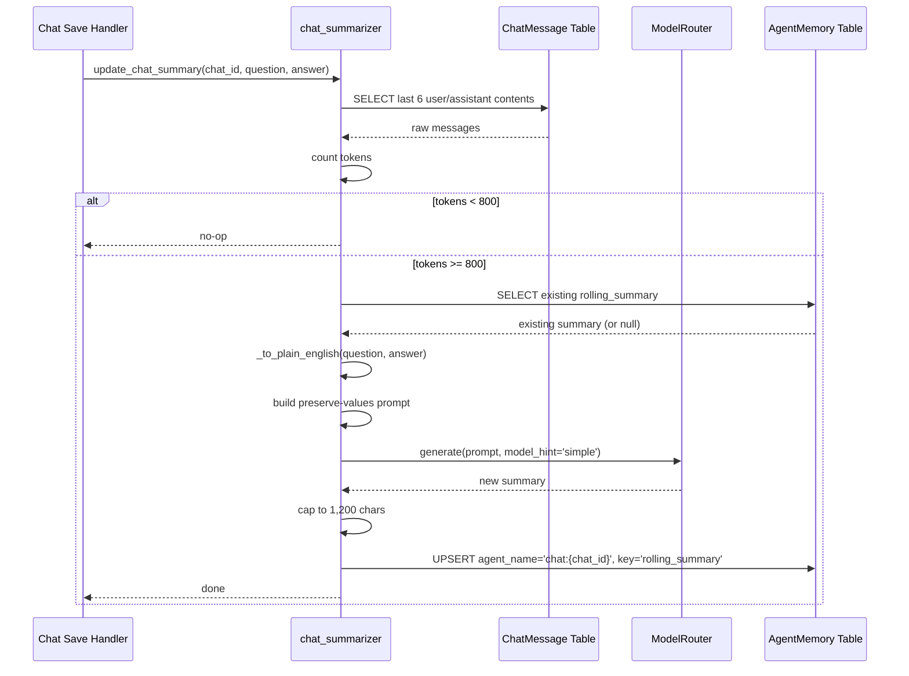
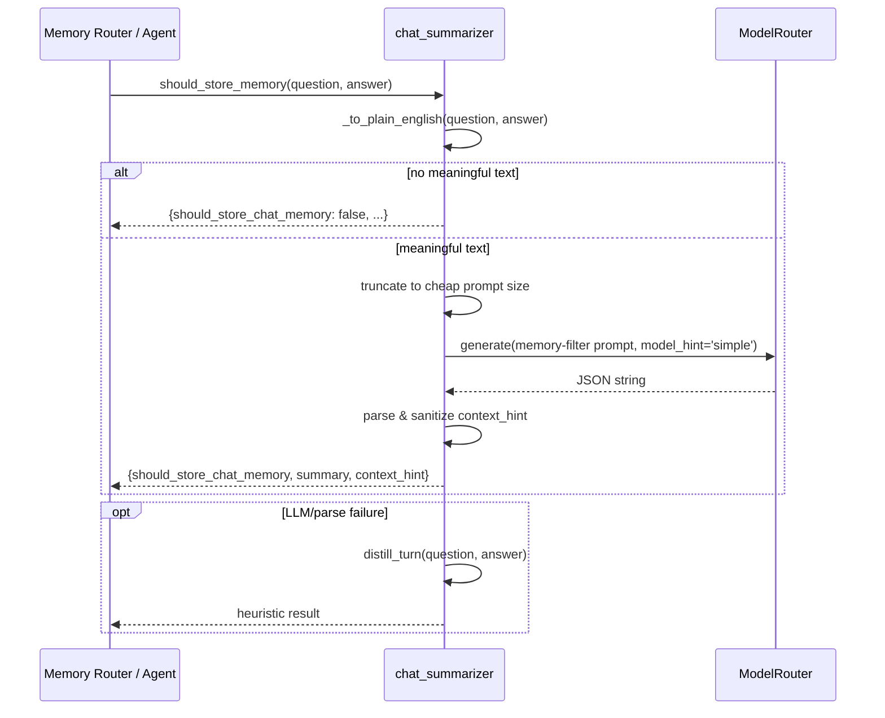

# memory_system_chat_summarizer

## Brief Introduction

The `memory_system_chat_summarizer` module provides **rolling per-chat summarization** and **cross-chat memory filtering** for the platform's conversational AI. It maintains a compact, ever-green summary of each chat thread and decides whether individual user-assistant turns are worth persisting as long-term memories.

The module is intentionally lightweight and best-effort: it runs in a background thread after messages are saved, uses a cheap `simple`-tier model, and never fails the caller when summarization or filtering encounters an error.

---

## Core Responsibilities

| Responsibility | Description |
| --- | --- |
| **Rolling chat summary** | Maintains a flat (~300 token) summary for every `chat_id` in the existing `agent_memory` table. |
| **Token-gated triggering** | Only regenerates the summary once the raw history of the last 6 messages exceeds ~800 tokens. |
| **Cross-chat memory filtering** | Uses an LLM to decide whether a Q&A turn contains durable user facts/preferences worth storing across chats. |
| **Content sanitization** | Strips code fences, markdown, URLs, and symbols while preserving exact scalar values (versions, IDs, dates, ratios). |
| **Best-effort fallback** | Falls back to heuristic summarization if the LLM is unavailable or returns unparseable output. |

---

## Architecture

The module sits between the chat persistence layer and the model routing layer. It reads raw `ChatMessage` rows, invokes the shared `ModelRouter` with a `simple` hint, and writes results back into the `AgentMemory` table.

```mermaid
flowchart TB
    subgraph ChatPersistence["Chat Persistence"]
        CM[(db.models.ChatMessage)]
    end

    subgraph MemorySystem["Memory System"]
        CS[memory/chat_summarizer.py]
        MS[memory/service.py MemoryService]
        PM[memory/postgres_memory.py PostgresMemory]
        RM[memory/redis_memory.py RedisMemory]
    end

    subgraph Routing["Model Routing"]
        MR[models/model_router.py ModelRouter]
        LLM[LLM Gateways / LLM Proxy]
    end

    subgraph Storage["Durable Storage"]
        AM[(db.models.AgentMemory)]
    end

    CM -->|read last 6 turns| CS
    CS -->|generate(prompt, model_hint='simple')| MR
    MR -->|route & dispatch| LLM
    LLM -->|summary / filter result| CS
    CS -->|upsert rolling_summary| AM
    MS -.->|used by higher-level memory flows| CS
    PM -.->|durable scope backend| MS
    RM -.->|session scope backend| MS
```

### Storage Layout

Rolling summaries are stored by reusing the existing `agent_memory` table:

- `agent_name` = `"chat:{chat_id}"`
- `key` = `"rolling_summary"`
- `value` = plain-English summary text (≤ 1,200 chars)

This avoids introducing a new schema and keeps chat memory aligned with the agent memory model.

---

## Component Reference

### `should_store_memory(question: str, answer: str) -> dict`

The primary public entry point for **cross-chat memory filtering**.

Returns a dictionary with:

| Key | Type | Meaning |
| --- | --- | --- |
| `should_store_chat_memory` | `bool` | Whether the turn deserves durable memory. |
| `summary` | `str` | Distilled plain-English memory (≤ 200 chars). |
| `context_hint` | `str` | Short snake_case topic label (e.g. `preferences`, `tech_stack`). |

Behavior:

1. Sanitizes both `question` and `answer` with `_to_plain_english`.
2. Fast-rejects turns that contain no meaningful plain text after stripping.
3. Prompts an LLM with a strict JSON schema and classification rules.
4. Sanitizes the returned `context_hint` to snake_case.
5. On any LLM or parse failure, falls back to `distill_turn()` and stores heuristically.

### `update_chat_summary(chat_id: str, question: str, answer: str) -> None`

Updates the **rolling per-chat summary**.

Behavior:

1. Counts tokens in the last 6 raw messages; aborts if below `_TRIGGER_TOKENS` (800).
2. Loads the existing summary (if any).
3. Sanitizes the new exchange.
4. Builds an LLM prompt that instructs the model to preserve exact numeric values, identifiers, versions, and dates.
5. Calls the model via `_call_model()`.
6. Caps the result at `_MAX_SUMMARY_CHARS` (1,200) and upserts it into `AgentMemory`.
7. On failure, logs a warning and leaves prior state intact.

### `distill_turn(question: str, answer: str) -> str`

Heuristic fallback that produces a compact (≤ 300 char) plain-English summary of one Q&A turn. Used when the LLM filter is unavailable or as a lightweight alternative.

### `_to_plain_english(text: str) -> str`

Content sanitizer. It:

- Drops fenced code blocks but extracts scalar `key:value` pairs that contain digits.
- Removes indented code, long JSON arrays, URLs, markdown headings, bold/inline code, and list markers.
- Strips non-ASCII characters (emoji, math symbols, Unicode arrows).
- Collapses whitespace.
- Keeps sentences with ≥ 4 words **or** any sentence containing a digit, ensuring exact facts survive.

### `_call_model(prompt: str) -> str`

Thin wrapper around `model_router.generate(prompt, model_hint="simple")`. Returns an empty string on failure so callers can fall back gracefully.

### `get_chat_summary(chat_id: str) -> str`

Reads the current rolling summary for a chat from `AgentMemory`.

### `_save_summary(chat_id: str, summary: str) -> None`

Upserts the rolling summary row in `AgentMemory`.

---

## Data Flow

### Rolling Summary Update



### Cross-Chat Memory Decision



---

## Dependencies

### Direct Dependencies

| Module | Component | Usage |
| --- | --- | --- |
| [model_routing](model_routing.md) | `ModelRouter` | Routes summarization and filter prompts to the `simple` tier (GPT-5-mini or local fallback). |
| [database](database.md) | `ChatMessage` | Reads recent chat history to decide whether to trigger summarization. |
| [database](database.md) | `AgentMemory` | Stores rolling summaries under `agent_name="chat:{chat_id}"`. |
| [core_infrastructure](core_infrastructure.md) | `logger` | Logs warnings/debug messages; never raises on failure. |

### Related Memory Modules

| Module | Relationship |
| --- | --- |
| [memory_system_service](memory_system_service.md) | Higher-level `MemoryService` facade that scopes writes to `SESSION`, `WORKING`, `DURABLE`, or `ORG`. The chat summarizer writes directly to Postgres for rolling summaries but conceptually aligns with `DURABLE` cross-chat memory. |
| [memory_system_postgres_memory](memory_system_postgres_memory.md) | Postgres-backed durable memory store. The chat summarizer reuses the same `agent_memory` table directly. |
| [memory_system_redis_memory](memory_system_redis_memory.md) | Redis-backed session/working memory store used by other memory flows. |
| [memory_system_cowork_memory](memory_system_cowork_memory.md) | Cowork-specific memory implementation that may consume cross-chat summaries. |

---

## Configuration & Constants

| Constant | Value | Purpose |
| --- | --- | --- |
| `_CHARS_PER_TOKEN` | 4 | Heuristic token estimator. |
| `_TRIGGER_TOKENS` | 800 | Minimum recent-history size before summarization runs. |
| `_MAX_SUMMARY_CHARS` | 1,200 | Hard cap on summary length (~300 tokens). |

These values keep the summarizer cheap and bounded: it only runs when raw history is large enough to benefit, and the summary stays flat regardless of conversation length.

---

## Error Handling & Operational Notes

- **Best-effort semantics**: every public function catches exceptions, logs a warning, and returns a safe default. Chat turns are never blocked by summarization failures.
- **Model unavailability**: if `ModelRouter` fails, `update_chat_summary` appends a minimal fallback sentence; `should_store_memory` falls back to `distill_turn()`.
- **Privacy**: the module uses `model_hint="simple"`, which respects the model router's privacy floor. Restricted data is pinned to the in-house local model and never egressed to cloud providers.
- **Thread safety**: designed to be called from a background thread after `_save_chat_messages`. Each call opens and closes its own database session.
- **Idempotency**: repeated calls with the same exchange are safe; the summary is upserted by `chat_id` and `key`.

---

## Integration Points

The module is typically invoked from chat/message handlers after a turn is persisted. It does not expose HTTP endpoints directly; instead, it is imported and called by:

- Chat save handlers that call `update_chat_summary()` in a background thread.
- Memory-aware agents that call `should_store_memory()` to decide what to persist in durable cross-chat memory.

For the public memory API, see [memory_router](memory_router.md) and [memory_system_service](memory_system_service.md).
