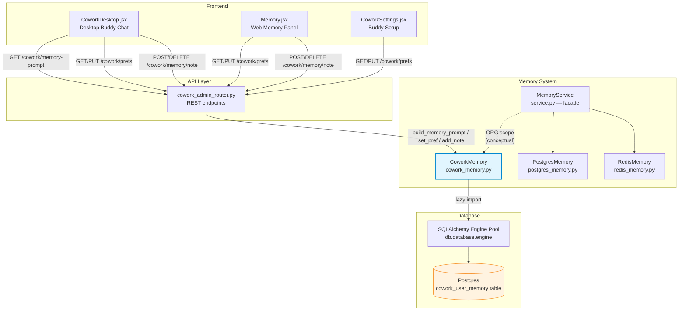
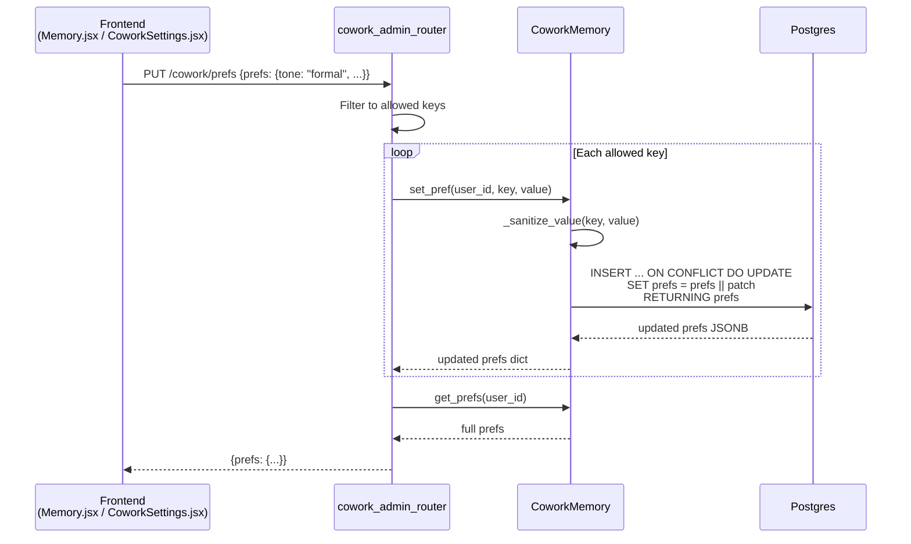
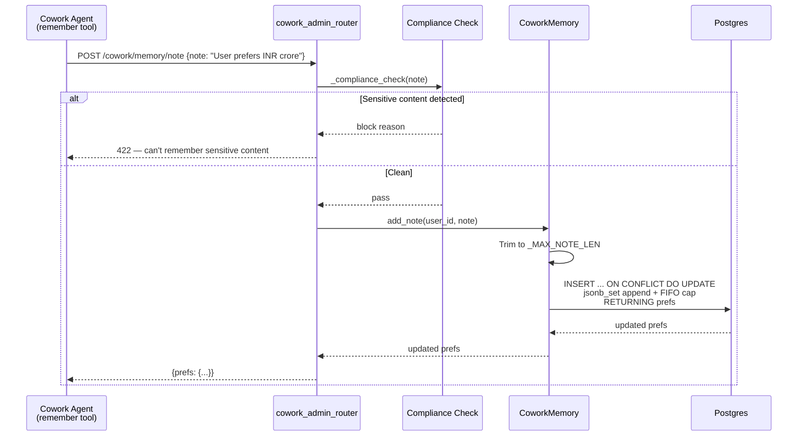
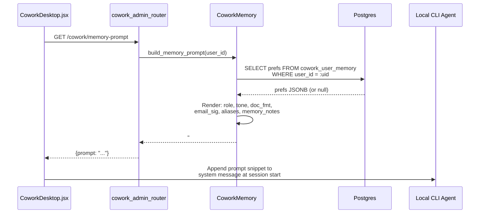
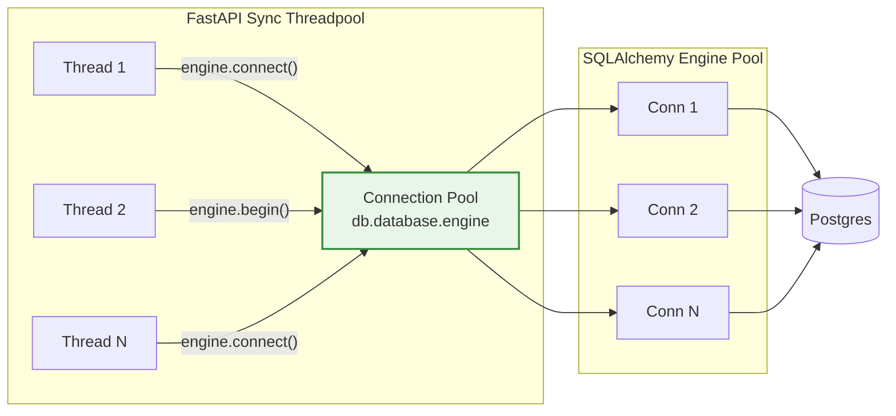
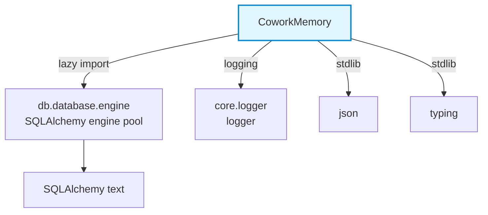

# Memory System — Cowork Memory

> **Module ID:** `memory_system_cowork_memory`
> **Source file:** `memory/cowork_memory.py`
> **Core component:** `CoworkMemory`

## 1. Introduction

The **Cowork Memory** module is a Postgres-backed durable store for per-user
personalization preferences and agent-saved durable facts in the Cowork (Buddy)
office-assistant experience. It persists small, user-controlled preferences —
email signature, default document format, preferred tone, team/channel aliases,
role — alongside durable facts the agent learns and saves via its `remember`
tool, all in a single JSONB column keyed by `user_id`.

The stored preferences are rendered into a **system-prompt snippet** that is
injected into both the desktop Cowork agent and the server-side "office mode"
gateway path at session start. This gives Buddy continuity across tasks and
sessions without the user repeating themselves.

> **Design boundary:** This module is **personalization only**. It never stores
> secrets, tokens, PANs, or any sensitive content. Connector/document writes are
> **not** performed from this module — preferences shape the prompt only.
> Outbound writes and sends still flow through the existing confirm +
> compliance-gated path.

---

## 2. Architecture Overview



### Position in the Memory System Family

`CoworkMemory` is one of five siblings under the `memory_system` parent. It
occupies the **ORG scope** — user-level personalization that is distinct from
the cross-chat semantic memory (`PostgresMemory`), session/working memory
(`RedisMemory`), and the chat summarization gate (`should_store_memory`).

| Sibling Module | Scope | Store | Purpose |
|---|---|---|---|
| `memory_system_cowork_memory` | ORG | Postgres (JSONB) | Per-user Cowork prefs + agent-saved facts |
| `memory_system_postgres_memory` | DURABLE | Postgres (normalized) | Cross-chat semantic memory, agent runs, workflow history |
| `memory_system_redis_memory` | SESSION / WORKING | Redis / RustyCluster | Ephemeral conversation + run history with TTL |
| `memory_system_service` | — | Facade | Sensitivity-gated read/write/forget facade over stores |
| `memory_system_chat_summarizer` | — | — | LLM-based gate deciding whether a turn deserves a memory entry |

See [memory_system_service](memory_system_service.md) for the `Scope` enum and
the `MemoryService` facade that ties these stores together.

---

## 3. Core Component: `CoworkMemory`

### 3.1 Class Responsibilities

`CoworkMemory` is a **stateless singleton** over the shared SQLAlchemy engine
pool. It owns no connection — each method call checks out a thread-safe
connection from the pool and returns it on exit, making it safe under thousands
of concurrent callers in FastAPI's sync threadpool.

| Responsibility | Methods |
|---|---|
| **Read preferences** | `get_prefs()` |
| **Write a single preference** | `set_pref()` |
| **Append a durable fact** | `add_note()` |
| **Remove a durable fact** | `delete_note()` |
| **Remove a preference key** | `delete_pref()` |
| **Clear all preferences** | `clear_prefs()` |
| **Render prompt snippet** | `build_memory_prompt()` |
| **Health check** | `ping()` |

### 3.2 Allowed Preference Keys

A strict whitelist prevents the prefs blob from being abused as a secrets store.
`set_pref()` rejects any key outside this set:

| Key | Type | Description |
|---|---|---|
| `email_signature` | `str` | Appended to drafted emails (max 1000 chars) |
| `default_doc_format` | `str` | e.g. `"docx"`, `"pdf"`, `"md"` |
| `preferred_ppt_theme` | `str` | e.g. `"npci_corporate"` (stored but **not** injected — no real theme catalog) |
| `tone` | `str` | e.g. `"formal"`, `"concise"` |
| `team_aliases` | `dict` | `{"alias": "actual team/person"}` (max 50 entries, 200 chars each) |
| `channel_aliases` | `dict` | `{"alias": "#real-channel"}` (max 50 entries, 200 chars each) |
| `role` | `str` | e.g. `"Engineering Manager"` |
| `memory_notes` | `list[str]` | Durable facts the agent saves via `remember` (max 40 notes, 400 chars each, FIFO-capped) |

### 3.3 Value Sanitization

`_sanitize_value()` bounds and shapes every value before persistence:

- **Scalar strings** are truncated to `_MAX_STR_LEN` (1000 chars).
- **Alias dicts** are capped at `_MAX_ALIASES` (50) entries with 200-char keys/values.
- **Memory notes** are de-duplicated, trimmed to `_MAX_NOTE_LEN` (400 chars), and
  FIFO-capped at `_MAX_NOTES` (40) — oldest notes drop off.

### 3.4 Concurrency-Safe Writes

All write operations use **atomic server-side JSONB operations** under a row
lock, so concurrent writes to the same user don't clobber each other:

- **`set_pref()`** uses `INSERT ... ON CONFLICT DO UPDATE SET prefs = prefs || EXCLUDED.prefs`
  — a JSONB merge that updates only the specified key.
- **`add_note()`** appends to the `memory_notes` array server-side using
  `jsonb_set` with a subquery that trims to the most-recent `_MAX_NOTES`, all in
  one statement under the row lock.
- **`delete_note()`** removes an exact-text match from the array server-side
  using `jsonb_agg` with a `WHERE elem <> to_jsonb(...)` filter.

If `add_note()` encounters any DB quirk, it falls back to a read-modify-write
path via `get_prefs()` + `set_pref()`, still on the pooled engine.

---

## 4. Data Flow

### 4.1 Preference Write Flow



### 4.2 Memory Note (Agent `remember`) Flow



> **Compliance gate:** User-added notes pass through `_compliance_check()` in
> the router before reaching `CoworkMemory`. If the compliance service is
> unavailable, the router **fails closed** (503) for safety — the note is never
> stored. See [shared_integrations](shared_integrations.md) for the guardrails
> module.

### 4.3 Prompt Injection Flow



---

## 5. Prompt Rendering

`build_memory_prompt()` produces a Markdown-formatted system-prompt snippet.
The rendering logic is deliberately conservative:

| Preference | Rendered? | Notes |
|---|---|---|
| `role` | ✅ | `"- Role: {role}"` |
| `tone` | ✅ | `"- Preferred tone: {tone}"` |
| `default_doc_format` | ✅ | `"- Default document format: {doc_fmt}"` |
| `email_signature` | ✅ | Multi-line block, indented |
| `team_aliases` | ✅ | `"'alias' = target"` pairs |
| `channel_aliases` | ✅ | `"'alias' = #channel"` pairs |
| `memory_notes` | ✅ | De-duplicated at render time, listed as remembered facts |
| `preferred_ppt_theme` | ❌ | Intentionally **not** injected — no real theme catalog exists; surfacing it would mislead the agent |

The snippet always ends with a guardrail reminder:

> *Apply these preferences when drafting documents, emails, and presentations.
> They shape style and defaults only — they do NOT authorize sending or writing.
> Any connector send or document write still requires explicit user confirmation
> and passes the standard compliance gate before execution.*

When there are no preferences, `build_memory_prompt()` returns `""` so callers
can append unconditionally.

---

## 6. Module-Level API

The module exposes a process-wide singleton and convenience functions so callers
don't need to instantiate `CoworkMemory` directly:

```python
from memory.cowork_memory import (
    get_cowork_memory,   # -> CoworkMemory singleton
    get_prefs,           # (user_id) -> Dict
    set_pref,            # (user_id, key, value) -> Dict
    add_note,            # (user_id, note) -> Dict
    delete_note,         # (user_id, note) -> Dict
    build_memory_prompt, # (user_id) -> str
)
```

---

## 7. REST API Surface

The `cowork_admin_router` (see [shared_api_routers](shared_api_routers.md))
exposes `CoworkMemory` through the following endpoints, all authenticated via
JWT (`current_user["sub"]`):

| Method | Path | Handler | Description |
|---|---|---|---|
| `GET` | `/cowork/prefs` | `get_my_prefs` | Return full preferences dict |
| `PUT` | `/cowork/prefs` | `set_my_prefs` | Set multiple preference keys (filtered to allowed set) |
| `GET` | `/cowork/memory-prompt` | `get_my_memory_prompt` | Render the prompt snippet for injection |
| `POST` | `/cowork/memory/note` | `add_my_note` | Add a durable fact (compliance-gated) |
| `DELETE` | `/cowork/memory/note` | `delete_my_note` | Remove a durable fact by exact text |

---

## 8. Frontend Integration

### 8.1 Desktop Buddy (`CoworkDesktop.jsx`)

The desktop Cowork agent fetches the memory prompt at session start and appends
it to the system message. The "Memory" button in the top bar opens an inline
modal where the user can:

- Edit `role`, `tone`, `default_doc_format`, `email_signature` (blur-to-save,
  debounced per-key PUT to `/cowork/prefs`).
- View, add, and delete `memory_notes` (POST/DELETE to
  `/cowork/memory/note`).

### 8.2 Web Memory Panel (`Memory.jsx`)

The web app's Memory page has three tabs:

| Tab | Data Source | Endpoint |
|---|---|---|
| **Memories** | Cross-chat semantic memory (PostgresMemory) | `/memory/user` |
| **Custom Instructions** | Profile custom instructions | `/profile/custom-instructions` |
| **Buddy Preferences** | CoworkMemory prefs + notes | `/cowork/prefs`, `/cowork/memory/note` |

The "Buddy Preferences" tab provides the same editing surface as the desktop
modal — tone, role, doc format, email signature, team/channel aliases, and
saved notes with add/delete.

### 8.3 Buddy Setup (`CoworkSettings.jsx`)

The admin/user settings page includes a "My preferences" section that writes
to `/cowork/prefs` (email signature, default doc format, PPT theme, tone).

---

## 9. Database Schema

The `cowork_user_memory` table is owned by `db/migrate.py` (`_part_u1`). This
module performs **DML only** — no DDL.

```sql
CREATE TABLE cowork_user_memory (
    user_id     TEXT PRIMARY KEY,
    prefs       JSONB NOT NULL DEFAULT '{}'::jsonb,
    created_at  TIMESTAMPTZ NOT NULL DEFAULT NOW(),
    updated_at  TIMESTAMPTZ NOT NULL DEFAULT NOW()
);
```

**Example `prefs` document:**

```json
{
  "role": "Engineering Manager",
  "tone": "concise",
  "default_doc_format": "docx",
  "email_signature": "Regards,\nJane Doe — NPCI",
  "team_aliases": {"settlement": "ops-settlement-team"},
  "channel_aliases": {"ops": "#ops-settlement"},
  "memory_notes": [
    "User prefers figures in INR crore",
    "Settlement review deck uses NPCI corporate template"
  ]
}
```

---

## 10. Scaling & Thread Safety



The module explicitly avoids the anti-pattern of a single module-wide `psycopg2`
connection (which is **not** thread-safe and corrupts under FastAPI's sync
threadpool at even modest concurrency). Instead:

- `_db()` lazily imports `engine` from `db.database` — a process-wide
  **connection pool**.
- Each call uses `engine.connect()` (read) or `engine.begin()` (transaction +
  auto-commit/rollback), checking out a thread-safe connection and returning it
  to the pool on exit.
- `CoworkMemory.__init__()` sets `self.available = True` but owns no connection.
- `close()` is a no-op — the pool is managed globally.

This design supports the 2k-parallel-user scaling target documented in the
module header.

---

## 11. Dependencies



| Dependency | Type | Purpose |
|---|---|---|
| `db.database.engine` | Internal (lazy) | Shared SQLAlchemy engine pool for Postgres access |
| `sqlalchemy.text` | Internal (lazy) | Raw SQL execution |
| `core.logger` | Internal | Structured logging |
| `json` | Stdlib | JSONB serialization for preference patches |

### Related Modules

| Module | Relationship |
|---|---|
| [memory_system_service](memory_system_service.md) | Parent facade; `Scope.ORG` conceptually maps to CoworkMemory |
| [memory_system_postgres_memory](memory_system_postgres_memory.md) | Sibling — cross-chat semantic memory (different table, different purpose) |
| [memory_system_redis_memory](memory_system_redis_memory.md) | Sibling — ephemeral session/working memory |
| [memory_system_chat_summarizer](memory_system_chat_summarizer.md) | Sibling — LLM gate for cross-chat memory storage |
| [shared_api_routers](shared_api_routers.md) | `cowork_admin_router` exposes this module via REST |
| [core_infrastructure](core_infrastructure.md) | Provides `core.logger` |
| [database](database.md) | Owns the `engine` pool and migration DDL |

---

## 12. Error Handling Strategy

| Operation | On Failure | User Impact |
|---|---|---|
| `get_prefs()` | Logs at DEBUG, returns `{}` | Silent degradation — empty prefs |
| `set_pref()` | Logs at ERROR, **re-raises** | Router returns 500 with detail |
| `add_note()` | Logs at ERROR, falls back to read-modify-write; if that fails, returns current prefs | Best-effort — note may not persist |
| `delete_note()` | Logs at ERROR, returns current prefs | Idempotent — no-match is a no-op |
| `delete_pref()` | Logs at DEBUG, returns `{}` | Silent degradation |
| `clear_prefs()` | Logs at DEBUG, returns `False` | Silent degradation |
| `build_memory_prompt()` | Delegates to `get_prefs()` — returns `""` on failure | Empty prompt (no injection) |
| `ping()` | Returns `False` | Health check signal |

Reads **never fail a turn** — they return safe empty defaults. Writes are
either re-raised (so the router can surface the error) or silently degraded
with a fallback path.

---

## 13. Key Design Decisions

1. **JSONB over normalized columns** — preferences are heterogeneous (strings,
   dicts, lists) and rarely queried individually. A single JSONB column with
   server-side merge (`||`) and array operations keeps the schema simple and
   writes atomic.

2. **Whitelist enforcement** — `ALLOWED_PREF_KEYS` prevents the prefs blob from
   becoming an unstructured dump or a secrets store. Unknown keys are rejected
   at both the module and router levels.

3. **`preferred_ppt_theme` stored but not injected** — there is no real theme
   catalog (decks always use the NPCI brand guide). Surfacing it in the prompt
   would mislead the agent into promising a theme the engine never applies.

4. **Compliance gate at the router, not the store** — `CoworkMemory` itself
   does only size guarding. The compliance check (`_compliance_check`) runs in
   the router before `add_note()` is called, failing closed (503) if the
   compliance service is unavailable. This keeps the store fast and the
   security boundary at the API edge.

5. **FIFO-capped memory notes** — the `memory_notes` array is bounded at 40
   entries. `add_note()` trims server-side to the most recent `_MAX_NOTES`,
   preventing unbounded prompt growth. De-duplication happens at render time
   (and in `_sanitize_value` for bulk sets).

6. **Stateless singleton** — no owned connection, no mutable state beyond the
   shared engine. Safe to use as a process-wide singleton from any thread
   without locking.
