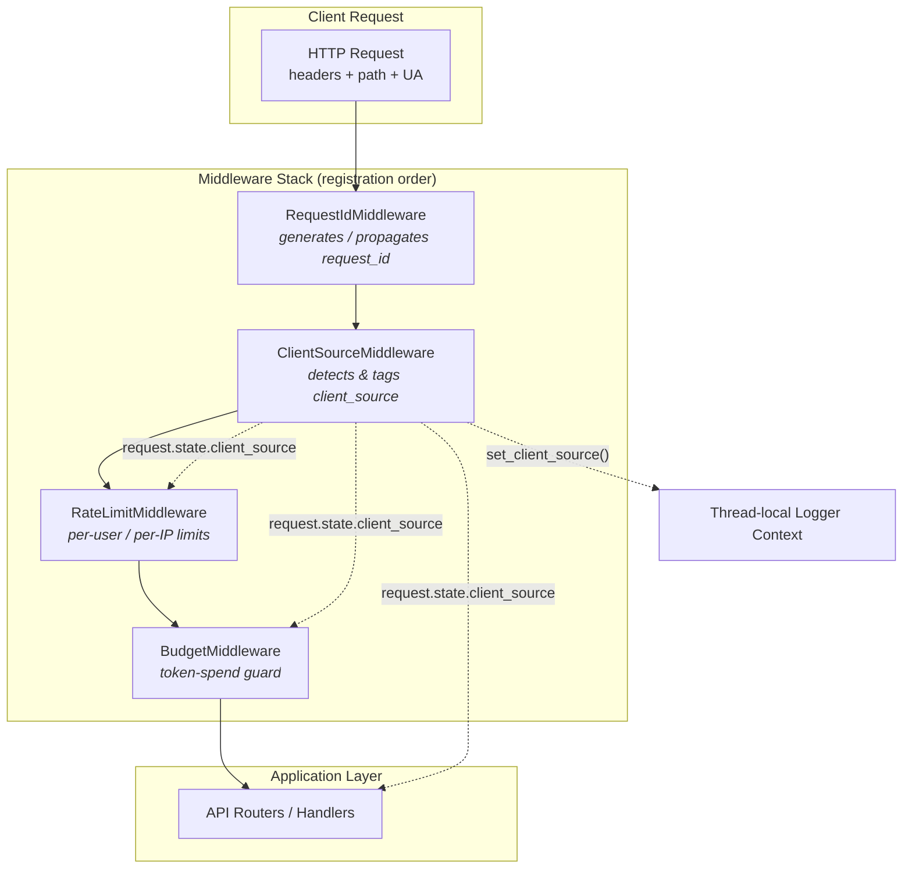
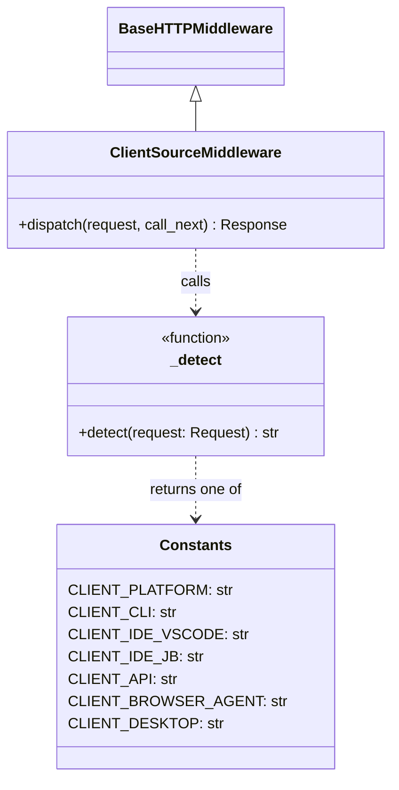
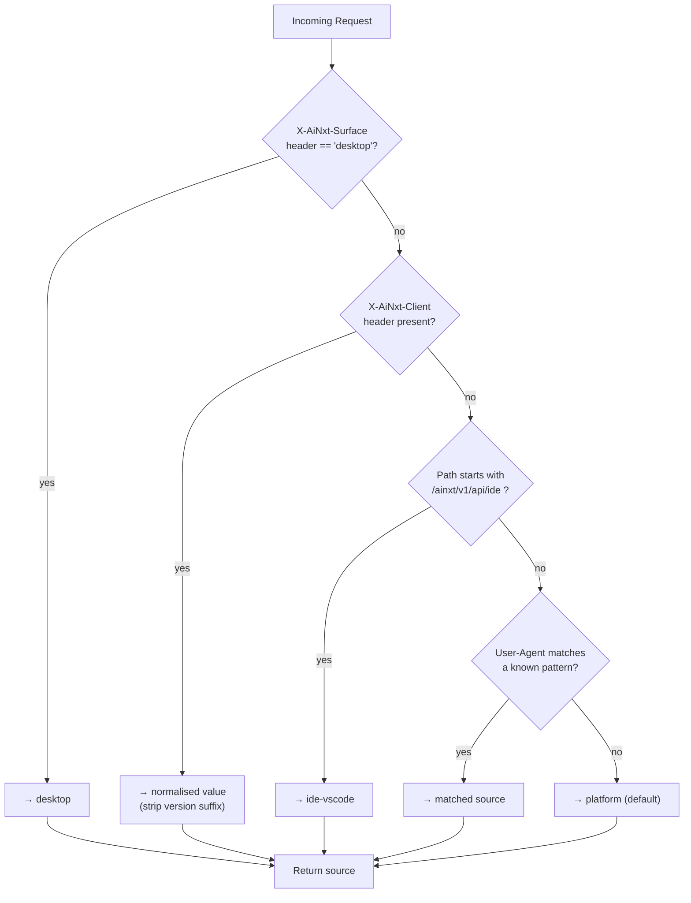
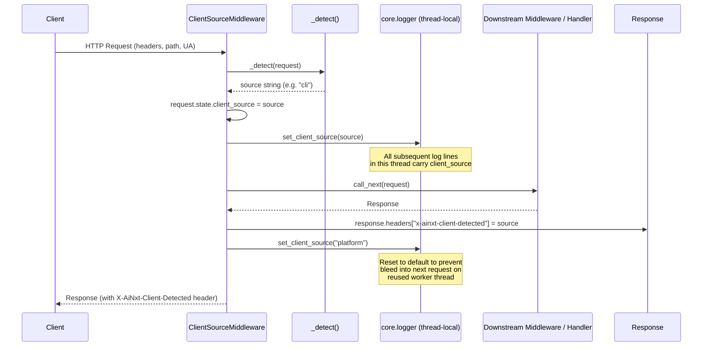
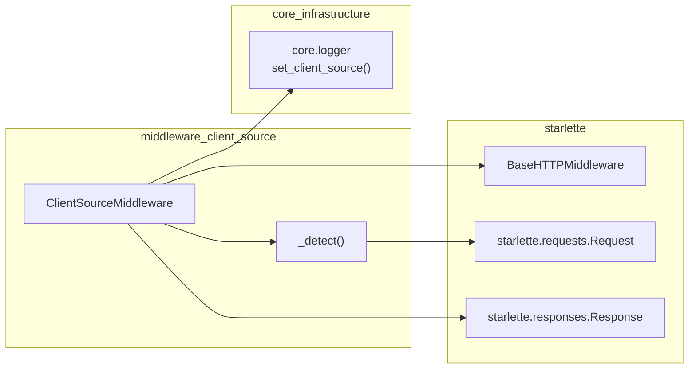

# middleware_client_source

## Brief Introduction

The `middleware_client_source` module provides a single Starlette middleware —
`ClientSourceMiddleware` — that inspects every inbound HTTP request and
classifies it into one of seven canonical **client source** values. The
detected source is then propagated to three downstream consumers:

1. **Thread-local logger context** — so every log line emitted during the
   request automatically carries the `client_source` field (see
   [core_infrastructure](core_infrastructure.md) / `core.logger`).
2. **`request.state.client_source`** — a plain attribute that any downstream
   handler, router, or other middleware can read.
3. **`X-AiNxt-Client-Detected` response header** — echoed back to the caller
   for debugging and for Grafana / Loki correlation.

This classification is the foundation for client-aware behaviour across the
platform: rate-limit buckets, budget enforcement, telemetry dimensions, and
RAG-injection guards all key off the value that this middleware sets.

---

## Architecture

### Module Position in the Request Pipeline

`ClientSourceMiddleware` is one of four application-level middlewares that wrap
the FastAPI / Starlette app. They execute in registration order; the client
source is detected early so that all subsequent middlewares and route handlers
can consume it.



> **See also:** [middleware_request_id](middleware_request_id.md),
> [middleware_rate_limit](middleware_rate_limit.md),
> [middleware_budget](middleware_budget.md) for the sibling middlewares.

### Component Overview

The entire module is contained in a single file
(`middleware/client_source_middleware.py`) with one public class and a small set
of module-level constants and helpers.



---

## Canonical Client Source Values

| Constant | Value | Origin / Detection Signal |
|---|---|---|
| `CLIENT_PLATFORM` | `platform` | Default — React web UI in a browser. |
| `CLIENT_CLI` | `cli` | `X-AiNxt-Client: cli` header or `ainxt-cli` in User-Agent. |
| `CLIENT_IDE_VSCODE` | `ide-vscode` | `X-AiNxt-Client: ide-vscode` header, `vscode` in UA, or `/ide/*` path prefix. |
| `CLIENT_IDE_JB` | `ide-jetbrains` | `X-AiNxt-Client: ide-jetbrains` header or JetBrains/PyCharm/IntelliJ in UA. |
| `CLIENT_API` | `api` | `X-AiNxt-Client: api` header or curl/httpie/python-requests/insomnia/postman in UA. |
| `CLIENT_BROWSER_AGENT` | `browser-agent` | `X-AiNxt-Client: browser-agent` header **only** — no UA fallback (see note below). |
| `CLIENT_DESKTOP` | `desktop` | `X-AiNxt-Surface: desktop` header injected by the Electron app's `webRequest` interceptor. |

> **`browser-agent` design note:** The browser-automation Chrome extension
> sends the browser's default User-Agent, which is indistinguishable from the
> platform web UI. Therefore the explicit `X-AiNxt-Client` header is the
> **only** reliable signal. Correctness for the RAG-injection path is
> additionally guarded server-side by a request-shape heuristic in the
> gateway's streaming handler.

---

## Detection Algorithm

The `_detect()` helper implements a five-step priority cascade. The first
match wins; later steps are not evaluated.



### Step Details

| Step | Check | Rationale |
|---|---|---|
| 1 | `X-AiNxt-Surface: desktop` | The Electron desktop app injects this via `webRequest.onBeforeSendHeaders`. Checked **before** the generic client header so the desktop is never misclassified as `platform`. |
| 2 | `X-AiNxt-Client` header | Explicit signal from CLI, IDE plugins, or browser-agent extension. The value is normalised by stripping any `/version` suffix (e.g. `cli/1.0.0` → `cli`). |
| 3 | `/ainxt/v1/api/ide` path prefix | All IDE router traffic is assumed to originate from VS Code for now. |
| 4 | User-Agent regex patterns | Fallback heuristic for clients that don't send explicit headers. Patterns match `ainxt-cli`, `vscode`, `jetbrains|pycharm|intellij|idea`, and `curl|httpie|python-requests|insomnia|postman`. |
| 5 | Default | If nothing matches, the request is treated as the platform web UI (`platform`). |

---

## Data Flow



### Thread-Local Lifecycle

The middleware uses `core.logger.set_client_source()` which sets a
`contextvars.ContextVar`. Because Gunicorn / Uvicorn reuse worker threads
across requests, the middleware **always** resets the value to `"platform"`
after the response is generated. This prevents a `cli` request's context from
bleeding into a subsequent `platform` request that happens to reuse the same
thread.

---

## Dependencies



| Dependency | Type | Purpose |
|---|---|---|
| `starlette.middleware.base.BaseHTTPMiddleware` | External (Starlette) | Base class providing the `dispatch(request, call_next)` contract. |
| `starlette.requests.Request` | External (Starlette) | Typed access to request headers, URL path, and `request.state`. |
| `starlette.responses.Response` | External (Starlette) | Return type; used to inject the `X-AiNxt-Client-Detected` header. |
| `core.logger.set_client_source` | Internal ([core_infrastructure](core_infrastructure.md)) | Sets the `contextvars`-backed thread-local that the structured logger reads on every log emission. |
| `re` | Stdlib | Compiled regex patterns for User-Agent heuristics. |

The module has **no** database, Redis, or external-service dependencies —
detection is purely header / path / User-Agent based, making it extremely
fast (sub-millisecond) and side-effect-free.

---

## Downstream Consumers

The `client_source` value set by this middleware is consumed by several other
modules. This section lists the key consumers without duplicating their
internal logic.

| Consumer | Module | How it uses `client_source` |
|---|---|---|
| **RateLimitMiddleware** | [middleware_rate_limit](middleware_rate_limit.md) | While it primarily keys on user_id / IP, the client source is available in `request.state` for anomaly-detection heuristics. |
| **BudgetMiddleware** | [middleware_budget](middleware_budget.md) | Enforces token-spend limits on LLM-generating endpoints; client source helps distinguish IDE vs. platform traffic for cost attribution. |
| **Gateway streaming handler** | [gateway](gateway.md) | Uses `request.state.client_source` (and a request-shape heuristic) to guard the RAG-injection path for `browser-agent` requests. |
| **Telemetry / Metrics** | [core_infrastructure](core_infrastructure.md) (`core.telemetry`) | The `client_source` dimension appears in Prometheus metrics and OpenTelemetry spans, enabling per-client dashboards. |
| **Structured Logging** | [core_infrastructure](core_infrastructure.md) (`core.logger`) | Every log line emitted during the request automatically includes the `client_source` field via the thread-local context variable. |

---

## Integration Notes

### Registration Order

`ClientSourceMiddleware` should be registered **after**
`RequestIdMiddleware` (so the request_id is already in the logger context)
and **before** `RateLimitMiddleware` and `BudgetMiddleware` (so those
middlewares can read `request.state.client_source`). A typical registration
looks like:

```python
app.add_middleware(RequestIdMiddleware)
app.add_middleware(ClientSourceMiddleware)
app.add_middleware(RateLimitMiddleware)
app.add_middleware(BudgetMiddleware)
```

### Adding a New Client Type

To add a new canonical client source:

1. Add a module-level constant (e.g. `CLIENT_MOBILE = "mobile"`).
2. If the client sends an explicit header, no code change to `_detect()` is
   needed — the `X-AiNxt-Client` normalisation already strips version
   suffixes and returns the raw value.
3. If detection must rely on a User-Agent pattern, add a `(regex, constant)`
   entry to the `_UA_PATTERNS` list.
4. If a new surface header is needed (like `X-AiNxt-Surface` for desktop),
   add a new check step in `_detect()` with appropriate priority.

### Response Header

Every response includes:

```
X-AiNxt-Client-Detected: <source>
```

This is useful for:
- **Client-side debugging** — verify the server correctly identified the
  client.
- **Grafana / Loki queries** — filter logs and metrics by client type.
- **Integration tests** — assert that a test client is classified as
  expected.

---

## Summary

| Aspect | Detail |
|---|---|
| **Purpose** | Classify every inbound request by its originating client. |
| **Single component** | `ClientSourceMiddleware` (Starlette `BaseHTTPMiddleware`). |
| **Detection** | 5-step priority cascade: surface header → explicit header → path prefix → UA regex → default. |
| **Outputs** | `request.state.client_source`, thread-local logger context, `X-AiNxt-Client-Detected` response header. |
| **Performance** | Pure header/path/regex inspection — no I/O, sub-millisecond. |
| **Thread safety** | Resets thread-local to `"platform"` after each response to prevent context bleed on reused worker threads. |
| **Key consumers** | [middleware_rate_limit](middleware_rate_limit.md), [middleware_budget](middleware_budget.md), [gateway](gateway.md), [core_infrastructure](core_infrastructure.md) (logger + telemetry). |
