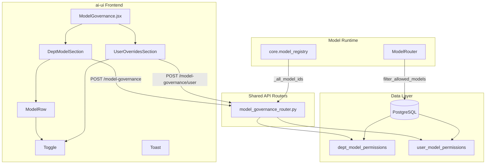
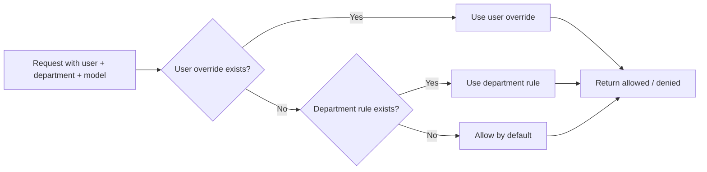
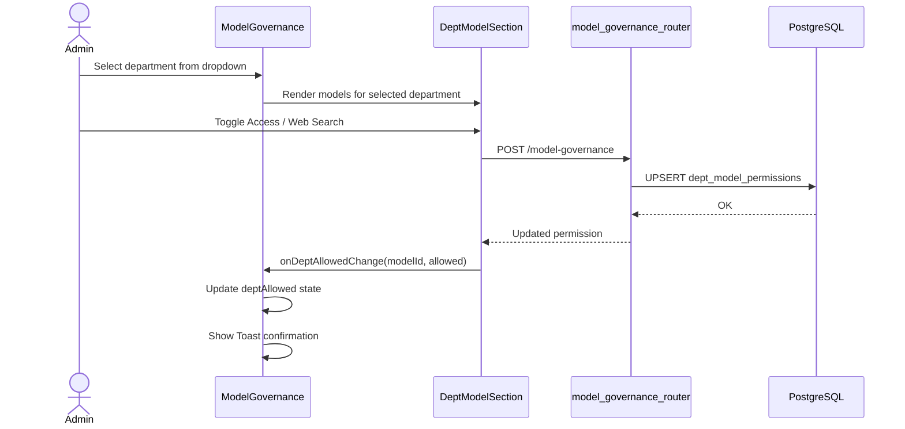
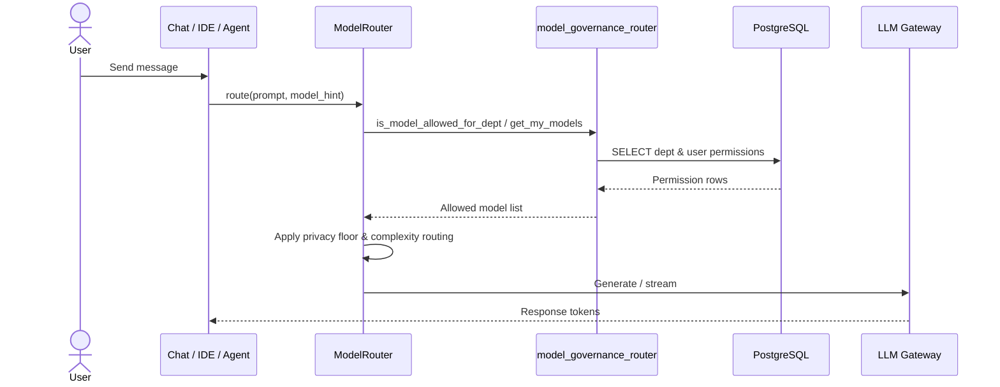
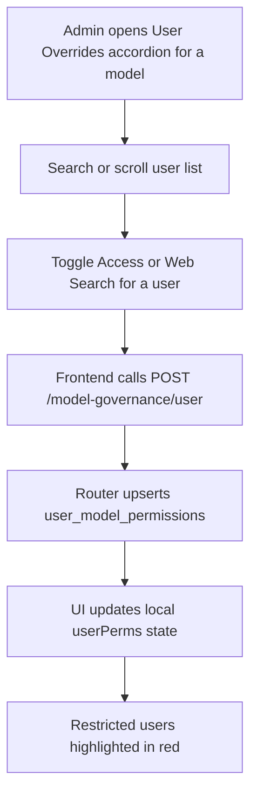

# Model Governance Module

## Brief Introduction

The **Model Governance** module provides administrators with a centralized interface to control which Large Language Models (LLMs) each department and individual user is permitted to use across the platform. It enforces a two-tier permission model—department-level defaults with optional user-level overrides—and independently governs the **Web Search** capability for each model. The module spans a React admin UI in `ai-ui`, a FastAPI router in `shared_api_routers`, and runtime enforcement inside the central `ModelRouter`.

---

## Core Purpose

- **Access Control**: Decide, per department, which cloud and local models are available.
- **User Overrides**: Grant or restrict specific models for individual users within a department.
- **Web Search Governance**: Enable or disable external web-search functionality independently from base model access.
- **Runtime Enforcement**: Ensure governance rules are respected when the chat, IDE, or agent runtime selects a model.

---

## Architecture Overview

---

## Component Breakdown

### Frontend Components (`ai-ui/src/components/ModelGovernance.jsx`)

| Component | Responsibility |
|-----------|----------------|
| `ModelGovernance` | Top-level page. Loads departments and model list, manages selected department, and renders the two sections. |
| `DeptModelSection` | Displays cloud and local models for the selected department; toggles department-level **Access** and **Web Search** permissions. |
| `UserOverridesSection` | Accordion list of users per enabled model; allows per-user access and web-search overrides. |
| `ModelRow` | Renders a single model with provider badge and toggle controls. |
| `Toggle` | Reusable animated toggle switch used for all on/off controls. |
| `Toast` | Displays ephemeral success feedback when a department permission changes. |
| `handler` | Placeholder/event helper referenced by the component tree. |

### Backend Router (`shared_api_routers/model_governance_router.py`)

| Endpoint | Method | Purpose |
|----------|--------|---------|
| `/model-governance/models` | GET | List all model IDs available for governance. |
| `/model-governance` | POST | Set or update a department-level model permission. |
| `/model-governance/{dept}` | GET | Get department-level permissions. |
| `/model-governance/{dept}/users` | GET | List active users for override management. |
| `/model-governance/{dept}/user-permissions` | GET | List user-level overrides for a department. |
| `/model-governance/user` | POST | Set or update a user-level model override. |
| `/model-governance/my-models` | GET | Return the models available to the authenticated caller. |
| `/model-governance/permissions` | GET | List all department-level permissions (admin). |

For full router details, see [shared_api_routers](shared_api_routers.md).

---

## Permission Resolution

Governance follows a **fail-open default** with explicit deny capability:

1. If no rule exists for a `(department, model)` pair, the model is **allowed**.
2. If a department rule exists, it determines base access.
3. If a user override exists for `(user_id, model_id)`, it **wins** over the department rule.
4. Web Search is governed independently; it can only be enabled when base model access is allowed.

The resolution is implemented in `filter_allowed_models` inside `model_governance_router.py` and is invoked at request time from `ModelRouter` and chat/IDE handlers via `get_my_models`.

---

## Data Flow: Admin Changing a Department Permission

---

## Data Flow: Runtime Model Selection

---

## Database Schema

Two tables store governance state:

### `dept_model_permissions`

| Column | Type | Notes |
|--------|------|-------|
| `department` | text | Part of primary key |
| `model_id` | text | Part of primary key |
| `allowed` | boolean | Base access flag |
| `web_search_allowed` | boolean | Web search flag |
| `created_by` | text | Admin identity |
| `created_at` | timestamp | Last update time |

### `user_model_permissions`

| Column | Type | Notes |
|--------|------|-------|
| `user_id` | text | Part of primary key |
| `model_id` | text | Part of primary key |
| `department` | text | Department context |
| `allowed` | boolean | Override access flag |
| `web_search_allowed` | boolean | Override web search flag |
| `created_by` | text | Admin identity |
| `created_at` | timestamp | Last update time |

---

## Model Catalog

The list of governable models is derived from `core.model_registry` constants and local gateway discovery:

- **Anthropic**: Claude Sonnet 4.6/5, Claude Haiku 4.5, Claude Opus 4.7/4.8/5
- **OpenAI**: GPT-5.4, GPT-5-5, GPT-5 Mini, GPT-5.6 Tera/Luna (feature-flagged)
- **Google**: Gemini 3.5 Flash, Gemini 3.1 Flash-Lite, Gemini 3.1 Flash Image
- **Local**: Any model returned by the local LLM gateway, prefixed with `local:`

Models listed in `BLOCKED_MODELS` (e.g., retired or kill-switched models) are excluded from governance assignment. See [model_router](model_router.md) and [core_model_registry](core_model_registry.md) for routing details.

---

## Integration with the Wider System

| Related Module | Relationship |
|----------------|--------------|
| [shared_api_routers](shared_api_routers.md) | Hosts the `model_governance_router.py` REST API. |
| [model_router](model_router.md) | Enforces governance at runtime via `is_model_allowed_for_dept` and `filter_allowed_models`. |
| [core_model_registry](core_model_registry.md) | Defines the model IDs and feature flags that populate the governance catalog. |
| [auth](auth.md) | All governance mutations require admin privileges (`_require_admin`). |
| [dept_metrics](dept_metrics.md) | The UI fetches the department list from `/dept-metrics/departments`. |
| [chat](chat.md) / [kb_chat](kb_chat.md) / [ide_router](ide_router.md) | Consumers of `get_my_models` that hide disallowed models from model pickers. |

---

## Security & Compliance Notes

- **Admin-only mutations**: Creating, updating, or deleting permissions requires admin authentication.
- **Fail-open defaults**: Absence of a rule allows access, ensuring the platform remains usable during initial rollout.
- **Privacy floor**: `ModelRouter` pins `CONFIDENTIAL`/`RESTRICTED` data to local models regardless of governance rules. See [model_router](model_router.md).
- **Audit logging**: Every permission change logs the admin email, target department/user, model, and flag values.
- **Web Search independence**: Disabling a model automatically disables web search for that model; enabling web search requires base access to be enabled first.

---

## Process Flow: Adding a New User Override

---

## Key Design Decisions

1. **Two-level governance** keeps administration simple for most users while allowing fine-grained exceptions.
2. **Live optimistic UI updates** after each toggle reduce perceived latency; the backend is the source of truth.
3. **Department selector with search** scales to organizations with many departments.
4. **User overrides only shown for department-enabled models** avoids contradictory configurations in the UI.
5. **Runtime resolution uses a single UNION ALL query** to fetch both department and user rules in one round-trip.

---

## References

- Frontend implementation: `ai-ui/src/components/ModelGovernance.jsx`
- Backend router: `routers/model_governance_router.py`
- Runtime enforcement: `models/model_router.py`
- Related docs: [shared_api_routers](shared_api_routers.md), [model_router](model_router.md), [auth](auth.md), [dept_metrics](dept_metrics.md)
